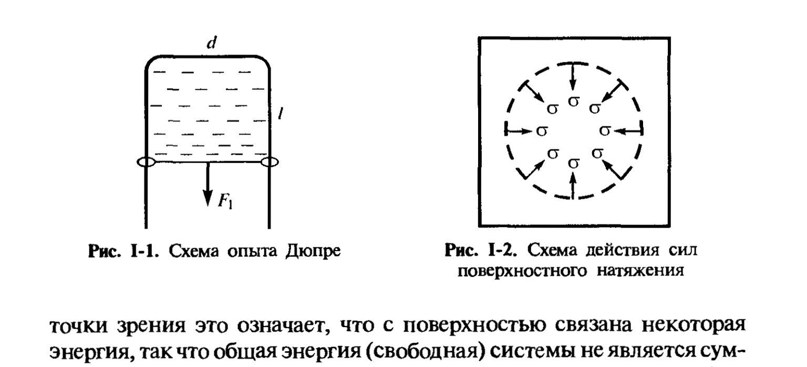
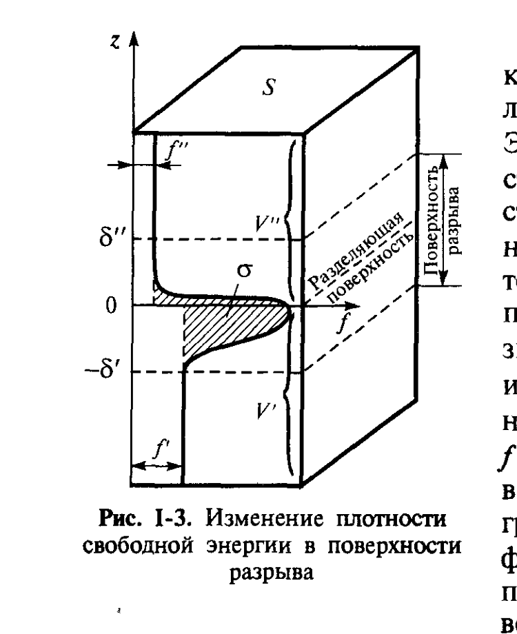
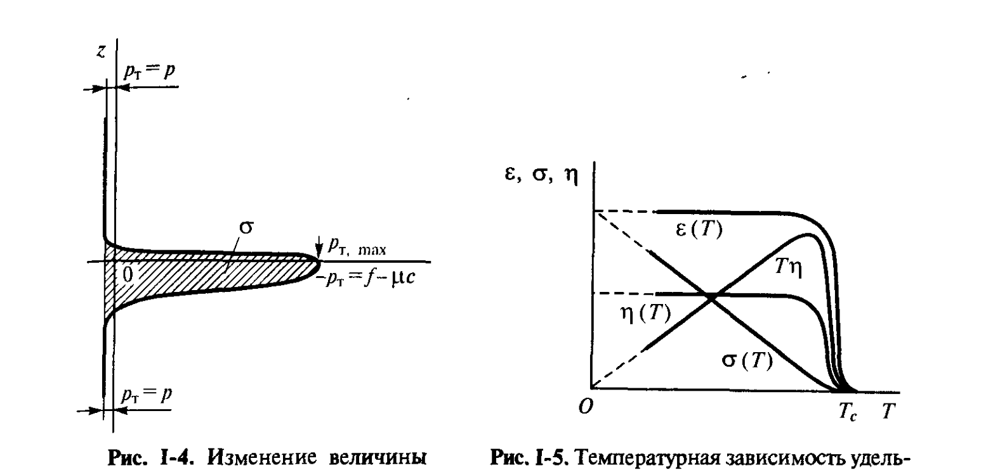

# Билет 2. Поверхностное натяжение границы жидкость/газ. Метод избыточных величин Гиббса

## Тема 1: Поверхностное натяжение однокомпонентных систем как удельная свободная поверхностная энергия

### Происхождение поверхностной энергии

> [!note] Определение
> Молекулы конденсированных фаз, находящиеся на поверхности раздела, обладают избыточной энергией по сравнению с молекулами в объёме — из-за нескомпенсированности их межмолекулярных взаимодействий (у поверхностной молекулы меньше соседей, чем у объёмной). Это порождает на поверхности раздела **поверхностные силы** и избыток энергии — **поверхностную энергию**.

С поверхностью раздела фаз связана дополнительная энергия системы: общая (свободная) энергия системы $\mathcal{F}$ не является суммой энергий двух объёмных фаз, а включает ещё избыточную свободную энергию, пропорциональную площади поверхности раздела фаз $S$ — **свободную поверхностную энергию** $\mathcal{F}_s$:

$$\mathcal{F}_s = \frac{d\mathcal{F}}{dS}\,S = \sigma S$$

где:
- $\mathcal{F}_s$ — свободная поверхностная энергия системы, Дж;
- $S$ — площадь поверхности раздела фаз, м²;
- $\sigma$ — удельная (приходящаяся на единицу площади поверхности) свободная поверхностная энергия, Дж/м².

> [!important] Двойной смысл величины σ
> Наличие на поверхности раздела фаз избытка энергии означает, что для образования новой поверхности требуется совершить работу, поэтому величина $\sigma$ одновременно представляет собой удельную работу обратимого изотермического образования единицы поверхности; эту величину называют также **поверхностным натяжением**.

### Поверхностное натяжение как сила: опыт Дюпре

Поверхностное натяжение можно трактовать и как силу, действующую вдоль поверхности раздела (тангенциально к ней) и препятствующую её увеличению. Существование такой силы иллюстрируется опытом А. Дюпре.

*Рис. I-1, I-2 (Щукин, с. 16). Слева — П-образная жёсткая рамка шириной $d$ с подвижной перемычкой и натянутой на ней мыльной плёнкой; справа — схема сил поверхностного натяжения, стягивающих контур поверхности к центру.*

На жёсткой П-образной рамке шириной $d$ с подвижной перемычкой натянута мыльная плёнка. К перемычке приложена сила $F_1$. При смещении перемычки на расстояние $\Delta l$ происходит увеличение площади плёнки на величину $\Delta l \cdot d$, а свободная энергия получает приращение, равное $\Delta\mathcal{F}_s = 2\sigma \Delta l d$ (коэффициент 2 отражает наличие двух сторон у плёнки). Следовательно, сила $F_2$, действующая на перемычку со стороны плёнки, равна:

$$F_2 = \frac{\Delta \mathcal{F}_s}{\Delta l} = 2\sigma d$$

Условию $F_1 = F_2 = 2\sigma d$ соответствует равновесие между плёнкой и внешней силой.

> [!note] Два эквивалентных представления о σ
> Величину $\sigma$ можно рассматривать не только как удельную поверхностную энергию, но и как **силу**, приложенную к единице длины контура, ограничивающего поверхность, и направленную вдоль этой поверхности перпендикулярно к контуру (для плёнки на рис. I-1 роль части контура выполняет подвижная перемычка). Соответственно величину $\sigma$ выражают в **мДж/м²** и **мН/м** — единицы численно эквивалентны.

> [!example] Действие сил поверхностного натяжения
> Действие поверхностного натяжения можно наглядно представить как совокупность сил, стягивающих края поверхности, ограниченной контуром, к центру (рис. I-2). Эти силы изображены стрелками-векторами; длина стрелок отражает величину поверхностного натяжения, а расстояние между ними соответствует принятой единице длины контура.

> [!warning] Жидкости vs твёрдые тела
> Для **жидкостей** поверхностное натяжение численно равно удельной свободной поверхностной энергии — оба представления (энергетическое и силовое) полностью эквивалентны. Для **твёрдых тел** дело обстоит сложнее: для них, как правило, не удаётся осуществить обратимое изменение площади поверхности раздела фаз без изменения структуры (упругая деформация, пластическое течение). В некоторых случаях (например, при рассмотрении смачивания, см. [[билет_09]]) величину, численно равную удельной поверхностной свободной энергии, можно рассматривать как силу поверхностного натяжения, действующую вдоль поверхности. Но в ряде работ по физике твёрдого тела «поверхностным натяжением» твёрдых тел называют другую величину — **избыточное поверхностное напряжение**, связанное с механическими напряжениями в поверхностных слоях.

### Молекулярная картина поверхности

На молекулярном масштабе поверхность раздела жидкость–пар находится в непрерывном тепловом движении: к поверхности прилипают прилетающие из паровой фазы молекулы, а от неё отрываются молекулы, уходящие в пар, причём в условиях равновесия частота тех и других событий одинакова. Время жизни молекулы воды до её перехода в пар составляет около $10^{-5}$ с. Тепловое движение приводит также к возникновению колебаний поверхности различной частоты и амплитуды (рассмотрены Мандельштамом и Френкелем — теория капиллярных волн, см. подробнее гл. VI учебника).

Полное молекулярно-статистическое описание строения поверхности раздела жидкость–пар — сложная и до конца не решённая задача. Однако сопоставить макроскопические характеристики поверхности (прежде всего поверхностное натяжение) с усреднёнными (по времени и вдоль поверхности) значениями плотностей термодинамических функций можно — это и есть предмет термодинамического описания поверхности (методы Гиббса и слоя конечной толщины, см. ниже).

---

## Тема 2: Метод избыточных величин Гиббса

### Физическая поверхность разрыва

При макроскопическом рассмотрении поверхность раздела фаз, следуя Гиббсу, удобно рассматривать как конечный по толщине слой, в котором осуществляется переход от свойств, характерных для одной фазы, к свойствам, характерным для другой. Этот неоднородный по своим свойствам переходный слой Гиббс назвал **физической поверхностью разрыва** (термины «поверхность», «поверхностный слой» и «физическая поверхность разрыва» используются как синонимы).

Для получения связи между характером распределения плотностей термодинамических функций в поверхности разрыва и макроскопическими характеристиками поверхности и объёмных фаз используются два подхода:

1. **метод избыточных величин Гиббса** (рассматривается в этом билете);
2. **метод слоя конечной толщины**, развитый Гуггенгеймом и затем А. И. Русановым.

> [!note] Суть метода Гиббса
> В методе Гиббса свойства реальной системы сопоставляются со свойствами идеализированной **системы сравнения**, в которой плотности термодинамических величин сохраняют постоянное (объёмное) значение вплоть до некоторой математической (имеющей нулевую толщину) **разделяющей поверхности**. Разность (положительная или отрицательная) между значением термодинамической функции в реальной системе и системе сравнения, отнесённая к единице площади поверхности, рассматривается как удельное значение **избытка** соответствующей величины; именно эта избыточная величина сопоставляется с соответствующей макроскопической характеристикой.

> [!important] Геометрический смысл избытка (см. рис. I-3)
> Определение избытка основывается на интегрировании по координате $z$, нормальной к поверхности, разности плотностей термодинамической функции (например, плотности свободной энергии $f$) в реальной системе и системе сравнения.

*Рис. I-3 (Щукин, с. 20). Призма с боковыми гранями, перпендикулярными разделяющей поверхности; $f'$ и $f''$ — объёмные плотности свободной энергии в жидкости и в паре соответственно; заштрихованная область — избыток свободной энергии в поверхностном слое толщиной $\delta' + \delta''$.*

### Вывод формулы избытка свободной энергии

Термодинамика устанавливает связь свободной энергии $\mathcal{F}$, изобарно-изотермического потенциала $\mathcal{G}$ и химического потенциала $\mu$ вещества в однокомпонентной системе:

$$\mathcal{F} = \mathcal{G} - pV = \mu N - pV = (\mu c - p)V$$

где:
- $p$ — давление;
- $V$ — объём;
- $N$ — число молей вещества;
- $c = N/V$ — концентрация.

Отсюда для **плотности свободной энергии** $f$ имеем основное соотношение:

$$f = \mu c - p \tag{I.1}$$

Для находящихся в равновесии фаз, разделённых плоской поверхностью, значения $\mu$ и $p$ одинаковы в обеих фазах. Согласно (I.1), различие плотностей свободной энергии в фазах может быть связано в этом случае только с различием в них концентрации вещества $c$ (плотность свободной энергии в паре значительно ниже, чем в жидкости).

Выделим призму, боковые грани которой перпендикулярны разделяющей поверхности (рис. I-3). Эта призма включает объём $V'$ со стороны жидкости и объём $V''$ со стороны пара. На расстоянии $-\delta'$ проведём границу, ниже которой плотность свободной энергии приближённо равна её объёмному значению в жидкости ($f \approx f' = \mathrm{const}$), и на расстоянии $+\delta''$ — ещё одну границу, выше которой $f \approx f'' = \mathrm{const}$. Заключённый между этими границами поверхностный (межфазный) слой толщиной $\delta' + \delta''$ представляет собой физическую поверхность разрыва.

В силу свойств поверхности разрыва свободная энергия реальной системы $\mathcal{F}$ оказывается выше свободной энергии $\mathcal{F}' + \mathcal{F}'' = f'V' + f''V''$ идеализированной системы, в которой плотности свободной энергии каждой фазы $f'$ и $f''$ были бы постоянны во всём объёме фаз вплоть до разделяющей (геометрической) поверхности, т. е.:

$$\mathcal{F} > \mathcal{F}' + \mathcal{F}''$$

**Избыток свободной энергии реальной системы** по сравнению с идеализированной равен:

$$\mathcal{F}_s = \mathcal{F} - (f'V' + f''V'')$$

Свободная энергия идеализированной системы (разделяющая поверхность в плоскости $z=0$):

$$\mathcal{F}' + \mathcal{F}'' = \left(\int_{-\infty}^{0} f'\,dz + \int_{0}^{+\infty} f''\,dz\right) S$$

тогда как свободная энергия реальной системы:

$$\mathcal{F} = \left[\int_{-\infty}^{+\infty} f(z)\,dz\right] S$$

**Избыток свободной энергии системы на единицу поверхности** составляет:

$$\psi = \frac{\mathcal{F} - (\mathcal{F}' + \mathcal{F}'')}{S} = \int_{-\infty}^{0}[f(z)-f']\,dz + \int_{0}^{+\infty}[f(z)-f'']\,dz \tag{I.2}$$

Так как вне поверхности разрыва отклонения плотности свободной энергии от её объёмного значения малы, бесконечные пределы в интегралах (I.2) можно заменить координатами $-\delta'$ и $+\delta''$ плоскостей, ограничивающих поверхность разрыва со стороны каждой фазы:

$$\psi = \int_{-\delta'}^{0}[f(z)-f']\,dz + \int_{0}^{\delta''}[f(z)-f'']\,dz$$

Геометрически величину $\psi$ можно представить как заштрихованную площадь, ограниченную кривой $f(z)$, прямыми $f=f'$, $f=f''$ и отрезком прямой $z=0$ (рис. I-3, заштрихованная область).

> [!important] σ зависит или не зависит от положения разделяющей поверхности?
> На плоских поверхностях величина $\psi$ зависит от положения мысленной разделяющей поверхности. Между тем поверхностное натяжение $\sigma$ — непосредственно экспериментально определяемая величина — **не может** зависеть от способа описания свойств поверхности. Величины $\sigma$ и $\psi$ совпадают ($\sigma = \psi$) только при одном, особом положении разделяющей поверхности — для так называемой **эквимолекулярной поверхности** (см. тему адсорбции, [[билет_17]]).

### Второй подход: σ как сила (тангенциальное давление)

Определение величины $\sigma$, **инвариантное** относительно положения разделяющей поверхности, можно получить вторым способом — рассматривая её как поверхностное натяжение и интегрируя величины с размерностью давления. Введём величину:

$$p_{\mathrm{T}} = -(f - \mu c)$$

В объёмах обеих фаз, разделённых плоской поверхностью, эта величина равна давлению $p$ и не зависит от направления (выполняется закон Паскаля). Внутри же поверхностного слоя (поверхности разрыва) давление начинает зависеть от направления и приобретает сложный характер — становится цилиндрически симметричным относительно оси $z$ тензором второго ранга. При этом соотношение $p_{\mathrm{T}} = p$ перестаёт выполняться вне поверхностного слоя, а внутри него:

$$\sigma = \int_{-\infty}^{+\infty}[p - p_{\mathrm{T}}(z)]\,dz \tag{уравнение Беккера}$$

Так как отличие $p_\mathrm{T}$ от $p$ существенно только в пределах поверхности разрыва, уравнение Беккера можно записать как:

$$\sigma = \int_{-\delta'}^{+\delta''}[p - p_{\mathrm{T}}(z)]\,dz$$

> [!note] Физический смысл $p_\mathrm{T}$
> Величина $p_\mathrm{T}$ может рассматриваться как «**тангенциальное давление**» — компонента тензора давления, действующая в плоскости, параллельной поверхности раздела, и стремящаяся уменьшить площадь раздела фаз.

*Рис. I-4 (Щукин, с. 23, левая часть). Изменение величины $p - p_\mathrm{T}(z)$ в поверхности разрыва: заштрихованная область равна $\sigma$.*

> [!important] Численные оценки
> Толщина поверхности разрыва $\delta' + \delta''$ в условиях, далёких от критических, имеет молекулярные размеры — порядка нескольких $b$ (где $b$ — размер молекул, доли нанометра), т. е. $\delta'+\delta'' \sim 10^{-9}$ м. Значения поверхностного натяжения $\sigma$ обычно лежат в пределах $10 \div 10^3$ мДж/м² (мН/м). Соответственно средние значения величины $p - p_\mathrm{T}$ в поверхностном слое составляют $\sigma/(\delta'+\delta'') \sim 10^7 \div 10^9$ Па, т. е. $100 \div 10\,000$ атм. Тангенциальное давление $p_\mathrm{T}$ в поверхности разрыва **отрицательно** и очень велико по сравнению с гидростатическим давлением $p$ в объёмах фаз — это отражает стремление поверхности уменьшить свою площадь.

> [!important] Эквивалентность двух подходов
> Поверхностное натяжение $\sigma$, являющееся макроскопической мерой стремления поверхности раздела к сокращению, может рассматриваться как **интегральная характеристика сил**, действующих в поверхностном слое. Величина этой тангенциальной силы численно равна площади между кривой $p_\mathrm{T}(z)$ и прямой $p$ и **не зависит от положения мысленной разделяющей поверхности** (рис. I-4) — в отличие от $\psi$. Это позволяет при рассмотрении поверхностных явлений на плоских поверхностях избирать любое положение разделяющей поверхности, что и используется при выводе уравнения Гиббса (см. [[билет_17]]).

> [!warning] Кривые поверхности — сложнее
> При рассмотрении искривлённых поверхностей раздела (см. [[билет_12]], [[билет_14]]) ситуация сложнее: между двумя фазами существует разность давлений, что приводит к тому, что поверхностное натяжение начинает зависеть от выбора разделяющей поверхности. Гиббс предложил использовать определённое положение разделяющей поверхности — «**поверхность натяжения**», которому отвечает минимум $\sigma$.

> [!tip] Как запомнить два определения σ
> «σ — это энергия» (через $\psi$, метод избыточных величин, зависит от положения разделяющей поверхности) и «σ — это сила» (через тангенциальное давление $p_\mathrm{T}$, не зависит от положения разделяющей поверхности). Для плоской поверхности оба подхода дают одно и то же численное значение $\sigma$, но только второй удобен как универсальное (инвариантное) определение.

---

## Источники

- Щукин Е. Д., Перцов А. В., Амелина Е. А. Коллоидная химия. 3-е изд. — М.: Высшая школа, 2004. Гл. I, § I.1, с. 15–23 (включая рис. I-1 – I-4).
