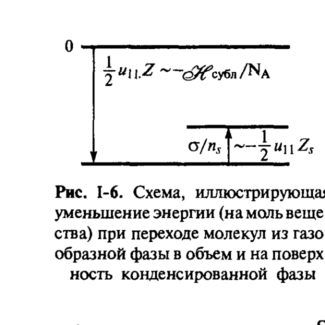
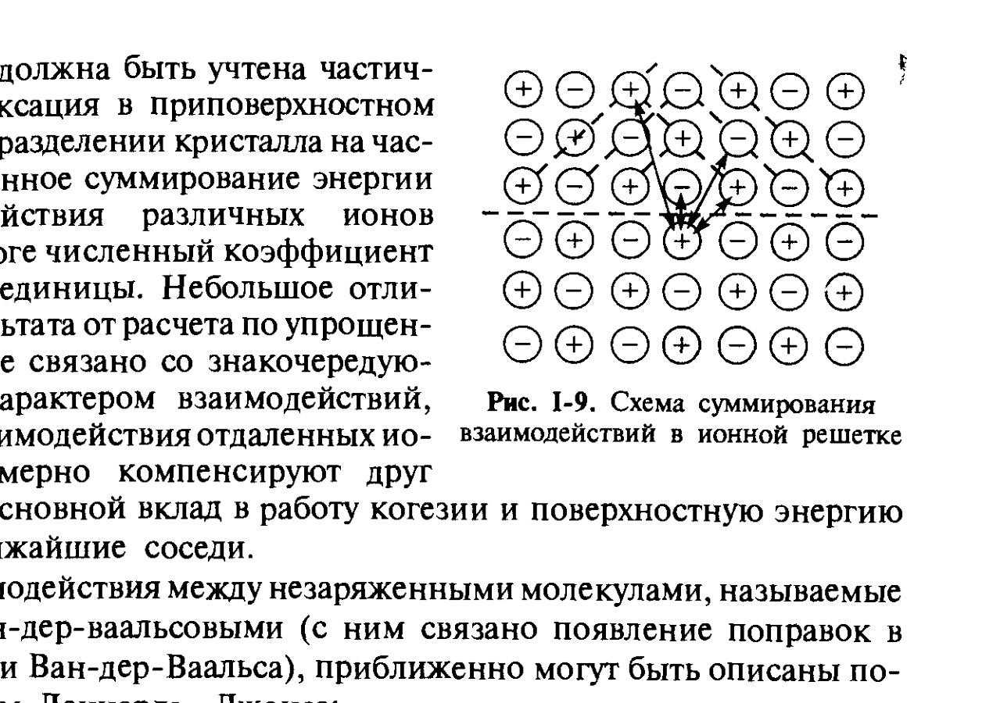
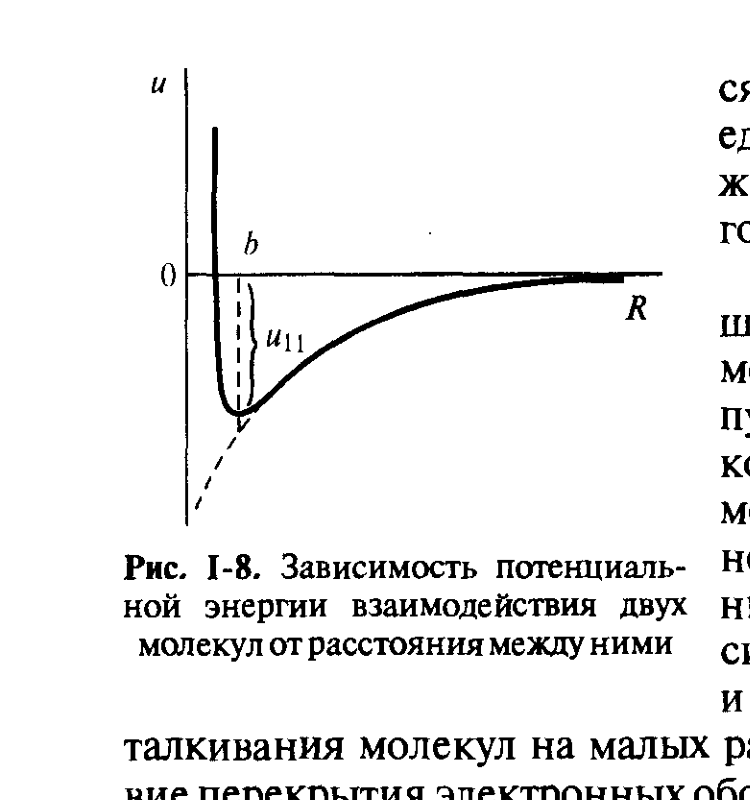

# Билет 4. Поверхностная энергия и межмолекулярные взаимодействия. Потенциал Леннарда–Джонса. Дисперсионные взаимодействия

## Тема 1: Связь поверхностной энергии с энергией сцепления молекул (работа когезии)

### Энергетика образования поверхности на молекулярном уровне

В [[билет_02]] и [[билет_03]] поверхностная энергия $\sigma$ рассматривалась макроскопически — как избыток термодинамической функции в поверхностном слое. Теперь подойдём к вопросу иначе: на основе приближённого рассмотрения энергетики взаимодействия образующих тело частиц — атомов, молекул или ионов (далее для краткости «молекулы»). При этом отвлекаются от роли энтропийных факторов (температурной зависимости $\sigma$), считая $\sigma \approx \varepsilon$.

> [!note] Исходное состояние — конденсация из пара
> Рассмотрим в качестве состояния сравнения сильно разреженный пар. **Конденсация** — образование жидкости или кристалла — приводит к уменьшению энергии системы вследствие возникновения сил сцепления молекул в конденсированной фазе. Уменьшение энергии на моль вещества $\Delta U < 0$, отвечающее по физическому смыслу теплоте сублимации $\mathcal{H}_{субл}$ или испарения $\mathcal{H}_{исп}$ (с обратным знаком), равно:
>
> $$\mathcal{H} \approx -\Delta U \approx \frac{1}{2} Z N_A |u_{11}| \tag{см. рис. I-6}$$
>
> где $Z$ — координационное число (число соседей молекулы в объёме данной конденсированной фазы); $N_A$ — постоянная Авогадро; $u_{11} < 0$ — энергия сцепления двух соседних молекул.

*Рис. I-6 (Щукин, с. 26). Молекула в объёме конденсированной фазы понижает энергию на величину $\frac{1}{2}u_{11}Z \sim -\mathcal{H}_{субл}/N_A$; молекула на поверхности — на меньшую величину $\sigma/n_s \sim -\frac{1}{2}u_{11}Z_s$, так как часть связей с соседями отсутствует (недостаток энергии сцепления).*

> [!important] Поверхностная энергия = «недостаток» энергии сцепления
> Для молекул, оказавшихся на поверхности, число соседей $Z_s < Z$ (часть взаимного насыщения межмолекулярных сил не происходит). Поэтому снижение энергии при конденсации для поверхностных молекул будет меньше по абсолютному значению на величину $\sigma S$ ($S$ — площадь поверхности раздела), т. е. уровень энергии поверхностных молекул оказывается выше на ту же величину по сравнению с молекулами в объёме конденсированной фазы. Иными словами, **избыток поверхностной энергии может трактоваться как «недостаток» энергии сцепления молекул**, или как неполное снижение энергии при установлении межмолекулярных связей вследствие того, что поверхностные связи остаются нескомпенсированными.

### Работа (энергия) когезии

> [!note] Определение
> **Работа (энергия) когезии** $W_к$ — работа, которую необходимо совершить в обратимом изотермическом процессе разделения на две части столбика единичного сечения, т. е. работа, затраченная на разрыв молекулярных связей в конденсированной фазе.

Поскольку в таком процессе образуются две поверхности единичной площади, работа когезии равна удвоенному значению поверхностного натяжения:

$$W_к = 2\sigma$$

Если на единицу площади поверхности приходится $n_s$ молекул, каждая из которых до разделения тела на части взаимодействовала с $Z_s$ соседними молекулами из другой половины тела, то $W_к \approx n_s Z_s |u_{11}|$. Тогда поверхностная энергия может быть оценена как:

$$\sigma = \frac{1}{2}W_к \approx \frac{1}{2}n_s Z_s |u_{11}| \tag{I.6}$$

Плотность молекул на поверхности связана с молярным объёмом $V_m$ и объёмом молекулы $v_m = V_m/N_A$ соотношением $n_s \approx v_m^{-2/3} = (V_m/N_A)^{-2/3}$, отсюда:

$$\sigma \approx \frac{\mathcal{H}}{V_m^{2/3}N_A^{1/3}}\cdot\frac{Z_s}{Z} \tag{I.7}$$

где значение $Z_s/Z$ составляет доли единицы, например $\frac{1}{4}$.

> [!important] Правило Стефана
> Согласно (I.7), удельная поверхностная энергия в этом приближении пропорциональна теплоте испарения (сублимации) $\mathcal{H}$ и обратно пропорциональна молярному объёму $V_m$ в степени $2/3$. Эту связь $\sigma$ и $\mathcal{H}$ обычно называют **правилом Стефана**. Экспериментальные данные (табл. I.1, см. [[билет_03]]) свидетельствуют о приближённой выполнимости правила Стефана: изменениям теплоты испарения на три порядка величины при переходе от благородных газов и молекулярных кристаллов к ионным и ковалентным соединениям и металлам отвечает примерно такое же возрастание удельной поверхностной энергии.

> [!example] Применение правила Стефана
> Для твёрдых тел, для которых определить величину $\sigma$ экспериментально трудно (см. [[билет_16]]), соотношение (I.7) позволяет оценить возможные значения поверхностной энергии — зная теплоту сублимации и молярный объём вещества.

### Внутреннее давление $\mathcal{K}$

Значения теплот испарения и сублимации близки. При температуре плавления мало различаются также плотности твёрдого тела и образующегося из него расплава. Соответственно примерно одинаковы и значения поверхностных энергий на границах жидкость — пар (газ) $\sigma_{жг}$ и твёрдое тело — пар (газ) $\sigma_{тг}$.

> [!warning] Не путать $\sigma_{жг}$ и $\sigma_{тж}$
> В отличие от $\sigma_{жг} \approx \sigma_{тг}$, межфазная энергия $\sigma_{тж}$ на границе раздела твёрдого тела с собственным расплавом, как правило, **низка**: подобно тому как теплота плавления составляет $\sim 10\%$ теплоты испарения, для $\sigma_{тж}$ обычно наблюдаются значения, не превышающие одной десятой поверхностного натяжения расплава.

Следуя Ребиндеру, рассмотрим связь поверхностной энергии с другой макроскопической величиной — **внутренним давлением**. Пусть жидкая фаза практически нелетуча ($f'' \ll f'$) и плотность свободной энергии $f$ линейно меняется в поверхности разрыва толщиной $\delta' = \delta$ от объёмного значения $f'$ до некоторого значения $f_m$. Тогда:

$$\sigma = k_1(f_m - f')\delta$$

где $k_1$ — безразмерный коэффициент, составляющий $\frac{1}{2}$ в рассматриваемом приближении. Величина $\mathcal{K}$, равная:

$$\mathcal{K} = \frac{\sigma}{\delta} = k_1(f_m - f')$$

есть средняя плотность избытка энергии (Дж/м³) в поверхностном слое, близкая по порядку величины к плотности энергии сцепления в объёме фазы.

> [!note] Физический смысл $\mathcal{K}$
> При таком подходе величина $\mathcal{K}$ является мерой «**стиснутости**» молекул в объёме жидкости из-за их взаимного притяжения и близка к **внутреннему давлению**, удерживающему молекулы жидкости (или твёрдого тела) в объёме. В идеальном газе $\mathcal{K} = 0$; в реальном газе $\mathcal{K}$ соответствует поправке на притяжение в уравнении Ван-дер-Ваальса.

> [!important] Численная оценка $\mathcal{K}$
> В конденсированных фазах внутреннее давление достигает весьма больших значений. Если учесть, что толщина поверхностного слоя $\delta$ близка к размеру молекул ($\delta \sim b$), а значения $\sigma$ лежат в пределах от единиц до тысяч мДж/м², то $\mathcal{K}$ составляет $10^7 - 10^{10}$ Н/м², т. е. достигает многих тысяч атмосфер.

Таким образом, $\mathcal{K}$ представляет собой совокупность всех действующих между молекулами элементарных сил (на площади 1 м²), которые необходимо преодолеть, чтобы вывести молекулы из объёма на поверхность. Для образования новой поверхности нужно совершить работу против сил когезии, и эта работа в изотермическом процессе запасается в поверхностном слое в виде избыточной энергии, характеризуемой плотностью $\mathcal{K} \approx f_m - f'$.

### Связь $\mathcal{K}$ с другими макроскопическими величинами

Величины, сходные по размерности ($\text{Н/м}^2 = \text{Дж/м}^3$) и близкие по порядку величины к $\mathcal{K}$, определяют и другие свойства конденсированных фаз (жидких и твёрдых), также связанные с работой против сил сцепления (когезии):

- **модуль упругости** $E$, равный силе, приходящейся на единицу площади, при упругой деформации тела (при условном 100%-ном удлинении);
- **теоретическая прочность идеального кристалла** $P_{ид}$ — сила, которая должна быть приложена к единице сечения всех связей, чтобы произошёл одновременный разрыв всех связей в этом сечении;
- **теплота сублимации, отнесённая к молярному объёму**, $\mathcal{H}_{субл}/V_m$ (поскольку $V_m \approx N_A b^3$ и по правилу Стефана $\mathcal{H}_{субл}/V_m \sim \sigma/b$).

Устанавливается приближённое равенство по порядку величин:

$$\mathcal{K} \sim E \sim P_{ид} \sim \frac{\mathcal{H}_{субл}}{V_m} \sim \frac{\sigma}{b} \sim |p_{\mathrm{T,max}}|$$

где $p_{\mathrm{T,max}}$ — максимальное (по модулю) значение тангенциального давления в поверхностном слое (см. рис. I-4, [[билет_02]]).

> [!tip] Единая природа
> Величины $\mathcal{K}$, $E$, $P_{ид}$, $\mathcal{H}_{субл}/V_m$, $\sigma/b$ имеют в конечном счёте одну и ту же природу: они представляют собой макроскопические характеристики взаимодействия между молекулами — сил сцепления на единицу площади или плотности энергии сцепления.

---

## Тема 2: Природа межмолекулярных взаимодействий. Потенциал Леннарда–Джонса. Дисперсионные взаимодействия

### Электростатическая природа межмолекулярных сил

Величины $\mathcal{K} \sim P_{ид} \sim E \sim \mathcal{H}_{субл}/V_m \sim \sigma/b$ представляют собой макроскопические характеристики взаимодействия между молекулами — сил сцепления на единицу площади или плотности энергии сцепления — и имеют в конечном счёте одну и ту же природу: **взаимодействие эффективных электрических зарядов**, близких по порядку величины к заряду электрона $e$ и находящихся на расстояниях $b$ порядка межатомных.

> [!example] Численная оценка энергии когезии через заряд электрона
> Величина $e^2/b$, выражаемая в единицах СИ как $e^2/4\pi\varepsilon_0 b$ и равная $\sim 10^{-18}$ Дж, по порядку величины представляет собой энергию $e^2/4\pi\varepsilon_0 b^2 \approx 10^{-9}$ Н — силу взаимодействия соседних атомов или молекул, т. е. прочность их связи. Эти величины, умноженные на число атомов (молекул) $n_s = 1/b^2$, приходящихся на 1 м² сечения тела, дают оценку энергии когезии:
>
> $$W_к = 2\sigma \sim \frac{e^2}{4\pi\varepsilon_0 b^3}$$
>
> равную примерно нескольким тысячам мДж/м², и сил сцепления на 1 м² (или энергии сцепления в единице объёма):
>
> $$\mathcal{K} \sim P_{ид} \sim E \sim \frac{\mathcal{H}_{субл}}{V_m} \sim \frac{e^2}{4\pi\varepsilon_0 b^4} \sim 10^{10}\ \text{Н/м}^2$$

### Ионные кристаллы: суммирование взаимодействий в решётке

Для ионных кристаллов потенциал сил притяжения между отдельными ионами отвечает закону Кулона ($n=1$). Однако здесь необходимо учитывать, что наряду с притяжением ближайших ионов противоположного знака отталкивание одноимённо заряженных ионов следующей координационной сферы, снова притяжение в последующей сфере и т. д. — необходимо производить **суммирование взаимодействия всех пар ионов** (с учётом их знаков) по обе стороны от будущей поверхности раздела.

*Рис. I-9 (Щукин, с. 30). Суммирование взаимодействий различных ионов в решётке: знакочередующийся характер взаимодействий приводит к тому, что взаимодействия отдалённых ионов примерно компенсируют друг друга, а основной вклад в работу когезии и поверхностную энергию дают ближайшие соседи.*

> [!important] Учёт релаксации
> Кроме суммирования взаимодействий разных ионов, должна быть учтена частичная **релаксация** в приповерхностном слое при разделении кристалла на части. Указанное суммирование энергии взаимодействия различных ионов даёт в итоге численный коэффициент порядка единицы. Небольшое отличие результата расчёта по упрощённой схеме связано со знакочередующимся характером взаимодействий, когда взаимодействия отдалённых ионов примерно компенсируют друг друга, а основной вклад в работу когезии и поверхностную энергию дают ближайшие соседи.

### Потенциал Леннарда–Джонса для незаряженных молекул

Взаимодействия между незаряженными молекулами, называемые часто **ван-дер-ваальсовыми** (с ним связано появление поправок $a$ в уравнении Ван-дер-Ваальса), приближённо могут быть описаны **потенциалом Леннарда–Джонса**:

$$u = -\frac{a_1}{R^6} + \frac{b_1}{R^{12}} \tag{I.8}$$

где:
- $u$ — потенциальная энергия взаимодействия двух молекул;
- $R$ — расстояние между молекулами;
- $a_1$ — константа межмолекулярного **притяжения**;
- $b_1$ — константа межмолекулярного **отталкивания**.

Более общая форма (I.8) с показателями степени $n$ и $m$:

$$u = -\frac{a_1}{R^n} + \frac{b_1}{R^m}$$

— первое слагаемое описывает взаимное притяжение молекул, второе — их отталкивание, причём показатель степени $m$ обычно принимается равным $10 \div 12$, тогда как значение $n$ зависит от природы сил притяжения молекул. Для потенциала Леннарда–Джонса $n=6$, $m=12$.

*Рис. I-8 (Щукин, с. 30). Кривая $u(R)$: на малых расстояниях преобладает резкое («борновское») отталкивание из-за перекрытия электронных оболочек, на больших — притяжение $\sim -a_1/R^6$. Равновесное расстояние $R \approx b$ отвечает минимуму потенциальной ямы глубиной $u_{11}$.*

> [!important] Борновское отталкивание
> Очень резкое возрастание энергии борновского отталкивания с уменьшением расстояния между молекулами приводит к тому, что при малых значениях $n$ (для кулоновского взаимодействия ионов, $n=1$) глубина потенциальной ямы $u_{11}$ (см. рис. I-8) определяется в основном энергией притяжения молекул вблизи положения равновесия. Равновесное расстояние $R \approx b$ отвечает минимуму потенциала взаимодействия молекул.

> [!warning] Применимость кулоновской модели
> Соотношения между макроскопическими характеристиками твёрдых тел ($\mathcal{K}$, $P_{ид}$, $E$, $\mathcal{H}_{субл}/V_m$) и величинами $u_{11}$, $e$, $b$ приложимы для описания свойств **ионных кристаллов**, для которых потенциал сил притяжения между отдельными ионами отвечает закону Кулона ($n=1$). Для **молекулярных** (неполярных) кристаллов и жидкостей основной вклад в притяжение даёт дисперсионное взаимодействие ($n=6$).

### Три типа взаимодействий незаряженных молекул

Константа межмолекулярного притяжения $a_1$ в общем случае включает три составляющие, описывающие соответственно:

1. **Ориентационное взаимодействие** — взаимодействие двух постоянных диполей, пропорциональное четвёртой степени дипольного момента молекул $\mu$ (диполь-дипольное взаимодействие);

2. **Индукционное взаимодействие** — взаимодействие диполя с неполярной молекулой, имеющей поляризуемость $\alpha_M$, пропорциональное $\mu^2 \alpha_M$;

3. **Дисперсионное взаимодействие** — взаимодействие двух неполярных молекул; дисперсионная составляющая $a_L$ константы $a_1$, по Лондону, описывается выражением:

$$a_L = \frac{3}{4}h\nu_0\alpha_M^2$$

где:
- $h$ — постоянная Планка;
- $\nu_0$ — характеристическая частота колебаний зарядов, с которой связано взаимодействие молекул;
- $h\nu_0$ — минимальная энергия взаимного возбуждения молекул (отвечает инфракрасной, видимой или ультрафиолетовой области в спектре поглощения);
- $\alpha_M$ — поляризуемость молекулы.

> [!example] Соотношение вкладов трёх типов взаимодействий
> При взаимодействии отдельных молекул ориентационное взаимодействие может составлять от $0$ (для неполярных молекул) до $\sim 50\%$ и более (для молекул с большим дипольным моментом, например воды); индукционное взаимодействие обычно не превышает $5-10\%$, тогда как наиболее универсальное **дисперсионное взаимодействие** составляет во многих случаях более половины всей энергии притяжения, вплоть до $100\%$ для неполярных углеводородов.

> [!important] Аддитивность дисперсионных взаимодействий
> Существенной особенностью дисперсионных взаимодействий является их **аддитивность** (по крайней мере приближённая): для двух объёмов конденсированной фазы, разделённых зазором, имеет место суммирование притяжения отдельных молекул (хотя значение константы $a_1$ может отличаться от её значения в вакууме из-за взаимного влияния молекул в конденсированной фазе). Роль дисперсионной составляющей особенно велика при взаимодействии молекул конденсированных фаз на больших (по сравнению с молекулярными размерами) расстояниях.

> [!note] Почему именно дисперсионные силы определяют дальнодействие
> Суммарный дипольный момент макроскопических фаз в большинстве случаев равен нулю: постоянные диполи ориентируются в пространстве таким образом, что их электрические поля взаимно нейтрализуют друг друга. Напротив, каждая молекула данной фазы будет поляризоваться под влиянием флуктуирующих диполей другой фазы и взаимодействовать с ними. Поэтому на больших расстояниях взаимодействие молекул конденсированных фаз и тем самым образуемых ими частиц практически полностью обусловлено **дисперсионным взаимодействием**. Этот случай особенно существен при взаимодействии частиц дисперсной фазы через тонкие прослойки дисперсионной среды (см. [[билет_05]], [[билет_06]]).

> [!tip] Как запомнить три типа взаимодействий
> «Ориентация — индукция — дисперсия»: ориентационное (диполь–диполь, зависит от $\mu^4$), индукционное (диполь наводит диполь, зависит от $\mu^2\alpha_M$) и дисперсионное (флуктуационные диполи, зависит от $h\nu_0\alpha_M^2$, не требует постоянных дипольных моментов вообще). Только дисперсионное взаимодействие универсально — присутствует между любыми молекулами, в том числе полностью неполярными.

---

## Источники

- Щукин Е. Д., Перцов А. В., Амелина Е. А. Коллоидная химия. 3-е изд. — М.: Высшая школа, 2004. Гл. I, § I.2, с. 25–31 (формулы I.6–I.8, рис. I-6, I-8, I-9).
