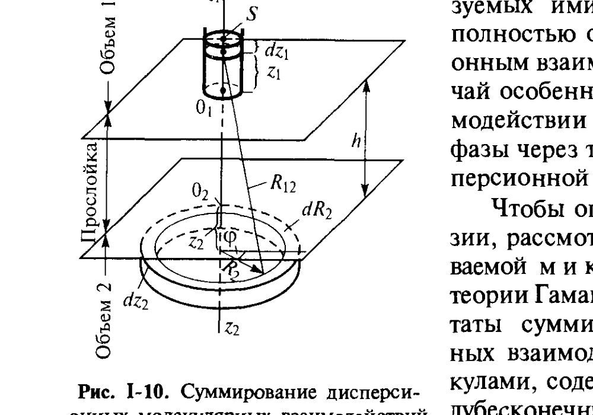

# Билет 5. Теория де Бура–Гамакера: энергия взаимодействия двух макрофаз через зазор. Константа Гамакера

## Тема 1: Аддитивность дисперсионных взаимодействий и переход от молекул к макротелам

### Дисперсионные взаимодействия как основа притяжения конденсированных фаз

> [!note] Напоминание
> Как обсуждалось в [[билет_04]], между молекулами действуют три типа взаимодействий — ориентационное, индукционное и дисперсионное, образующие в сумме константу притяжения $a_1$ потенциала Леннарда–Джонса (I.8). **Дисперсионное взаимодействие** (за счёт мгновенных флуктуационных диполей) универсально — оно действует между любыми молекулами, в том числе неполярными, и для неполярных углеводородов составляет до 100% энергии притяжения.

Существенной особенностью дисперсионных взаимодействий является их **аддитивность** (по крайней мере приближённая): для двух объёмов конденсированной фазы, разделённых зазором, имеет место суммирование притяжения отдельных молекул (хотя значение константы $a_1$ может отличаться от её значения в вакууме из-за взаимного влияния молекул в конденсированной фазе).

> [!important] Когда дисперсионная составляющая определяет всё взаимодействие фаз
> Суммарный дипольный момент макроскопических фаз в большинстве случаев равен нулю: постоянные диполи молекул ориентируются в пространстве так, что их электрические поля взаимно нейтрализуют друг друга. Однако каждая молекула фазы поляризуется под влиянием флуктуирующих диполей молекул другой фазы и взаимодействует с ними. Поэтому **на больших расстояниях взаимодействие молекул конденсированных фаз и образуемых ими частиц практически полностью обусловлено дисперсионным взаимодействием**. Этот случай особенно существен при взаимодействии частиц дисперсной фазы через тонкие прослойки дисперсионной среды (см. [[билет_46]]).

### Геометрия задачи: два полубесконечных объёма, разделённых зазором

*Рис. I-10 (Щукин, с. 32). Суммирование дисперсионных молекулярных взаимодействий между молекулами, содержащимися в двух полубесконечных объёмах конденсированной фазы, разделённых плоским зазором шириной $h$.*

Рассматривается так называемая **микроскопическая теория Гамакера и Де-Бура** — суммирование (интегрирование) парных дисперсионных взаимодействий между молекулами, содержащимися в двух полубесконечных объёмах конденсированной фазы (Объём 1 сверху, Объём 2 снизу), разделённых плоским зазором шириной $h$.

> [!note] Идея метода
> Энергия взаимодействия фаз $U_{mol}$ определяется в расчёте на единицу площади межфазной поверхности раздела. Величина $U_{mol}$ равна энергии взаимодействия молекул, находящихся в бесконечно длинном цилиндре единичного сечения $S$ над плоскостью $O_1$, со всеми молекулами объёма, расположенного под плоскостью $O_2$. Суммирование заменяется интегрированием по четырём координатам: одной — вертикальной координате $z_1$ в объёме над $O_1$, и трём — координатам $z_2$, $R_2$, $\varphi$ в объёме под $O_2$ (цилиндрические координаты с осями $z_1$, $z_2$, отсчитываемыми от плоскостей $O_1$ и $O_2$ внутрь соответствующих объёмов, $R_2$ — радиус, $\varphi$ — угол).

### Вывод формулы суммирования (интегрирование)

Предполагается, что все молекулы, находящиеся в малом элементе объёма 1 $dV_1 = S\,dz_1$, одинаково взаимодействуют с молекулами малого элемента $dV_2$ объёма 2, расположенного на расстоянии $R_{12}$ от $dV_1$. Тогда:

$$U_{mol} = -n^2 a_1 \iiint\limits_{z_1, z_2, R_2} \frac{1}{R_{12}^6}\, dz_1\, dz_2\, R_2\, dR_2\, d\varphi$$

где:
- $n$ — концентрация молекул в объёмах 1 и 2 (число молекул в единице объёма), м⁻³;
- $a_1 = a_L = \tfrac{3}{4}h\nu_0\alpha_M^2$ — константа притяжения молекул, поскольку учитываются только дисперсионные взаимодействия (см. [[билет_04]]);
- $R_{12}$ — расстояние между взаимодействующими элементами объёма;
- $z_1, z_2, R_2, \varphi$ — координаты интегрирования.

Поскольку все элементы кольца $z_2 = \mathrm{const}$, $R_2 = \mathrm{const}$ находятся на одинаковом расстоянии от $dV_1$, и объём этого кольца равен $2\pi R_2\,dz_2\,dR_2$, интегрирование по $\varphi$ даёт:

$$U_{mol} = -2\frac{A_{11}}{\pi}\iiint\limits_{z_1,z_2,R_2}\frac{R_2\,dz_1\,dz_2\,dR_2}{R_{12}^6}$$

Геометрическая связь величин $R_2$, $R_{12}$ и $z_1+z_2+h$:

$$R_{12}^2 = R_2^2 + (z_1+z_2+h)^2$$

Последовательное интегрирование (по $R_2$, затем по $z_1$, затем по $z_2$) даёт сначала взаимодействие элемента $dV_1$ со всем объёмом 2:

$$-\frac{A_{11}}{\pi}\int\limits_{R_2=0}^{\infty}\frac{d(R_2^2)\,dz_1\,dz_2}{[R_2^2+(z_1+z_2+h)^2]^3} = -\frac{A_{11}}{2\pi(z_1+z_2+h)^4}\,dz_1\,dz_2$$

затем взаимодействие всего объёма 1 с прослойкой объёма 2 толщиной $dz_2$:

$$-\frac{A_{11}}{6\pi(z_2+h)^3}\,dz_2$$

и, наконец, четвёртое интегрирование по $z_2$ даёт искомую величину $U_{mol}$.

> [!tip] Как не запутаться в выводе
> Каждое последующее интегрирование «убирает» одну координату и одновременно повышает степень $h$ в знаменателе на единицу: после первого интегрирования степень 4, после второго — 3, после третьего (по $z_1$, аналогично) — степень 2. Конечный результат содержит $h^2$ в знаменателе — отсюда и итоговая формула (I.9).

---

## Тема 2: Энергия взаимодействия двух макрофаз через зазор. Константа Гамакера

### Формула (I.9) и константа Гамакера

В результате точного рассмотрения суммирования дисперсионных взаимодействий получается:

$$U_{mol} = -\frac{A_{11}}{12\pi h^2} \tag{I.9}$$

где:
- $U_{mol}$ — энергия взаимодействия двух полубесконечных объёмов конденсированной фазы (1) через плоский зазор шириной $h$, отнесённая к единице площади поверхности раздела (в единицах энергии на единицу площади), Дж/м²;
- $h$ — ширина (толщина) зазора между объёмами, м;
- $A_{11} = \pi^2 n^2 a_L$ — **константа Гамакера**, имеет размерность энергии, Дж;
- $n$ — концентрация молекул в каждом из объёмов, м⁻³;
- $a_L$ — лондоновская константа дисперсионного притяжения молекул (см. [[билет_04]]).
- Знак минус в (I.9) отвечает **притяжению** — энергия взаимодействия отрицательна, и убыль $|U_{mol}|$ при сближении объёмов соответствует выигрышу энергии.

> [!important] Зависимость от расстояния — степень −2
> В отличие от парного межмолекулярного взаимодействия, которое убывает как $1/R^6$ (формула I.8 в [[билет_04]]), энергия взаимодействия **макроскопических тел** через зазор убывает значительно медленнее — как $1/h^2$. Это прямое следствие интегрирования (суммирования) парных взаимодействий по объёмам обеих фаз: при последовательном интегрировании по $z_1$ и $z_2$ степень убывания понижается с 6 до 2. Именно эта медленная зависимость $\sim 1/h^2$ обеспечивает дальнодействие сил притяжения между макроскопическими частицами и их существенную роль в устойчивости дисперсных систем (см. [[билет_46]], [[билет_48]]).

### Переход от энергии через зазор к работе когезии: формула (I.10)

Работу когезии для конденсированной фазы с молекулярным строением можно рассматривать как **предел**, к которому стремится величина $U_{mol}$ при уменьшении толщины зазора $h$ до размера молекул $b$. В таком случае при $h = h_0 = b$:

$$\frac{1}{2}W_к = \sigma = -\frac{1}{2}U_{mol}(b) \approx \frac{A_{11}}{24\pi b^2} \tag{I.10}$$

где:
- $W_к = 2\sigma$ — работа когезии, Дж/м² (см. [[билет_04]]);
- $\sigma$ — поверхностное натяжение (удельная свободная поверхностная энергия), Дж/м²;
- $b$ — эффективное расстояние между молекулами при их непосредственном контакте (того же порядка, что и боровский радиус отталкивания в потенциале Леннарда–Джонса, [[билет_04]]), м;
- $A_{11}$ — константа Гамакера данной фазы, Дж.

> [!warning] Условность приближения $h_0 = b$
> На расстояниях, сравнимых с размерами молекул, проведённая ранее замена суммирования взаимодействия отдельных молекул интегрированием утрачивает строгое физическое обоснование — на таких расстояниях дискретность молекулярной структуры уже нельзя игнорировать. Поэтому величине $b$ можно приписать лишь некоторое **эффективное значение**, отвечающее по порядку величины межмолекулярным расстояниям, а формулы (I.9)–(I.10) на расстояниях $h \sim b$ дают лишь **оценочные** (по порядку величины) результаты.

> [!note] Уточнение Лифшица
> Развитый Е. М. Лифшицем макроскопический подход (макроскопическая теория Лифшица) даёт более строгий путь расчёта дисперсионного взаимодействия двух объёмов конденсированной фазы, не использующий приближение парной аддитивности молекулярных взаимодействий (подробнее — см. главу VII учебника, посвящённую расклинивающему давлению, [[билет_46]]).

### Дисперсионная и недисперсионная составляющие поверхностной энергии

Для органических веществ, молекулы которых содержат полярные группы, наряду с дисперсионными силами необходимо рассматривать **недисперсионные составляющие взаимодействия**, связанные, в частности, с присутствием постоянных диполей и мультиполей, особенно с образованием водородных связей. Такие силы действуют преимущественно между ближайшими соседями и, в отличие от дисперсионных взаимодействий, не суммируются на больших расстояниях в объёме фаз.

Соответственно поверхностную энергию можно разделить на **дисперсионную** $\sigma^d$ и **недисперсионную** $\sigma^n$ составляющие (по Фоуксу):

$$\sigma = \sigma^d + \sigma^n$$

где:
- $\sigma^d$ — вклад дисперсионных взаимодействий в поверхностную энергию, Дж/м²;
- $\sigma^n$ — вклад недисперсионных (полярных, водородных и т. п.) взаимодействий, Дж/м².

Вклад той или иной составляющей существенно зависит от природы фазы:

| Тип конденсированной фазы | Соотношение $\sigma^d$ и $\sigma^n$ | Пример |
|---|---|---|
| Неполярные органические жидкости (углеводороды) | $\sigma^n \approx 0$, $\sigma \approx \sigma^d \approx 20$ мДж/м² | предельные углеводороды |
| Полярные жидкости | значителен вклад $\sigma^n$ (для воды — до ~70%) | вода: $\sigma \approx 72{,}7$ мДж/м² ([[билет_03]]), при этом $\sigma^d \approx 20$ мДж/м², $\sigma^n \approx 50$ мДж/м² |
| Ионные и ковалентные соединения, металлы | $\sigma^d$ отличается от значений для неполярных органических веществ в основном в пределах различий плотностей; $\sigma$ велико (сотни–тысячи мДж/м²) за счёт недисперсионных (высокоэнергетических) взаимодействий | металлы, ионные кристаллы (см. таблицу в [[билет_03]]) |

> [!example] Численный пример для воды
> Для воды $\sigma \approx 72$ мДж/м², из них на долю дисперсионных сил приходится не более 30%, т.е. $\sigma^d \approx 20$ мДж/м², а основной вклад (~70%, $\sigma^n \approx 50$ мДж/м²) вносят водородные и дипольные (недисперсионные) взаимодействия.

### Равенство $W_к = 2\sigma$ и его границы применимости

> [!important] Когда $W_к = -U_{mol}(b) = 2\sigma$, а когда нет
> Равенство $W_к = 2\sigma$ имеет место для **любых жидких фаз**, как полярных, так и неполярных: при сближении двух объёмов единичного сечения до их непосредственного соприкосновения ($h \to b$) происходит слияние и полностью исчезают две поверхности раздела с суммарной энергией $2\sigma$. А вот равенство $2\sigma = -U_{mol}(b)$ справедливо **только для жидких неполярных фаз**, в которых взаимодействие между молекулами обусловлено исключительно дисперсионными силами, т. е. $\sigma \approx \sigma^d$.
>
> Для **твёрдых тел** сближение двух объёмов вплоть до непосредственного соприкосновения не сопровождается их полным слиянием даже в вакууме: вследствие малой подвижности молекул различия структуры на поверхности и в объёме не могут самопроизвольно исчезнуть. Поэтому при непосредственном соприкосновении твёрдых тел возникает реальная физическая граница раздела с характерной для неё удельной свободной энергией $\sigma^* \neq 0$ (для двух кристаллов одного состава — **удельная свободная энергия границы зёрен** $\sigma_{гз}$). В этом случае $-\tfrac{1}{2}U_{mol}(b)$ оказывается **меньше** поверхностной энергии $\sigma$, а именно: $-U_{mol}(b) = 2\sigma - \sigma^*$.

> [!tip] Как запомнить
> Для жидкости: «слиплись — и обе поверхности исчезли без следа» → $W_к = 2\sigma$. Для твёрдого тела: «слиплись, но шов остался» → часть поверхностной энергии «застревает» в виде энергии границы зёрен $\sigma^*$, поэтому выигрыш энергии при сближении меньше $2\sigma$.

---

## Источники

- Щукин Е. Д., Перцов А. В., Амелина Е. А. Коллоидная химия. 3-е изд. — М.: Высшая школа, 2004. Гл. I, § I.2, с. 31–35 (формулы I.9–I.10, рис. I-10, разделы о дисперсионной/недисперсионной составляющих σ).
