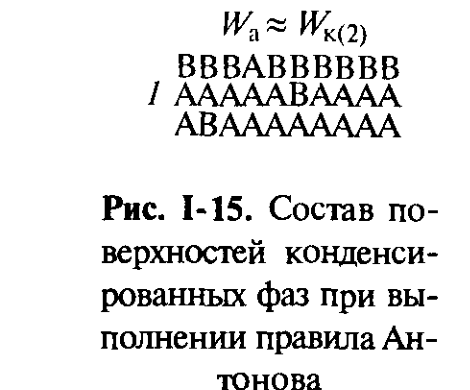

# Билет 8. Поверхность раздела конденсированных фаз: работа адгезии, межфазное натяжение и его составляющие. Правило Антонова. Уравнение Джирифалко–Гуда

## Тема 1: Работа адгезии и межфазное натяжение

### Определение работы адгезии

> [!note] Определение
> **Работа (энергия) адгезии** $W_a$ — это работа изотермического обратимого разделения вдоль межфазной поверхности единичной площади двух конденсированных фаз 1 и 2, находящихся в контакте. При таком разделении исчезает межфазная поверхность с энергией $\sigma_{12}$ и образуются две новые свободные поверхности раздела фаз 1 и 2 с газом (воздухом), имеющие энергии $\sigma_1$ и $\sigma_2$ соответственно.

По аналогии с работой когезии $W_к$ (см. [[билет_04]], [[билет_07]]), работа адгезии определяется соотношением, известным как **уравнение Дюпре**:

$$W_a = \sigma_1 + \sigma_2 - \sigma_{12} \tag{I.11}$$

где:
- $W_a$ — работа адгезии, Дж/м²;
- $\sigma_1$, $\sigma_2$ — удельные свободные поверхностные энергии (поверхностные натяжения) фаз 1 и 2 на границе с газом, Дж/м²;
- $\sigma_{12}$ — удельная свободная энергия межфазной границы раздела фаз 1 и 2, Дж/м².

> [!important] Физический смысл $W_a$
> Величина $W_a$ характеризует **родственность** контактирующих фаз — степень насыщения нескомпенсированных поверхностных сил при контакте. Чем больше $W_a$, тем сильнее «слипание» фаз 1 и 2 между собой. Межфазная энергия $\sigma_{12}$, наоборот, определяет интенсивность остаточных нескомпенсированных сил на границе раздела конденсированных фаз.

### Молекулярная модель работы адгезии для предельного случая взаимной нерастворимости

Рассмотрим предельный случай, когда компоненты А (образующие фазу 1) и В (образующие фазу 2) практически взаимно нерастворимы, причём обе фазы близки по структуре — имеют одинаковые размеры атомов, одинаковые координационные числа $Z_A = Z_B = Z$ и числа связей $Z_s n_s$ в единичном сечении (см. [[билет_04]]).

В приближении, учитывающем лишь взаимодействия с ближайшими соседями, работа адгезии связана с энергией взаимодействия $u_{AB}$ разнородных молекул (атомов) соотношением, аналогичным (I.6):

$$W_a = W_{AB} = -u_{AB}Z_s n_s \tag{сходно с I.6}$$

Межфазная энергия $\sigma_{12}$ может быть определена как сумма поверхностных энергий фаз за вычетом работы адгезии:

$$\sigma_{12} = \sigma_1 + \sigma_2 - W_a = \frac{1}{2}Z_s n_s(-u_{AA} - u_{BB} + 2u_{AB}) = \frac{Z_s}{Z}n_s u_0 \tag{I.12}$$

где:
- $u_{AA}$, $u_{BB}$ — энергии взаимодействия однородных атомов (молекул) фаз А и В соответственно;
- $u_0 = Z\left[u_{AB} - \tfrac{1}{2}(u_{AA}+u_{BB})\right]$ — **энергия смешения** компонентов.

> [!note] Энергия смешения как мера взаимной растворимости
> Величина $u_0$ определяет взаимную растворимость компонентов А и В и может быть оценена из диаграммы состояния соответствующей двухкомпонентной системы. При заметной взаимной растворимости компонентов избыточная энергия межфазной поверхности $\sigma_{12}$ уменьшается — это связано, во-первых, с тем, что на межфазной поверхности часть связей типа А–В заменяется на связи А–А и В–В, а во-вторых, с тем, что в объёмах фаз доля связей А–В увеличивается (рис. I-14, *б*).

> [!example] Геометрическая иллюстрация
> На рис. I-14 *а* (полная взаимная нерастворимость) межфазный слой представляет собой резкую границу: атомы А контактируют только с атомами В вдоль идеально плоской границы. На рис. I-14 *б* (заметная растворимость) граница «размыта» — в приповерхностных слоях обеих фаз появляются «чужие» атомы, что снижает $\sigma_{12}$.

---

## Тема 2: Дисперсионная и недисперсионная составляющие $\sigma_{12}$. Уравнение Джирифалко–Гуда (Фоукса)

### Дисперсионная составляющая межфазной энергии

Как и для однокомпонентных систем (см. [[билет_05]], [[билет_07]]), в величине $\sigma$ можно выделить «неспецифическую» **дисперсионную составляющую** $\sigma^d$ и **недисперсионную составляющую** $\sigma^n$, определяемую типом молекулярных взаимодействий в граничащих фазах: $\sigma = \sigma^d + \sigma^n$.

Дисперсионная составляющая поверхностной энергии границы раздела конденсированных фаз 1–2 приближённо описывается выражением, сходным с (I.10) (см. [[билет_05]], [[билет_06]]), в котором, как и в (I.12), аддитивно учитываются взаимодействия молекул А с А, В с В и А с В, описываемые соответствующими константами Гамакера $A_A$, $A_B$ и $A_{AB}$:

$$\sigma_{12}^d = \frac{A_A + A_B - 2A_{AB}}{24\pi b^2} = \frac{A^*}{24\pi b^2}$$

где $b$ — эффективное межмолекулярное расстояние, $A^*$ — сложная константа Гамакера (см. [[билет_06]]).

Используя приближение среднего геометрического $A_{AB} \approx \sqrt{A_A A_B}$ (см. [[билет_06]]), получаем:

$$A^* = A_A + A_B - 2\sqrt{A_AA_B} = (\sqrt{A_A}-\sqrt{A_B})^2 \tag{I.13}$$

и соответственно:

$$\sigma_{12}^d \approx \left(\sqrt{\sigma_1^d} - \sqrt{\sigma_2^d}\right)^2$$

### Уравнение Джирифалко–Гуда (Фоукса) — формула (I.14)

Поэтому общая свободная поверхностная энергия границы раздела конденсированных фаз, согласно **Ф. Фоуксу, Л. Джирифалко и Р. Гуду**, может быть представлена в виде:

$$\sigma_{12} \approx \left(\sqrt{\sigma_1^d} - \sqrt{\sigma_2^d}\right)^2 + \sigma_{12}^n \tag{I.14}$$

где:
- $\sigma_1^d$, $\sigma_2^d$ — дисперсионные составляющие поверхностных натяжений фаз 1 и 2 (на границе с газом), Дж/м²;
- $\sigma_{12}^n$ — составляющая межфазной энергии, обусловленная нескомпенсированными в поверхностном слое **недисперсионными** взаимодействиями фаз 1 и 2, Дж/м².

> [!important] Частный случай: одна фаза предельно неполярна
> Если величина $\sigma$ одной из фаз содержит недисперсионную компоненту ($\sigma_1^n > 0$), а другая фаза предельно неполярна ($\sigma_2^n = 0$ и $\sigma_2 = \sigma_2^d$), то уравнение (I.14) упрощается:
>
> $$\sigma_{12} = \left(\sqrt{\sigma_1^d}-\sqrt{\sigma_{2}^d}\right)^2 + \sigma_1^n$$
>
> Если же **обе фазы неполярны**, то недисперсионная составляющая $\sigma_{12}^n$ межфазной энергии близка к нулю.

> [!tip] Практическое значение
> Оценить значения дисперсионной и недисперсионной составляющих поверхностного натяжения можно на основе изучения **смачивания** твёрдых тел жидкостями с известными $\sigma^d$ и $\sigma^n$ (метод Зисмана и др., см. [[билет_09]], [[билет_16]]) — это один из основных практических способов определения данных составляющих для твёрдых поверхностей.

---

## Тема 3: Правило Антонова

### Формулировка правила

> [!note] Определение
> Для границ между двумя **жидкостями** часто оказывается справедливым эмпирическое **правило Антонова**, согласно которому межфазная энергия $\sigma_{12}$ равна разности между поверхностными натяжениями более полярной $\sigma_1$ и менее полярной $\sigma_2$ жидкостей (на их соответствующих границах с воздухом):
>
> $$\sigma_{12} = \sigma_1 - \sigma_2 \tag{I.15}$$
>
> где $\sigma_1 > \sigma_2$ ($\sigma_1$ — поверхностное натяжение более полярной жидкости, $\sigma_2$ — менее полярной).

> [!warning] Взаимно насыщенные растворы
> При применении правила Антонова следует учитывать, что для **взаимно растворимых** жидкостей величины $\sigma_1$ и $\sigma_2$ относятся к их **взаимно насыщенным растворам**, а не к чистым жидкостям. Это особенно важно для полярной жидкости, поскольку её поверхностное натяжение может сильно снижаться при растворении в ней менее полярного компонента (подробнее — см. главу II учебника, посвящённую адсорбции).

### Геометрическая интерпретация правила Антонова

*Рис. I-15 (Щукин, с. 42). Схематический состав поверхностных слоёв конденсированных фаз А и В при выполнении правила Антонова: $W_a \approx W_{к(2)}$.*

Правило Антонова (I.15) означает, что работа адгезии в этом случае равна работе когезии **менее полярной** жидкости:

$$W_a = \sigma_1 + \sigma_2 - \sigma_{12} = 2\sigma_2 = W_{к(2)}$$

> [!important] Молекулярная интерпретация
> Можно сказать, что образование новой поверхности при нарушении контакта жидкостей с резко различающейся полярностью происходит **как бы по менее полярной фазе**, где взаимодействия слабее, чем в более полярной фазе и на межфазной поверхности. Иными словами, поверхностный слой более полярной фазы (со стороны границы 1–2) по составу и строению близок к чистой менее полярной фазе 2 (рис. I-15) — происходит обогащение приповерхностного слоя более полярной фазы молекулами (или ориентациями молекул), характерными для менее полярной фазы.

### Таблица: проверка правила Антонова (Щукин, табл. I.2)

| Жидкость (малополярная фаза, $\sigma_2$) | $\sigma_2$, мН/м | $\sigma_1$ (вода), мН/м | $\sigma_{12}$ эксп., мН/м | $\sigma_{12}$ по правилу Антонова, мН/м |
|---|---|---|---|---|
| Бензол | 28,8 | 63,2 | 34,4 | 34,4 |
| Эфир | 17,5 | 28,1 | 10,6 | 10,6 |
| Анилин | 42,2 | 46,4 | 4,8 | 4,2 |
| CCl₄ | 26,7 | 70,2 | 43,8 | 43,5 |
| Нитробензол | 43,2 | 67,9 | 24,7 | 24,7 |
| Амиловый спирт | 21,5 | 26,3 | 4,8 | 4,8 |

> [!example] Вывод из таблицы
> Из таблицы видно, что правило Антонова хорошо выполняется для различных систем «органическая жидкость — вода» (расхождение экспериментальных и расчётных значений $\sigma_{12}$ обычно не превышает десятых долей мН/м). Все приведённые жидкости, кроме воды, относительно малополярны по сравнению с водой, поэтому именно их поверхностное натяжение $\sigma_2$ выступает в роли вычитаемого в формуле (I.15).

> [!warning] Не путать правило Антонова с уравнением Джирифалко–Гуда
> **Правило Антонова** (I.15) — простое эмпирическое соотношение для границ жидкость–жидкость, не требующее знания дисперсионных/недисперсионных составляющих. **Уравнение Джирифалко–Гуда** (I.14) — более общее и теоретически обоснованное соотношение, применимое в том числе к границам жидкость–твёрдое тело, но требующее знания величин $\sigma^d$ и $\sigma^n$ для обеих фаз. Сопоставление соотношения (I.15) с выражением для работы адгезии (I.11) показывает, что правило Антонова — частный случай, отвечающий условию $W_a \approx W_{к(2)}$.

---

## Источники

- Щукин Е. Д., Перцов А. В., Амелина Е. А. Коллоидная химия. 3-е изд. — М.: Высшая школа, 2004. Гл. I, § I.3, с. 39–43 (формулы I.11–I.15, рис. I-13, I-14, I-15, табл. I.2).
