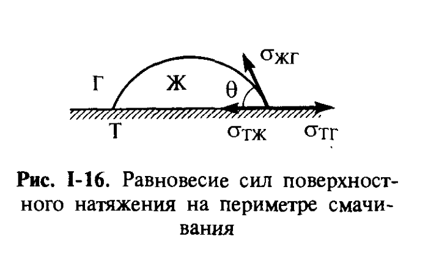
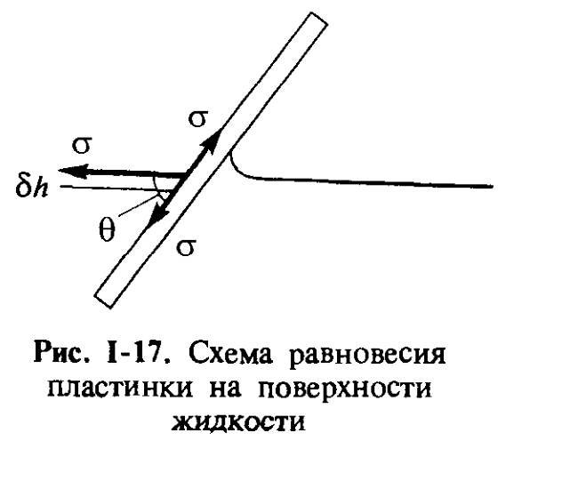

# Билет 9. Краевой угол смачивания. Вывод уравнения Юнга. Условия смачивания, несмачивания и растекания

## Тема 1: Краевой угол и три поверхности раздела при смачивании

### Линия и угол смачивания

> [!note] Определение
> Если на поверхность твёрдого тела нанесена капля жидкости, то в такой системе присутствуют **три различные поверхности раздела фаз**: между твёрдым телом и газом ($\sigma_{тг}$), между жидкостью и газом ($\sigma_{жг}$), и между жидкостью и твёрдым телом ($\sigma_{тж}$). Линию пересечения всех трёх поверхностей раздела называют **линией смачивания**, а замкнутая линия смачивания (линия трёхфазного контакта) образует **периметр смачивания**.
>
> **Краевой угол смачивания** $\theta$ — угол между поверхностями раздела жидкость–газ и твёрдое тело–жидкость.

*Рис. I-16 (Щукин, с. 44). Равновесие сил поверхностного натяжения $\sigma_{тг}$, $\sigma_{тж}$ и $\sigma_{жг}$ на периметре смачивания. Краевой угол $\theta$ отсчитывается внутри капли жидкости (Ж) между поверхностями Т–Ж и Ж–Г; Г — газовая фаза.*

---

## Тема 2: Вывод уравнения Юнга

### Механическое равновесие сил поверхностного натяжения (нестрогий вывод)

Чтобы получить условия равновесия капли жидкости на твёрдой поверхности, обычно величины удельных поверхностных энергий считают численно равными поверхностным натяжениям, т. е. **силам**, приложенным к единице длины периметра смачивания и действующим по касательным к соответствующим поверхностям (рис. I-16). Тогда условие механического равновесия этих сил может быть записано в виде:

$$\sigma_{тг} = \sigma_{тж} + \sigma_{жг}\cos\theta$$

или

$$\cos\theta = \frac{\sigma_{тг}-\sigma_{тж}}{\sigma_{жг}} \tag{I.16}$$

Полученное выражение называют **уравнением Юнга**.

> [!warning] Нестрогость «механического» вывода
> Вывод уравнения Юнга на основе рассмотрения механического равновесия сил поверхностного натяжения часто считается нестрогим. Неоднократно высказывались сомнения, могут ли величины $\sigma_{тг}$, $\sigma_{тж}$ и $\sigma_{жг}$ рассматриваться как реальные **силы**, действующие на периметр смачивания (твёрдое тело недеформируемо, и понятие силы поверхностного натяжения для него не столь наглядно, как для жидкости).

### Строгий термодинамический вывод (метод Гиббса–Дюпре)

> [!important] Идея строгого вывода
> Более строгая количественная связь между величиной равновесного краевого угла $\theta$ и значениями удельных свободных энергий границ раздела фаз может быть получена из рассмотрения **зависимости свободной энергии системы от формы капли** — т. е. из условия минимума свободной энергии системы при заданном объёме капли по отношению к малым виртуальным изменениям формы (положения) периметра смачивания.

Один из методов измерения краевого угла основан на следующей геометрической схеме: после погружения пластинки в жидкость угол наклона пластинки выбирают так, чтобы с одной стороны поверхность жидкости стала бы плоской (рис. I-17), т. е. угол между поверхностью пластинки и горизонтальной поверхностью жидкости стал равным краевому углу $\theta$.

*Рис. I-17 (Щукин, с. 44). Схема равновесия пластинки на поверхности жидкости: при смещении линии трёхфазного контакта на $\delta h$ изменяются площади всех трёх поверхностей раздела.*

Рассмотрим изменение свободной поверхностной энергии системы на единицу длины линии трёхфазного контакта при смещении поверхности на $\delta h$ (например, вниз). При этом появляется поверхность раздела твёрдое тело–газ площадью $\delta S_{тг}$, исчезает такая же по площади поверхность твёрдое тело–жидкость $\delta S_{тж}$, и уменьшается на ту же величину $\delta S_{жг}$ площадь поверхности жидкость–газ. Из элементарных тригонометрических соотношений можно записать общее изменение свободной поверхностной энергии в виде:

$$\delta\mathcal{F}_s = (\sigma_{тг}-\sigma_{тж})\frac{\delta h}{\sin\theta} - \sigma_{жг}\frac{\delta h}{\mathrm{tg}\,\theta}$$

В условиях равновесия, когда $\delta\mathcal{F}_s = 0$, это выражение переходит в **уравнение Юнга** (I.16).

> [!tip] Как запомнить геометрию вывода
> При смещении линии контакта на $\delta h$ вдоль поверхности пластинки три площади меняются согласованно: одна поверхность «исчезает», другая «появляется» (обе равны $\delta h/\sin\theta$ — твёрдое тело–жидкость и твёрдое тело–газ), а площадь жидкость–газ меняется на $\delta h/\mathrm{tg}\,\theta = \delta h\cos\theta/\sin\theta$. Подстановка этих геометрических множителей и приравнивание $\delta\mathcal{F}_s = 0$ автоматически даёт коэффициент $\cos\theta$ при $\sigma_{жг}$.

### Линейное натяжение

> [!note] Поправка для малых капель
> Для очень малых капель заметный вклад в энергетику смачивания может давать избыточная энергия периметра смачивания, так называемое **линейное натяжение** $æ$. Эта величина может быть как положительной, так и отрицательной: при $æ > 0$, когда периметр смачивания стремится дополнительно стянуть каплю, краевой угол $\theta$ должен увеличиваться с уменьшением радиуса периметра смачивания $r_l$, а при $æ < 0$ он должен уменьшаться. Знак и величина линейного натяжения $æ$ определяются особенностями взаимодействия контактирующих фаз вблизи периметра смачивания.

---

## Тема 3: Условия смачивания, несмачивания и растекания

### Классификация по значению краевого угла

> [!important] Три случая в зависимости от $\theta$
> В зависимости от значений равновесного краевого угла различают следующие случаи:
>
> 1. Краевой угол **острый**: $\theta < 90°$, т. е. $\cos\theta > 0$ — **смачивание** поверхности жидкостью;
> 2. Краевой угол **тупой**: $\theta > 90°$, т. е. $\cos\theta < 0$ — **несмачивание** поверхности;
> 3. Равновесный краевой угол **не устанавливается**, и капля растекается в тонкую плёнку — **растекание**.

> [!example] Метастабильные смачивающие плёнки
> При растекании и хорошем смачивании за счёт действия поверхностных сил могут возникать равновесные или метастабильные **смачивающие плёнки**, изученные в исследованиях Б. В. Дерягина и Н. В. Чураева (см. [[билет_46]]).

### Условия через поверхностные энергии. Работа растекания

В соответствии с уравнением Юнга (I.16) смачиванию отвечает условие $\sigma_{тг} > \sigma_{тж}$, несмачиванию — $\sigma_{тг} < \sigma_{тж}$, а растеканию — условие $\sigma_{тг} > \sigma_{тж} + \sigma_{жг}$.

> [!note] Определение
> Величина $W_р = \sigma_{тг} - \sigma_{тж} - \sigma_{жг}$ представляет собой изменение энергии системы, когда единица поверхности твёрдого тела покрывается плоским слоем жидкости; её можно рассматривать как **удельную работу растекания** или как движущую силу процесса растекания, т. е. силу, приложенную перпендикулярно к единице длины периметра смачивания вдоль поверхности твёрдого тела.

### Связь с работой адгезии и когезии: формула (I.17)

Сопоставляя уравнение Юнга с определением работы адгезии $W_a$ (I.11, см. [[билет_08]]), имеем:

$$\cos\theta = \frac{W_a - \sigma_{жг}}{\sigma_{жг}}$$

Это выражение позволяет экспериментально определить работу адгезии $W_a$ на границе твёрдой и жидкой фаз. Заменяя поверхностное натяжение жидкости на работу когезии $W_к = 2\sigma_{жг}$ (см. [[билет_07]]), уравнение Юнга можно представить в виде:

$$\cos\theta = \frac{2W_a - W_к}{W_к} \tag{I.17}$$

Это позволяет выразить термодинамические условия смачивания через соотношения работ когезии и адгезии:

| Условие | Соотношение $W_a$ и $W_к$ | Тип поведения |
|---|---|---|
| Несмачивание | $W_a < \tfrac{1}{2}W_к$ | капля сохраняет форму, $\theta > 90°$ |
| Смачивание | $\tfrac{1}{2}W_к < W_a < W_к$ | капля растекается частично, $0 < \theta < 90°$ |
| Растекание | $W_a > W_к$ | плёнка растекается неограниченно, $\theta \to 0$ |

> [!important] Почему краевой угол всегда меньше 180°
> Так как в вакууме все конденсированные фазы притягиваются друг к другу, работа адгезии — величина принципиально положительная ($W_a > 0$), и, следовательно, $\cos\theta > -1$, т. е. угол $\theta$ всегда меньше $180°$. Как правило, краевой угол в системе жидкость–твёрдое тело–газ не превышает $150°$.

### Примеры: согласованность работы адгезии и когезии с поверхностной активностью

> [!example] Углеводороды и металлы
> В соответствии с выражением (I.17) хорошее смачивание и растекание возможны при большой работе адгезии (когда молекулярная природа жидкости и твёрдого тела близки) или при низкой работе когезии (когда поверхностное натяжение жидкости мало). Соответственно углеводороды и другие органические жидкости с малым поверхностным натяжением хорошо смачивают практически любые твёрдые тела. Наоборот, жидкие металлы (с малой химической активностью), имеющие высокие значения поверхностного натяжения (порядка $10^2$–$10^3$ мДж/м²), хорошо смачивают только неокисленные поверхности твёрдых металлов. Активные металлы — «раскислители» (например, титан, марганец, цирконий) — способны смачивать и некоторые оксиды.

> [!example] Вода
> Вода — жидкость со сравнительно высокой работой когезии в силу полярности её молекул ($W_к \approx 145$ мДж/м²) — хорошо смачивает оксиды и растекается на некоторых силикатах, но не смачивает парафин и фторорганические полимеры.

> [!tip] Степень родственности фаз через $\theta$ и $W_a$
> Работа адгезии отражает степень взаимного насыщения поверхностных сил жидкости и твёрдого тела при их соприкосновении; симбатная с ней величина $\cos\theta$ также отражает степень родственности, или, как часто говорят, «фильности», поверхности твёрдого тела по отношению к жидкости (лиофильности). Полярные поверхности, хорошо смачиваемые водой, являются **гидрофильными**, тогда как поверхности твёрдых углеводородов (парафин, полиэтилен) и особенно фторорганических полимеров, не смачиваемые водой, — **гидрофобны** (подробнее об избирательном смачивании, гидрофильности/гидрофобности — см. [[билет_11]]).

> [!warning] Сравнение работ адгезии для разных жидкостей
> Так как краевой угол определяется не только работой адгезии, но и работой когезии, то сопоставление краевых углов, образуемых различными жидкостями на поверхности твёрдого тела, **не позволяет непосредственно** сравнивать работы адгезии, т. е. степень родственности жидкости к твёрдому телу. Для этого требуется учитывать обе величины — $W_a$ и $W_к$ — совместно, как в уравнении (I.17).

---

## Источники

- Щукин Е. Д., Перцов А. В., Амелина Е. А. Коллоидная химия. 3-е изд. — М.: Высшая школа, 2004. Гл. I, § I.4, с. 43–47 (формулы I.16–I.17, рис. I-16, I-17).
