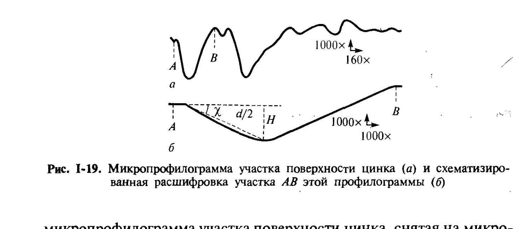
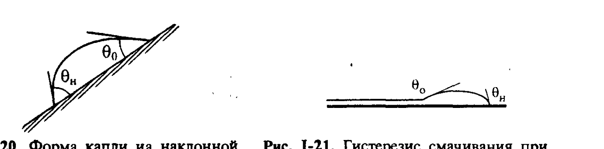

# Билет 10. Влияние шероховатости и химической неоднородности поверхности на смачивание. Супергидрофобность. Гистерезис смачивания

## Тема 1: Влияние шероховатости поверхности на смачивание

### Реальные поверхности и коэффициент шероховатости

> [!note] Постановка задачи
> На смачивание твёрдых тел жидкостями большое влияние оказывает **состояние поверхности твёрдого тела**, в частности её микрогеометрия (шероховатость). Поверхность реальных твёрдых тел не бывает идеально гладкой.

*Рис. I-19 (Щукин, с. 50). *а* — микропрофилограмма участка поверхности цинка, снятая на микропрофилографе с алмазной иглой (увеличение по вертикали 1000×, по горизонтали 160×); *б* — схематизированная «расшифровка» участка $AB$ этой профилограммы.*

Рельеф реальной поверхности можно приближённо рассматривать как совокупность микроканавок глубиной $H$ и шириной $d$; $H = (d/2)\,\mathrm{tg}\,\chi$, где $\chi$ — угол между идеализированной плоской поверхностью и боковой стороной канавки.

> [!note] Определение
> При наличии шероховатости реальная поверхность твёрдого тела $S_{ист}$ больше идеализированной поверхности $S_{ид}$. Отношение фактической площади поверхности к площади её проекции на идеализированную плоскую поверхность называется **коэффициентом шероховатости**:
>
> $$k_ш = \frac{S_{ист}}{S_{ид}} = \frac{d/\cos\chi}{d} = \frac{1}{\cos\chi}$$

Увеличение истинной площади поверхности твёрдого тела приводит к соответствующему возрастанию вклада в энергетику смачивания границ раздела твёрдое тело–жидкость и твёрдое тело–газ.

### Уравнение Венцеля–Дерягина для эффективного краевого угла

> [!important] Уравнение Венцеля (с учётом шероховатости)
> Согласно А. Венцелю и Б. В. Дерягину, в случае контакта жидкости с поверхностью реального твёрдого тела выражение для работы адгезии следует записать в виде:
>
> $$W_a = k_ш(\sigma_{тг}-\sigma_{тж}) + \sigma_{жг}$$
>
> тогда усреднённое («эффективное») значение косинуса краевого угла равно:
>
> $$\cos\theta_{эф} = \frac{k_ш(\sigma_{тг}-\sigma_{тж})}{\sigma_{жг}} = k_ш\cdot\frac{\sigma_{тг}-\sigma_{тж}}{\sigma_{жг}\cos\chi} = \frac{\cos\theta}{\cos\chi}$$

где:
- $\theta_{эф}$ — эффективный (наблюдаемый, измеряемый) краевой угол на шероховатой поверхности;
- $\theta$ — истинный краевой угол на идеализированной (гладкой) поверхности того же химического состава, определяемый уравнением Юнга (I.16, см. [[билет_09]]);
- $k_ш = 1/\cos\chi$ — коэффициент шероховатости.

> [!important] Главный вывод уравнения Венцеля — усиление смачивания
> Из приведённого выражения видно, что при смачивании жидкостью твёрдого тела шероховатость поверхности **улучшает смачивание** (угол $\theta_{эф}$ уменьшается по сравнению с $\theta$), при несмачивании — **ухудшает** (угол $\theta_{эф}$ увеличивается). Условие $\chi = \theta$ оказывается достаточным, чтобы смачивание перешло в растекание.

> [!example] Практическое применение
> Это используют, например, в процессах пайки и склеивания, когда наждаком не только удаляют загрязнения, но и наводят шероховатость — для усиления смачивания (если жидкость в принципе смачивает данный материал, $\theta < 90°$) или, наоборот, для усиления несмачивания (гидрофобизация при $\theta > 90°$).

> [!warning] Канавки усиливают гистерезис
> Шероховатость поверхности, особенно образованная системой параллельных канавок (например, для поверхностей, подвергшихся механической обработке), **усиливает гистерезисные явления** при смачивании (см. Тему 3).

---

## Тема 2: Влияние химической неоднородности поверхности. Супергидрофобность

### Состояния Венцеля и Кэсси–Бакстера (внешнее дополнение)

> [!note] Дополнение из современной литературы (не из Щукина)
> Современная теория смачивания шероховатых и химически неоднородных поверхностей выделяет **два предельных режима** контакта капли с шероховатой поверхностью:
> - **режим Венцеля** (гомогенное смачивание) — жидкость полностью заполняет микронеровности рельефа, эффективный угол описывается приведённым выше уравнением Венцеля;
> - **режим Кэсси–Бакстера** (гетерогенное, или композитное смачивание) — под каплей остаются «карманы» воздуха, и капля контактирует с поверхностью лишь частично, опираясь на выступы рельефа. Эффективный косинус краевого угла в этом случае описывается уравнением Кэсси–Бакстера:
>
> $$\cos\theta_{эф} = f_1\cos\theta_1 + f_2\cos\theta_2$$
>
> где $f_1$, $f_2$ — доли площади контакта капли с твёрдой фазой и с воздухом соответственно ($f_1+f_2=1$), $\theta_1$ — истинный краевой угол на гладкой поверхности данного материала, $\theta_2 \approx 180°$ — краевой угол на воздухе. Поскольку $\cos180° = -1$, наличие воздушных «карманов» ($f_2>0$) всегда увеличивает $\theta_{эф}$ по сравнению с $\theta_1$, т. е. усиливает гидрофобность.

> [!important] Супергидрофобность — комбинация химии и микрорельефа
> **Супергидрофобными** называют поверхности с краевым углом смачивания водой $\theta_{эф} > 150°$ и малым гистерезисом смачивания (капля легко скатывается). Согласно уравнению Кэсси–Бакстера, для достижения супергидрофобности необходимо сочетание двух факторов: (1) поверхность должна быть гидрофобна по химической природе ($\theta_1 > 90°$ на гладком образце того же материала) и (2) поверхность должна иметь развитый, обычно иерархический (микро- и наноразмерный), рельеф, обеспечивающий большую долю воздушных «карманов» $f_2$ в режиме Кэсси–Бакстера. Согласно уравнению Венцеля (Тема 1), шероховатость **гидрофильной** поверхности, напротив, лишь усиливает её смачиваемость и не приводит к супергидрофобности.

> [!example] «Эффект лотоса»
> Классический природный пример супергидрофобной поверхности — лист лотоса, поверхность которого покрыта восковым налётом (химически гидрофобным веществом, $\theta_1\sim 100$–$110°$) и микро/наноразмерными сосочками-выступами эпидермиса (иерархический рельеф). В результате капли воды на листе лотоса принимают почти сферическую форму ($\theta_{эф} \to 170°$ и более) и легко скатываются, увлекая частицы загрязнений («эффект самоочищения»).

### Химическая неоднородность поверхности: теплота смачивания

Помимо геометрической неоднородности (шероховатости), на смачивание влияет и **химическая неоднородность** поверхности — наличие участков с разной природой (полярных и неполярных, гидрофильных и гидрофобных). Количественной характеристикой энергетики смачивания, особенно для тонкопористых тел и порошков, наряду с краевым углом, служит **удельная теплота смачивания**.

> [!note] Определение
> **Удельная теплота смачивания** — количество энергии, выделяемое при смачивании единицы массы твёрдого тела. Эта величина равна разности полных поверхностных энергий границ раздела фаз твёрдое тело–газ и твёрдое тело–жидкость.

По Ребиндеру, отношение теплот смачивания твёрдых поверхностей водой ($H_в$) и углеводородом ($H_м$) служит характеристикой гидрофильности поверхности:

$$\beta = \frac{H_в}{H_м}$$

где для **гидрофильных** поверхностей $\beta > 1$, для **гидрофобных** — $\beta < 1$.

> [!example] Численные значения β для разных материалов
> Для активированного угля $\beta \approx 0{,}4$ (гидрофобная поверхность), для кварца $\beta \approx 2$ (сильно гидрофильная), для крахмала $\beta \approx 20$ (сильно гидрофильная). При этом в обоих случаях при контакте с водой и углеводородом тепловой эффект смачивания может быть отнесён к единице массы порошка (адсорбента), и, таким образом, отпадает необходимость измерять поверхность исследуемого порошка.

> [!tip] Связь химической неоднородности с режимом Кэсси–Бакстера
> Химически неоднородная поверхность, состоящая из чередующихся гидрофильных и гидрофобных участков, формально описывается тем же уравнением Кэсси–Бакстера (см. выше), где роли $f_1$, $f_2$ и $\theta_1$, $\theta_2$ играют доли площади и краевые углы соответствующих **химических компонентов** поверхности (а не «твёрдое/воздух»).

---

## Тема 3: Гистерезис смачивания

### Определение и проявления

> [!note] Определение
> **Гистерезисом смачивания** называют способность жидкости образовывать при контакте с твёрдым телом несколько устойчивых (метастабильных) краевых углов, отличных по значению от равновесного.

Например, краевой **угол натекания** $\theta_н$, образованный при нанесении капли жидкости на твёрдую поверхность, оказывается значительно больше краевого **угла оттекания** $\theta_о$, который возникает при приведении в контакт пузырька воздуха с той же поверхностью, находящейся в данной жидкости.

*Рис. I-20, I-21 (Щукин, с. 51). Слева (рис. I-20) — форма капли на наклонной поверхности: угол $\theta_н$ в нижней части капли значительно больше угла $\theta_о$ в верхней части. Справа (рис. I-21) — гистерезис смачивания при возникновении смачивающих плёнок.*

> [!important] Капля на наклонной поверхности (рис. I-20)
> Гистерезис краевого угла наглядно проявляется, если поверхность твёрдого тела с нанесённой на неё каплей наклонена: при этом угол в нижней части капли $\theta_н$ оказывается значительно больше угла в верхней части капли $\theta_о$.

### Причины гистерезиса смачивания

> [!note] Основные причины
> Гистерезис смачивания может быть связан с:
> 1. **загрязнением поверхности**;
> 2. **химической неоднородностью** поверхности (см. Тему 2);
> 3. **шероховатостью поверхности** (см. Тему 1);
> 4. образованием **тонких смачивающих плёнок** (рис. I-21).

> [!important] Сильный гистерезис и смачивающие плёнки (рис. I-21)
> Очень сильный гистерезис, достигающий иногда десятков градусов, может быть связан с образованием тонких смачивающих плёнок (см. [[билет_46]]). В этом случае капля жидкости натекает на сухую поверхность с большим краевым углом $\theta_н$, а при оттекании на поверхности остаётся смачивающая плёнка, и краевой угол оказывается очень мал (несколько градусов и менее).

### Влияние растворимости твёрдого тела на гистерезис

При заметной растворимости вещества твёрдого тела в смачивающей жидкости возможна ещё одна причина гистерезисных явлений — изменение профиля поверхности твёрдого тела при контакте с жидкой фазой. При смачивании капля жидкости способна растворять вещество твёрдого тела на периметре смачивания, что приводит к постепенному образованию углубления и приобретению поверхностью раздела твёрдое тело–жидкость сферической формы.

> [!tip] Метод «нейтральной капли»
> Для описания такого равновесия (рис. I-23 в учебнике) вводят два угла: $\theta_1$ — между поверхностью капли и продолжением поверхности раздела твёрдое тело–газ, и $\theta_2$ — между границей раздела твёрдой и жидкой фаз и продолжением поверхности твёрдое тело–газ. Углы $\theta_1$ и $\theta_2$ могут быть определены после замораживания жидкости на шлифе, сделанном перпендикулярно линии смачивания. При известном поверхностном натяжении жидкости $\sigma_{жг}$ измерения этих двух углов позволяют определить одновременно и поверхностное натяжение твёрдой фазы $\sigma_{тг}$, и межфазное натяжение $\sigma_{тж}$. Этот метод называют методом «**нейтральной капли**».

### Кинетика гистерезисных явлений

> [!example] Растекание и кинетика краевого угла
> При ограниченном смачивании жидкостью твёрдого тела обычно предполагается, что поверхность капли малых размеров сохраняет сферическую форму, а увеличение во времени площади смачивания жидкостью и поверхностью твёрдого тела связано с постепенным уменьшением во времени краевого угла натекания $\theta_н = \theta_н(t)$ до равновесного значения. Движущая сила такого процесса на единицу длины периметра смачивания определяется выражением:
>
> $$W_{см} = \sigma_{тг}-\sigma_{тж}-\sigma_{жг}\cos\theta(t) = \sigma_{жг}[\cos\theta_0 - \cos\theta_н(t)]$$
>
> где $\theta_0$ — равновесный краевой угол.

> [!warning] Не путать гистерезис смачивания с линейным натяжением
> Гистерезис смачивания (несколько устойчивых значений $\theta$ для одной и той же системы в зависимости от предыстории) — явление принципиально иной природы, чем линейное натяжение $æ$ (см. [[билет_09]]), которое отражает зависимость **равновесного** краевого угла от радиуса периметра смачивания для малых капель. Гистерезис всегда связан с **метастабильностью** (неполным достижением равновесия), тогда как линейное натяжение — равновесная поправка.

---

## Источники

- Щукин Е. Д., Перцов А. В., Амелина Е. А. Коллоидная химия. 3-е изд. — М.: Высшая школа, 2004. Гл. I, § I.4, с. 48–52 (теплота смачивания, коэффициент шероховатости, уравнение Венцеля–Дерягина, рис. I-19, I-20, I-21, метод «нейтральной капли», кинетика растекания).
- Дополнительно (не из Щукина, не противоречит ему): уравнение Кэсси–Бакстера для гетерогенного (композитного) смачивания и понятие супергидрофобности — общепринятые положения современной коллоидной химии и физики поверхностей (см., например, обзоры по смачиванию структурированных поверхностей и «эффекту лотоса»).
