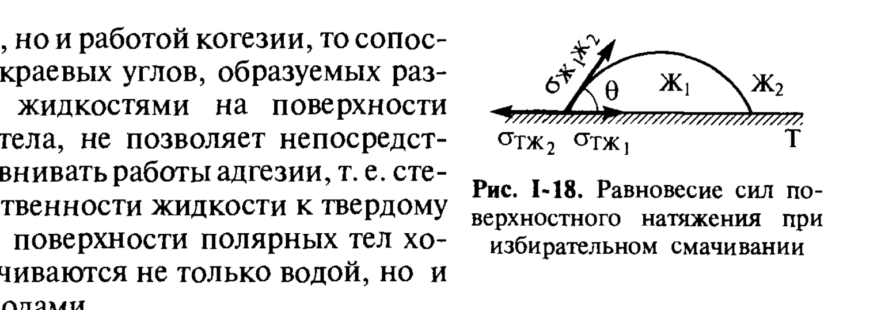

# Билет 11. Избирательное смачивание. Гидрофильные и гидрофобные поверхности. Удельная теплота смачивания

## Тема 1: Избирательное смачивание

### Понятие избирательного смачивания

> [!note] Определение
> **Избирательным смачиванием** называют смачивание твёрдой поверхности одной жидкостью преимущественно перед другой при одновременном контакте твёрдого тела с обеими несмешивающимися (или ограниченно смешивающимися) жидкостями — например, с водой и углеводородом (маслом). Поверхность твёрдого тела при этом «выбирает», какая из двух жидкостей вытесняет другую с её поверхности и образует с ней межфазный контакт.

Условия смачивания твёрдого тела (Т) жидкостью (Ж) в присутствии второй несмешивающейся жидкости (или газа Г) определяются тем же балансом поверхностных энергий, что и обычное смачивание (см. [[билет_09]]), но записанным для границы раздела двух конденсированных фаз $\sigma_{Ж_1Ж_2}$ вместо $\sigma_{ЖГ}$.

*Рис. I-18 (Щукин, с. 47). Равновесие сил поверхностного натяжения на линии трёхфазного контакта твёрдое тело (Т) – жидкость 1 ($Ж_1$) – жидкость 2 ($Ж_2$) при избирательном смачивании.*

### Уравнение Юнга для избирательного смачивания (формула I.18)

> [!important] Запись уравнения Юнга через краевой угол избирательного смачивания
> Для системы твёрдое тело – две несмешивающиеся жидкости равновесный краевой угол $\theta$ (отсчитываемый внутри фазы $Ж_1$, например воды) определяется уравнением, аналогичным уравнению Юнга:
>
> $$\cos\theta = \frac{\sigma_{TЖ_2}-\sigma_{TЖ_1}}{\sigma_{Ж_1Ж_2}} \tag{I.18}$$
>
> где:
> - $\sigma_{TЖ_1}$ — межфазное натяжение твёрдое тело–жидкость 1 (например, вода);
> - $\sigma_{TЖ_2}$ — межфазное натяжение твёрдое тело–жидкость 2 (например, углеводород);
> - $\sigma_{Ж_1Ж_2}$ — межфазное натяжение на границе двух жидкостей.

Если каждая из жидкостей порознь, в отсутствие конкурирующей фазы, смачивает данную твёрдую поверхность с краевым углом, более близким к нулю (лучше смачивает), результаты сопоставления краевого угла избирательного смачивания позволяют установить, какая из двух жидкостей термодинамически предпочтительнее на данной поверхности.

> [!note] Гидрофильные и гидрофобные поверхности через избирательное смачивание
> На основе уравнения (I.18) принята следующая классификация твёрдых поверхностей в системе вода–масло–твёрдое тело:
>
> - если $\theta < 90°$ (отсчёт от воды) — поверхность называют **гидрофильной** (олеофобной): она преимущественно смачивается водой, отталкивая масляную фазу;
> - если $\theta > 90°$ — поверхность называют **гидрофобной** (олеофильной): она преимущественно смачивается маслом (углеводородом), отталкивая воду.

> [!warning] Не путать с обычным краевым углом θ на воздухе
> Краевой угол избирательного смачивания (формула I.18) измеряется в системе **твёрдое тело – жидкость 1 – жидкость 2**, тогда как обычный краевой угол смачивания (уравнение Юнга I.16, см. [[билет_09]]) — в системе **твёрдое тело – жидкость – газ**. Численные значения этих углов для одной и той же твёрдой поверхности и воды, вообще говоря, различаются, хотя качественная классификация (гидрофильность/гидрофобность) обычно согласуется.

---

## Тема 2: Гидрофильность и гидрофобность поверхностей

### Молекулярная природа гидрофильности/гидрофобности

> [!note] Определение
> **Гидрофильными** называют поверхности, хорошо смачиваемые водой (полярные, способные к образованию водородных связей или ион-дипольных взаимодействий с молекулами воды): оксиды, гидроксиды металлов, силикаты, многие соли, целлюлоза. **Гидрофобными** называют поверхности, плохо смачиваемые водой (неполярные, образованные углеводородными радикалами): парафин, многие полимеры (полиэтилен, политетрафторэтилен), графит, тальк, сера.

> [!example] Примеры гидрофильных и гидрофобных минералов
> Большинство природных минералов (кварц, кальцит, силикаты, оксиды металлов) — гидрофильны. Гидрофобны от природы лишь немногие минералы со слоистой структурой и слабыми связями между слоями (графит, тальк, молибденит) или с серой на поверхности (самородная сера, некоторые сульфиды).

### Управление избирательным смачиванием с помощью ПАВ

> [!important] Роль ПАВ в управлении смачиванием
> Адсорбция дифильных молекул ПАВ на твёрдой поверхности способна изменить (модифицировать) её природу: гидрофилизовать исходно гидрофобную поверхность или гидрофобизовать исходно гидрофильную. Если полярные группы молекул ПАВ ориентированы своими неполярными «хвостами» наружу, поверхность гидрофобизуется (становится более склонной смачиваться маслом); если, напротив, полярные группы ПАВ ориентированы наружу — поверхность гидрофилизуется.

> [!example] Применение в технологии флотации
> Управление избирательным смачиванием с помощью ПАВ лежит в основе многих технологических процессов, среди них одним из самых масштабных является **флотация** — метод обогащения руд и других порошкообразных материалов, основанный на различии в смачиваемости частиц разной природы. Гидрофобные (или гидрофобизованные собирателем) частицы ценного минерала прилипают к пузырькам воздуха в пенной суспензии и всплывают с пеной, тогда как гидрофильные частицы пустой породы остаются в водной фазе и тонут.

> [!tip] Реагенты флотации
> В качестве реагентов флотации используют: **собиратели** (коллекторы) — ПАВ, гидрофобизующие поверхность ценного минерала (например, ксантогенаты для сульфидных руд); **вспениватели** — ПАВ, стабилизирующие пенный слой; **активаторы** и **депрессоры** — реагенты, избирательно усиливающие или подавляющие действие собирателя на разные минералы; **регуляторы среды** (pH).

> [!example] Бытовое применение: моющее действие
> Избирательное смачивание лежит в основе моющего действия ПАВ: частицы масляных и жировых загрязнений на гидрофобной (загрязнённой) поверхности ткани при добавлении ПАВ в воду гидрофилизуются и отрываются от ткани, переходя в водную среду в виде эмульгированных капель (см. подробнее о применении ПАВ для гидрофобизации/гидрофилизации твёрдых поверхностей в [[билет_23]]).

---

## Тема 3: Удельная теплота смачивания

### Определение и связь с гидрофильностью (величина β)

> [!note] Определение
> **Удельная теплота смачивания** — количество тепла, выделяющееся при смачивании единицы массы (или площади поверхности) сухого твёрдого тела жидкостью. Эта величина равна разности полных поверхностных энергий границ раздела твёрдое тело–газ и твёрдое тело–жидкость и тем больше, чем сильнее взаимодействие данной жидкости с поверхностью.

По П. А. Ребиндеру, количественной мерой гидрофильности/гидрофобности поверхности порошков служит отношение теплот смачивания водой ($H_в$) и неполярным углеводородом ($H_м$):

$$\beta = \frac{H_в}{H_м}$$

> [!important] Критерий гидрофильности по теплотам смачивания
> - $\beta > 1$ — поверхность **гидрофильна** (взаимодействие с водой сильнее, чем с углеводородом);
> - $\beta < 1$ — поверхность **гидрофобна** (взаимодействие с углеводородом сильнее).

> [!example] Численные значения β
> Активированный уголь: $\beta \approx 0{,}4$ (гидрофобен). Кварц: $\beta \approx 2$ (гидрофилен). Крахмал: $\beta \approx 20$ (сильно гидрофилен). Подробнее о методе и значении теплот смачивания для конкретных материалов см. [[билет_10]].

> [!tip] Практическое значение метода теплот смачивания
> Измерение теплоты смачивания особенно ценно для тонкодисперсных и пористых тел (порошков, грунтов, сорбентов), для которых прямое измерение краевого угла затруднено или невозможно из-за малого размера индивидуальных частиц. Метод позволяет отнести тепловой эффект к единице массы образца, не требуя знания величины удельной поверхности.

---

## Источники

- Щукин Е. Д., Перцов А. В., Амелина Е. А. Коллоидная химия. 3-е изд. — М.: Высшая школа, 2004. Гл. I, § I.4, с. 46–48 (избирательное смачивание, уравнение I.18, рис. I-18, теплота смачивания); Гл. III, § III.2, с. 132–138 (применение ПАВ для управления избирательным смачиванием, флотация, рис. III-7).
- Дополнительно (не из Щукина, не противоречит ему): современная классификация реагентов флотации (собиратели, вспениватели, активаторы, депрессоры) и моющее действие ПАВ — общепринятые положения коллоидной химии и технологии обогащения полезных ископаемых.
