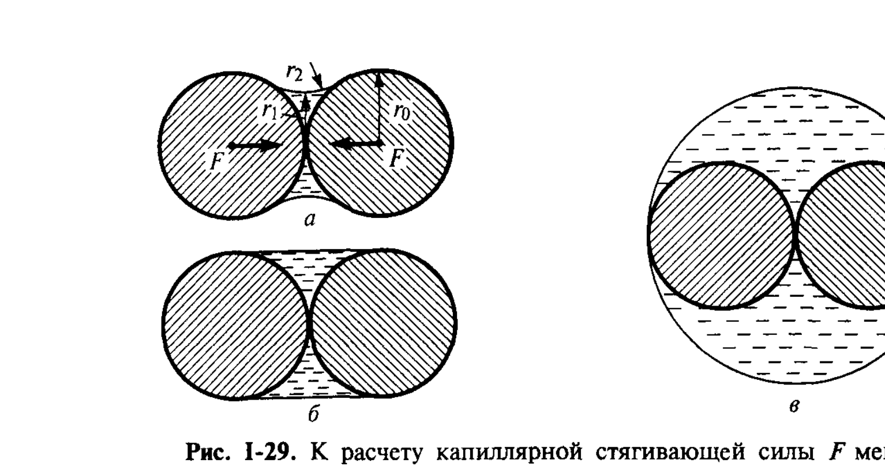

# Билет 13. Капиллярное поднятие. Уравнение Жюрена. Капиллярная постоянная. Капиллярные эффекты в менисках между частицами

## Тема 1: Капиллярное поднятие жидкости

### Качественная картина

> [!note] Постановка задачи
> Если узкий капилляр (трубку малого радиуса $r_0$) опустить одним концом в широкий сосуд со смачивающей стенки капилляра жидкостью, то жидкость в капилляре поднимется выше уровня жидкости в сосуде на некоторую высоту $H$. Если жидкость не смачивает стенки капилляра, уровень в капилляре, напротив, опустится. Это явление называют **капиллярным поднятием** (или капиллярной депрессией).

*Рис. I-29 (Щукин, с. 59–60). К расчёту капиллярной стягивающей силы $F$ мениска в зависимости от его формы (используется ниже, в Теме 2); геометрия мениска в капилляре аналогична изображённой на рис. I-28 (см. [[билет_12]]).*

### Вывод уравнения Жюрена (формула I.21)

> [!important] Условие равновесия: капиллярное давление = гидростатическое
> Жидкость в капилляре поднимается (или опускается) до тех пор, пока **капиллярное давление**, создаваемое искривлённым мениском (см. [[билет_12]]), не уравновесится **гидростатическим давлением** столба жидкости высотой $H$:
>
> $$\Delta p_\sigma = \rho g H$$

Капиллярное давление мениска радиусом $r$ равно $2\sigma/r$, причём радиус мениска $r$ связан с радиусом тонкого капилляра $r_0$ соотношением $r = r_0/\cos\theta$ (где $\theta$ — краевой угол смачивания стенок капилляра жидкостью). Следовательно:

$$\frac{2\sigma\cos\theta}{r_0} = \rho g H$$

откуда высота капиллярного поднятия (или опускания):

$$H = \frac{2\sigma\cos\theta}{r_0(\rho'-\rho'')g} \tag{I.21}$$

> [!note] Расшифровка символов уравнения Жюрена
> - $H$ — высота капиллярного поднятия (опускания), м;
> - $\sigma$ — поверхностное натяжение жидкости на границе с её насыщенным паром (или с другой жидкостью), Н/м;
> - $\theta$ — равновесный краевой угол смачивания материала капилляра данной жидкостью;
> - $r_0$ — радиус (тонкого, цилиндрического) капилляра, м;
> - $\rho'$, $\rho''$ — плотности жидкой и паровой (или второй жидкой) фаз соответственно, кг/м³;
> - $g$ — ускорение свободного падения, м/с².

> [!important] Знак и направление эффекта
> Если жидкость **смачивает** стенки капилляра ($\theta<90°$, $\cos\theta>0$) — наблюдается **капиллярное поднятие** ($H>0$): мениск вогнутый, давление под мениском понижено, и жидкость подсасывается вверх. Если жидкость **не смачивает** стенки ($\theta>90°$, $\cos\theta<0$) — наблюдается **капиллярная депрессия** ($H<0$): мениск выпуклый, уровень жидкости в капилляре опускается ниже уровня в широком сосуде. Классический пример депрессии — ртуть в стеклянном капилляре.

> [!example] Численная оценка
> Для воды ($\sigma\approx 72{,}8$ мДж/м², $\theta\approx 0$, $\rho\approx 1000$ кг/м³) в стеклянном капилляре радиусом $r_0 = 0{,}1$ мм высота поднятия составляет порядка $H\approx \dfrac{2\cdot 0{,}0728}{10^{-4}\cdot 1000\cdot 9{,}8}\approx 0{,}15$ м, т. е. около 15 см — капиллярное поднятие весьма значительно для тонких капилляров и быстро убывает с увеличением радиуса.

### Условия применимости

> [!warning] Тонкий капилляр — условие применимости приближения сферического мениска
> Уравнение Жюрена (I.21) выведено в предположении, что мениск имеет форму сферического сегмента, что справедливо лишь для **достаточно тонких капилляров** ($r_0$ много меньше так называемой капиллярной постоянной, см. Тему 2). Для капилляров большего радиуса форма мениска отклоняется от сферической из-за влияния силы тяжести, и формула (I.21) даёт лишь приближённую оценку.

---

## Тема 2: Капиллярная постоянная

### Определение

> [!note] Определение
> **Капиллярная постоянная** $a$ (иногда обозначается $a^2$ или $\alpha^2$) — характерная длина, определяющая масштаб, на котором эффекты поверхностного натяжения сопоставимы по величине с эффектами силы тяжести (гравитации):
>
> $$a^2 = \frac{2\sigma}{(\rho'-\rho'')g}$$
>
> Размерность $a^2$ — м², т. е. сама величина $a$ имеет размерность длины. Капиллярная постоянная характеризует тот размер капель, пузырьков или капилляров, при котором капиллярные (поверхностные) силы становятся сравнимы с силами тяжести.

С учётом капиллярной постоянной уравнение Жюрена (I.21) можно записать компактно:

$$H = \frac{a^2\cos\theta}{r_0}$$

> [!important] Критерий «малого» капилляра
> Капилляр считается «тонким» (применимо приближение сферического мениска и формула Жюрена) при условии $r_0 \ll a$. Если же радиус капилляра (или капли, пузырька) сравним с $a$ или превышает её, форма мениска (или поверхности капли) перестаёт быть сферической, и для расчёта необходимо решать дифференциальное уравнение Лапласа с учётом гидростатического давления (уравнение капиллярной поверхности).

> [!example] Порядок величины капиллярной постоянной
> Для воды на границе с воздухом при комнатной температуре капиллярная постоянная $a\approx 3{,}9$ мм, т. е. капилляры с радиусом порядка десятых долей миллиметра и менее можно считать «тонкими» в указанном смысле, тогда как для трубок радиусом порядка сантиметра форма мениска уже заметно отклоняется от сферической.

---

## Тема 3: Капиллярные эффекты в менисках между частицами

### Капиллярная стягивающая сила между частицами

> [!note] Постановка задачи
> Если между двумя сближенными твёрдыми частицами (например, зёрнами порошка) находится небольшое количество жидкости, смачивающей частицы, образуется вогнутый мениск седловидной формы. Такой мениск создаёт **пониженное** (по сравнению с атмосферным) давление в жидкости (отрицательное капиллярное давление по закону Лапласа, см. [[билет_12]], так как главные радиусы кривизны мениска $r_1$ и $r_2$ имеют противоположные знаки), и в результате между частицами возникает дополнительная **стягивающая сила** $F$.

*Рис. I-29 (Щукин, с. 60). К расчёту капиллярной стягивающей силы $F$ мениска в зависимости от его формы. (а) — мениск между двумя сферическими частицами с главными радиусами кривизны $r_1$ (в плоскости рисунка, отрицательный) и $r_2$ (в перпендикулярной плоскости, положительный); (б), (в) — иные геометрии мениска (например, между плоскостью и сферой, или плёнка между сближенными частицами).*

### Расчёт силы стягивания

Капиллярная составляющая стягивающей силы складывается из вклада капиллярного давления (действующего на площадь сечения мениска) и вклада поверхностного натяжения, действующего непосредственно по периметру контакта мениска с частицей:

$$F_1 = -\pi r_2^2\sigma\left(\frac{1}{r_1}+\frac{1}{r_2}\right)$$

$$F_2 = 2\pi r_2\sigma$$

Полная сила стягивания:

$$F = F_1+F_2 = \pi r_2\sigma\left(1-\frac{r_2}{r_1}\right)$$

> [!note] Расшифровка символов
> - $F$ — суммарная капиллярная сила стягивания частиц, Н;
> - $F_1$ — составляющая, обусловленная разностью давлений (капиллярным давлением мениска), действующей на сечение мениска площадью $\pi r_2^2$;
> - $F_2$ — составляющая, обусловленная непосредственным действием поверхностного натяжения по периметру мениска ($2\pi r_2$);
> - $r_1$ — радиус кривизны мениска в плоскости рисунка (как правило, $r_1 \ll 0$ — отрицательный, седловидная кривизна);
> - $r_2$ — радиус кривизны мениска в перпендикулярной плоскости (положительный).

> [!important] Условие $|r_1| \ll r_2$ — приближение тонкой прослойки
> Если $|r_1/r_2|\ll 1$ (узкая прослойка жидкости по сравнению с поперечным размером мениска), то $F\approx \pi r_2\sigma$, т. е. **сила стягивания пропорциональна поверхностному натяжению и поперечному размеру мениска и практически не зависит от количества жидкости** (от расстояния между частицами), пока прослойка остаётся тонкой по сравнению с $r_2$.

> [!example] Практическое значение: связность влажных сыпучих материалов
> Капиллярная сила стягивания между частицами, обусловленная небольшим количеством смачивающей жидкости в зазорах между ними, определяет механическую прочность («связность») влажных порошков, грунтов, песка («мокрый песок держит форму, сухой — рассыпается»). Этот эффект лежит в основе явления **капиллярной контракции** при сушке пористых тел и капиллярного сцепления частиц в формовочных и строительных смесях (см. также представления о коагуляционных структурах в [[билет_58]]).

> [!tip] Как отличить капиллярную силу от расклинивающего давления
> Капиллярная стягивающая сила между частицами (рассмотренная здесь) обусловлена **кривизной мениска** на макроскопическом уровне (мениск имеет радиусы кривизны порядка размера частиц или зазора между ними). **Расклинивающее давление** (см. [[билет_46]]) — принципиально иной, существенно более тонкий эффект, проявляющийся в очень тонких плёнках (нанометровой толщины), где на взаимодействие поверхностей влияют молекулярные, электростатические и структурные силы, а не только макроскопическая кривизна мениска.

---

## Источники

- Щукин Е. Д., Перцов А. В., Амелина Е. А. Коллоидная химия. 3-е изд. — М.: Высшая школа, 2004. Гл. I, § I.5.1, с. 58–60 (капиллярное поднятие, уравнение Жюрена I.21, капиллярная постоянная, капиллярные эффекты в менисках между частицами, формула стягивающей силы, рис. I-28, I-29).
