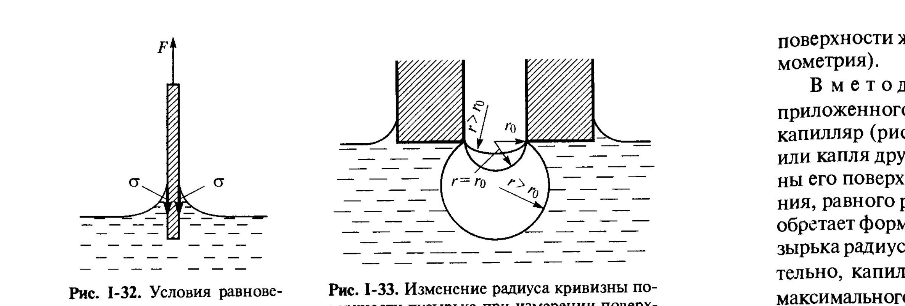
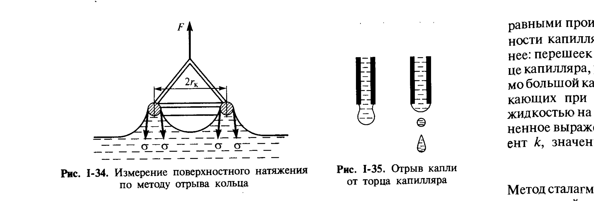

# Билет 15. Методы измерения поверхностного (межфазного) натяжения жидкостей: статические, полустатические и динамические

## Тема 1: Общая классификация методов

> [!note] Три группы методов
> Методы измерения поверхностного натяжения жидкостей делят на три группы по характеру установления равновесия поверхностного слоя в момент измерения:
>
> - **статические методы** — измерение проводится на системе, находящейся в полном термодинамическом равновесии (поверхностный слой полностью сформирован, время существования поверхности практически не ограничено);
> - **полустатические методы** — поверхность создаётся и разрушается относительно медленно, поверхностный слой успевает приблизиться к равновесному состоянию, но измерение всё же связано с квазиравновесным процессом (например, медленный отрыв);
> - **динамические методы** — поверхность создаётся и обновляется быстро (за доли секунды и менее), что позволяет изучать **неравновесное** поверхностное натяжение, в частности кинетику адсорбции ПАВ на свежесозданной поверхности.

> [!important] Зачем нужны разные методы
> Выбор метода определяется свойствами исследуемой жидкости (вязкость, летучесть, склонность к загрязнению поверхности), требуемой точностью, доступным объёмом образца, а также тем, интересует ли исследователя **равновесное** значение $\sigma$ или его **временна́я зависимость** (для растворов ПАВ — кинетика установления адсорбционного равновесия, см. [[билет_18]]).

---

## Тема 2: Статические методы

### Метод капиллярного поднятия

> [!note] Принцип метода
> Метод капиллярного поднятия основан на измерении высоты $H$ равновесного мениска жидкости в тонком капилляре известного радиуса $r_0$ по уравнению Жюрена (I.21, см. [[билет_13]]):
>
> $$\sigma = \frac{H r_0(\rho'-\rho'')g}{2\cos\theta}$$

> [!important] Достоинства и ограничения
> Метод капиллярного поднятия — один из наиболее точных и простых статических методов, особенно для случая полного смачивания ($\theta\approx 0$, $\cos\theta\approx 1$, что справедливо для большинства чистых жидкостей в чистых стеклянных капиллярах). Основные источники погрешности: точность определения радиуса капилляра $r_0$ (особенно для капилляров переменного сечения) и необходимость точного знания краевого угла $\theta$, если он отличен от нуля.

### Метод вращающейся капли (спиннинг-метод)

> [!example] Метод вращающейся капли
> Применяется для измерения **очень низких** межфазных натяжений (характерных, например, для микроэмульсионных систем, см. [[билет_32]]) — порядка $10^{-3}$–$10^{-6}$ мН/м, недоступных другим методам. Капля менее плотной жидкости вводится в трубку с более плотной жидкостью, вращающуюся вокруг своей оси; под действием центробежной силы капля растягивается в цилиндрический столбик, форма и размеры которого (диаметр $d_{max}$) при известной скорости вращения $\omega$ и разности плотностей $\rho_1-\rho_2$ позволяют по уравнению Воннегута рассчитать межфазное натяжение:
>
> $$\sigma = \frac{\omega^2(\rho_1-\rho_2)r^3}{4}$$

### Методы измерения формы мениска (метод Вильгельми и метод максимального давления в пузырьке)

*Рис. I-32, I-33 (Щукин, с. 66–67). Слева (рис. I-32) — условия равновесия при измерении поверхностного натяжения по методу Вильгельми (тонкая вертикальная пластинка, частично погружённая в жидкость). Справа (рис. I-33) — изменение радиуса кривизны пузырька при измерении поверхностного натяжения методом максимального давления в пузырьке.*

> [!important] Метод Вильгельми (метод равновесия пластинки)
> В методе Вильгельми тонкую вертикальную пластинку (стеклянную, платиновую или из фильтровальной бумаги) частично погружают в жидкость, полностью смачивающую её поверхность ($\theta=0$). Сила $F$, удерживающая плёнку жидкости, поднятую вдоль смачиваемой поверхности пластинки, связана с поверхностным натяжением $\sigma$ периметром смачивания $P$ пластинки:
>
> $$F = P\sigma\cos\theta$$
>
> Для пластинки толщиной $d$ и шириной $b$ периметр $P=2(b+d)$; при $\theta=0$ (полное смачивание) измерение силы $F$ непосредственно даёт $\sigma=F/P$.

> [!note] Метод максимального давления в пузырьке (метод Ребиндера)
> В методе наибольшего давления под действием приложенного извне избыточного давления $\Delta p$ через калиброванный капилляр (рис. I-33) в объём жидкости продавливается пузырёк газа или капля другой жидкости. По мере роста пузырька радиус кривизны его поверхности $\rho$ уменьшается до достижения минимального значения, равного радиусу капилляра $r_0$ (когда поверхность пузырька приобретает форму полусферы); при дальнейшем увеличении объёма пузырька радиус кривизны его поверхности **снова возрастает** ($\rho>r_0$). Следовательно, капиллярное давление $p_\sigma=2\sigma/\rho$ проходит через **максимум**, равный $2\sigma/r_0$, в момент, когда пузырёк представляет собой полусферу:
>
> $$\sigma = \frac{1}{2}\Delta p_{max}\, r_0$$

> [!tip] Почему метод максимального давления удобен для растворов ПАВ
> Этот метод позволяет регулировать **скорость образования** новой поверхности пузырька (от очень медленного до очень быстрого продавливания), что делает его удобным переходным методом — от квазистатического измерения равновесного $\sigma$ растворов ПАВ до измерения **динамического** поверхностного натяжения свежеобразованной поверхности (см. Тему 3).

---

## Тема 3: Полустатические и динамические методы

### Метод отрыва кольца (метод Дю-Нуи)

*Рис. I-34, I-35 (Щукин, с. 68–69). Слева (рис. I-34) — измерение поверхностного натяжения по методу отрыва кольца: сила $F$, необходимая для отрыва кольца от поверхности жидкости, связана с длиной окружности кольца $2\pi r_к$ и поверхностным натяжением $\sigma$. Справа (рис. I-35) — отрыв капли от торца капилляра (сталагмометрия).*

> [!important] Принцип метода Дю-Нуи
> Тонкое кольцо (обычно платиновое, радиусом $r_к$) погружают в жидкость, а затем медленно поднимают. При отрыве кольца от поверхности жидкости измеряют максимальную силу $F$, препятствующую отрыву (за счёт образования вытягиваемой плёнки жидкости — мениска, прилипающего к кольцу с обеих сторон). В первом (грубом) приближении:
>
> $$F = 4\pi r_к \sigma$$
>
> что соответствует произведению поверхностного натяжения на длину **окружностей** кольца с обеих сторон, на которых действует поверхностное натяжение.

> [!important] Поправочный коэффициент $k$
> Реальные условия отрыва плёнки жидкости сложнее: перешеек между плёнкой и оставшейся в сосуде жидкостью, утоньшаясь, разрывается не точно на уровне кольца, а форма и объём вытягиваемого мениска зависят от диаметра кольца, толщины проволоки и плотности жидкости. Поэтому для более точных результатов вводят **поправочный коэффициент** $k$, зависящий от геометрии кольца и плотности жидкостей:
>
> $$\sigma = \frac{F}{4\pi r_к}\,k$$
>
> Значения $k$ рассчитаны теоретически (с учётом численного интегрирования уравнения Лапласа) и приводятся в справочных таблицах.

### Сталагмометрический метод (метод счёта капель)

> [!note] Принцип
> **Сталагмометрический метод** основан на измерении массы (или объёма) капли жидкости, отрывающейся от торца вертикальной трубки (капилляра) известного радиуса $r_к$ под действием силы тяжести (рис. I-35). В момент отрыва вес капли $P$ уравновешивается силой поверхностного натяжения, действующей по периметру шейки капли $2\pi r_к$:
>
> $$P = 2\pi r_к \sigma\,/\,k$$
>
> где $k$ — поправочный коэффициент (значения табулированы), учитывающий, что в момент отрыва от капли остаётся часть жидкости (отрывается не вся «висящая» капля целиком), и форма шейки капли отличается от идеальной окружности радиуса $r_к$.

> [!example] Практическое удобство сталагмометрии
> Сталагмометрический метод (счёт капель определённого объёма жидкости, вытекающей из сталагмометра) особенно удобен и доступен в лабораторной практике благодаря простоте оборудования и возможности применения с электроннооптическими устройствами для автоматической регистрации числа капель.

### Динамические методы

> [!important] Назначение динамических методов
> Динамические методы определения поверхностного натяжения имеют специальное назначение: они применяются в основном для изучения существенно **неравновесных** состояний поверхностных слоёв жидкостей при изучении кинетики установления равновесных значений поверхностной структуры этих слоёв в результате адсорбции ПАВ из объёма раствора.

> [!example] Метод колеблющихся струй
> С помощью эллиптического отверстия, формирующего струю жидкости, истекающую под давлением, создаётся колеблющаяся (по сечению) струя жидкости с периодически изменяющейся кривизной поверхности. Анализ длины волны колебаний поверхности струи (теория Дж. У. Рэлея, развитая Ф. Бором и С. Сазерлендом) связывает длину волны с поверхностным натяжением **свежесозданной** поверхности — практически в момент её образования (время существования поверхности — миллисекунды и менее). Это позволяет выводить кинетические зависимости значений динамического поверхностного натяжения от времени жизни поверхности и сопоставлять их с кинетикой адсорбции ПАВ.

> [!tip] Как выбрать метод по задаче
> | Задача | Рекомендуемый метод |
> |---|---|
> | Точное равновесное $\sigma$ чистой жидкости | капиллярное поднятие |
> | Очень малые межфазные натяжения (микроэмульсии) | вращающаяся капля |
> | Растворы ПАВ, быстрая рутинная оценка | отрыв кольца, сталагмометрия |
> | Кинетика адсорбции ПАВ, динамическое σ(t) | максимальное давление в пузырьке, колеблющиеся струи |
> | Малый объём образца | метод висящей/сидячей капли (форма мениска, см. [[билет_16]]) |

---

## Источники

- Щукин Е. Д., Перцов А. В., Амелина Е. А. Коллоидная химия. 3-е изд. — М.: Высшая школа, 2004. Гл. I, § I.6, с. 63–69 (классификация методов, статические методы — капиллярное поднятие, вращающаяся капля, метод Вильгельми, метод максимального давления в пузырьке рис. I-33; полустатические методы — метод отрыва кольца рис. I-34, сталагмометрия рис. I-35; динамические методы — метод колеблющихся струй).
