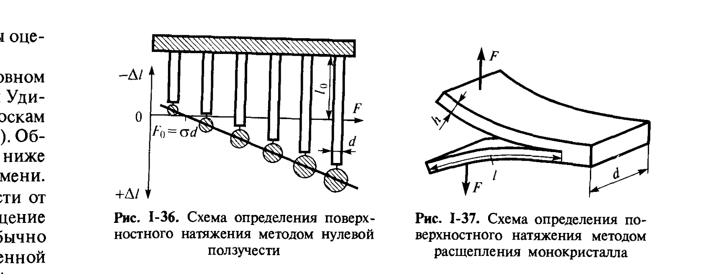

# Билет 16. Методы определения свободной поверхностной энергии твёрдых тел

## Тема 1: Почему твёрдые тела нельзя измерять «обычными» методами

> [!important] Главная трудность
> Для твёрдых тел, в отличие от жидкостей (см. [[билет_15]]), как правило, **не удаётся реализовать термодинамически обратимое увеличение площади поверхности раздела фаз** — новую поверхность нельзя создать квазистатическим растяжением плёнки или выдуванием пузырька. Любая попытка увеличить поверхность твёрдого тела (раскалывание, измельчение, пластическая деформация) связана с **большими необратимыми затратами энергии на пластическое деформирование**, которые трудно отделить от собственно поверхностной энергии.

> [!note] Следствие
> Поэтому для твёрдых тел разработан ряд **косвенных** методов, каждый из которых применим лишь к ограниченному классу объектов (пластичные металлы вблизи точки плавления, хрупкие монокристаллы со спайностью, мелкодисперсные порошки и т. п.) и позволяет в лучшем случае **оценить** удельную свободную поверхностную энергию $\sigma$.

---

## Тема 2: Метод нулевой ползучести (метод Тамман — Удин)

*Рис. I-36, I-37 (Щукин, с. 70). Слева (рис. I-36) — схема определения поверхностного натяжения методом нулевой ползучести: к тонким полоскам фольги шириной $d$ подвешиваются грузы разного веса $F$; в зависимости от соотношения веса груза и поверхностного натяжения образцы либо удлиняются ($+\Delta l$), либо укорачиваются ($-\Delta l$). Справа (рис. I-37) — схема определения поверхностного натяжения методом расщепления монокристалла: сила $F_c$ прикладывается так, чтобы заранее образованная в твёрдом теле трещина длиной $l$ продолжала развиваться.*

> [!note] Идея метода
> Метод применяется в основном для **пластичных металлов вблизи температуры плавления**. К тонким полоскам фольги шириной $d$ подвешивают грузы разного веса $F$ и термостатируют образцы при температуре, на несколько градусов ниже температуры плавления, в течение длительного времени. Под действием груза происходит либо удлинение, либо укорочение образца (ползучесть металла), и измеряется итоговое изменение длины $\Delta l$.

> [!important] Линейная зависимость и «нулевая ползучесть»
> Зависимость $\Delta l(F)$ оказывается **линейной**: при больших грузах образец удлиняется ($+\Delta l$), при малых — укорачивается ($-\Delta l$) под действием стягивающей силы поверхностного натяжения. Точка пересечения прямой $\Delta l(F)$ с осью абсцисс соответствует условию **нулевой ползучести** — состоянию, при котором приложенная нагрузка $F_0$ в точности уравновешивается силами поверхностного натяжения, действующими по периметру сечения фольги.

> [!note] Расчётная формула
> Точное рассмотрение, учитывающее изменение формы образца при постоянстве его объёма (фольга, сокращаясь в длину, утолщается, и наоборот), показывает, что в условие равновесия должен быть введён коэффициент $1/2$, так что:
>
> $$F_0 = \sigma d$$
>
> где:
> - $F_0$ — нагрузка, отвечающая нулевой ползучести (Н);
> - $\sigma$ — поверхностное натяжение (искомая величина, Н/м);
> - $d$ — ширина полоски фольги (м).

> [!warning] Ограничение метода
> Метод нулевой ползучести применим только к **пластичным** материалам (в основном металлам), способным к заметной ползучести при температурах, близких к плавлению, но недостаточно высоких, чтобы вызвать плавление или окисление образца.

---

## Тема 3: Метод расщепления по плоскости спайности (метод Обреимова)

> [!note] Идея метода
> В **противоположном** случае — для весьма **хрупких** твёрдых тел, особенно монокристаллов с хорошо выраженной спайностью (классический пример — слюда), — применяют предложенный Обреимовым **метод расщепления по плоскости спайности**. В монокристалле создаётся (заранее) трещина, и измеряется сила $F_c$, которую необходимо приложить, чтобы трещина в твёрдом теле начала развиваться дальше (рис. I-37).

> [!important] Связь силы расщепления с поверхностным натяжением
> Сила $F_c$ связана с поверхностным натяжением $\sigma$, которое в данном случае проявляется как **работа образования новой поверхности** при росте трещины длиной $l$, шириной $d$ и модулем Юнга $E$ отщепляемой пластинки, уравнением:
>
> $$\sigma = \frac{6(F_c\, l)^2}{E\, d^2 h^3}$$
>
> где:
> - $\sigma$ — удельная свободная поверхностная энергия (Дж/м²);
> - $F_c$ — критическая сила расщепления (Н);
> - $l$ — длина трещины (м);
> - $E$ — модуль Юнга материала (Па);
> - $d$ — ширина отщепляемой пластинки (м);
> - $h$ — толщина отщепляемой пластинки (м).

> [!example] Связь с эффектом Ребиндера
> Метод расщепления монокристаллов напрямую связан с физико-химической механикой разрушения твёрдых тел: понижение работы расщепления $F_c$ под действием адсорбции поверхностно-активных сред — одно из проявлений **эффекта Ребиндера** (адсорбционное понижение прочности), подробно рассматриваемого в [[билет_61]].

---

## Тема 4: Косвенные методы — растворимость частиц и зависимость от размера

> [!note] Использование уравнения Кельвина
> Для определения поверхностной энергии твёрдых тел используют также зависимость **растворимости** частиц от их размера, описываемую уравнением Томсона (Кельвина) (I.25, см. [[билет_14]]):
>
> $$c(r) = c_0 \exp\left(\frac{2\sigma V_m}{rRT}\right)$$
>
> где:
> - $c(r)$ — растворимость частицы радиуса $r$;
> - $c_0$ — растворимость макроскопической фазы;
> - $\sigma$ — удельная свободная поверхностная энергия твёрдого тела;
> - $V_m$ — мольный объём вещества;
> - $R$ — универсальная газовая постоянная;
> - $T$ — абсолютная температура.
>
> Измеряя зависимость растворимости от размера частиц (например, методом изотермической перегонки, [[билет_14]]), в принципе можно рассчитать $\sigma$.

> [!warning] Существенное ограничение метода
> Применимость этого метода резко ограничена тем, что **повышенная растворимость частиц**, полученных механическим измельчением, связана не только с кривизной поверхности, но и с появлением в них **многочисленных дефектов** — упругих и неупругих искажений кристаллической решётки в результате механического воздействия. Эти дефекты сами по себе повышают химический потенциал вещества и искажают результат, не позволяя корректно выделить вклад собственно поверхностной энергии.

---

## Тема 5: Табличные данные

> [!example] Значения $\sigma$ для некоторых твёрдых тел (табл. I.3, Щукин)
>
> | Вещество | $T$, °C | $\sigma$, мДж/м² | Метод |
> |---|---|---|---|
> | Ag | 909 | 1140 | нулевая ползучесть |
> | Au | 1040 | 1350 | нулевая ползучесть |
> | Co | 1350 | 1970 | нулевая ползучесть |
> | Cu | 900 | 1750 | нулевая ползучесть |
> | Ni | 1343 | 1820 | нулевая ползучесть |
> | Zn | 380 | 830 | нулевая ползучесть |
> | Zn (плоскость 0001) | −195 | 410 | расщепление кристалла |
> | Нафталин | 20 | 60 | расщепление кристалла |
> | Слюда | 20 | 480 | расщепление кристалла |

> [!tip] Как запомнить порядок величин
> Поверхностная энергия металлов вблизи точки плавления (~1000–2000 мДж/м²) на порядок выше, чем у молекулярных кристаллов типа нафталина (~60 мДж/м²) — что согласуется с общей закономерностью: $\sigma$ определяется энергией межмолекулярных/межатомных взаимодействий, разрываемых при образовании поверхности (ср. работу когезии $W_к=2\sigma$, [[билет_04]]). Металлическая связь значительно прочнее ван-дер-ваальсовых взаимодействий молекулярных кристаллов.

---

## Источники

- Щукин Е. Д., Перцов А. В., Амелина Е. А. Коллоидная химия. 3-е изд. — М.: Высшая школа, 2004. Гл. I, § I.6, с. 69–71 (трудности измерения поверхностной энергии твёрдых тел; метод нулевой ползучести, рис. I-36; метод расщепления по плоскости спайности, рис. I-37; растворимость частиц от размера; табл. I.3).
- Уравнение Кельвина (I.25) и метод изотермической перегонки — см. также [[билет_14]].
