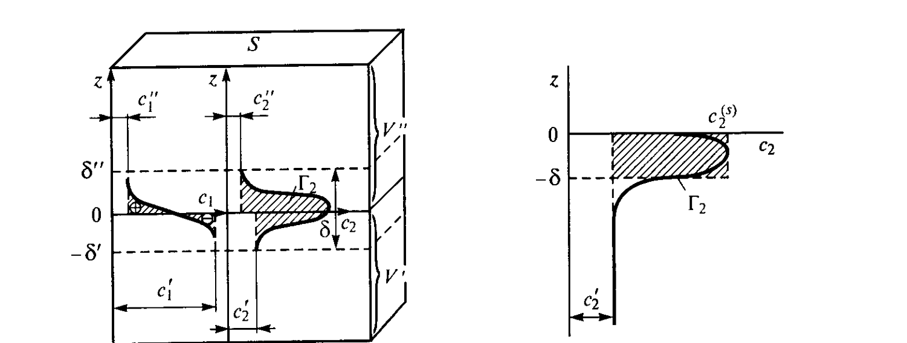

# Билет 17. Адсорбция на границе жидкость — газ. Вывод уравнения Гиббса

## Тема 1: Понятие адсорбции и величина $\Gamma_i$

> [!note] Определение адсорбции
> В многокомпонентной системе состав поверхностного слоя (см. метод избыточных величин Гиббса, [[билет_02]]) может заметно отличаться от состава соприкасающихся объёмных фаз: различные вещества в зависимости от их природы могут концентрироваться на поверхности либо, наоборот, уходить в объём фаз. Самопроизвольное концентрирование веществ в поверхностном слое называется **адсорбцией**.

> [!important] Формула адсорбции (по Гиббсу)
> Количественной мерой адсорбции $i$-го компонента служит, по Гиббсу, величина $\Gamma_i$ — **адсорбция**, или **удельная адсорбция**, определяемая как избыток (обычно в молях) рассматриваемого компонента, приходящийся на единицу площади поверхности раздела фаз:
>
> $$\Gamma_i = \frac{N_i - N_i' - N_i''}{S}$$
>
> где:
> - $N_i$ — общее число молей $i$-го компонента в системе;
> - $N_i'$ и $N_i''$ — число молей того же компонента в каждой из двух соприкасающихся фаз в предположении, что их концентрации остаются постоянными вплоть до геометрической разделяющей поверхности площадью $S$;
> - $S$ — площадь поверхности раздела фаз.

---

## Тема 2: Геометрическая иллюстрация — изменение концентраций у поверхности разрыва

*Рис. II-1, II-2 (Щукин, с. 74–75). Слева (рис. II-1) — изменение концентраций воды $c_1(z)$ и спирта $c_2(z)$ при переходе через поверхность разрыва толщиной $\delta=\delta'+\delta''$. Справа (рис. II-2) — к определению адсорбции $\Gamma_2$ через поверхностную концентрацию $c_2^{(s)}$ и эффективную толщину адсорбционного слоя $\delta$.*

> [!example] Модельная система: раствор гексилового спирта в воде
> Рассмотрим раствор какого-либо спирта (например, гексилового — второй компонент) в воде (первый компонент), находящийся в равновесии с парами воды и спирта. Внутри объёмных фаз концентрации компонентов практически постоянны: $c_1'$, $c_2'$ — в жидкой фазе, $c_1''$, $c_2''$ — в паре, причём из-за малой плотности паров $c_1'\gg c_1''$ и $c_2'\gg c_2''$.
>
> В пределах поверхности разрыва толщиной $\delta=\delta'+\delta''$ концентрация воды $c_1(z)$ монотонно спадает от значения $c_1'$ (в жидкой фазе) до значения $c_1''$ (в паре). Концентрация же спирта $c_2(z)$ ведёт себя иначе: она резко **возрастает** по сравнению как с концентрацией в растворе $c_2'$, так и тем более с концентрацией в паре $c_2''$ — спирт концентрируется в поверхностном слое.

> [!note] Адсорбция второго компонента $\Gamma_2$
> Выделим перпендикулярную поверхности разрыва призму с сечением $S$ и сопоставим количество вещества в такой призме в реальной системе и в идеализированной системе сравнения, где в плоскости $z=0$ происходит скачкообразное изменение концентрации от $c_2'$ до $c_2''$. Адсорбция второго компонента (спирта) $\Gamma_2$ определяется соотношением:
>
> $$\Gamma_2 = \int_{-\delta'}^{0}\bigl[c_2(z)-c_2'\bigr]\,dz \;+\; \int_{0}^{+\delta''}\bigl[c_2(z)-c_2''\bigr]\,dz \tag{II.1}$$
>
> где $-\delta'$ и $+\delta''$ — координаты, ограничивающие поверхность разрыва толщиной $\delta=\delta'+\delta''$. Графически $\Gamma_2$ соответствует площади заштрихованного «языка», заключённого между прямыми $c_2=c_2'$, $c_2=c_2''$, $z=0$ и кривой $c_2(z)$.

> [!important] Знак адсорбции и эквимолекулярная поверхность
> Аналогично определяется адсорбция первого компонента (воды) $\Gamma_1$. В части поверхности разрыва, примыкающей к жидкой фазе ($-\delta'<z<0$), концентрация воды $c_1(z)$ оказывается **меньше**, чем концентрация в объёме $c_1'$ — соответствующий интеграл имеет отрицательный знак (площадь со знаком минус на рис. II-1). В зависимости от выбора положения разделяющей поверхности адсорбция первого компонента оказывается положительной, отрицательной (этому соответствует «недостаток» компонента в поверхности разрыва) или равной нулю.
>
> Разделяющая поверхность, отвечающая условию $\Gamma_1=0$, называется **эквимолекулярной поверхностью** по отношению к первому компоненту (растворителю). В отличие от поверхностной энергии $\sigma$ (см. [[билет_02]]), величина адсорбции $\Gamma_i$ зависит, таким образом, от положения разделяющей поверхности.

> [!tip] Упрощение для практически нелетучего ПАВ
> Если второй компонент (ПАВ) практически нелетуч, т. е. $c_2''\approx 0$, удобно так выбрать положение разделяющей поверхности, чтобы второй интеграл в (II.1) был пренебрежимо мал (рис. II-2). Физическая поверхность разрыва при этом целиком лежит ниже геометрической разделяющей поверхности, и:
>
> $$\Gamma_2 = \int_{-\delta}^{0}\bigl[c_2(z)-c_2'\bigr]\,dz$$

---

## Тема 3: Эффективная толщина адсорбционного слоя

> [!note] Теорема об интегральном среднем (II.2)
> По теореме об интегральном среднем можно записать:
>
> $$\Gamma_2 = \bigl(c_2^{(s)} - c_2'\bigr)\,\delta \tag{II.2}$$
>
> где:
> - $c_2^{(s)}$ — средняя концентрация второго компонента в адсорбционном слое;
> - $\delta$ — его эффективная толщина.
>
> Графически этому соответствует замена «языка», ограниченного кривой $c_2(z)$ и прямой $c_2'$, на равный по площади прямоугольник со сторонами $(c_2^{(s)}-c_2')$ и $\delta$ (рис. II-2). Эффективная толщина адсорбционного слоя $\delta$ отличается (как правило, в сторону меньших значений) от толщины поверхностного слоя (физической поверхности разрыва), определяемой по изменению других параметров, например плотности свободной энергии (см. [[билет_02]]).

> [!important] Предельный случай: адсорбция как количество вещества в слое (II.3)
> Адсорбция $\Gamma_2$ может рассматриваться как **избыток** вещества в поверхностном слое, приходящийся на единицу площади поверхности раздела фаз, по сравнению с количеством этого вещества в таком же по толщине слое объёмной фазы. При резко выраженной способности вещества к адсорбции и его малой объёмной концентрации имеем $c_2^{(s)}\gg c_2'$ и, следовательно:
>
> $$\Gamma_2 \approx c_2^{(s)}\delta \tag{II.3}$$
>
> т. е. адсорбция приближённо равна количеству вещества в адсорбционном слое на единицу поверхности. Это справедливо, когда второй компонент не только нелетуч, но и практически нерастворим в жидкой фазе ($c_2''\approx 0$ и $c_2'\approx 0$) — тогда второй компонент целиком сосредоточен в поверхностном слое (актуально для нерастворимых ПАВ, [[билет_24]]).

> [!example] Численная оценка для гексилового спирта
> Соотношение (II.3) позволяет оценить возможные значения адсорбции в случае водного раствора гексилового спирта. Если предположить, что толщина плотно упакованного адсорбционного слоя близка к длине молекулы гексилового спирта ($\approx 0{,}7$ нм), а концентрация $c_2^{(s)}$ — концентрации спирта в жидком состоянии ($\approx 8$ кмоль/м³), то $\Gamma$ составляет $\approx 0{,}6\cdot10^{-5}$ моль/м².

---

## Тема 4: Вывод уравнения Гиббса

### Вывод через избыточные термодинамические функции (метод Гиббса)

> [!note] Обобщение поверхностных избытков на многокомпонентные системы
> Различие составов объёма фаз и поверхностных слоёв в многокомпонентных системах приводит к тому, что при деформации поверхности происходит перераспределение компонентов между объёмами фаз и поверхностным слоем. Поэтому для многокомпонентных систем выражение для удельной избыточной энергии Гельмгольца $\varepsilon$ (I.3, см. [[билет_02]]) представляется в виде:
>
> $$\varepsilon = \sigma + \eta T + \sum_{i=1}^{n}\mu_i\Gamma_i$$
>
> где суммирование проводится по всем $n$ компонентам; $\eta$ — удельная избыточная энтропия поверхности; $\mu_i$ — химический потенциал $i$-го компонента.

> [!important] Полные избыточные величины и дифференцирование (II.4)
> Для поверхности площадью $S$ можно записать связь между избыточной полной энергией $\mathcal{E}_s=\varepsilon S$, избыточной энтропией $\mathcal{S}_s=\eta S$ и избыточными количествами компонентов в поверхности $N_{is}=\Gamma_i S$:
>
> $$\mathcal{E}_s = \sigma S + T\mathcal{S}_s + \sum_{i=1}^{n}\mu_i N_{is} \tag{II.4}$$
>
> Аналогично для элемента поверхности $dS$:
>
> $$d\mathcal{E}_s = \sigma\,dS + T\,d\mathcal{S}_s + \sum_{i=1}^{n}\mu_i\,dN_{is}$$
>
> Дифференцирование общего выражения (II.4) даёт:
>
> $$d\mathcal{E}_s = \sigma\,dS + T\,d\mathcal{S}_s + \sum_{i=1}^{n}\mu_i\,dN_{is} + S\,d\sigma + \mathcal{S}_s\,dT + \sum_{i=1}^{n}N_{is}\,d\mu_i$$

> [!important] Получение уравнения Гиббса
> Вычитая из последнего выражения предыдущее, получаем:
>
> $$S\,d\sigma + \mathcal{S}_s\,dT + \sum_{i=1}^{n}N_{is}\,d\mu_i = 0$$
>
> или, разделив на $S$ (с учётом $\eta=\mathcal{S}_s/S$ и $\Gamma_i=N_{is}/S$):
>
> $$d\sigma = -\eta\,dT - \sum_{i=1}^{n}\Gamma_i\,d\mu_i$$
>
> Это выражение было получено Гиббсом в разделе «Теория капиллярности» его фундаментального труда «О равновесии гетерогенных веществ» и называется **адсорбционным уравнением Гиббса**. Оно является аналогом уравнения Гиббса — Дюгема для объёмных фаз:
>
> $$\mathcal{S}\,dT - V\,dp + \sum N_i\,d\mu_i = 0$$

> [!note] Изотермическая форма
> В изотермических условиях ($dT=0$) в уравнении Гиббса остаётся только второе слагаемое:
>
> $$d\sigma = -\sum_{i=1}^{n}\Gamma_i\,d\mu_i$$
>
> Кроме того, уравнение Гиббса — Дюгема связывает между собой химические потенциалы компонентов; это позволяет исключить из уравнения Гиббса одну из величин, например $d\mu_1$. Наиболее просто это можно сделать, применив уравнение Гиббса для поверхности, эквимолекулярной по отношению к одному из компонентов, рассматриваемому как растворитель ($\Gamma_1=0$). Тогда уравнение Гиббса принимает вид:
>
> $$d\sigma = -\sum_{i=2}^{n}\Gamma_i\,d\mu_i$$

### Альтернативный вывод — по Ребиндеру

> [!example] Вывод Ребиндера через функцию $\psi=\sigma+\Gamma\mu$
> Ребиндером был дан другой, более наглядный вывод уравнения Гиббса для двухкомпонентной системы, исходя из введённой им величины $\psi=\sigma+\Gamma\mu$. Дифференцируя это выражение по $\mu$:
>
> $$\frac{d\psi}{d\mu} = \frac{d\sigma}{d\mu} + \mu\frac{d\Gamma}{d\mu} + \Gamma$$
>
> Левую часть можно записать в виде $\dfrac{d\psi}{d\mu}=\dfrac{d\psi}{d\Gamma}\dfrac{d\Gamma}{d\mu}$. Величина $d\psi/d\Gamma$ как производная свободной энергии по количеству вещества равна химическому потенциалу $\mu$. Учитывая это, находим:
>
> $$\mu\frac{d\Gamma}{d\mu} = \frac{d\sigma}{d\mu} + \mu\frac{d\Gamma}{d\mu} + \Gamma,\qquad\text{т. е.}\qquad \Gamma = -\frac{d\sigma}{d\mu}$$
>
> что в дифференциальной форме эквивалентно записанному выше уравнению Гиббса.

> [!tip] Физический смысл уравнения Гиббса
> Уравнение Гиббса отражает условия равновесия объёмных фаз и поверхностного слоя при постоянной температуре — условия минимума свободной энергии системы при возможных изменениях состояния системы, связанных с отклонением от равновесия. Можно сказать, что **минимуму свободной энергии системы** на единицу площади поверхности раздела (при заданной величине адсорбции $\Gamma$) соответствует равновесие между «механическими» силами $d\sigma$ и «химическими» силами $\Gamma\,d\mu$ — между стремлением системы к уменьшению поверхностной энергии за счёт концентрирования в поверхностном слое некоторых веществ и невыгодностью такого концентрирования из-за возрастания их химического потенциала.
>
> Из уравнения Гиббса следует, что **избыток компонента в поверхностном слое определяет резкость уменьшения поверхностного натяжения с ростом химического потенциала адсорбирующегося вещества**.

---

## Тема 5: Рабочая форма уравнения Гиббса для растворов

> [!note] Переход к концентрации раствора
> Для системы, находящейся в состоянии термодинамического равновесия, химический потенциал любого компонента, в том числе адсорбированного вещества, одинаков во всех контактирующих фазах и в поверхностном слое. Рассматривая величину $\mu$ как химический потенциал растворённого вещества в объёме раствора, можно написать:
>
> $$d\mu = RT\,d\ln(\alpha c)$$
>
> где $\alpha$ — коэффициент активности; $c$ — концентрация раствора.

> [!important] Уравнение Гиббса для двухкомпонентных систем (II.5)
> Если раствор близок к идеальному и коэффициент активности принят равным единице, то уравнение Гиббса для двухкомпонентных систем записывается в виде:
>
> $$\Gamma = -\frac{c}{RT}\frac{d\sigma}{dc} \tag{II.5}$$
>
> Эта форма — рабочая для определения изотермы адсорбции $\Gamma(c)$ по экспериментальной изотерме поверхностного натяжения $\sigma(c)$, и именно на ней основан анализ зависимости $\sigma(c)$ для растворов ПАВ ([[билет_18]], [[билет_19]], [[билет_20]]).

> [!warning] Условия применимости (II.5)
> Для молекулярных растворов, не склонных к ассоциации растворённого вещества, коэффициент активности близок к единице вплоть до концентраций около $0{,}1$ моль/л. Поэтому применение уравнения Гиббса в приближённом виде (II.5) возможно только при достаточно малых объёмных концентрациях; напротив, величина концентрации в поверхностном слое $c_2^{(s)}=c^{(s)}$ никаких ограничений на применимость уравнения (II.5) не накладывает.
>
> А. И. Русановым было показано, что для **ионизирующихся** веществ в отсутствие электролита, когда в адсорбционный слой переходят два иона, в правую часть уравнения Гиббса входит коэффициент $1/2$ (используется при анализе адсорбции электролитов, [[билет_38]]).

> [!note] Альтернативная форма через эффективную толщину слоя (II.6)
> Если выразить с помощью соотношения (II.2) адсорбцию $\Gamma$ через поверхностную концентрацию $c^{(s)}$ и толщину адсорбционного слоя $\delta$, то уравнение Гиббса можно также записать в виде:
>
> $$-\frac{d\sigma}{dc} = RT\delta\,\frac{c^{(s)}-c}{c} \tag{II.6}$$

> [!example] Случай адсорбции из газовой фазы (II.7)
> Ранее был рассмотрен случай адсорбции из раствора нелетучих веществ; ему полностью термодинамически эквивалентна адсорбция нерастворимого в конденсированной фазе вещества из его пара. При малых парциальных давлениях пара $p$ уравнение Гиббса можно приближённо записать в виде:
>
> $$\Gamma = -\frac{p}{RT}\frac{d\sigma}{dp} \tag{II.7}$$
>
> Особенно важное значение этот случай имеет при анализе адсорбции паров и газов на твёрдых адсорбентах (см. [[билет_22]], [[билет_23]]).

---

## Тема 6: Экспериментальная проверка и ограничения уравнения Гиббса

> [!important] Уравнение Гиббса как термодинамическое соотношение между тремя величинами
> Уравнение Гиббса, содержащее три переменные $\Gamma$, $\sigma$ и $\mu$ (или $c$, или $p$), как типичное термодинамическое уравнение не позволяет без привлечения дополнительных сведений получить конкретные (количественные) данные об интересующих нас системах. Для установления непосредственной количественной связи между двумя величинами из трёх, входящих в уравнение Гиббса, необходимо иметь ещё одно независимое соотношение, связывающее эти величины — таким соотношением может быть какое-либо эмпирическое уравнение (например, уравнение Шишковского, [[билет_19]], или уравнение Ленгмюра, [[билет_20]]).

> [!example] Экспериментальная проверка — метод подвижного барьера (Ленгмюр, Покельс)
> Для ПАВ, практически нерастворимых в жидкой фазе (и нелетучих), которые целиком локализуются в поверхностном слое, можно непосредственно задать адсорбцию, поместив известное (очень малое) количество вещества на известную площадь. Если поверхность ограничить подвижным барьером (методика А. Покельс, детально разработанная И. Ленгмюром), то её площадь, а следовательно, и адсорбцию можно непрерывно изменять. Такая методика позволяет изучать зависимость поверхностного натяжения от величины адсорбции молекул нерастворимого ПАВ непосредственно — без обращения к уравнению Гиббса (см. [[билет_24]]) — и тем самым **проверить справедливость самого уравнения Гиббса**.

> [!example] Метод Мак-Бена
> Дж. Мак-Бен наряду с изучением зависимости поверхностного натяжения раствора от концентрации исследовал и изменение адсорбции поверхностно-активного компонента непосредственно: с поверхности раствора ПАВ при помощи быстродвижущегося ножа снимался слой жидкости толщиной 0,05–0,1 мм, и в нём аналитическими методами определялось содержание ПАВ. Проведённые эксперименты показали хорошее соответствие полученных таким методом величин адсорбции с результатами расчёта по уравнению Гиббса. Аналогичные исследования были проведены с использованием метода радиоактивных индикаторов.

> [!tip] Итог
> Как правило, может быть получена та или иная зависимость между двумя из трёх входящих в уравнение Гиббса величин: изотерма поверхностного натяжения $\sigma(c)$ — для легкоподвижных поверхностей и растворимых ПАВ; изотерма адсорбции $\Gamma(c)$ или изотерма двумерного давления $\pi(\Gamma)$ — для нерастворимых веществ, изотерма адсорбции $\Gamma(p)$ — при адсорбции на твёрдых пористых адсорбентах или высокодисперсных порошках. Труднее всего измерить **все три** входящие в уравнение Гиббса величины одновременно: поверхностное натяжение, адсорбцию и химический потенциал адсорбированного компонента.

---

## Источники

- Щукин Е. Д., Перцов А. В., Амелина Е. А. Коллоидная химия. 3-е изд. — М.: Высшая школа, 2004. Гл. II, § II.1, с. 73–85 (понятие адсорбции, рис. II-1, II-2; вывод уравнения Гиббса методом избыточных величин и по Ребиндеру; формы уравнения Гиббса II.5–II.7; экспериментальная проверка — методы Ленгмюра, Покельс, Мак-Бена, радиоактивных индикаторов).
- Связь с методом избыточных величин Гиббса и удельной избыточной энергией Гельмгольца $\varepsilon$ — см. [[билет_02]].
