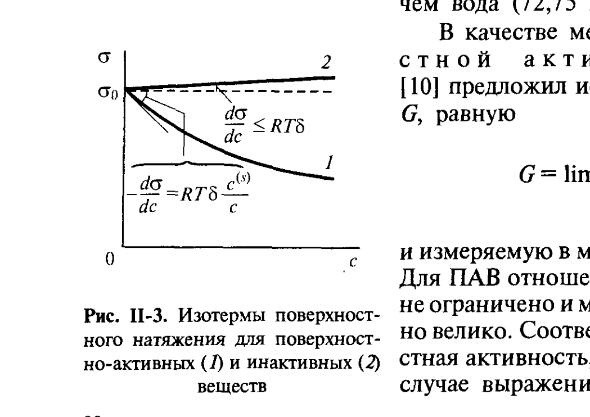
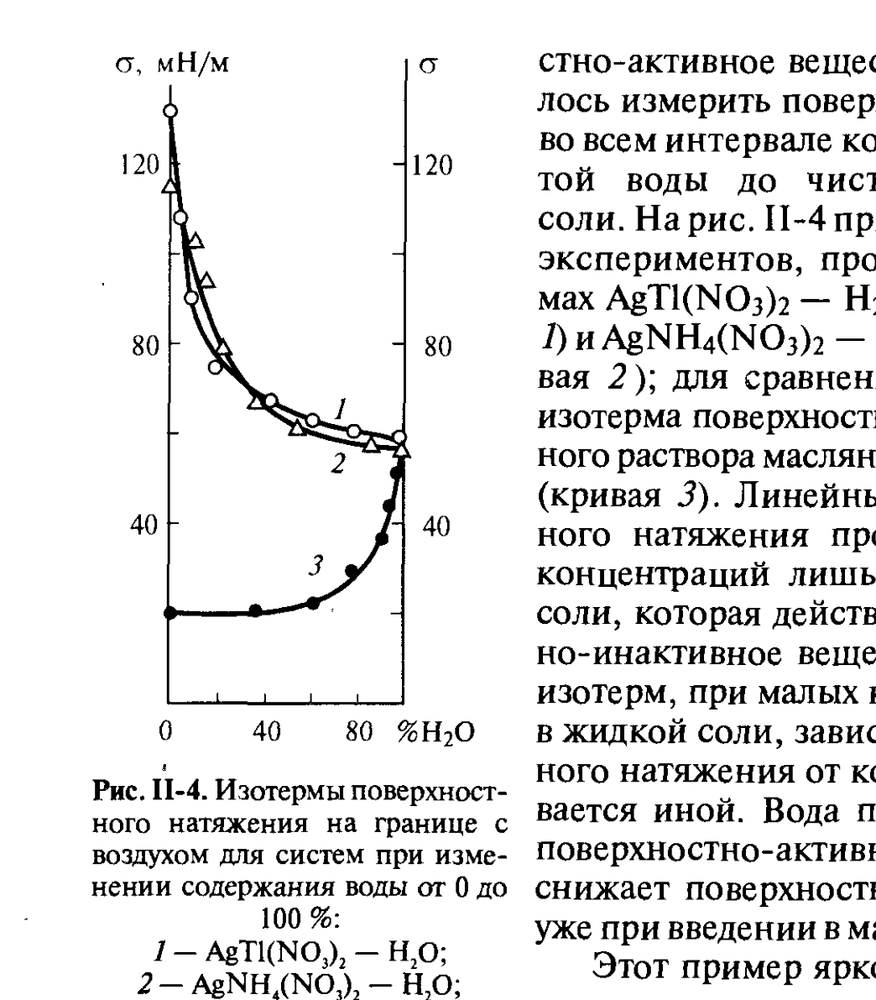

# Билет 18. Зависимость σ растворов от концентрации ПАВ/ПИАВ. Поверхностная активность и её относительность

## Тема 1: Влияние растворённого вещества на поверхностное натяжение

> [!note] Общая картина
> Экспериментальные исследования влияния различных веществ на поверхностное натяжение растворов показали, что в зависимости от природы растворённого вещества и растворителя возможно как **падение**, так и **повышение** поверхностного натяжения с ростом концентрации раствора $c$. Однако это влияние растворённого вещества на поверхностное натяжение растворителя $\sigma_0$ существенно различно: одни вещества уже в очень малых концентрациях вызывают резкое понижение поверхностного натяжения, тогда как другие повышают его, и притом очень незначительно.

> [!important] Связь с уравнением Гиббса
> Вещества, введение которых в систему приводит к **понижению** поверхностного натяжения ($d\sigma/dc<0$), называют **поверхностно-активными веществами (ПАВ)**. В соответствии с уравнением Гиббса (II.5, [[билет_17]]) адсорбция $\Gamma$ для таких веществ положительна, т. е. их концентрация в поверхностном слое выше объёмной концентрации.

---

## Тема 2: Дифильное строение молекул ПАВ

> [!note] Строение молекул ПАВ
> Для границ вода — воздух и вода — углеводород поверхностно-активными являются органические соединения, в молекулах которых имеются углеводородная (неполярная) часть и полярная группа (—OH, —COOH, —NH₂ и др.). Такое асимметричное (**дифильное**) строение молекул ПАВ приводит к тому, что они оказываются родственными обеим контактирующим фазам: хорошо гидратирующаяся полярная группа обусловливает родственность молекул ПАВ по отношению к воде, а углеводородная цепь — к неполярной фазе.

> [!example] Граница «с воздухом» — поверхностно-активные вещества
> На границе с воздухом поверхностно-активные вещества имеют поверхностное натяжение ($\approx 25$ мДж/м²) значительно меньше, чем вода ($72{,}75$ мДж/м²).

---

## Тема 3: Изотермы σ(c): активные и инактивные вещества

*Рис. II-3 (Щукин, с. 80). Кривая 1 — типичная изотерма σ(c) поверхностно-активного вещества: резкое начальное падение σ с наклоном $-d\sigma/dc=RT\delta\,c^{(s)}/c$, ограниченное предельным наклоном $RT\delta$ при $c\to 0$. Кривая 2 — поверхностно-инактивное вещество: слабый рост σ с концентрацией, $d\sigma/dc\le RT\delta$.*

> [!important] Поверхностно-инактивные вещества
> Неорганические электролиты при растворении в воде лишь слабо **повышают** её поверхностное натяжение (рис. II-4, кривая 2). В соответствии с уравнением Гиббса это означает, что адсорбция электролитов **отрицательна** — поверхностный слой раствора обеднён растворённым веществом по сравнению с объёмом ($c^{(s)}<c$). Такое обеднение поверхностного слоя при растворении электролита в воде вполне понятно: ионы гидратируются, и им невыгодно подходить к поверхности ближе, чем на толщину гидратной оболочки (выход иона непосредственно в поверхностный слой термодинамически невыгоден вследствие затраты энергии на дегидратацию иона).

> [!note] Предельный случай и оценка $\delta RT$
> В предельном случае поверхностный слой раствора может вообще не содержать ионов, тогда отношение $(c^{(s)}-c)/c$, входящее в (II.6, [[билет_17]]), окажется равным $-1$. В этом предельном случае рост поверхностного натяжения с концентрацией раствора определяется условием $d\sigma/dc=\delta RT$, где $\delta$ — толщина гидратных слоёв вокруг ионов близка к размеру молекул воды и не превышает долей нанометра. Максимальное значение тангенса угла наклона зависимости поверхностного натяжения от концентрации раствора электролита в воде при комнатной температуре составляет:
>
> $$8{,}3\ \text{Дж}\cdot\text{моль}^{-1}\cdot\text{К}^{-1}\cdot 300\ \text{К}\cdot 4\cdot10^{-10}\ \text{м} \approx 10^{-6}\ \text{Дж}\cdot\text{м/моль} = 1\ \text{мДж}\cdot\text{м}^2/(\text{кмоль}\cdot\text{м}^{-3})$$
>
> этому соответствует повышение поверхностного натяжения всего на 1 мДж/м² для одномолярного раствора — очень малая величина по сравнению с собственным поверхностным натяжением воды ($72{,}75$ мДж/м² при комнатной температуре).

> [!warning] Поверхностно-инактивные вещества — терминология
> Вещества, повышающие поверхностное натяжение растворителя, получили название **поверхностно-инактивных** веществ. Возможны также случаи, когда растворённое вещество не приводит к измеримому изменению поверхностного натяжения растворителя; примером может служить водный раствор сахара.

---

## Тема 4: Относительность понятия поверхностной активности

> [!important] Поверхностная активность — не абсолютное свойство вещества
> Этот пример (изотермы для систем AgTl(NO₃)₂—H₂O, AgNH₄(NO₃)₂—H₂O и водного раствора масляной кислоты, рис. II-4) ярко демонстрирует **относительность** понятия поверхностной активности веществ: активность или инактивность вещества **не есть его абсолютное свойство**, а зависит от природы поверхности раздела фаз. Так, вода, поверхностно-активная относительно солей (имеющих более высокое собственное поверхностное натяжение), поверхностно-**инактивна** на границе раздела спирт — воздух.

> [!example] Примеры относительности
> Спирты и другие вещества с дифильными молекулами, сильно поверхностно-активные по отношению к воде, оказываются **инактивными** на границе неполярного углеводорода с воздухом. Соли могут проявлять высокую поверхностную активность по отношению к более тугоплавким солям, оксидам и жидким металлам; некоторые оксиды и легкоплавкие металлы способны снижать поверхностное натяжение тугоплавких металлов и веществ с ковалентными связями между атомами.

> [!tip] Общее правило
> Обычно поверхностно-активным является вещество, которое имеет **более низкое собственное поверхностное натяжение**. Если компонент $A$ поверхностно-активен по отношению к $B$, то $B$ **инактивен** по отношению к $A$.

> [!warning] Частые путаницы на экзамене
> Не путать «поверхностную активность» (термодинамическое свойство пары вещество/граница раздела, относительное) с «адсорбционной активностью» $A$ из уравнения Шишковского (см. [[билет_19]]) — это родственные, но не тождественные понятия: адсорбционная активность характеризует крутизну начального участка изотермы $\sigma(c)$ в рамках конкретного эмпирического уравнения для конкретного гомологического ряда.

---

## Тема 5: Количественная мера поверхностной активности по Ребиндеру

> [!note] Определение величины $G$
> В качестве меры поверхностной активности Ребиндер предложил использовать величину $G$, равную пределу отношения $-d\sigma/dc$ при стремлении концентрации к нулю:
>
> $$G = \lim_{c\to 0}\left(-\frac{d\sigma}{dc}\right)$$
>
> и измеряемую в мДж$\cdot$м$^{-2}$/(кмоль$\cdot$м$^{-3}$), т. е. в единицах работы, отнесённой к единице площади и единице концентрации. Графически $G$ — это тангенс угла наклона касательной к начальному (линейному) участку изотермы $\sigma(c)$ в точке $c=0$ (см. рис. II-3).

> [!important] $G$ для активных и инактивных веществ
> Для ПАВ отношение $c^{(s)}/c$ в принципе не ограничено и может быть сколь угодно велико, т. е. $G$ может быть сколь угодно большой величиной — поверхностное натяжение может очень круто падать с ростом концентрации в растворе, что особенно характерно для **малорастворимых ПАВ**. Для поверхностно-инактивных веществ, напротив, $-d\sigma/dc\le RT\delta$ — величина $G$ ограничена сверху и не может быть большой (см. оценку выше).

---

## Тема 6: Экспериментальные данные для широкого интервала концентраций

*Рис. II-4 (Щукин, с. 82). Изотермы поверхностного натяжения на границе с воздухом для систем AgTl(NO₃)₂—H₂O при 90°C (кривая 1) и AgNH₄(NO₃)₂—H₂O при 100°C (кривая 2); для сравнения — изотерма поверхностного натяжения водного раствора масляной кислоты при 90°C (кривая 3).*

> [!example] Расплавы солей: вода как ПАВ
> Ребиндеру удалось измерить поверхностное натяжение во всём интервале концентраций — от чистой воды до чистой расплавленной соли. Линейный рост поверхностного натяжения происходит в области концентраций лишь примерно до 30% соли, которая в этой области действует как поверхностно-инактивное вещество. В левой части изотерм, при малых концентрациях воды в жидкой соли, зависимость поверхностного натяжения от концентрации оказывается **иной** — здесь вода ведёт себя как «обычное» поверхностно-активное вещество и резко снижает поверхностное натяжение соли уже при введении в малых количествах.
>
> Это демонстрирует относительность: **вода** — поверхностно-активное вещество относительно расплавленных солей (имеющих гораздо более высокое собственное $\sigma$), хотя относительно органических ПАВ (спиртов, кислот) сама вода — поверхностно-инактивна.

---

## Тема 7: Связь с границей твёрдое тело — пар/жидкость

> [!note] ПАВ на разных границах раздела
> Органические ПАВ, вследствие их уникальной дифильности, оказываются поверхностно-активными на большинстве межфазных границ, разумеется, в области термической устойчивости молекул ПАВ. Вызываемое ими понижение поверхностного натяжения по абсолютному значению, как правило, не превышает 30–50 мН/м.
>
> Очень большие эффекты снижения поверхностного натяжения высокоэнергетических поверхностей тугоплавких соединений, оксидов и металлов дают вещества, близкие им по молекулярной природе. Это относится не только к поверхности раздела жидкость — пар, но и к поверхностям твёрдое тело — пар и твёрдое тело — жидкость (см. [[билет_23]], [[билет_61]]).

---

## Источники

- Щукин Е. Д., Перцов А. В., Амелина Е. А. Коллоидная химия. 3-е изд. — М.: Высшая школа, 2004. Гл. II, § II.2, с. 80–83 (изотермы σ(c) для ПАВ и поверхностно-инактивных веществ, рис. II-3, II-4; относительность поверхностной активности; мера поверхностной активности Ребиндера $G$).
- Связь с уравнением Гиббса (II.5, II.6) и адсорбцией $\Gamma$ — см. [[билет_17]].
