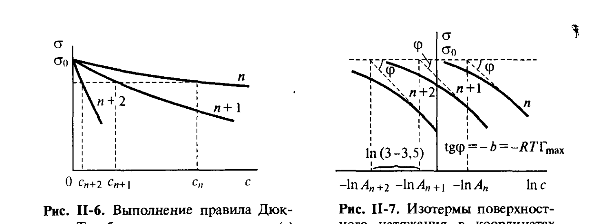

# Билет 19. Уравнение Шишковского, физический смысл констант

## Тема 1: Эмпирическое уравнение Шишковского

> [!note] Историческая справка
> Б. Шишковским (1908–1909) были проведены измерения поверхностного натяжения растворов карбоновых кислот — от муравьиной до капроновой, а также их изомеров. Результаты этих исследований и данные других исследователей были описаны им с помощью эмпирического уравнения, которое теперь записывается в виде:
>
> $$\sigma_0 - \sigma = b\ln(Ac+1) \tag{II.9}$$
>
> где:
> - $\sigma_0$ — поверхностное натяжение чистого растворителя;
> - $\sigma$ — поверхностное натяжение раствора при концентрации $c$;
> - $c$ — концентрация ПАВ в растворе;
> - $b$ и $A$ — эмпирические константы (см. ниже).

> [!warning] Историческая форма уравнения (Шишковского)
> Сам Шишковский в то же время записывал своё уравнение в виде $\dfrac{\sigma_0-\sigma}{\sigma_0}=B\ln(Ac+1)$, что неточно, так как предполагает, что крутизна зависимости $\sigma(c)$ пропорциональна поверхностному натяжению растворителя; как будет ясно из дальнейшего изложения, это не соответствует действительности. В современной форме (II.9) используется константа $b$ (не делённая на $\sigma_0$).

---

## Тема 2: Физический смысл константы $b$

> [!important] Константа $b$ — групповая, не зависит от длины цепи
> Константа $b$ является **общей для всего гомологического ряда** и сохраняет своё значение и для многих других гомологических рядов, тогда как величина $A$ увеличивается в 3–3,5 раза при переходе к каждому последующему гомологу.

> [!note] Связь $b$ с предельной адсорбцией
> Как будет показано далее (Тема 5), $b=RT\Gamma_{max}$, где $\Gamma_{max}$ — предельная (максимально возможная) адсорбция в насыщенном монослое. Постоянство $b$ в гомологическом ряду означает, что в насыщенном адсорбционном слое, при значениях адсорбции, приближающихся к предельным, число молей (молекул) ПАВ, умещающееся на единице площади поверхности, **не зависит от длины молекулы** — молекулы ПАВ ориентируются перпендикулярно к поверхности, и адсорбция определяется только поперечным сечением молекулы $s_1$ (см. [[билет_20]]).

---

## Тема 3: Правило Дюкло — Траубе и константа $A$

*Рис. II-6, II-7 (Щукин, с. 86–87). Слева (рис. II-6) — выполнение правила Дюкло — Траубе на примере изотерм $\sigma(c)$ для трёх ПАВ — соседних членов гомологического ряда $n$, $n{+}1$, $n{+}2$: одинаковое понижение поверхностного натяжения достигается при концентрациях $c_n>c_{n+1}>c_{n+2}$, убывающих в 3–3,5 раза. Справа (рис. II-7) — изотермы поверхностного натяжения в координатах $\sigma-\ln c$ для трёх ПАВ — соседних членов гомологического ряда; параллельные прямые отстоят друг от друга на постоянную величину $\ln(3$–$3{,}5)$, тангенс наклона $\mathrm{tg}\varphi=-b=-RT\Gamma_{max}$.*

> [!important] Правило Дюкло — Траубе через константу $A$
> Из уравнения Шишковского (II.9) видно, что одинаковое понижение поверхностного натяжения может быть достигнуто при в 3–3,5 раза меньшей концентрации каждого последующего гомолога (рис. II-6); эта закономерность была получена ранее в работах Д. Дюкло (1878) и И. Траубе (1884–1886) и получила название **правило Дюкло — Траубе**:
>
> $$\frac{G_{n+1}}{G_n} = \frac{A_{n+1}}{A_n} \approx 3-3{,}5$$
>
> т. е. **поверхностная активность** $G$ (равная, как было установлено в [[билет_18]], $Ab$ при малых концентрациях) и величина $A$ возрастают в 3–3,5 раза при переходе к каждому следующему гомологу.

> [!warning] Подробный разбор и обоснование правила Дюкло — Траубе вынесены в [[билет_21]]
> В этом билете правило Дюкло — Траубе упоминается лишь как иллюстрация физического смысла константы $A$ уравнения Шишковского; полное термодинамическое обоснование правила (через инкремент работы адсорбции на одну CH₂-группу) дано в [[билет_21]].

---

## Тема 4: Предельные случаи уравнения Шишковского

> [!note] Малые концентрации: линейное приближение
> При малых концентрациях разложение логарифма в уравнении Шишковского в ряд даёт линейную зависимость поверхностного натяжения от концентрации:
>
> $$\sigma_0 - \sigma = b\ln(Ac+1) \approx Abc$$
>
> Тангенс угла наклона начальной касательной кривой $\sigma(c)$, т. е. по определению Ребиндера поверхностная активность ПАВ, равна $Ab$ (см. [[билет_18]]).

> [!important] Большие концентрации: логарифмическая зависимость от $\ln c$
> При $Ac\gg 1$ имеем $\ln(Ac+1)\approx\ln(Ac)$ и $\sigma$ уменьшается (двумерное давление $\pi$ растёт) пропорционально $\ln c$:
>
> $$\pi = \sigma_0 - \sigma = b\ln(Ac) = b\ln c + b\ln A$$
>
> В координатах $\sigma(\ln c)$ участки кривых для серии гомологов при высоких концентрациях превращаются в **параллельные прямые линии**, отстоящие друг от друга на постоянную величину $\ln(3$–$3{,}5)$ (рис. II-7).

> [!example] Уравнение Милнера
> Сходное выражение за год до работ Шишковского было предложено Милнером.

---

## Тема 5: Переход к изотерме адсорбции — связь с уравнением Ленгмюра

> [!note] Дифференцирование уравнения Шишковского и подстановка в уравнение Гиббса
> Чтобы перейти от зависимости $\sigma(c)$ к изотерме адсорбции $\Gamma(c)$, продифференцируем уравнение Шишковского по концентрации и подставим в уравнение Гиббса (II.5, [[билет_17]]):
>
> $$-\frac{d\sigma}{dc} = b\frac{A}{Ac+1} = \frac{RT\Gamma}{c}$$

> [!important] Получение уравнения Ленгмюра (II.10)
> После преобразований получаем уравнение, **впервые выведенное на основе кинетического подхода И. Ленгмюром**:
>
> $$\Gamma = \frac{b}{RT}\frac{Ac}{Ac+1} = \Gamma_{max}\frac{c}{\alpha+c} \tag{II.10}$$
>
> где $\alpha=1/A$, $\Gamma_{max}=b/RT$. Подробный разбор уравнения Ленгмюра, его кинетического вывода и расчёта размеров молекул ПАВ — в [[билет_20]].

> [!tip] Мнемоника: как связаны три уравнения этого «куста»
> Уравнение Гиббса (термодинамическая связь $\sigma\leftrightarrow\Gamma$, [[билет_17]]) + эмпирическое уравнение Шишковского ($\sigma(c)$, этот билет) $\;\Longrightarrow\;$ уравнение Ленгмюра ($\Gamma(c)$, [[билет_20]]). Все три уравнения взаимно согласованы и описывают одну и ту же систему «с трёх разных сторон» — это редкий случай, когда чисто эмпирическое уравнение (Шишковского) оказалось термодинамически согласованным с теоретически выводимым уравнением (Ленгмюра).

---

## Тема 6: Постоянство $b=RT\Gamma_{max}$ — молекулярная интерпретация

> [!important] Геометрический смысл постоянства $b$
> Постоянство значения $b=RT\Gamma_{max}$ в гомологическом ряду говорит о том, что в насыщенном адсорбционном слое, при значениях адсорбции, приближающихся к предельным, число молей (молекул) ПАВ, умещающееся на единице площади поверхности, **не зависит от длины молекулы** ПАВ. Это означает, что молекулы ПАВ ориентируются **перпендикулярно** к поверхности, и адсорбция определяется только поперечным сечением молекулы $s_1$:
>
> $$\Gamma_{max} = \frac{1}{N_A s_1}$$
>
> где $N_A$ — число Авогадро. Величина $S_1=1/\Gamma_{max}$ представляет собой площадь, занимаемую молем ПАВ в плотном адсорбционном слое.

> [!example] Применение: определение размеров молекул ПАВ
> Это позволяет на основе изучения зависимости поверхностного натяжения от концентрации ПАВ получить сведения о размерах их молекул. Подробная процедура (переход к изотерме адсорбции, построение в координатах $c/\Gamma$ от $c$, определение $\Gamma_{max}$, $s_1$ и толщины слоя $\delta$) рассмотрена в [[билет_20]].

---

## Источники

- Щукин Е. Д., Перцов А. В., Амелина Е. А. Коллоидная химия. 3-е изд. — М.: Высшая школа, 2004. Гл. II, § II.2, с. 86–88, 92 (уравнение Шишковского II.9, рис. II-6, II-7; правило Дюкло — Траубе; переход к уравнению Ленгмюра II.10; постоянство $b=RT\Gamma_{max}$).
- Связь с уравнением Гиббса — см. [[билет_17]]; полное обоснование правила Дюкло — Траубе — см. [[билет_21]]; уравнение Ленгмюра и расчёт размеров молекул — см. [[билет_20]]; поверхностная активность $G$ — см. [[билет_18]].
