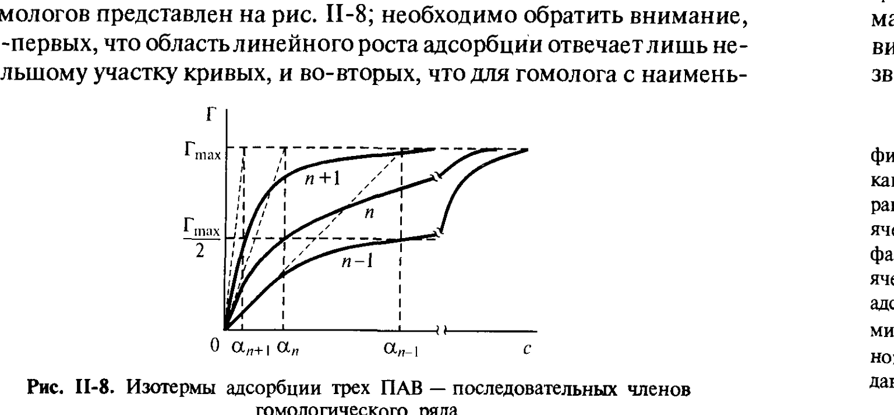
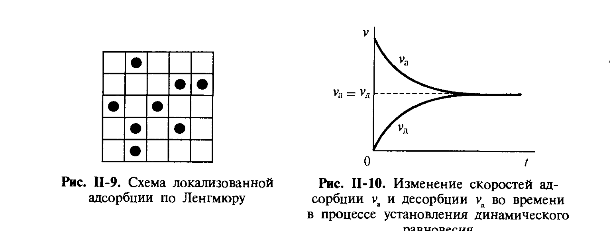

# Билет 20. Уравнение Ленгмюра. Строение монослоёв растворимых ПАВ. Расчёт размеров молекул ПАВ

## Тема 1: Уравнение Ленгмюра — изотерма адсорбции (II.10)

> [!note] Получение из уравнения Шишковского и Гиббса
> Как было показано в [[билет_19]], дифференцирование эмпирического уравнения Шишковского (II.9) и подстановка в уравнение Гиббса (II.5, [[билет_17]]) дают уравнение, впервые выведенное на основе кинетического подхода И. Ленгмюром:
>
> $$\Gamma = \frac{b}{RT}\frac{Ac}{Ac+1} = \Gamma_{max}\frac{c}{\alpha+c} \tag{II.10}$$
>
> где:
> - $\Gamma$ — адсорбция при концентрации раствора $c$;
> - $\Gamma_{max}=b/RT$ — предельная (максимальная) адсорбция, отвечающая насыщенному монослою;
> - $\alpha=1/A$ — константа, имеющая размерность концентрации;
> - $b$, $A$ — константы уравнения Шишковского ([[билет_19]]).

> [!important] Поведение константы $\alpha$ в гомологическом ряду
> Величина $\alpha$ падает в 3–3,5 раза при увеличении длины цепи в гомологическом ряду на одну CH₂-группу (так как $A$ растёт в 3–3,5 раза, а $\alpha=1/A$), тогда как $\Gamma_{max}$, как и параметр $b$ в уравнении Шишковского, **не зависит от длины цепи** молекулы ПАВ.

---

## Тема 2: Предельные участки изотермы Ленгмюра

*Рис. II-8 (Щукин, с. 88). Изотермы адсорбции трёх ПАВ — последовательных членов гомологического ряда $n-1$, $n$, $n+1$ в координатах $\Gamma(c)$. Для гомолога с наименьшей длиной цепи область линейного роста адсорбции и значения адсорбции при высокой концентрации далеки от предельного $\Gamma_{max}$.*

> [!note] Малые концентрации $c\ll\alpha$: закон Генри (II.11)
> При малых значениях концентраций $c\ll\alpha$ уравнение Ленгмюра даёт асимптоту — линейную зависимость адсорбции от концентрации:
>
> $$\Gamma = Ac\,\Gamma_{max} = c\,\Gamma_{max}/\alpha \tag{II.11}$$
>
> Величина $A$ характеризует крутизну возрастания **относительной** адсорбции $\Gamma/\Gamma_{max}$ при малых концентрациях раствора ПАВ; её называют **относительной адсорбционной активностью**. В соответствии с уравнением Гиббса области концентраций, которым отвечают линейные зависимости $\sigma(c)$ и $\Gamma(c)$, совпадают (область, которую часто называют **областью Генри**, см. [[билет_38]]).

> [!important] Большие концентрации $c\gg\alpha$: насыщение $\Gamma\to\Gamma_{max}$
> При $c\gg\alpha$ величина адсорбции асимптотически стремится к предельному значению $\Gamma_{max}$; этой области отвечает линейная зависимость $\sigma(\ln c)$, причём тангенс угла наклона этих прямолинейных участков кривых $\sigma(\ln c)$ равен $RT\Gamma_{max}$ (см. [[билет_19]], рис. II-7).

> [!tip] Точка пересечения асимптот
> В точке пересечения асимптот, при $c=\alpha$, адсорбция равна **половине** своего предельного значения: $\Gamma=\Gamma_{max}/2$.
>
> Общий вид изотерм адсорбции для серии гомологов представлен на рис. II-8; необходимо обратить внимание: во-первых, что область линейного роста адсорбции отвечает лишь небольшому участку кривых, и во-вторых, что для гомолога с наименьшей длиной цепи значения адсорбции и при высокой концентрации далеки от предельного $\Gamma_{max}$.

---

## Тема 3: Линеаризация уравнения Ленгмюра — определение $\Gamma_{max}$

> [!important] Линейная форма $c/\Gamma$ от $c$
> Чтобы перейти от экспериментальной изотермы поверхностного натяжения к изотерме адсорбции и затем получить параметры молекул ПАВ, экспериментальные результаты представляют в виде графика зависимости $c/\Gamma(c)$. В этих координатах изотерме Ленгмюра отвечает **прямая линия**:
>
> $$\frac{c}{\Gamma} = \frac{\alpha}{\Gamma_{max}} + \frac{c}{\Gamma_{max}}$$

> [!note] Извлечение $\Gamma_{max}$, площади на молекулу $s_1$ и толщины слоя $\delta$
> Котангенс угла наклона даёт значение $\Gamma_{max}$, из которого может быть рассчитана площадь на молекулу в плотном адсорбционном слое:
>
> $$s_1 = \frac{1}{N_A\Gamma_{max}}$$
>
> и его толщина:
>
> $$\delta = \Gamma_{max}M/\rho$$
>
> где $M$ — молекулярная масса ПАВ, $\rho$ — плотность молекул ПАВ. Так несложные измерения зависимости поверхностного натяжения раствора от концентрации позволяют определить молекулярные параметры ПАВ.

---

## Тема 4: Постоянство $\Gamma_{max}$, $b$, $\delta$ — ориентация молекул в монослое

> [!important] Молекулы ориентированы перпендикулярно поверхности
> Постоянство значения $b=RT\Gamma_{max}$ в гомологическом ряду говорит о том, что в насыщенном адсорбционном слое, при значениях адсорбции, приближающихся к предельным, число молей (молекул) ПАВ, умещающееся на единице площади поверхности, **не зависит от длины молекулы**. Это означает, что молекулы ПАВ ориентируются **перпендикулярно к поверхности**, и адсорбция определяется только поперечным сечением молекулы $s_1$:
>
> $$\Gamma_{max} = 1/(N_A s_1)$$
>
> Величина $S_1=1/\Gamma_{max}$ представляет собой площадь, занимаемую молем ПАВ в плотном адсорбционном слое.

> [!example] Геометрическая картина монослоя
> При предельном заполнении монослой состоит из плотно упакованных «вертикально стоящих» дифильных молекул: полярные группы обращены к воде (опущены в водную фазу), углеводородные хвосты — к воздуху (направлены наружу). Толщина такого слоя $\delta$ близка к длине вытянутой молекулы ПАВ, а $s_1$ — к поперечному сечению углеводородной цепи (около $0{,}2$ нм² для одной алкильной цепи — значение, согласующееся с независимыми кристаллографическими данными).

---

## Тема 5: Кинетический (теоретический) вывод уравнения Ленгмюра

*Рис. II-9, II-10 (Щукин, с. 90). Слева (рис. II-9) — схема локализованной адсорбции по Ленгмюру: поверхность твёрдой фазы рассматривается как «шахматная доска», в каждой клетке (ячейке) которой с одинаковой вероятностью может находиться адсорбированная молекула (не более одной на ячейку). Справа (рис. II-10) — изменение скоростей адсорбции $v_a$ и десорбции $v_d$ во времени в процессе установления динамического равновесия $v_a=v_d$.*

> [!note] Модель локализованной адсорбции
> Теоретический вывод уравнения Ленгмюра (II.9 в обозначениях главы II), подробно излагаемый в курсах физической химии, основан на том, что поверхность твёрдой фазы рассматривается как своеобразная **шахматная доска**, на каждой клетке — ячейке которой с одинаковой вероятностью могут находиться адсорбированные молекулы (не более одной на ячейку). При этом учитывается только обмен молекулами между объёмом газовой фазы и ячейками на поверхности и не принимается во внимание переход молекул от ячейки к ячейке (рассматривается **локализованная адсорбция**). Молекулы не взаимодействуют друг с другом в адсорбционном слое.

> [!important] Скорости адсорбции и десорбции; вывод (II.12)–(II.13)
> Скорость адсорбции $v_a$ пропорциональна доле свободных мест $(1-\theta_a)$ и давлению пара $p$:
>
> $$v_a = k_a(1-\theta_a)p$$
>
> а скорость десорбции $v_d$ зависит только от доли заполненных ячеек:
>
> $$v_d = k_d\theta_a$$
>
> где $k_a$ и $k_d$ — константы скоростей адсорбции и десорбции и адсорбирующегося газа соответственно.
>
> В начальный момент контакта свободной поверхности и адсорбирующегося газа скорость адсорбции максимальна, а скорость десорбции равна нулю (рис. II-10). По мере заполнения поверхности скорости процессов адсорбции и десорбции сравниваются вплоть до достижения **динамического равновесия** между этими процессами $v_a=v_d$, т. е.:
>
> $$k_a(1-\theta_a)p = k_d\theta_a$$
>
> или
>
> $$\theta_a = \frac{\Gamma}{\Gamma_{max}} = \frac{(k_a/k_d)p}{1+(k_a/k_d)p} = \frac{Ap}{Ap+1} \tag{II.13}$$

> [!tip] Адсорбционная активность как отношение констант
> Адсорбционная активность $A'$ приобретает, таким образом, смысл отношения констант скоростей адсорбции $k_a$ и десорбции $k_d$.

> [!warning] Ограничения теоретического вывода
> Уравнение Ленгмюра составило эпоху как в теории адсорбции, так и в основанной на ней теории гетерогенного катализа. Оно применимо только к **обратимым равновесным процессам** и не может быть приложено к описанию процессов **хемосорбции** с образованием химических связей. Переход от рассмотрения газа с давлением $p$ к рассмотрению раствора с концентрацией $c$, граничащего с твёрдой поверхностью вещества (адсорбента), существенно не изменяет логических предпосылок изложенного вывода, так что уравнение Ленгмюра может быть применимо и к описанию **локализованной адсорбции из раствора на твёрдой поверхности** (см. [[билет_23]]).

---

## Тема 6: Сопоставление с уравнением Гиббса и областью применимости

> [!important] Согласие эмпирического и теоретического подходов
> Как показывает сопоставление эмпирического уравнения Шишковского (II.9, [[билет_19]]) с уравнением Гиббса (II.5), изотерма адсорбции Ленгмюра (II.10) хорошо применима и к границе раздела **раствор ПАВ — воздух**; более того, именно для границы твёрдое тело — газ, для которой уравнение (II.10) было выведено, чаще наблюдаются различного вида отклонения от ленгмюровской изотермы адсорбции.
>
> Возможность описания адсорбции из раствора уравнением (II.10) была установлена самим Ленгмюром, который провёл сопоставление изотермы адсорбции с уравнением Гиббса и получил уравнение Шишковского. Переход от локализованной адсорбции к нелокализованной, который может рассматриваться как переход от неподвижных к движущимся ячейкам, не меняет, таким образом, в рассматриваемых случаях закономерностей адсорбции.

> [!note] Энергетическая однородность жидкой поверхности
> Следует также иметь в виду бо́льшую энергетическую однородность жидкостной поверхности по сравнению с твёрдой, на которой существуют различные по энергии взаимодействия активные центры. По-видимому, именно поэтому уравнение Ленгмюра может хорошо выполняться для жидкой поверхности.

> [!example] Уравнение Фрейндлиха — альтернатива для неоднородных твёрдых поверхностей
> Экспериментальные данные для адсорбции на твёрдых адсорбентах из газовой фазы в области средних значений давлений паров адсорбирующегося компонента часто хорошо передаются эмпирической изотермой Фрейндлиха:
>
> $$\Gamma = \beta p^{1/n}$$
>
> где $\beta$ и $n$ — константы, причём $n$ составляет обычно несколько единиц. Изотерма Фрейндлиха, в отличие от изотермы Ленгмюра, не имеет простого теоретического обоснования и не даёт ни начальной линейной зависимости адсорбции от давления пара, ни конечного значения постоянной предельной адсорбции. Связана с энергетической неоднородностью поверхности твёрдого тела.

---

## Тема 7: Начальный линейный участок и закон Генри (II.14)

> [!note] Связь $c_s/c$ с законом Генри
> Рассмотрим подробнее начальный участок изотерм поверхностного натяжения и адсорбции. Как отмечалось ранее, при высокой поверхностной активности адсорбция равна количеству вещества в поверхностном слое, т. е. произведению поверхностной концентрации $c_s$ и толщины поверхностного слоя $\delta$: $\Gamma=c_s\delta$. Поскольку в соответствии с (II.10) на начальном линейном участке изотермы адсорбции $\Gamma=Ac\Gamma_{max}$, можно написать:
>
> $$\frac{c_s}{c} = \frac{A\Gamma_{max}}{\delta} = K_a \tag{II.14}$$
>
> т. е. к равновесию адсорбционного слоя и объёмного раствора (при малых объёмной и поверхностной концентрациях) можно применить **закон Генри**, описывающий распределение вещества между двумя фазами с постоянным коэффициентом распределения $K_a$.

> [!important] Работа адсорбции $W_{адс}$ (II.15)
> Условие равновесия объёмного и поверхностного растворов можно записать в виде $\mu_{os}+RT\ln c_s=\mu_o+RT\ln c$, откуда $RT\ln(c_s/c)=\mu_o-\mu_{os}=W_{адс}$ — работа, совершённая системой при переносе молекулы ПАВ из объёма на поверхность (**работа адсорбции**). Из (II.14):
>
> $$W_{адс} = RT\ln\frac{c_s}{c} = RT\ln\!\left(\frac{A\Gamma_{max}}{\delta}\right) = RT\left(\ln A + \ln\Gamma_{max}\right)$$
>
> Поскольку при увеличении длины цепи молекул ПАВ на одну CH₂-группу адсорбционная активность $A$ возрастает в 3–3,5 раза, а $\Gamma_{max}$ и $\delta$ постоянны, работа адсорбции возрастает на постоянную величину $RT\ln(3$–$3{,}5)$. Это и есть термодинамическая основа правила Дюкло — Траубе, подробно обоснованная в [[билет_21]]:
>
> $$W_{адс} = \varphi_0 + n\varphi_1$$
>
> где $\varphi_0$ характеризует изменение энергии взаимодействия полярной группы молекулы ПАВ с молекулами воды при выходе ПАВ на поверхность, а $\varphi_1$ — инкремент работы адсорбции на одну CH₂-группу ($\approx 3$ кДж/моль).

---

## Источники

- Щукин Е. Д., Перцов А. В., Амелина Е. А. Коллоидная химия. 3-е изд. — М.: Высшая школа, 2004. Гл. II, § II.2, с. 87–93 (уравнение Ленгмюра II.10, рис. II-8; линеаризация и определение $\Gamma_{max}$, $s_1$, $\delta$; кинетический вывод по Ленгмюру, рис. II-9, II-10, II.12–II.13; изотерма Фрейндлиха; закон Генри II.14, работа адсорбции II.15).
- Эмпирическое уравнение Шишковского и его параметры — см. [[билет_19]]; уравнение Гиббса — см. [[билет_17]]; правило Дюкло — Траубе и инкремент работы адсорбции — см. [[билет_21]].
