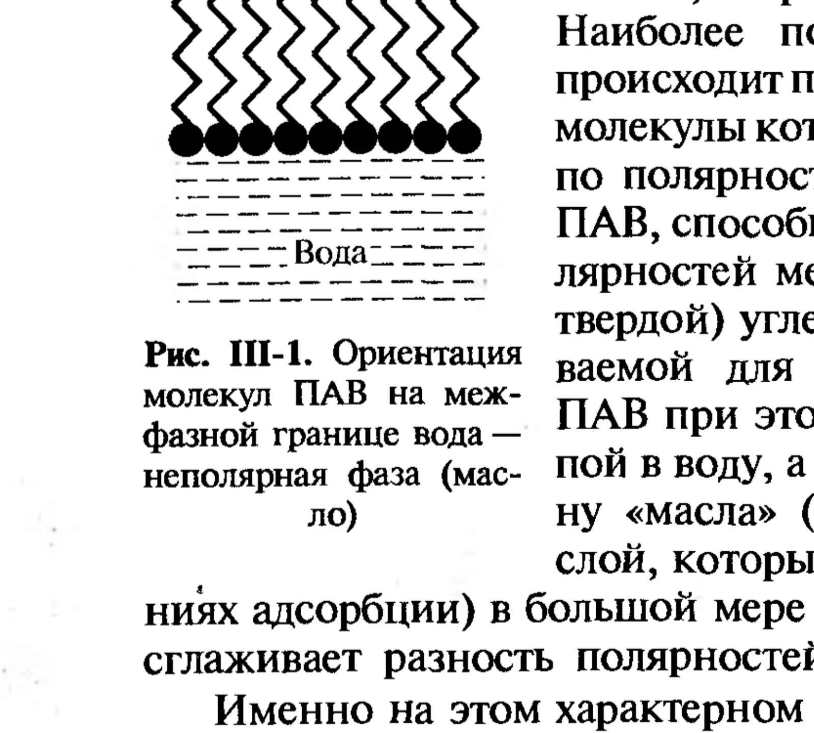
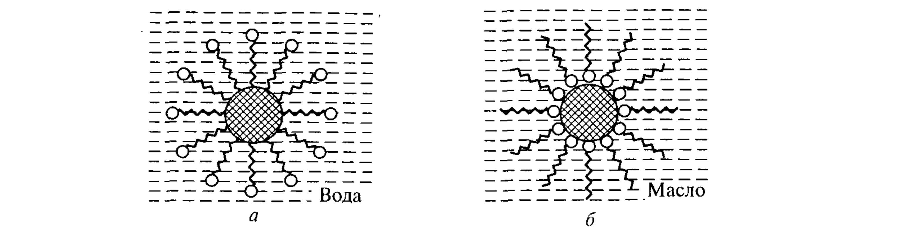
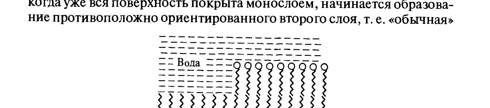

# Билет 23. Адсорбция ПАВ из растворов на поверхности твёрдых тел. Правило уравнивания полярностей Ребиндера. Гидрофилизация и гидрофобизация

## Тема 1: Адсорбция ПАВ на границе твёрдое тело — жидкость

### Постановка задачи и метод изучения

Для изучения адсорбции на твёрдых телах основным методом служит исследование **концентрационной зависимости адсорбции** $\Gamma(c)$, поскольку прямое измерение поверхностного натяжения твёрдого тела (как для жидкости — [[билет_15]], [[билет_16]]) невозможно. Используют твёрдые адсорбенты с большой удельной поверхностью — порошки или тонкопористые тела.

> [!note] Определение адсорбции на твёрдом теле
> Полное количество вещества $\Gamma^*$, поглощённого единицей массы адсорбента, находят по убыли концентрации адсорбирующегося вещества $\Delta c$ в определённом объёме раствора $V$ после достижения равновесия:
> $$
> \Gamma^*=\frac{\Delta c\, V}{m},
> $$
> где $m$ — масса адсорбента. Если известна удельная поверхность адсорбента $S_1$ (например, по адсорбции газов), адсорбцию на единицу поверхности находят как $\Gamma=\Gamma^*/S_1$.

---

## Тема 2: Правило уравнивания полярностей Ребиндера

> [!important] Формулировка правила (ключевое для билета)
> **Правило уравнивания полярностей Ребиндера**: при адсорбции на межфазной границе наибольшей способностью к адсорбции обладают вещества, **полярность которых имеет промежуточное значение между полярностями контактирующих фаз**. Молекулы такого ПАВ ориентируются так, что более полярная часть молекулы обращена в более полярную фазу, а менее полярная — в менее полярную, тем самым «сглаживая» (уравнивая) разность полярностей на границе раздела.

### Иллюстрация на границе масло–вода

Наиболее полное «сглаживание» разности полярностей достигается при адсорбции **дифильных** молекул (имеющих резко различающиеся по полярности участки) — органических ПАВ. Молекула ПАВ ориентируется полярной группой в воду, а углеводородной цепью — в сторону «масла» (рис. III-1), создавая переходный слой, который при достаточно высоких значениях адсорбции в большой мере или даже практически полностью сглаживает разность полярностей между двумя фазами.

*Рис. III-1. Ориентация молекул ПАВ на межфазной границе вода — неполярная фаза (масло). Полярная группа обращена в воду, углеводородный радикал — в масло.*

### Распределение ПАВ между водной и масляной фазами

По растворимости в водной и масляной фазах ПАВ делят на:
- **водорастворимые** — несут заряженную полярную группу либо достаточно крупную полиоксиэтиленовую цепь, углеводородный радикал умеренной длины (обычно не более 16–18 атомов углерода);
- **маслорастворимые** — на границе вода–масло образуют адсорбционные слои, исследуемые с помощью весов Ленгмюра ([[билет_24]]); имеют одну-две длинные углеводородные цепи и слабо диссоциирующую или неионогенную полярную группу;
- **ПАВ промежуточной природы** — растворимы в обеих фазах.

При низкой концентрации распределение ПАВ между фазами подчиняется закону Генри:

$$
c_в/c_м=K,
$$

где $c_в, c_м$ — концентрации ПАВ в водной и масляной фазах; $K$ — коэффициент распределения.

> [!note] Связь поверхностных активностей в обеих фазах
> Применяя уравнение Гиббса в приближённой форме для обеих фаз при малых концентрациях:
> $$
> \Gamma=-\frac{c_м}{RT}\frac{d\sigma}{dc_м}=-\frac{c_в}{RT}\frac{d\sigma}{dc_в},
> $$
> откуда
> $$
> G_м=G_в\frac{c_в}{c_м}=G_в K,
> $$
> где $G_в, G_м$ — поверхностные активности при адсорбции из водной и масляной фаз.

> [!important] Правило Дюкло–Траубе и коэффициент распределения
> Коэффициент распределения $K$ приближённо пропорционален отношению растворимостей ПАВ в водной и масляной фазах. Он, как и растворимость ПАВ в воде, **падает в 3–3.5 раза с удлинением цепи на одну $\text{CH}_2$-группу** (растворимость в масляной фазе слабо изменяется с длиной цепи). Поэтому поверхностная активность ПАВ при адсорбции из водной фазы возрастает в 3–3.5 раза при переходе к каждому следующему гомологу ([[билет_21]]), тогда как при адсорбции из масляной фазы — слабо изменяется с длиной цепи.

### Энтропийная природа адсорбции на границе вода–масло

Как и для границы вода–воздух ([[билет_22]]), энергетика адсорбции молекул ПАВ из водного раствора на поверхности вода–масло определяется в основном изменением **стандартной части химического потенциала объёмного раствора** $\mu_0$, связанным с гидрофобными взаимодействиями углеводородных цепей в объёме воды, т. е. имеет **энтропийную природу**. При адсорбции маслорастворимых ПАВ из углеводородной фазы энергетика определяется **гидратацией полярных групп** при их выходе из углеводородной фазы на межфазную поверхность.

---

## Тема 3: Гидрофилизация и гидрофобизация поверхностей твёрдых тел

### Ориентация молекул ПАВ на различных межфазных границах

В соответствии с правилом уравнивания полярностей наибольшей способностью к адсорбции на границе раздела между водным раствором ПАВ и **неполярным твёрдым телом** обладают вещества с промежуточной полярностью. Так, на поверхности парафина, сажи, угля, активированного угля и других неполярных адсорбентов, контактирующих с водным раствором органического ПАВ, образуются адсорбционные слои, в которых углеводородные цепи ориентированы к поверхности твёрдой фазы, а полярные группы находятся в воде (рис. III-3, *а*). В этом состоит один из главных факторов, обусловливающих **моющее действие ПАВ**.

И наоборот, при погружении полярных твёрдых тел или порошков (оксидов, карбонатов, силикатов, алюмосиликатов — мел, глины и др.) в **маслянyю фазу**, содержащую маслорастворимое ПАВ, происходит образование адсорбционных слоёв, в которых полярные группы расположены на поверхности твёрдой фазы, а углеводородные цепи «плавают» в масляной среде (рис. III-3, *б*). Этот процесс важен при введении полярных наполнителей и пигментов в углеводородную или малополярную полимерную фазу.

*Рис. III-3. Ориентация молекул ПАВ на различных межфазных границах: а — неполярное твёрдое тело — водный раствор ПАВ; б — полярное твёрдое тело — раствор ПАВ в неполярной жидкости (масле).*

> [!important] Определения гидрофилизации и гидрофобизации
> - **Гидрофилизация поверхности** — превращение исходно гидрофобной (неполярной) поверхности в гидрофильную за счёт адсорбции ПАВ, обращённых полярными группами наружу (в воду).
> - **Гидрофобизация поверхности** — превращение исходно гидрофильной (полярной) поверхности в гидрофобную за счёт адсорбции ПАВ, обращённых неполярными (углеводородными) группами наружу.
>
> При достаточной концентрации ПАВ в растворе в обоих случаях образуются плотные адсорбционные слои, способные радикально менять свойства поверхностей.

### Хемосорбция и кажущееся «несоблюдение» правила уравнивания полярностей

Адсорбирующееся на твёрдой поверхности вещество может связываться не только слабыми «физическими силами» (ван-дер-ваальсовы взаимодействия, [[билет_04]], [[билет_05]]), но и за счёт образования **химических связей** с поверхностными ионами/молекулами — это явление называют **хемосорбцией**.

> [!warning] Хемосорбция как кажущееся нарушение правила Ребиндера
> Хемосорбция может приводить к видимости несоблюдения правила уравнивания полярностей: на границе раздела **полярного кристалла** (например, силиката или сульфида) и **полярной среды** (воды) адсорбция может происходить так, что углеводородные радикалы оказываются обращёнными **в сторону воды** (рис. III-4, *а*) — то есть с виду полярная поверхность дополнительно «гидрофобизуется» хемосорбированным ПАВ, хотя по правилу уравнивания полярностей следовало бы ожидать обратного. Причина — специфическое химическое связывание полярной группы ПАВ с поверхностными активными центрами кристалла, доминирующее над энергетикой физической адсорбции.
>
> При высоких концентрациях хемосорбирующегося ПАВ, когда поверхность уже покрыта монослоем, начинается образование **второго, противоположно ориентированного слоя** — формируется «обычная» (по правилу уравнивания полярностей) бислойная структура (рис. III-4, *б*).

*Рис. III-4. Ориентация молекул ПАВ на межфазной границе полярное твёрдое тело — водный раствор в условиях хемосорбции при малых (а) и больших (б) концентрациях ПАВ в объёме.*

> [!tip] Мнемоника
> Хемосорбция «переключает» молекулу ПАВ с энергетически выгодной по полярности ориентации на ориентацию, диктуемую химической связью полярной группы с поверхностью — отсюда «инверсия» по сравнению с обычной физической адсорбцией.

### Особенности изотерм адсорбции из растворов на твёрдые тела

В нерасслаивающихся системах с неограниченно смешивающимися компонентами рассматривают зависимость объёмной концентрации $x^{(s)}$ в поверхностном слое от концентрации в объёме $x$ (рис. III-5). При сильной поверхностной активности компонента $x^{(s)}\to1$ резко (кривая *1*); при слабой — $x^{(s)}(x)$ может иметь S-образную форму (кривая *2*) с точкой пересечения, где состав поверхностного слоя совпадает с составом объёма («поверхностная азеотропия»).

Адсорбцию выражают через избыток концентрации в поверхностном слое и толщину слоя $\delta$:

$$
\Gamma=\left(\frac{x^{(s)}}{V_m^{(s)}}-\frac{x}{V_m}\right)\delta,
\tag{III.1}
$$

где $V_m^{(s)}$ и $V_m$ — молярные объёмы компонента в поверхностном слое и в объёме.

---

## Тема 4: Применение управления смачиванием — флотация (практический пример)

> [!example] Флотационное обогащение полезных ископаемых
> **Флотация** — крупномасштабный технологический процесс разделения минералов на основе различий в смачивании их жидкой фазой. ПАВ-**собиратели** (коллекторы) хемосорбируются на поверхности флотируемого минерала, гидрофобизуя («намасливая») её. Гидрофобизованные частицы прилипают к пузырькам воздуха в пенной флотации и выносятся в пенный слой, тогда как гидрофильные частицы пустой породы остаются в воде.
>
> Дополнительные реагенты:
> - **активаторы** — модифицируют поверхность частиц, облегчая хемосорбцию собирателя;
> - **депрессоры** — усиливают смачивание водой минералов, которые не должны флотироваться;
> - **пенообразователи** — обеспечивают устойчивую пену умеренной плотности.
>
> Флотация — пример практического применения как избирательного смачивания ([[билет_11]]), так и правила уравнивания полярностей: собиратели подбираются так, чтобы их полярная группа химически связывалась с поверхностью ценного минерала, а неполярный «хвост» обращался в воду, обеспечивая гидрофобность и прилипание к пузырьку.

---

## Источники

- Щукин Е.Д., Перцов А.В., Амелина Е.А. Коллоидная химия, 3-е изд. — раздел III.1 «Адсорбция ПАВ на поверхностях раздела конденсированных фаз», с. 121–129 (правило уравнивания полярностей Ребиндера, ориентация молекул ПАВ, хемосорбция, рис. III-1, III-3, III-4, III-5, формула III.1).
- Щукин и др., раздел III.2 «Применение ПАВ для управления процессами смачивания и избирательного смачивания», с. 132–138 (гидрофилизация/гидрофобизация, флотация, моющее действие, текстильно-вспомогательные вещества).
- Связь с правилом Дюкло–Траубе и гидрофобным эффектом — см. [[билет_21]], [[билет_22]].
