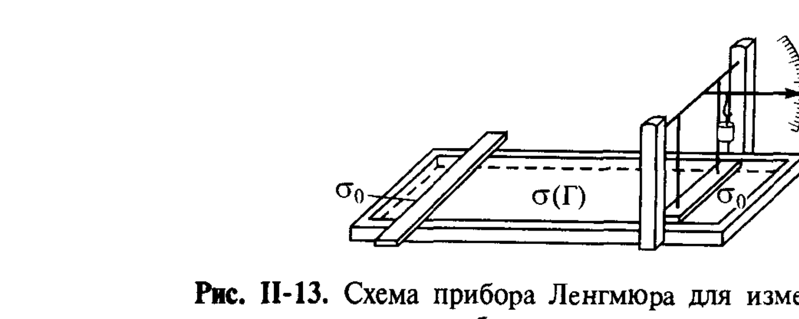
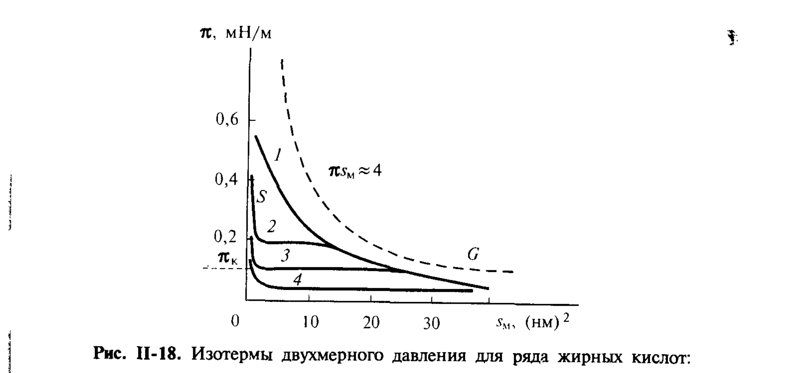
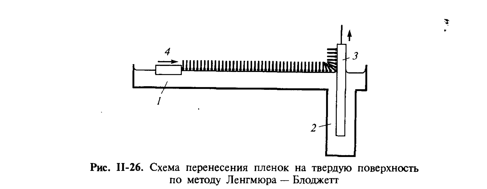

# Билет 24. Монослои нерастворимых ПАВ на границе вода/воздух. Весы Ленгмюра. Изотермы двухмерного давления. Уравнения состояния монослоёв. Плёнки Ленгмюра–Блоджетт

## Тема 1: Весы Ленгмюра

### Принцип измерения двухмерного давления

В отличие от растворимых ПАВ, для которых используют метод избыточных величин Гиббса (изотерма $\sigma(c)$, см. [[билет_17]], [[билет_18]]), для **нерастворимых ПАВ** адсорбцию можно задать непосредственно — нанесением известного (очень малого) количества вещества на известную площадь поверхности.

> [!note] Двухмерное давление $\pi$
> Если поверхность, на которую нанесено поверхностно-активное вещество, ограничить подвижным барьером (рис. II-5), то на единицу длины барьера действует сила, направленная в сторону чистой поверхности и равная разности поверхностных натяжений чистой поверхности $\sigma_0$ и поверхности, покрытой адсорбционным слоем, $\sigma(\Gamma)$. Эту силу называют **двухмерным (поверхностным) давлением**:
> $$
> \pi=\sigma_0-\sigma(\Gamma)=-\Delta\sigma(\Gamma).
> \tag{II.8}
> $$

### Прибор Ленгмюра

> [!example] Конструкция весов Ленгмюра
> Прибор Ленгмюра представляет собой плоскую кювету с парафинированными стенками, заполненную водой, на поверхности которой плавает лёгкий барьер, соединённый с динамометром (весами). На небольшое количество разбавленного раствора нерастворимого ПАВ в легколетучем растворителе (например, бензольный раствор цетилового спирта) наносят на поверхность воды между измерительным и вспомогательным барьерами; растворитель испаряется, оставляя на поверхности заданное количество ПАВ. Передвигая барьер, изменяют площадь, приходящуюся на молекулы ПАВ, и измеряют силу $F$, действующую на измерительный барьер; разделив $F$ на ширину барьера, получают $\pi$.

*Рис. II-13. Схема прибора Ленгмюра для измерения двухмерного давления адсорбционных слоёв нерастворимых ПАВ.*

Повторяя измерения при разных количествах нанесённого ПАВ (т. е. разных $\Gamma$) и разных положениях вспомогательного барьера (разных площадях $s_М$, приходящихся на молекулу), получают **изотерму $\pi(s_М)$** — основной экспериментальный результат для монослоёв нерастворимых ПАВ.

> [!important] Применимость к растворимым ПАВ
> Сопоставление, проведённое Ленгмюром и Фрумкиным (рис. II-23), показало, что свойства адсорбционных слоёв одного и того же вещества, полученные методом Ленгмюра (для нерастворимых веществ) и из изотермы $\sigma(c)$ по уравнению Гиббса (для растворимых), **хорошо совпадают**. Это доказывает, что свойства адсорбционных слоёв близки и не связаны непосредственно с растворимостью молекул ПАВ в подстилающей жидкости.

---

## Тема 2: Изотермы двухмерного давления и уравнения состояния монослоёв

### Идеальный двухмерный газ

При малых поверхностных концентрациях понижение $\sigma$ имеет простую молекулярно-кинетическую природу — двухмерное давление можно рассматривать как аналог осмотического давления, вызванного «бомбардировкой» барьера молекулами ПАВ. Для идеального двухмерного газа справедливо уравнение состояния, аналогичное Клапейрону–Менделееву:

$$
\pi s_М=kT,
\tag{II.18}
$$

где $s_М$ — площадь, приходящаяся на одну молекулу. Соответственно изотерма $\pi(s_М)$ — гипербола (рис. II-11), а в координатах $\pi s_М-\pi$ идеальному газу отвечает горизонтальная прямая на уровне $kT\approx4$ мН·м⁻¹·нм² (рис. II-12, [[билет_17]]).

### Классификация поверхностных плёнок (по Адамсону)

При уменьшении площади на молекулу (увеличении концентрации в монослое) идеализация двухмерного газа перестаёт работать — начинают проявляться силы взаимного притяжения и отталкивания молекул в слое. А. Адамсон выделяет несколько типов поверхностных плёнок:

| Тип плёнки | Площадь на молекулу $s_М$ | Поведение $\pi(s_М)$ | Особенности |
|---|---|---|---|
| **Газообразные ($G$)** | большая | $\pi s_М\approx kT\approx4$ мН·м⁻¹·нм² | приближённо подчиняются уравнению идеального двухмерного газа (II.18) |
| **Жидкорастянутые ($L_2$)** | $0.4$–$1$ нм² | плавное снижение $\pi$ с ростом $s_М$ | характерны для кислот и спиртов умеренной длины при повышенных $T$ |
| **Жидкие ($L_1$)** | малая, экстраполяция к $\pi=0$ даёт $s_1\approx0.22$ нм² | малая сжимаемость, резкий подъём кривой | $s_1$ ненамного больше сечения углеводородной цепи (для веществ с большой полярной группой, например фенолов, $s_1>0.22$ нм²) |
| **Твёрдые ($S$)** | минимальная, $s_1\approx0.206$ нм² | сжимаемость ещё ниже, чем у жидких; выдерживают напряжения сдвига без остаточной деформации | предельное значение $s_1$ ≈ собственное сечение молекулы ПАВ |

> [!example] Иллюстрация на жирных кислотах
> На рис. II-18 показаны изотермы $\pi(s_М)$ для ряда жирных кислот (1 — лауриновая $C_{12}$, 2 — миристиновая $C_{14}$, 3 — пентадециловая $C_{15}$, 4 — пальмитиновая $C_{16}$). Видно, что разные кислоты при больших $s_М$ выходят на общую газоподобную ветвь $G$ (асимптотически приближающуюся к гиперболе $\pi s_М\approx4$), а при малых $s_М$ переходят в конденсированные ($S$) состояния с почти вертикальным подъёмом $\pi$.

*Рис. II-18. Изотермы двухмерного давления для ряда жирных кислот: 1 — лауриновая ($C_{12}$); 2 — миристиновая ($C_{14}$); 3 — пентадециловая ($C_{15}$); 4 — пальмитиновая ($C_{16}$).*

> [!note] Двухмерная конденсация
> Переход от газообразных (парообразных) плёнок к жидким и твёрдым представляет собой **двухмерный фазовый переход первого рода**, аналогичный трёхмерной конденсации паров. Уменьшение площади на молекулу в области парообразных плёнок ведёт к постепенному повышению $\pi$ вплоть до **давления конденсации насыщенного двухмерного пара $\pi_к$**; после этого сжатие плёнки не сопровождается ростом $\pi$ — происходит конденсация в конденсированное (жидкорастянутое, жидкое или, в зависимости от природы ПАВ, твёрдое) состояние (рис. II-19).

### Уравнения состояния монослоёв

> [!note] Уравнение Ван-дер-Ваальса для двухмерного газа
> По аналогии с трёхмерным уравнением Ван-дер-Ваальса
> $$
> \left(p+\frac{a_V}{V_m^2}\right)(V_m-b_V)=RT,
> $$
> для двухмерных адсорбционных слоёв (Фрумкин) предложено уравнение
> $$
> \left(\pi+\frac{a_s}{s_М^2}\right)(s_М-s_1)=kT,
> \tag{II.20}
> $$
> где:
> - $a_s$ — характеризует **притяжение молекул** в адсорбционном слое (аналог $a_V$);
> - $s_1$ — **собственная площадь**, занимаемая молекулой («запрещённая» для сжатия область, аналог поправки $b_V$ на собственный объём молекул).

Величина $s_1$ зависит от природы конденсированного состояния: для жидкорастянутых плёнок $s_1\approx0.5$ нм², для жидких — $s_1\approx0.22$ нм², для твёрдых — $s_1\approx0.206$ нм² (для молекул с линейной цепью).

> [!important] Связь $\pi s_М$ с притяжением и отталкиванием
> Представляя (II.20) в виде
> $$
> \pi s_М=kT-\frac{a_s}{s_М}+\left(\pi+\frac{a_s}{s_М^2}\right)s_1,
> $$
> видно, что при не очень высоких $\pi$ отклонение $\pi s_М$ от $kT$ обусловлено в основном отрицательным слагаемым $-a_s/s_М$ — **притяжением** молекул, и кривая $\pi s_М(\pi)$ отклоняется **вниз** от $kT=4$ (рис. II-22). При сильном сжатии (малые $s_М$, $s_М\to s_1$) преобладает положительное слагаемое, отвечающее **отталкиванию**, и произведение $\pi s_М$ может **превысить** $kT$.

> [!warning] Частая путаница
> Не путать **двухмерное давление $\pi$** (силу на единицу длины барьера, аналог давления газа) и **поверхностное натяжение $\sigma$**: $\pi=\sigma_0-\sigma$ — это убыль $\sigma$ относительно чистой поверхности, а не сама величина $\sigma$.

### Давление коллапса

Рост двухмерного давления при сжатии адсорбционного слоя ограничен некоторой величиной $\pi_{max}$ — **давлением коллапса**. При $\pi>\pi_{max}$ адсорбционный слой теряет устойчивость: на его поверхности образуются складки (подобные торосам на ледяных полях, рис. II-15), возникают полимолекулярные слои (рис. II-14).

---

## Тема 3: Плёнки Ленгмюра–Блоджетт

> [!note] Метод переноса плёнок на твёрдую поверхность
> Метод, разработанный Ленгмюром и Блоджетт, позволяет переносить адсорбционные слои нерастворимых ПАВ с поверхности воды на твёрдую подложку с образованием **полимолекулярных слоёв заданной структуры**.

> [!example] Схема процесса
> С одной стороны ванны Ленгмюра делается углубление, в которое опускается пластинка. После нанесения на поверхность воды слоя ПАВ одновременно с равной скоростью подвижным барьером поджимается адсорбционный слой и поднимается (или опускается) пластинка; при этом адсорбционный слой переходит на поверхность пластинки при постоянном, достаточно высоком значении двухмерного давления (контролируемом, например, пластинкой Вильгельми). Операцию можно повторять многократно, перенося на поверхность большое количество монослоёв (иногда несколько сотен).

*Рис. II-26. Схема перенесения плёнок на твёрдую поверхность по методу Ленгмюра–Блоджетт.*

### Типы плёнок Ленгмюра–Блоджетт

В зависимости от направления движения пластинки (вверх/вниз) и характера контакта соседних монослоёв (полярные группы к полярным или к углеводородным цепям соседнего слоя) различают три типа многослойных плёнок (рис. II-27):

| Тип плёнки | Структура | Условие получения |
|---|---|---|
| **X-плёнки** | «полярные» плёнки с нескомпенсированным дипольным моментом монослоёв; в каждом слое полярные группы обращены к углеводородным цепям соседнего | нанесение на гидрофобную поверхность при движении пластинки вниз |
| **Y-плёнки** | соседние монослои поочерёдно контактируют углеводородными цепями и полярными группами (наиболее симметричная, центросимметричная структура) | пластинка движется поочерёдно вверх-вниз; иногда возникают и при попытках получения X-плёнок («переворачивание») |
| **Z-плёнки** | аналог X, но с противоположной ориентацией | нанесение на гидрофильную поверхность при движении пластинки вверх |

> [!tip] Применение плёнок Ленгмюра–Блоджетт
> Возможность формировать структуры с заданной молекулярной организацией (последовательные слои разного, заранее заданного состава) используется в монохроматорах и анализаторах мягкого рентгеновского, нейтронного и других излучений (за счёт периодичности на заданных расстояниях в несколько нм), а также для получения светопроводящих, электропроводящих и сверхпроводящих тонких плёнок — основы новых электронных приборов.

---

## Тема 4: Адсорбционные слои белков и биополимеров (дополнение)

> [!example] Монослои глобулярных белков
> Метод Ленгмюра применяется и для исследования белков (альбумин, глобулин, гемоглобин, трипсин и др.). При сжатии белковых плёнок изотермы $\pi$ обратимы вплоть до $\pi\approx20$ мН/м; при дальнейшем сжатии, когда площадь на аминокислотную группу составляет $\approx0.17$ нм², $\pi$ резко возрастает, а затем происходят необратимые изменения — коллапс плёнки. Многие белки сохраняют в монослоях свои ферментативные свойства, что делает такие исследования ценными для понимания процессов на клеточных мембранах и внутриклеточных структурах.

---

## Источники

- Щукин Е.Д., Перцов А.В., Амелина Е.А. Коллоидная химия, 3-е изд. — раздел II.3 «Адсорбционные слои нерастворимых ПАВ», с. 96–110 (весы Ленгмюра, рис. II-13; уравнения состояния идеального двухмерного газа II.18, Ван-дер-Ваальса II.20; классификация плёнок G/L₂/L₁/S, рис. II-18, II-19; давление коллапса, рис. II-14, II-15; плёнки Ленгмюра–Блоджетт, рис. II-26, II-27; адсорбционные слои белков).
- Связь с уравнением Гиббса и изотермами растворимых ПАВ — см. [[билет_17]], [[билет_18]], [[билет_19]], [[билет_20]].
