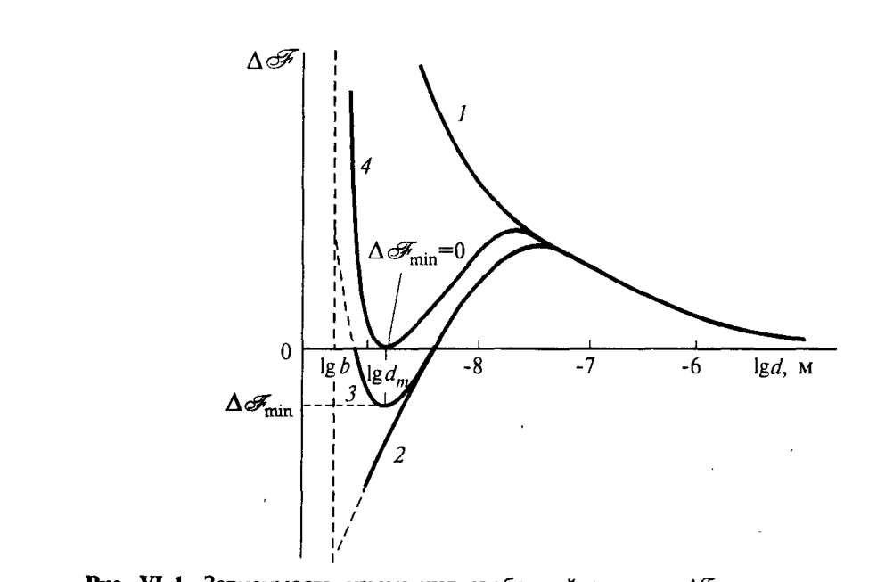

# Билет 26. Самопроизвольное диспергирование макрофаз. Критерий Ребиндера–Щукина. Примеры термодинамически устойчивых дисперсных систем

## Тема 1: Энтропийный фактор при образовании дисперсной системы

> [!note] Постановка задачи
> Образование частиц дисперсной фазы из макрофазы всегда увеличивает свободную поверхностную энергию системы за счёт роста площади межфазной поверхности $S$:
> $$
> \Delta\mathscr{F}_s=\sigma\Delta S>0.
> $$
> Однако одновременно образование частиц, способных участвовать в самостоятельном броуновском движении (см. [[билет_40]]), увеличивает **энтропию** системы на величину $\Delta S$, и член $T\Delta S$ может существенно изменить соотношение энергий макрофазы и дисперсной системы.

Исторически роль теплового движения частиц в термодинамике коллоидных систем впервые рассмотрел М. Фольмер (1927–1931). Полное и последовательное рассмотрение энтропийного фактора было дано П.А. Ребиндером и Е.Д. Щукиным.

### Прирост энтропии при диспергировании

Рассмотрим дисперсную систему, содержащую $\mathscr{N}_1$ частиц дисперсной фазы (или $N_1=\mathscr{N}_1/N_A$ молей частиц) в $N_2$ молях растворителя (дисперсионной среды), как идеальный или регулярный раствор. Прирост энтропии при образовании дисперсной системы можно выразить как энтропию смешения:

$$
\Delta S=R\left(N_1\ln\frac{N_1+N_2}{N_1}+N_2\ln\frac{N_1+N_2}{N_2}\right)=k\left(\mathscr{N}_1\ln\frac{N_1+N_2}{N_1}+N_2N_A\ln\frac{N_1+N_2}{N_2}\right).
$$

В реальной коллоидной системе число частиц дисперсной фазы много меньше числа молекул растворителя, $N_1\ll N_2$ (например, при 0,1 об.% частиц радиусом $r\approx10^{-8}$ м отношение $N_1/N_2\sim10^{-8}$). Учитывая $\ln(1+N_1/N_2)\approx N_1/N_2$, получаем:

$$
\Delta S\approx k\mathscr{N}_1\left(\ln\frac{N_2}{N_1}+1\right)\approx k\beta\mathscr{N}_1, \tag{VI.1}
$$

где

$$
\beta=\left(\ln\frac{N_2}{N_1}+1\right)\approx\ln\frac{N_2}{N_1}\approx15\div30. \tag{VI.2}
$$

> [!note] Расшифровка обозначений
> - $k$ — постоянная Больцмана;
> - $\mathscr{N}_1$ — число частиц дисперсной фазы (общее количество, не молей);
> - $N_1, N_2$ — число молей частиц дисперсной фазы и молекул дисперсионной среды соответственно;
> - $\beta$ — безразмерный параметр порядка 15–30, логарифмически зависящий от соотношения числа частиц и молекул среды.

### Полное изменение свободной энергии

Общее изменение свободной энергии при образовании дисперсной системы из $\mathscr{N}_1$ сферических частиц радиусом $r$:

$$
\Delta\mathscr{F}=\mathscr{N}_1\,4\pi r^2\sigma-T\Delta S,
$$

или, приближённо (включая случай несферических частиц с линейным размером $d$):

$$
\Delta\mathscr{F}\approx(4\pi r^2\sigma-\beta kT)\mathscr{N}_1\approx(\alpha d^2\sigma-\beta kT)\mathscr{N}_1, \tag{VI.3}
$$

где $\alpha$ — безразмерный коэффициент формы частиц (например, $\alpha=4\pi$ для сферы радиусом $r$, если $d=r$).

> [!important] Смысл формулы VI.3
> Первое слагаемое $\alpha d^2\sigma$ — проигрыш энергии за счёт роста поверхности (всегда положителен). Второе слагаемое $\beta kT$ — выигрыш энергии за счёт роста энтропии (от участия частиц в тепловом движении). Знак и величина $\Delta\mathscr{F}$ определяются конкуренцией этих двух вкладов и **зависят от размера частиц** $d$.

---

## Тема 2: Зависимость $\Delta\mathscr{F}(\lg d)$ и условие термодинамической устойчивости

### Качественный вид зависимости

Чтобы описать возможность образования термодинамически равновесной коллоидной системы, рассматривают зависимость $\Delta\mathscr{F}$ (разности свободных энергий дисперсной системы данного состава и макрогетерогенной системы того же состава) от $\lg d$ — логарифма размера частиц.

> [!example] Рис. VI-1 — три характерных случая
> - **Кривая 1**: при высокой $\sigma$ (поверхностная энергия велика) рост энергии при уменьшении $d$ преобладает на всех размерах, заметно превышающих молекулярные — энтропийный фактор пренебрежимо мал, $\Delta\mathscr{F}>0$ всегда. Дисперсная система **термодинамически невыгодна**, для её получения нужна работа механического диспергирования.
> - **Кривая 2** (простейший случай $\sigma=\text{const}$): $\Delta\mathscr{F}(\lg d)$ имеет только **максимум** при $d=b$ (молекулярный размер) — образование молекулярного раствора термодинамически выгоднее, чем образование коллоидной системы.
> - **Кривая 3**: при малой $\sigma$ существен учёт прироста энтропии — выражение VI.3 при малых $d$ преобразуется к виду $\Delta\mathscr{F}(d)\approx\alpha_1 d^2\sigma\mathscr{N}_1-\alpha_2\beta\mathscr{N}_1 kT/d^3$, и на кривой $\Delta\mathscr{F}(\lg d)$ появляется **минимум** при $d=d_m\gg b$, заметно превышающий размер молекул.

*Рис. VI-1. Зависимость изменения свободной энергии $\Delta\mathscr{F}$ монодисперсной системы частиц от логарифма диаметра частиц $d$ (Щукин, рис. VI-1)*

### Критерий самопроизвольного диспергирования (по $\sigma$)

Если в минимуме кривой $\Delta\mathscr{F}_{min}<0$, образование дисперсной системы термодинамически выгодно и может происходить **самопроизвольно**. При постоянном составе фаз условие термодинамической выгодности образования дисперсной системы из макрофазы имеет вид:

$$
4\pi r^2\sigma<\beta kT.
$$

> [!note] Физический смысл (по Ребиндеру и Щукину)
> Если межфазное натяжение $\sigma$ мало, то возможно самопроизвольное отщепление частиц коллоидных размеров от макрофазы, поскольку работа, затрачиваемая на образование новой поверхности, компенсируется выигрышем энергии в результате прироста энтропии из-за участия образующихся частиц в тепловом движении.

Отсюда — **критическое значение поверхностного натяжения** $\sigma_c$, ниже которого процесс самопроизвольного диспергирования макрофазы оказывается выгодным:

$$
\sigma\le\sigma_c=\frac{\beta kT}{4\pi r^2}=\beta'\frac{kT}{d^2}, \tag{VI.4}
$$

где $\beta'=\beta/\alpha$.

> [!important] Порядок величины $\sigma_c$
> Поскольку $\beta\approx15-30$, для частиц радиусом $\sim10^{-8}$ м величина $\sigma_c$ при комнатной температуре составляет десятые или сотые доли мДж/м² — значения, **на 1–3 порядка ниже** типичных $\sigma$ обычных границ раздела (которые составляют десятки–сотни мДж/м²). Это означает, что условие $\sigma\le\sigma_c$ выполняется лишь для специфических, очень низкоэнергетических межфазных границ.

### Связь с теорией флуктуаций (альтернативный вывод)

Условие самопроизвольного образования лиофильной дисперсной системы можно получить и с позиций теории флуктуаций (см. [[билет_43]]). На примере границы раздела жидкость–жидкость: поверхность жидкости не абсолютно плоская — за счёт термических флуктуаций (капиллярных волн) на ней возникают «бугорки», работа флуктуационного образования которых:

$$
W(r)=2\pi r^2\sigma.
$$

> [!example] Рис. VI-2 — отражение света вблизи критической температуры
> Вблизи критической температуры смешения двух жидкостей (Л.И. Мандельштам, 1914) поверхность раздела фаз приобретает резко выраженную шероховатость, что проявляется в резком усилении рассеяния света, отражённого от такой поверхности.

По общей теории флуктуаций (см. [[билет_40]]) среднее значение квадрата радиуса таких флуктуаций определяется второй производной работы флуктуации по флуктуирующему параметру $r$:

$$
\overline{r^2}=\frac{kT}{d^2W(r)/dr^2}\approx\frac{kT}{\pi\sigma},
$$

откуда

$$
\sigma_c\approx\frac{kT}{\pi\overline{r^2}}. \tag{VI.6}
$$

> [!warning] Точность оценки по VI.6
> Выражение VI.6 аналогично условию VI.4 и отличается от него только числовым коэффициентом. Однако оценки $\sigma_c$ по VI.6 могут давать заниженные результаты, поскольку это уравнение не учитывает ряд других факторов — таких, как время ожидания (частота) флуктуации данного размера и соответствующее число (концентрацию) таких частиц.

---

## Тема 3: Критерий Ребиндера–Щукина (по соотношению размеров)

### Вывод критерия RS

Условие самопроизвольного образования равновесной коллоидно-дисперсной системы возможно при условии, что значение $d_m$ (размер частиц в минимуме $\Delta\mathscr{F}$) лежит в области дисперсности, где размер частиц заметно превышает молекулярные размеры $b$, т.е. $d_m\gg b$, например, в области $d_m\ge(5-10)b$.

Тогда условие самопроизвольного образования лиофильной дисперсной системы из макрофазы и, соответственно, её термодинамической равновесности относительно этой макрофазы можно записать в виде **критерия, сформулированного Ребиндером и Щукиным**:

> [!important] Критерий Ребиндера–Щукина (RS)
> $$
> RS=\frac{d_m}{b}=\sqrt{\frac{\beta kT}{\alpha b^2\sigma}}=\sqrt{\frac{\beta' kT}{b^2\sigma}}\ge5\div10. \tag{VI.5}
> $$
> где $d_m$ — размер частиц, отвечающий минимуму $\Delta\mathscr{F}(\lg d)$ (термодинамически наиболее выгодное состояние дисперсной системы), $b$ — размер молекулы.
>
> Этот критерий **эквивалентен условию самопроизвольного диспергирования макрофазы (VI.4)**. Таким образом, при достаточно низких, но конечных положительных значениях $\sigma$, когда $RS\approx5-10$, могут самопроизвольно путём диспергирования макрофазы возникать термодинамически равновесные лиофильные дисперсные системы с заметной концентрацией частиц дисперсной фазы, существенно превосходящих молекулярные размеры.

> [!tip] Мнемоника
> Критерий RS отвечает на вопрос: «во сколько раз частицы дисперсной фазы крупнее отдельных молекул в равновесном минимуме энергии?» Если это отношение $\ge5-10$ — система действительно **коллоидно-дисперсная** (а не просто молекулярный раствор), и при этом она **термодинамически устойчива** (не стремится ни укрупняться, ни раздробляться дальше).

---

## Тема 4: Лиофильные и лиофобные дисперсные системы

> [!note] Определение — лиофильные коллоидные системы
> Если дисперсия самопроизвольно возникает из макрофазы при $\sigma<\sigma_c$ (и не обнаруживает при этом тенденции к дальнейшему дроблению частиц до отдельных молекул), то она является **термодинамически устойчивой**. Ребиндер предложил называть подобные дисперсии **лиофильными коллоидными системами**.

Для лиофильных коллоидных систем характерно **равновесное распределение частиц по размерам**, которое не зависит от пути их возникновения — при диспергировании макроскопической фазы или при агрегировании молекул из разбавленного (молекулярного) раствора при концентрировании системы.

> [!note] Определение — лиофобные дисперсные системы
> В противоположность этому, **лиофобные дисперсные системы** — это системы, в которых межфазное поверхностное натяжение **превышает** (обычно на несколько порядков) критическое значение $\sigma_c$. Такие системы термодинамически неустойчивы относительно процесса разделения на макроскопические фазы и **не могут образовываться самопроизвольным диспергированием** макрофазы в отсутствие механических воздействий.

> [!warning] Промежуточные системы
> Наряду с типичными лиофобными и лиофильными системами могут реализовываться различные **промежуточные по природе устойчивости дисперсии**, в которых, в зависимости от степени родственности дисперсной фазы и дисперсионной среды, а также концентрации и размера частиц дисперсной фазы, роль теплового движения частиц может быть различной (см. [[билет_44]], [[билет_45]]).

### Таблица: сопоставление лиофильных и лиофобных систем

| Критерий | Лиофильные системы | Лиофобные системы |
|---|---|---|
| Соотношение $\sigma$ и $\sigma_c$ | $\sigma\le\sigma_c$ | $\sigma\gg\sigma_c$ (на порядки) |
| Образование | самопроизвольное диспергирование макрофазы или конденсация (агрегация) из раствора | требует механического диспергирования или конденсационных методов с пересыщением |
| Термодинамическая устойчивость | устойчивы (равновесное распределение по размерам) | неустойчивы относительно укрупнения частиц (агрегации, см. [[билет_44]]) |
| Типичный $\sigma$ | десятые–сотые мДж/м² | десятки–сотни мДж/м² |
| Примеры | мицеллярные дисперсии ПАВ (см. [[билет_27]]), микроэмульсии (см. [[билет_32]]) | золи металлов, эмульсии без стабилизатора, суспензии |

---

## Тема 5: Примеры термодинамически устойчивых (лиофильных) дисперсных систем

### Мицеллярные дисперсии ПАВ

> [!example] Главный пример — мицеллы ПАВ
> Важнейшим представителем лиофильных дисперсных систем являются **мицеллярные дисперсии ПАВ**, в которых наряду с отдельными молекулами ПАВ присутствуют коллоидные частицы (мицеллы) — ассоциаты молекул ПАВ с числом агрегации $m=20\div100$ и более. Подробное рассмотрение термодинамики мицеллообразования и условий, при которых выполняется критерий Ребиндера–Щукина для систем ПАВ — вода, дано в [[билет_27]], [[билет_28]], [[билет_29]].

Низкое значение эффективного поверхностного натяжения на границе мицелла–среда ($\sigma\le\sigma_c$) обусловлено тем, что гидрофильная оболочка молекул ПАВ экранирует углеводородное ядро мицеллы от контакта с водой, резко снижая межфазную энергию по сравнению с границей чистый углеводород–вода.

### Микроэмульсии

> [!example] Микроэмульсии
> Системы типа масло/вода/ПАВ, в которых сверхнизкое межфазное натяжение (часто за счёт смесей ПАВ и со-ПАВ) позволяет образовываться термодинамически устойчивым каплям нанометрового размера самопроизвольно. Подробнее — [[билет_32]].

### Коллоидная растворимость

Помимо самопроизвольного диспергирования, рассмотренные представления отражают и явление **«коллоидной растворимости»**: равновесное число частиц радиуса $r$ в единице объёма лиофильной коллоидной системы $n_1(r)$ определяется условием $\Delta\mathscr{F}_{min}=0$:

$$
n_1=n_0\exp\left(-\frac{4\pi r^2\sigma}{kT}\right), \tag{VI.7}
$$

где $n_0$ — приближённо число молекул дисперсионной среды в единице объёма системы. Эта величина может рассматриваться как **«коллоидная растворимость»** вещества дисперсной фазы в виде частиц радиуса $r$.

> [!warning] Частая путаница
> Не путать **критерий Ребиндера–Щукина (RS)**, отвечающий на вопрос «может ли вообще образоваться коллоидная дисперсия данного размера самопроизвольно» (VI.5), с **уравнением Кельвина** (см. [[билет_14]]), описывающим зависимость давления пара/растворимости от кривизны поверхности **уже существующих** частиц. Оба используют похожую экспоненциальную форму записи (через $\sigma$ и $kT$), но описывают разные физические явления: первое — глобальную термодинамическую устойчивость дисперсии, второе — локальное равновесие частицы данного радиуса с окружающей средой.

---

## Источники

- Щукин Е.Д., Перцов А.В., Амелина Е.А. Коллоидная химия, 3-е изд. — раздел VI.1 «Лиофильные и лиофобные дисперсные системы», с. 234–241 (энтропийный фактор, формулы VI.1–VI.7, рис. VI-1, VI-2, критерий Ребиндера–Щукина).
- Дополнение (общеизвестные сведения, не из Щукина): примеры микроэмульсий и мицеллярных систем как иллюстрация лиофильных систем — стандартный материал курсов коллоидной химии, подробнее см. [[билет_27]]–[[билет_32]].
