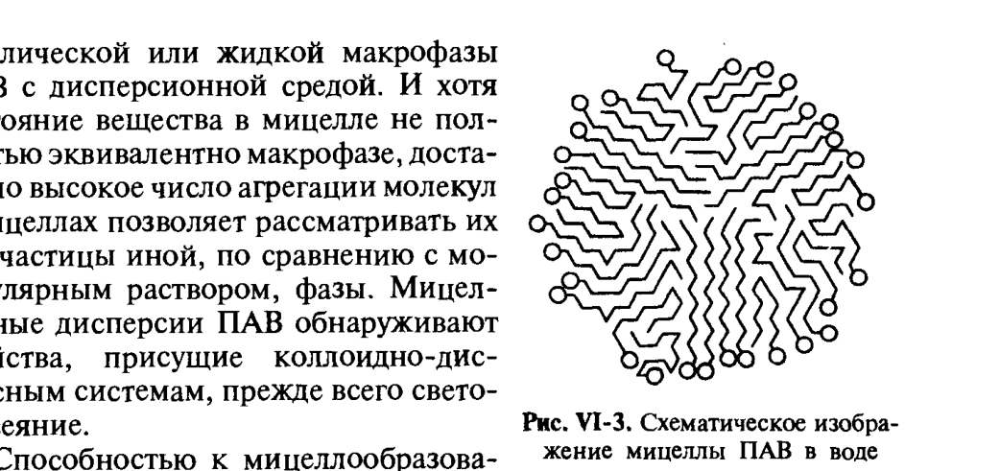
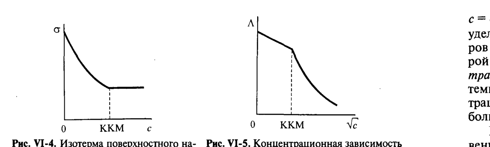

# Билет 27. Самоорганизация ПАВ в водных растворах. Критическая концентрация мицеллообразования (ККМ), методы её определения. Факторы, влияющие на ККМ

## Тема 1: Мицеллообразование в растворах ПАВ — общая картина

> [!note] Определение
> **Мицеллы** — коллоидные частицы, представляющие собой ассоциаты молекул ПАВ с числом агрегации (числом молекул в мицелле) $m=20\div100$ и более, существующие в растворе наряду с отдельными (молекулярно-растворёнными) молекулами ПАВ. Дисперсии таких мицелл в полярном растворителе (воде) — важнейший пример **термодинамически устойчивых лиофильных дисперсных систем** (см. [[билет_26]]).

### Строение прямой мицеллы

При образовании мицелл в полярном растворителе углеводородные цепи молекул ПАВ объединяются в **углеводородное ядро**, а гидратированные полярные группы, обращённые в сторону водной фазы, образуют **гидрофильную оболочку** (рис. VI-3).

*Рис. VI-3. Схематическое изображение мицеллы ПАВ в воде (Щукин, рис. VI-3)*

> [!important] Почему именно мицеллы, а не макрофаза
> Благодаря гидрофильности наружной оболочки, экранирующей углеводородное ядро от контакта с водой, поверхностное натяжение на границе мицелла–среда оказывается сниженным до значений $\sigma\le\sigma_c$ (см. [[билет_26]], критерий VI.4), что обусловливает термодинамическую устойчивость мицеллярных систем относительно макрофазы ПАВ.

### Не все ПАВ мицеллообразующие

Способностью к мицеллообразованию обладают не все ПАВ, а только те, которые имеют оптимальное соотношение между гидрофобной (углеводородный радикал) и гидрофильной (полярная группа) частями — это определяется **гидрофильно-липофильным балансом (ГЛБ)** (см. [[билет_25]]).

> [!example] Мицеллообразующие ПАВ (4-я группа по Ребиндеру)
> Натриевые и аммониевые соли жирных кислот с длиной цепи $C_{12-20}$, алкилсульфаты, алкилбензолсульфонаты и другие синтетические ионогенные и неионогенные ПАВ (см. [[билет_25]]).

> [!warning] Истинная растворимость ничтожна
> Истинная растворимость, т.е. равновесная концентрация молекулярно-растворённого вещества, для мицеллообразующих ПАВ невелика и составляет для ионогенных — сотые или тысячные доли кмоль/м³, а для неионогенных — может быть ещё на один-два порядка меньше.

### Факторы, определяющие размер и форму мицелл

Способность полярных групп **экранировать** углеводородное ядро от контакта с водой определяется не только собственными размерами полярных групп, но и их характером взаимодействия с растворителем (гидратируемостью). С уменьшением числа агрегации $m$ уменьшаются размеры мицелл, и (поскольку уменьшается отношение числа молекул в мицелле к её поверхности, т.е. числа полярных групп к площади поверхности) степень экранирования углеводородного ядра должна падать.

Допустим, что каждая полярная группа способна «экранировать» углеводородное ядро от контакта с водой на некоторой площади $s_{пг}$. Если принять, что углеводородное ядро мицеллы близко по плотности к объёмной фазе соответствующего углеводорода, то в сферической мицелле радиусом $r_1$, имеющей поверхность $S_1$, содержится $m=\dfrac{4\pi r_1^3}{3V_1}N_A$ молекул в мицелле (и столько же полярных групп), где $V_1$ — молярный объём соответствующего углеводорода. Тогда доля поверхности мицеллы, на которой углеводородная часть экранирована от контакта с водой:

$$
\frac{ms_{пг}}{S_1}=\frac{4\pi r_1^3 N_A s_{пг}}{3V_1\cdot4\pi r_1^2}=\frac{r_1 s_{пг} N_A}{3V_1}, \tag{раздел VI.2}
$$

и будет уменьшаться с уменьшением размера мицеллы. Отсюда можно оценить, в какой мере с уменьшением $r_1$ должно расти значение $\sigma$. «Среднее» эффективное значение удельной поверхностной энергии частицы $\sigma_{мицц}$ равно:

$$
\sigma_{мицц}\approx\sigma_0\left(1-\frac{r_1 s_{пг}N_A}{3V_1}\right), \tag{VI.11}
$$

где $\sigma_0$ — поверхностное натяжение неэкранированной части поверхности (близкое к межфазному натяжению углеводород–вода, $\sigma_0\sim30$ мДж/м², см. [[билет_22]]).

> [!important] Связь с оптимальным числом агрегации
> Соответственно, способность к мицеллообразованию обладают ПАВ, имеющие наряду с хорошо растворимым гидрофобным радикалом сильную полярную группу или несколько полярных групп, способных экранировать углеводородное ядро от достаточно большой площади. Поэтому термодинамически выгодно существование мицелл сферической формы с некоторым **оптимальным числом агрегации**, отвечающим коллоидным размерам с радиусом $r$, близким к длине углеводородной цепи $l_м$. Например, диаметр устойчивых мицелл олеата натрия составляет $\sim5$ нм, что отвечает числу агрегации молекул $m$ порядка нескольких десятков.

При попытке образования мицелл со значительно большими числами агрегации ($r\gg l_м$) сферическая форма термодинамически невыгодна (потребовала бы вхождения полярной группы в углеводородное ядро). Поэтому при дальнейшем росте содержания ПАВ число агрегации в мицеллах растёт за счёт **изменения формы**: переход к асимметричному строению (см. Тему 4).

---

## Тема 2: Критическая концентрация мицеллообразования (ККМ)

> [!note] Определение
> **Критическая концентрация мицеллообразования (ККМ)** — концентрация ПАВ $c_к$, выше которой в растворе начинают образовываться мицеллы, что сопровождается резким, скачкообразным изменением физико-химических свойств раствора (поверхностного натяжения, электропроводности, светорассеяния и др.).

### Качественная картина возникновения мицелл (рис. VI-6, VI-7)

С увеличением содержания ПАВ в системе при $c_0>$ ККМ ($c_0$ — общее содержание ПАВ) зависимость концентрации мицелл $c_{мицц}$ от концентрации молекулярно-растворённых молекул $c_м$ представляет собой **параболу очень высокой степени** (числа агрегации $m=20-100$); практически её можно рассматривать как кривую с изломом (рис. VI-6).

> [!important] Ключевая закономерность: ПАВ как «депо»
> До ККМ мицеллы практически отсутствуют, и всё растворённое ПАВ находится в молекулярной форме, т.е. $c_м\approx c_0$. При достижении ККМ в узкой области концентраций начинается образование мицелл — практически всё вновь вводимое вещество переходит в мицеллярное состояние, и величина $mc_{мицц}$ резко растёт (рис. VI-7), тогда как концентрация молекулярно-растворённого вещества $c_м$ возрастает лишь очень слабо и остаётся примерно равной ККМ.
>
> Таким образом, мицеллы являются своеобразным **депо** для поддержания практически неизменной молекулярной концентрации (и, соответственно, химического потенциала) ПАВ в растворе при его расходовании, например в процессах стабилизации золей, суспензий и эмульсий, при использовании ПАВ как компонентов моющих средств (см. [[билет_45]], [[билет_51]]).

Можно ввести величину **степени мицеллизации** $\alpha_{мицц}=mc_{мицц}/c_0$: до ККМ $\alpha_{мицц}\approx0$, выше ККМ резко возрастает и стремится к 1.

### Резкое изменение свойств вблизи ККМ (рис. VI-4, VI-5)

> [!example] Экспериментальные проявления ККМ
> Поскольку поверхностное натяжение раствора $\sigma$ определяется концентрацией ПАВ в молекулярной форме, становится понятной практическая неизменность $\sigma$ выше ККМ. В соответствии с уравнением Гиббса $d\sigma=-\Gamma d\mu$ (см. [[билет_17]]), условию $\sigma=\text{const}$ отвечает практическая независимость химического потенциала от концентрации при $c_0>$ ККМ ($d\mu\approx0$). Изотермы поверхностного натяжения вместо плавного хода, описываемого уравнением Шишковского (см. [[билет_19]]), обнаруживают **излом** при $c=c_к$ (рис. VI-4), при дальнейшем росте концентрации значения $\sigma$ остаются практически неизменными.
>
> Аналогично при $c=c_к$ излом появляется и на кривых концентрационной зависимости удельной и эквивалентной ($\Lambda$) электрической проводимости растворов ионогенных ПАВ (рис. VI-5).

*Рис. VI-4 (изотерма $\sigma(c)$) и Рис. VI-5 (зависимость $\Lambda(\sqrt{c})$) — резкое изменение свойств при $c=$ ККМ (Щукин)*

> [!note] До ККМ — раствор близок к идеальному
> Можно сказать, что до ККМ раствор ПАВ близок по свойствам к идеальному, а выше ККМ начинает предельно резко отличаться по свойствам от идеального — за счёт мицеллообразования.

---

## Тема 3: Методы определения ККМ

> [!important] Принцип всех методов
> Резкое изменение свойств системы ПАВ–вода вблизи ККМ позволяет по точкам излома концентрационных зависимостей многих физико-химических величин с большой точностью определять значения ККМ.

| Метод | Измеряемая величина | Характер зависимости от $c$ |
|---|---|---|
| Тензиометрия (поверхностное натяжение) | $\sigma(c)$ | плавное падение по уравнению Шишковского до $c_к$, затем плато (рис. VI-4) |
| Кондуктометрия (для ионогенных ПАВ) | удельная и эквивалентная электропроводность $\varkappa(c)$, $\Lambda(\sqrt{c})$ | излом наклона при $c=c_к$ (рис. VI-5) |
| Светорассеяние (нефелометрия) | мутность раствора | резкий рост светорассеяния выше $c_к$ — появление коллоидной фазы (мицелл) |
| Спектральные методы (солюбилизация красителей) | спектр поглощения красителя-зонда | сдвиг максимума поглощения при переходе красителя в углеводородное ядро мицелл (см. [[билет_30]]) |
| Калориметрия | теплота разбавления | излом при $c=c_к$, связан с $\Delta H_{мицц}$ (см. Тему 5, [[билет_28]]) |

> [!example] Светорассеяние как индикатор
> С увеличением содержания ПАВ в растворе выше некоторой критической концентрации $c_к$ наблюдается заметный рост светорассеяния, указывающий на возникновение новой коллоидно-дисперсной фазы (мицелл).

---

## Тема 4: Концентрированные дисперсии мицеллообразующих ПАВ — изменение формы мицелл

В широком интервале концентраций выше ККМ молекулы ПАВ объединяются в сферические мицеллы, так называемые **мицеллы Гартли–Ребиндера**. Их углеводородное ядро жидкоподобно, хотя и отличается от жидкой объёмной фазы соответствующего углеводорода (например, капель эмульсий) — на жидкоподобное состояние ядра указывает образование смешанных мицелл с различными добавками, а также растворение в гидрофобных ядрах мицелл жидких углеводородов, не растворимых в воде (явление **солюбилизации**, см. [[билет_30]]).

> [!important] Эволюция формы мицелл с ростом концентрации
> С ростом содержания ПАВ в растворе при $c_0>$ ККМ наряду с увеличением концентрации сферических мицелл постепенно происходит изменение их формы. Сферические мицеллы превращаются в анизометричные — эллипсоидальные, а затем цилиндрические (палочкообразные), ленточные и пластинчатые мицеллы с резко выраженной асимметрией; в таких мицеллах углеводородные цепи располагаются всё более упорядоченно (параллельно друг другу). Каждому значению концентрации отвечает термодинамическое равновесие:
> $$
> \text{сферические мицеллы}\rightleftharpoons\text{анизометричные мицеллы}\rightleftharpoons\text{ленточные мицеллы}.
> $$

> [!example] Мицеллы Мак-Бена и жидкие кристаллы
> Появление в растворе анизометричных коллоидных частиц, существование которых впервые предположил Мак-Бен, фиксируется оптическими, рентгенографическими и реологическими методами (отклонения от уравнения Ньютона при течении, см. [[билет_56]]). Поверхностные свойства анизометричных (особенно ленточных) мицелл неодинаковы на разных участках: на плоских участках плотность полярных групп выше, чем на концевых, поэтому концевые участки проявляют большую гидрофильность.
>
> При дальнейшем увеличении содержания ПАВ (или уменьшении подвижности мицелл) происходит их сцепление концевыми участками с образованием объёмной сетки — **коагуляционной структуры (геля)** с характерными свойствами: пластичностью, прочностью, тиксотропией (см. [[билет_58]]).
>
> Системы с упорядоченным расположением молекул, обладающие оптической анизотропией и механическими свойствами, промежуточными между истинными жидкостями и твёрдыми телами, называют **жидкими кристаллами**.

### Полная схема состояний системы ПАВ–вода

$$
\text{истинный раствор}\rightleftharpoons\text{сферические мицеллы}\rightleftharpoons\text{анизометричные мицеллы}\rightleftharpoons\text{гель}\rightleftharpoons\text{кристаллы в растворе}
$$

> [!tip] Мнемоника — «лестница состояний»
> При повышении концентрации ПАВ система последовательно проходит ступени: молекулярный раствор → сферические мицеллы → анизометричные (палочки, ленты) → гель (коагуляционная структура) → кристаллогидраты. При разбавлении (обратный переход) кристаллы мыла набухают, и происходит самопроизвольное диспергирование частиц через стадию геля обратно к мицеллярным системам — иллюстрация термодинамической обратимости лиофильных систем (см. [[билет_26]]).

> [!note] Стадийность плавления мицеллообразующих ПАВ
> Характерной чертой мицеллообразующих ПАВ (в частности, мыл) является стадийный характер их плавления — между низкотемпературным кристаллическим состоянием и высокотемпературным гомогенным (жидкость) возникает 4–5 (а иногда и больше) промежуточных фаз: кристаллическая, суперкристаллическая, предвосковая, восковая, суперв осковая, предпросвечивающая, просвечивающая и затем изотропный расплав.

---

## Тема 5: Факторы, влияющие на ККМ

> [!important] Главные факторы (для экзамена)
>
> 1. **Длина углеводородного радикала.** Внутри гомологического ряда ККМ уменьшается в **3–3.5 раза** при удлинении цепи на одну $\text{CH}_2$-группу при переходе к каждому последующему гомологу — прямое следствие правила Дюкло–Траубе (см. [[билет_21]], [[билет_22]]) и роста гидрофобного эффекта.
> 2. **Природа и заряд полярной группы (ионогенность).** Ионогенные ПАВ имеют значительно более высокие ККМ ($10^{-3}-10^{-1}$ кмоль/м³), чем неионогенные (на 1–2 порядка ниже) — из-за электростатического отталкивания одноимённо заряженных полярных групп при сближении в мицелле, препятствующего мицеллообразованию.
> 3. **Концентрация и природа электролита** (для ионогенных ПАВ). Добавление электролита с одноимённым ПАВ ионом снижает ККМ (экранирование зарядов полярных групп облегчает их сближение в мицелле) — см. формулу VI.10 ниже.
> 4. **Температура.** Для ионогенных ПАВ — точка Крафта, ниже которой мицеллообразование не наблюдается (см. [[билет_28]]); для неионогенных — точка помутнения (см. [[билет_29]]).
> 5. **Добавки органических веществ** (низшие спирты и др.) — могут как затруднять, так и (в малых количествах) облегчать мицеллообразование, понижая ККМ (см. [[билет_30]], [[билет_31]]).

### Формальное описание влияния электролита на ККМ для ионогенных ПАВ

Для ионогенных ПАВ можно считать, что вследствие ионизации части полярных групп на поверхности мицеллы возникает $n$ зарядов, так что реакция равновесия (для анионного ПАВ, образующего при диссоциации однозарядные катионы $K^+$) записывается как:

$$
(\text{ПАВ}_m)^{n-}\rightleftharpoons m[\text{ПАВ}]^- + (m-n)K^+.
$$

Условие равновесия:

$$
c_{мицц}=K_{мицц}\,c_м^m\,c_{зл}^{(m-n)}, \tag{VI.10}
$$

где $c_{зл}$ — концентрация ионов $K^+$ в растворе, которые могут входить не только в состав ПАВ, но и постороннего электролита с одноимённым ионом. Это позволяет описать влияние электролитов на ККМ как:

$$
\lg\text{ККМ}=k-\frac{m-n}{m}\lg c_{зл}=k-\gamma\lg c_{зл},
$$

где $\gamma=(m-n)/m$ — степень связывания ионов поверхностью мицеллы.

> [!note] Расшифровка обозначений
> - $m$ — число агрегации (число молекул ПАВ в мицелле);
> - $n$ — число зарядов на поверхности мицеллы (после диссоциации части полярных групп);
> - $c_{мицц}, c_м$ — концентрации мицелл и молекулярно-растворённого ПАВ;
> - $K_{мицц}$ — константа равновесия процесса мицеллообразования;
> - $\gamma$ — степень связывания противоионов поверхностью мицеллы (доля от $m$).

> [!warning] Частая путаница
> Не путать **ККМ** (концентрацию ПАВ, при которой начинается мицеллообразование) и **точку Крафта**/**точку помутнения** (температурные границы, ниже/выше которых мицеллообразование невозможно или система расслаивается). ККМ — концентрационная характеристика при заданной температуре; точка Крафта и точка помутнения — температурные характеристики при заданной (обычно $\ge$ ККМ) концентрации. Подробно — [[билет_28]] (точка Крафта), [[билет_29]] (точка помутнения).

---

## Источники

- Щукин Е.Д., Перцов А.В., Амелина Е.А. Коллоидная химия, 3-е изд. — раздел VI.2 «Мицеллообразование в растворах ПАВ», с. 242–250 (строение мицелл, формула VI.11, ККМ, рис. VI-3, VI-4, VI-5, методы определения ККМ, эволюция формы мицелл, формула VI.10).
- Дополнение (общеизвестные сведения, не из Щукина): сводная таблица методов определения ККМ — стандартный материал курсов коллоидной химии и физической химии поверхностных явлений.
