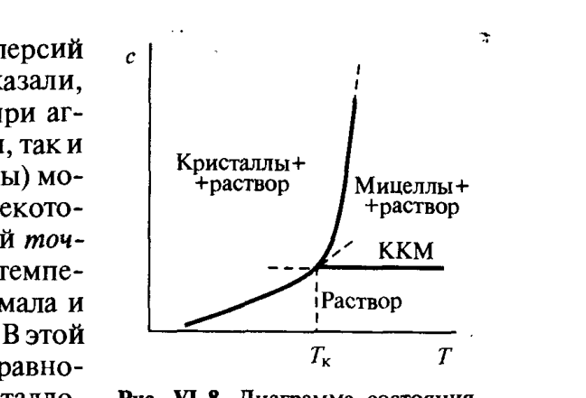

# Билет 28. Двойная фазовая диаграмма для системы ионогенное ПАВ – вода. Точка Крафта. Свободная энергия Гиббса мицеллообразования для ионогенных ПАВ. Гидрофобный эффект при мицеллообразовании ПАВ в водных растворах

## Тема 1: Термодинамика мицеллообразования — общие соотношения

> [!note] Постановка задачи
> В термодинамически устойчивых системах, содержащих мицеллообразующие ПАВ, существует равновесие дисперсной фазы (мицелл) с молекулярным раствором ПАВ, а в условиях насыщения и с макрофазой (см. [[билет_26]], [[билет_27]]).

Рассмотрим равновесие между мицеллами, содержащими $m$ молекул ПАВ ($m$ — число агрегации) и молекулярным раствором ПАВ. Пусть в единице объёма системы содержится $c_м$ молей молекулярно-растворённого ПАВ и $n_{мицц}$ мицелл, т.е. $c_{мицц}=n_{мицц}/N_A$ молей мицелл; тогда общее содержание ПАВ в растворе $c_0=c_м+mc_{мицц}$.

Используя квазихимический подход, процесс самоорганизации молекулярно-растворённого ПАВ в мицеллы можно описать подобно химической реакции. Для **простейшего случая неионогенного ПАВ**:

$$
m[\text{ПАВ}]\rightleftharpoons(\text{ПАВ}_m).
$$

В соответствии с законом действия масс:

$$
c_{мицц}=K_{мицц}\,c_м^m,
$$

где $K_{мицц}$ — константа равновесия процесса мицеллообразования.

> [!important] Связь $\Delta G_{мицц}$ с $K_{мицц}$
> В соответствии с общими принципами термодинамики, константа равновесия процесса мицеллообразования $K_{мицц}$ связана с изменением энергии Гиббса $\Delta\mathscr{G}_{мицц}$ в этом процессе соотношением:
> $$
> \Delta\mathscr{G}_{мицц}=-\frac{RT}{m}\ln K_{мицц}
> $$
> в расчёте на 1 моль ПАВ, находящегося в мицеллярной форме.

Следует иметь в виду, что ККМ отвечает концентрации раствора ПАВ, при которой появляется экспериментально обнаруживаемое количество мицелл $c_{мицц}^*$, так что $K_{мицц}=c_{мицц}^*/\text{ККМ}^m$. Тогда, выражая $c_{мицц}^*$ и ККМ в мольных долях, для $\Delta\mathscr{G}_{мицц}$ можно записать:

$$
\Delta\mathscr{G}_{мицц}=-\frac{RT}{m}(\ln c_{мицц}^*-m\ln\text{ККМ})=-RT\left(\frac{\ln c_{мицц}^*}{m}-\ln\text{ККМ}\right).
$$

Поскольку первое слагаемое в скобках, как правило, мало по сравнению со вторым, пренебрегая им, получаем главную рабочую формулу:

> [!important] Основная формула $\Delta G_{мицц}$ (неионогенные ПАВ)
> $$
> \Delta\mathscr{G}_{мицц}\approx RT\ln\text{ККМ}.
> $$

Соответственно энтальпию мицеллообразования $\Delta\mathscr{H}_{мицц}$ можно выразить как:

$$
\Delta\mathscr{H}_{мицц}=\frac{\partial(\Delta\mathscr{G}_{мицц}/T)}{\partial(1/T)}=-RT^2\frac{d\ln\text{ККМ}}{dT}.
$$

> [!note] Расшифровка обозначений
> - $m$ — число агрегации (число молекул ПАВ в мицелле);
> - $K_{мицц}$ — константа равновесия мицеллообразования;
> - $c_{мицц}, c_м, c_{мицц}^*$ — концентрации мицелл, молекулярно-растворённого ПАВ и «экспериментально обнаруживаемых» мицелл соответственно;
> - $\text{ККМ}$ — критическая концентрация мицеллообразования (в мольных долях для термодинамических формул);
> - $\Delta\mathscr{G}_{мицц}, \Delta\mathscr{H}_{мицц}, \Delta\mathscr{S}_{мицц}$ — энергия Гиббса, энтальпия и энтропия мицеллообразования (на 1 моль ПАВ в мицеллярной форме).

Экспериментальное определение ККМ (см. [[билет_27]]) позволяет рассчитать величину $\Delta\mathscr{G}_{мицц}$, а изучение температурной зависимости ККМ — определить $\Delta\mathscr{H}_{мицц}$ и энтропию мицеллообразования $\Delta\mathscr{S}_{мицц}$. Сопоставление этих величин позволяет получить ценные сведения о природе процессов, ведущих к мицеллообразованию.

> [!example] Экспериментальные значения $\Delta H_{мицц}$
> Многочисленные экспериментальные исследования мицеллообразования широкого круга ПАВ показали, что значения $\Delta\mathscr{H}_{мицц}$ обычно малы и могут быть положительными, но при этом, как правило, $|\mathscr{H}_{мицц}|<|T\Delta\mathscr{S}_{мицц}|$. Поскольку объединение многих молекул в одну мицеллу должно сопровождаться падением энтропии системы, малые (а тем более положительные) значения $\Delta\mathscr{H}_{мицц}$ свидетельствуют о том, что есть ещё один фактор, также энтропийной природы, содействующий процессу мицеллообразования — **гидрофобный эффект** (Тема 4).

---

## Тема 2: Уравнение для ионогенных ПАВ и формула VI.10

Для **ионогенных ПАВ** можно считать, что вследствие ионизации части полярных групп на поверхности мицеллы возникает $n$ зарядов, так что реакция равновесия (для анионного ПАВ, образующего при диссоциации однозарядные катионы $K^+$) записывается как:

$$
(\text{ПАВ}_m)^{n-}\rightleftharpoons m[\text{ПАВ}]^-+(m-n)K^+.
$$

Тогда условие равновесия:

$$
c_{мицц}=K_{мицц}\,c_м^m\,c_{зл}^{(m-n)}, \tag{VI.10}
$$

где $c_{зл}$ — концентрация ионов $K^+$ в растворе, которые могут входить не только в состав ПАВ, но и постороннего электролита с одноимённым ионом.

> [!important] $\Delta G_{мицц}$ для ионогенных ПАВ
> Поскольку при мицеллообразовании ионогенных ПАВ в растворе участвуют **два сорта ионов** (амфифильный ион ПАВ и противоион), выражение для свободной энергии мицеллообразования модифицируется и приобретает дополнительный вклад от связывания противоионов:
> $$
> \Delta\mathscr{G}_{мицц}\approx RT(1+\beta)\ln\text{ККМ},
> $$
> где $\beta=(m-n)/m=\gamma$ — степень связывания противоионов поверхностью мицеллы (доля противоионов, нейтрализующих заряд мицеллы, $0\le\beta\le1$). Это позволяет описать влияние электролитов на ККМ как:
> $$
> \lg\text{ККМ}=k-\gamma\lg c_{зл},
> $$
> где $k$ — константа, $\gamma$ — степень связывания ионов поверхностью мицеллы (см. [[билет_27]]).

> [!warning] Частая путаница
> Для **неионогенных ПАВ** $\Delta\mathscr{G}_{мицц}\approx RT\ln\text{ККМ}$ (один сорт частиц переходит из раствора в мицеллу). Для **ионогенных ПАВ** в выражении появляется дополнительный множитель $(1+\beta)$ или $(1+\gamma)$, отражающий тот факт, что вместе с амфифильными ионами в мицеллу «уходят» (адсорбируются на её поверхности) и противоионы, уменьшая электростатическое отталкивание одноимённо заряженных полярных групп.

---

## Тема 3: Двойная фазовая диаграмма ионогенное ПАВ – вода. Точка Крафта

> [!note] Определение
> **Точка Крафта** $T_к$ — температура, ниже которой растворимость кристаллического (кристаллогидратного) ПАВ мала и оказывается **меньше ККМ**; в этой области температур мицеллообразование не наблюдается, и в системе существует равновесие между кристаллами (кристаллогидратами) ПАВ и истинным (молекулярным) раствором, концентрация которого растёт с ростом температуры.

*Рис. VI-8. Диаграмма состояния системы мицеллообразующее ПАВ – вода (Щукин, рис. VI-8)*

### Анализ диаграммы (рис. VI-8)

Диаграмма состояния в координатах концентрация ПАВ $c$ — температура $T$ содержит три области:

| Область диаграммы | Описание |
|---|---|
| Ниже кривой растворимости, левее $T_к$ | **«Кристаллы + раствор»** — равновесие кристаллогидратов ПАВ с истинным (молекулярным) раствором; концентрация раствора растёт с температурой по кривой растворимости |
| Полоса ниже линии ККМ, выше $T_к$ | **«Раствор»** — истинный молекулярный раствор ПАВ ($c<$ ККМ), мицелл нет |
| Выше линии ККМ, правее $T_к$ | **«Мицеллы + раствор»** — равновесие сферических (или иной формы) мицелл с молекулярным раствором при $c\approx$ ККМ |

Точка пересечения кривой растворимости с линией ККМ определяет **точку Крафта** $T_к$ — именно при этой температуре кривая растворимости кристаллов пересекает горизонтальную линию ККМ.

> [!important] Физический смысл точки Крафта
> Ниже $T_к$ растворимость ПАВ мала и оказывается меньше ККМ. В этой области температур существует равновесие между кристаллами (кристаллогидратами) мыла и истинным раствором ПАВ, концентрация которого растёт по мере роста температуры. Поэтому в растворах ПАВ, для которых точка Крафта лежит в области повышенных температур (выше $50-80°C$), в обычных условиях мицеллообразование не наблюдается.

### Поведение вблизи точки Крафта

В результате возникновения мицелл общая концентрация ПАВ резко возрастает. Поскольку истинная (молекулярная) растворимость ПАВ определяется значением ККМ и практически не меняется, увеличение содержания ПАВ в растворе обусловлено ростом числа мицелл. При этом мицеллярная растворимость резко растёт с температурой.

> [!example] Непрерывный переход вблизи точки Крафта
> Поэтому вблизи точки Крафта возможен непрерывный переход от чистого растворителя и истинного раствора к мицеллярному раствору и через мицеллярную систему к различного типа жидкокристаллическим системам и набухшим кристаллам ПАВ (см. [[билет_27]], с. 252).

> [!warning] Частая путаница: точка Крафта vs точка помутнения
> **Точка Крафта** характерна для **ионогенных** ПАВ — это нижняя температурная граница мицеллообразования (ниже неё мицеллы не образуются из-за низкой растворимости кристаллов). **Точка помутнения** характерна для **неионогенных** ПАВ — это верхняя температурная граница, выше которой система расслаивается на две фазы из-за дегидратации полярных групп при нагревании. Подробно точка помутнения рассмотрена в [[билет_29]].

---

## Тема 4: Гидрофобный эффект при мицеллообразовании ПАВ в водных растворах

> [!note] Определение
> **Гидрофобный эффект** — совокупность термодинамических явлений, связанных с пребыванием неполярных (углеводородных) групп в водном окружении: невыгодность их растворения в воде, выталкивание на межфазные границы, объединение друг с другом (мицеллообразование), обусловленных не столько прямым взаимодействием неполярных групп между собой, сколько **перестройкой структуры воды** (подробное изложение механизма — [[билет_22]]).

### Механизм гидрофобного эффекта применительно к мицеллообразованию

В [[билет_22]] подробно рассмотрено, что выход неполярной (углеводородной) группы из объёма воды сопровождается ростом энтропии системы за счёт разрушения «айсберговых» структур вокруг углеводородных цепей.

> [!important] Применение к мицеллообразованию (ключевой момент билета)
> Подобно процессу адсорбции (см. [[билет_22]]), процесс мицеллообразования также имеет **энтропийную природу** и связан с гидрофобными взаимодействиями углеводородных цепей с водой: **объединение углеводородных цепей молекул ПАВ в мицеллу ведёт к росту энтропии** из-за разрушения структуры воды вокруг исчезнувших полостей, в которых ранее находились разрозненные углеводородные радикалы.

Именно поэтому, как отмечалось в Теме 1, малые (или даже положительные) значения $\Delta\mathscr{H}_{мицц}$ при $|\mathscr{H}_{мицц}|<|T\Delta\mathscr{S}_{мицц}|$ свидетельствуют о доминирующем вкладе энтропийного фактора, связанного с гидрофобным эффектом.

> [!example] Аналогия трёх процессов
> Те же закономерности правила Дюкло–Траубе (см. [[билет_21]]), что и для поверхностной активности ($G$, $A$ растут в 3–3.5 раза при удлинении цепи на $\text{CH}_2$), наблюдаются и для ККМ:
>
> | Свойство | Изменение при удлинении цепи на $\text{CH}_2$ | Причина |
> |---|---|---|
> | Поверхностная активность $G$, $A$ | растёт в 3–3.5 раза | каждая $\text{CH}_2$-группа добавляет $\varphi_1\approx3$ кДж/моль к выигрышу при выходе из воды (см. [[билет_22]]) |
> | Растворимость в воде | уменьшается в 3–3.5 раза | растворение требует размещения цепи в воде — энтропийно невыгодно |
> | ККМ | уменьшается в 3–3.5 раза | мицеллообразование — тоже «уход» цепей из воды |

> [!tip] Мнемоника
> «Вода не любит хвосты» (см. [[билет_22]]) — каждая попытка спрятать углеводородный хвост от воды (на поверхность при адсорбции, в мицеллу при мицеллообразовании, в масляную каплю при солюбилизации, см. [[билет_30]], [[билет_31]]) даёт системе небольшой, но систематический выигрыш в энтропии. Этим объясняется единая природа адсорбции ПАВ, мицеллообразования и солюбилизации.

> [!warning] Частая путаница
> Гидрофобный эффект — это **не прямое притяжение** неполярных групп друг к другу (как ван-дер-ваальсово притяжение, см. [[билет_04]], [[билет_05]]), а в первую очередь следствие **поведения воды как растворителя**. Прямое вандерваальсово притяжение между углеводородными цепями существует, но энергетически часто второстепенно по сравнению с энтропийным вкладом структурных перестроек воды (подробнее — [[билет_22]]).

---

## Источники

- Щукин Е.Д., Перцов А.В., Амелина Е.А. Коллоидная химия, 3-е изд. — раздел VI.2.1 «Термодинамика мицеллообразования», с. 245–249 (термодинамика мицеллообразования, формулы для $\Delta G_{мицц}$, $\Delta H_{мицц}$, формула VI.10 для ионогенных ПАВ, рис. VI-8 — диаграмма состояния и точка Крафта, точка помутнения).
- Щукин и др., раздел II.2 «Адсорбция растворимых ПАВ», с. 92–95 (исходное обоснование гидрофобного эффекта — полное изложение в [[билет_22]]).
- Дополнение (общеизвестные сведения, не из Щукина): для ионогенных ПАВ типичные значения точки Крафта приводятся в справочной литературе по поверхностно-активным веществам — например, для додецилсульфата натрия $T_к\approx8-16°C$ (зависит от противоиона и примесей).
