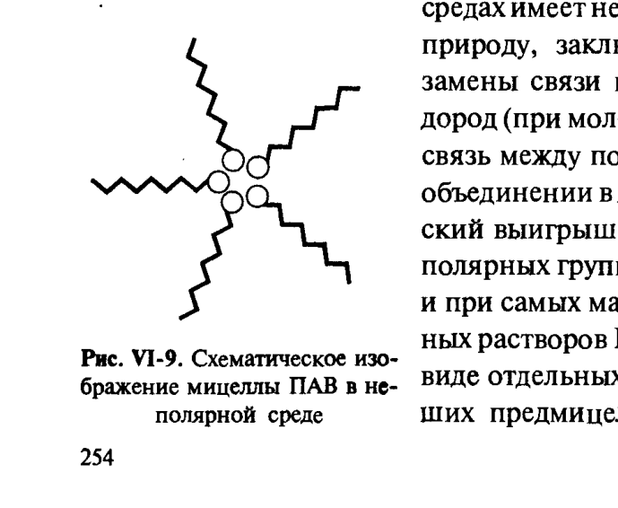
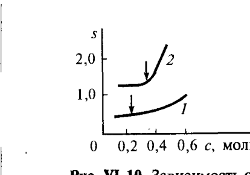
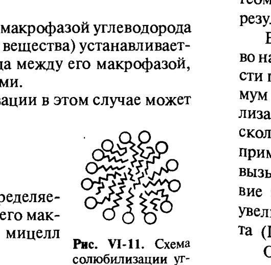

# Билет 30. Мицеллообразование в неполярных средах; механизм самоорганизации ПАВ. Солюбилизация

## Тема 1: Мицеллообразование в неводных (неполярных) средах

> [!note] Определение — обратные мицеллы
> Аналогично тому как в водных растворах ПАВ возникают **прямые мицеллы** с ориентацией полярных групп в сторону водной фазы (см. [[билет_27]]), в растворах ПАВ в углеводородах могут образовываться мицеллы с **противоположной ориентацией молекул** — **обратные (олеофобные) мицеллы**: полярные группы объединяются в гидрофильное (олеофобное) ядро, а углеводородные радикалы, обращённые в сторону родственной им неполярной среды, образуют олеофильную оболочку, экранирующую внутреннюю гидрофильную часть мицеллы от контакта с углеводородной средой.

*Рис. VI-9. Схематическое изображение мицеллы ПАВ в неполярной среде (обратная мицелла) (Щукин, рис. VI-9)*

### Сравнение прямых и обратных мицелл

| Признак | Прямая мицелла (вода) | Обратная мицелла (неполярная среда) |
|---|---|---|
| Ядро мицеллы | углеводородное (гидрофобное) | полярное (олеофобное), часто содержит воду |
| Оболочка мицеллы | гидрофильные полярные группы | олеофильные углеводородные радикалы |
| Растворимость ПАВ | растворим в воде, нерастворим в неполярной среде | растворим в неполярной среде, нерастворим в воде |
| Число агрегации $m$ | обычно 20–100 | значительно ниже, чем в прямых мицеллах |
| Природа выгоды мицеллообразования | энтропийная (гидрофобный эффект, см. [[билет_22]], [[билет_28]]) | энергетическая («силовая») — см. ниже |

> [!warning] ПАВ нерастворимы «по другую сторону»
> ПАВ, образующие устойчивые мицеллы в неполярных растворителях, как правило, нерастворимы в воде; баланс гидрофильных и олеофильных свойств их молекул резко сдвинут в сторону олеофильности. Число агрегации $m$ молекул в обратных мицеллах значительно ниже, чем в прямых мицеллах.

### Условия мицеллообразования в неполярных средах

> [!important] Требование к растворителю
> Для мицеллообразования в неводных средах существенна роль полярности (неполярности) растворителя, определяющая интенсивность взаимодействия его молекул с полярной и неполярной частями дифильных молекул ПАВ. Для мицеллообразования необходимо, чтобы среда являлась **«хорошим растворителем» только для углеводородных радикалов**.
>
> В средах, одинаково родственных обеим частям дифильных молекул ПАВ, мицеллообразование не происходит, и ПАВ обнаруживают в таких средах только истинную растворимость. Примером таких сред могут служить низшие спирты, которые являются хорошими растворителями и для полярной, и для неполярной частей молекул ПАВ (см. также [[билет_30]] — Тема 3, влияние спиртов на солюбилизацию и мицеллообразование).

### Энергетическая («силовая») природа мицеллообразования в неполярных средах

> [!important] Принципиальное отличие от водных систем (ключевой момент билета)
> В отличие от водной среды, мицеллообразование в неполярных средах имеет **не энтропийную, а «силовую» природу**, заключающуюся в выгодности замены связи полярная группа – углеводород (при молекулярном растворении в неполярной среде) на связь между полярными группами при их объединении в ядро мицеллы.

Энергетический выигрыш системы при объединении полярных групп настолько существен, что и при самых малых концентрациях истинных растворов ПАВ может находиться не в виде отдельных молекул, а в виде небольших предмицеллярных ассоциатов.

> [!note] Расшифровка механизма
> При молекулярном растворении ПАВ в неполярной среде полярные группы вынуждены контактировать с неполярными молекулами растворителя — энергетически невыгодный контакт (полярная группа – углеводород). При объединении молекул ПАВ в обратную мицеллу полярные группы оказываются в контакте друг с другом (полярная группа – полярная группа), что энергетически выгоднее. Этот выигрыш энергии межмолекулярного взаимодействия (а не выигрыш энтропии, как в водных системах) и движет процессом мицеллообразования в неполярных средах.

> [!warning] Частая путаница
> Не путать движущие силы мицеллообразования в водных и неполярных средах:
> - **Вода** (прямые мицеллы): главная движущая сила — **энтропийный гидрофобный эффект** (рост энтропии воды при удалении углеводородных цепей из водного окружения, см. [[билет_22]], [[билет_28]]).
> - **Неполярная среда** (обратные мицеллы): главная движущая сила — **энергетический («силовой») выигрыш** при замене невыгодных контактов полярная группа–углеводород на выгодные контакты полярная группа–полярная группа.

---

## Тема 2: Солюбилизация — определение и виды

> [!note] Определение
> **Солюбилизация** — включение в состав мицелл третьего компонента, нерастворимого или слаборастворимого в дисперсионной среде, но способного проникать в ядро (или оболочку) мицеллы. Различают **прямую солюбилизацию** (в водных дисперсиях ПАВ — растворение неполярных веществ в углеводородном ядре прямой мицеллы) и **обратную солюбилизацию** (в углеводородных системах — растворение полярных веществ, например воды, в полярном ядре обратной мицеллы).

### Влияние третьего компонента на мицеллообразование

> [!important] Двойственное влияние добавок
> Введение в систему третьего компонента может в зависимости от его природы либо **затруднять** мицеллообразование, либо (что наблюдается чаще) **способствовать** этому процессу.
>
> - Введение в водный раствор ПАВ значительных количеств **полярных органических веществ** (например, низших спиртов) увеличивает молекулярную растворимость ПАВ и вследствие этого **затрудняет мицеллообразование**.
> - Введение этих же веществ, но в **малых количествах**, и особенно добавление **неполярных углеводородов**, приводит к некоторому понижению ККМ, т.е. **облегчает мицеллообразование**. При этом существенно изменяется строение мицелл: внедрённый в качестве добавки третий компонент входит в состав мицеллы.

> [!example] Иллюстрация — растворимость октана
> Растворимость углеводородов в воде очень мала и составляет, например, для октана 0,0015 %. Вместе с тем в 10%-ном растворе олеата натрия может быть растворено 2 % октана, т.е. эффективное значение растворимости этого углеводорода возрастает более чем на три порядка — за счёт солюбилизации в мицеллах олеата натрия.

### Количественная характеристика — относительная солюбилизация

**Относительная солюбилизация** $s$ — отношение числа молей солюбилизированного вещества $N_{сол}$ к числу молей ПАВ, находящегося в мицеллярном состоянии $N_{мицц}$:

$$
s=N_{сол}/N_{мицц}.
$$

*Рис. VI-10. Зависимость относительной солюбилизации $s$ октана (кривая 1) и циклогексана (кривая 2) от концентрации олеата натрия выше ККМ (Щукин, рис. VI-10)*

> [!example] Поведение $s$ выше ККМ (рис. VI-10)
> При концентрациях ПАВ, соответствующих области существования сферических мицелл (отмечены стрелочками), величина относительной солюбилизации углеводородов **постоянна**. Например, при температурах $6-20°C$ солюбилизация составляет для октана $\sim0.5$ моль, а для циклогексана $\sim1.2$ моль углеводорода на моль мицеллообразующего ПАВ.
>
> При более высоких концентрациях ПАВ, соответствующих области существования в растворе анизометричных мицелл (см. [[билет_27]]), происходит **резкий рост относительной солюбилизации**, который сопровождается изменением строения мицелл: анизометричные мицеллы снова превращаются в сферические.

> [!note] Геометрический эффект солюбилизации
> При этом, в присутствии углеводорода, сферические мицеллы могут иметь диаметр, превышающий удвоенную длину цепи молекулы ПАВ, поскольку сердцевина мицеллы заполняется углеводородом (рис. VI-11).

*Рис. VI-11. Схема солюбилизации углеводорода в прямой мицелле (Щукин, рис. VI-11)*

---

## Тема 3: Распределение солюбилизата и температурная зависимость

### Два режима солюбилизации

> [!important] Распределение солюбилизируемого вещества между мицеллами и молекулярным раствором
> Распределение солюбилизируемого вещества между мицеллами и молекулярным раствором в условиях, когда нет избытка этого вещества (нет контакта с объёмной углеводородной фазой), определяется работой выхода молекул углеводорода из воды в ядро мицеллы.
>
> При контакте мицеллярного раствора с **макрофазой углеводорода** (при наличии избытка солюбилизируемого вещества) устанавливается равновесное распределение углеводорода между его макрофазой, истинным водным раствором и мицеллами.

### Температурная зависимость солюбилизации

Температурная зависимость солюбилизации в этом случае может быть описана соотношением:

$$
\frac{d\ln s}{dT}=\frac{\Delta H_{сол}}{RT^2},
$$

где $\Delta H_{сол}$ — энтальпия солюбилизации, определяемая энергетикой перехода углеводорода из его макрофазы в мицеллы и перестройкой самих мицелл при солюбилизации.

> [!note] Расшифровка обозначений
> - $s$ — относительная солюбилизация (моль солюбилизата на моль ПАВ в мицеллярной форме);
> - $\Delta H_{сол}$ — энтальпия солюбилизации;
> - $T$ — абсолютная температура; $R$ — универсальная газовая постоянная.

### Экспериментальные методы наблюдения солюбилизации

> [!example] Спектральные и реологические методы
> - **Реологические методы**: при росте относительной солюбилизации наблюдается резкое (иногда на два порядка) понижение вязкости раствора — переход от анизометричных мицелл к сферическим придаёт системе ньютоновское реологическое поведение (см. [[билет_56]]).
> - **Спектральные методы (солюбилизация красителей)**: при малых концентрациях ПАВ (ниже ККМ), когда краситель находится в водной фазе, спектр поглощения раствора отвечает поглощающей способности красителя в водной среде (например, для родамина 6G максимум поглощения наблюдается при 590 нм). Выше ККМ практически весь краситель солюбилизируется и меняет спектр поглощения на характерный для углеводородной среды (полоса 590 нм исчезает, раствор меняет малиновый цвет на оранжевый). Это позволяет по изменению спектральных характеристик раствора при переходе через ККМ определять её значение, а также доказывает, что краситель локализуется в углеводородном ядре мицеллы (методом ЯМР — наблюдение подвижности протонов воды в ядрах обратных мицелл при обратной солюбилизации).

### Солюбилизация полярных органических веществ

> [!important] Особый случай — солюбилизация полярных веществ
> Несколько иной характер имеет солюбилизация **полярных органических веществ**, в том числе и немицеллообразующих ПАВ. Наличие в молекулах таких веществ полярной и неполярной частей приводит к тому, что «солюбилизируемые» молекулы могут включаться в структуру мицеллы в той или иной специфической геометрии наряду с молекулами мицеллообразующего ПАВ. В результате возникают **мицеллы смешанного состава** (рис. VI-12).

> [!example] Минимум на изотерме поверхностного натяжения
> Если сильно поверхностно-активное солюбилизируемое вещество находится в системе в виде малой примеси, то на кривой зависимости поверхностного натяжения от состава может наблюдаться **минимум** (рис. VI-13). Возникновение такого минимума связано с солюбилизацией примеси при концентрациях основного компонента несколько выше ККМ: уменьшение концентрации примеси в растворе в результате солюбилизации вызывает уменьшение её адсорбции и, как следствие этого, рост поверхностного натяжения при увеличении концентрации основного компонента (ПАВ) выше ККМ.

> [!tip] Мнемоника
> «Вода не любит хвосты, а мицелла — готовый карман для гостя»: солюбилизация — это естественное продолжение логики гидрофобного эффекта (см. [[билет_22]], [[билет_28]], [[билет_29]]) — углеводородное ядро прямой мицеллы «охотно принимает» неполярные молекулы-гости, а полярное ядро обратной мицеллы — полярные молекулы-гости (например, воду).

---

## Источники

- Щукин Е.Д., Перцов А.В., Амелина Е.А. Коллоидная химия, 3-е изд. — раздел VI.2.3 «Мицеллообразование в неводных средах», с. 253–254 (обратные мицеллы, рис. VI-9, энергетическая природа мицеллообразования в неполярных средах).
- Щукин и др., раздел VI.3 «Солюбилизация в растворах мицеллообразующих ПАВ, образование микроэмульсий», с. 255–258 (определение солюбилизации, прямая/обратная солюбилизация, относительная солюбилизация $s$, рис. VI-10, VI-11, VI-12, температурная зависимость, спектральные методы).
- Дополнение (общеизвестные сведения, не из Щукина): применение солюбилизации в моющих средствах и при разработке систем доставки лекарств — стандартные иллюстрации в курсах коллоидной химии.
