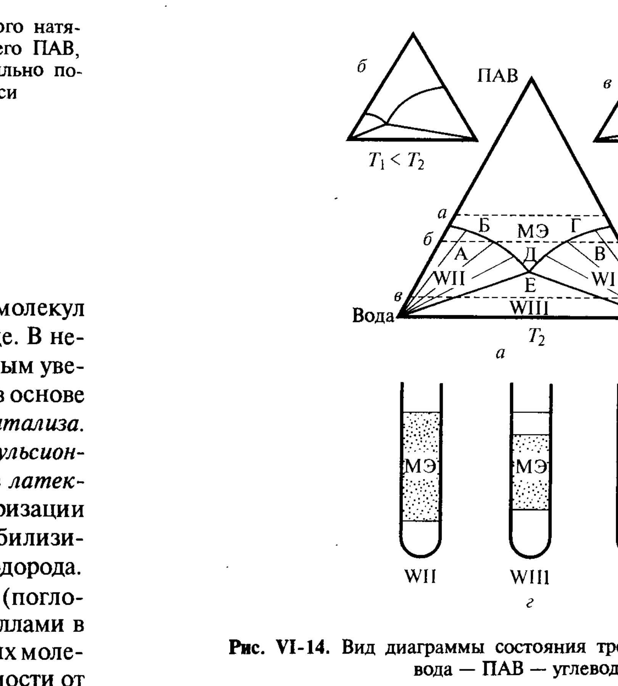
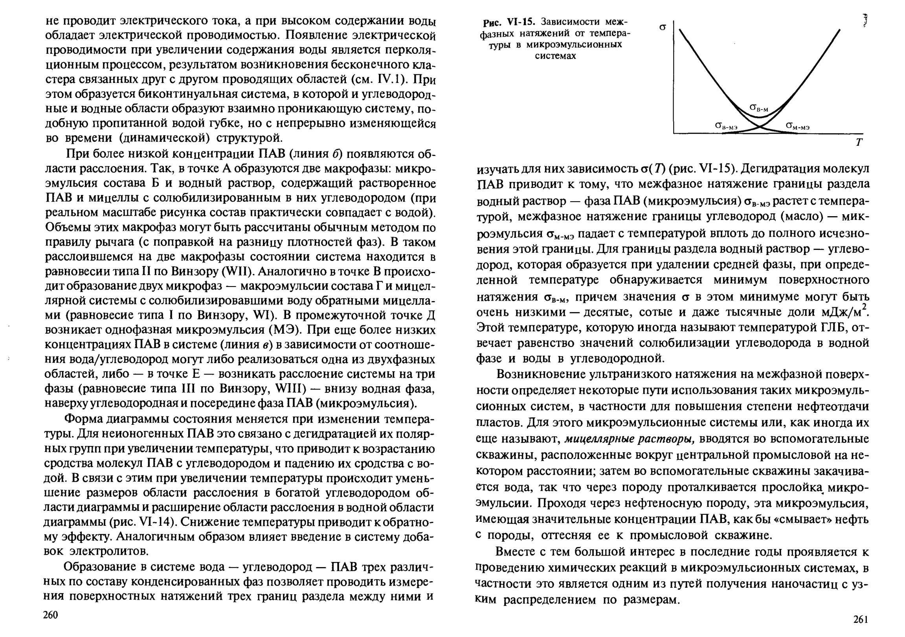

# Билет 32. Микроэмульсии. Классификация по Винзору

## Тема 1: Микроэмульсии — определение и место среди коллоидных систем

> [!note] Определение
> **Микроэмульсии** — термодинамически устойчивые, оптически прозрачные (или слабоопалесцирующие) дисперсии, образующиеся в трёхкомпонентных (и более сложных) системах **вода — углеводород — ПАВ** (часто с участием со-ПАВ). В зависимости от состава системы и температуры в них могут возникать структуры разной геометрии: сферические мицеллы, более сложные по структуре цилиндрические и плоские мицеллы или образованные ими упорядоченные **жидкокристаллические структуры**.

> [!important] Микроэмульсии — частный случай самоорганизации ПАВ
> Микроэмульсии возникают как продолжение явлений мицеллообразования (см. [[билет_27]]) и солюбилизации (см. [[билет_30]], [[билет_31]]) при увеличении содержания «третьего» компонента (масла или воды) в мицеллярном растворе. Граница между «мицеллярным раствором с высокой солюбилизацией» и «микроэмульсией» в значительной степени условна.

### Разнообразие структур

> [!note] Структурные типы в трёхкомпонентных системах
> На тройной диаграмме могут существовать области составов, которым отвечают различные по строению фазы:
> - мицеллярные системы с мицеллами различных размеров и формы;
> - жидкокристаллические фазы, образованные упорядоченными прямыми или обратными сферическими, цилиндрическими или плоскими (ламеллярными) мицеллами.
>
> Особенно характерно образование таких разнообразных по структуре фаз для **неионогенных ПАВ** с крупными полярными и неполярными участками молекул. Для **ионогенных ПАВ** образование подобных структур происходит обычно при введении четвёртого компонента — так называемых **со-ПАВ**, чаще всего спиртов $C_5$–$C_{12}$.

---

## Тема 2: Тройная диаграмма состояния вода — ПАВ — углеводород

Обычно рассматривают псевдотрёхкомпонентные диаграммы состояния, на которых двум углам отвечают вода и углеводород (масло), а третьему — смесь ионогенного и неионогенного ПАВ определённого состава (или смесь ионогенного ПАВ и со-ПАВ).

*Рис. VI-14. Вид диаграммы состояния трёхкомпонентной системы вода — ПАВ — углеводород: $a$ — при температуре ГЛБ; $б$ — ниже температуры ГЛБ; $в$ — выше температуры ГЛБ; $г$ — вид систем при соответствующих составах, отвечающих областям WI, WII и WIII на диаграмме (Щукин, рис. VI-14)*

### Изменение строения системы при изменении соотношения вода/масло (рис. VI-14, $a$)

При изменении соотношения вода/углеводород и постоянной концентрации ПАВ (горизонтальные линии на рис. VI-14, $a$):

> [!note] Высокая концентрация ПАВ (линия $a$)
> Образуется макроскопически однородная система, которая при высоком содержании углеводорода **не проводит электрического тока**, а при высоком содержании воды **обладает электрической проводимостью**. Появление электропроводности при увеличении содержания воды является результатом **перколяционного процесса** — возникновения бесконечного кластера связанных друг с другом проводящих областей (см. [[билет_37]]).
>
> При этом образуется **бинепрерывная (биконтинуальная) система**, в которой и водные, и углеводородные области образуют взаимопроникающую систему, подобную пропитанной водой губке, но с непрерывно изменяющейся во времени (динамической) структурой.

> [!important] Более низкая концентрация ПАВ (линия $б$) — расслоение, классификация Винзора
> При более низкой концентрации ПАВ появляются области расслоения:
>
> - **Точка А**: образуются **две макрофазы** — микроэмульсия состава Б и водный раствор, содержащий растворённое ПАВ и мицеллы с солюбилизированным в них углеводородом (при реальном масштабе состав практически совпадает с водой). Система находится в **равновесии типа II по Винзору (WII)**.
> - **Точка Г** (аналогично, но по другую сторону): образование **двух макрофаз** — макроэмульсии состава Г и мицеллярной системы с мицеллами, солюбилизировавшими воду обратными мицеллами. Это **равновесие типа I по Винзору (WI)**.
> - **Промежуточная точка Д**: возникает **однофазная микроэмульсия (МЭ)**.
> - При ещё более низких концентрациях ПАВ (линия $в$) в зависимости от соотношения вода/углеводород могут реализоваться:
>   - либо одна из двух описанных выше двухфазных областей (WI или WII),
>   - либо — **в точке Е** — расслоение системы на **три фазы**: равновесие **типа III по Винзору (WIII)** — внизу водная фаза, наверху углеводородная, посередине фаза ПАВ (микроэмульсия).

### Сводная классификация Винзора

| Тип по Винзору | Число фаз | Состав фаз |
|---|---|---|
| **WI** | 2 | макроэмульсия (или избыток масла) + мицеллярная фаза с прямыми мицеллами, солюбилизировавшими масло, в равновесии с водной фазой |
| **WII** | 2 | микроэмульсия (обратные мицеллы, солюбилизировавшие воду) в равновесии с избытком водной фазы |
| **WIII** | 3 | водная фаза (низ) + углеводородная фаза (верх) + промежуточная фаза ПАВ-микроэмульсии (середина) |
| **WIV** *(не показан явно на рис. VI-14, но упоминается в литературе как однофазная МЭ)* | 1 | гомогенная (биконтинуальная или мицеллярная) микроэмульсия |

> [!warning] Частая путаница в номенклатуре Винзора
> WI и WII различаются тем, **какая фаза находится в избытке и с чем равновесна микроэмульсия**: в WI избыточная (нижняя) фаза — водная, а микроэмульсия обогащена маслом (содержит прямые мицеллы); в WII — наоборот, избыточная фаза — масляная, а микроэмульсия обогащена водой (содержит обратные мицеллы). WIII — промежуточный трёхфазный случай.

---

## Тема 3: Влияние температуры. Температура ГЛБ

> [!important] Температурная зависимость диаграммы для неионогенных ПАВ
> Форма диаграммы состояния существенно меняется при изменении температуры. Для неионогенных ПАВ это связано с **дегидратацией их полярных групп при увеличении температуры**, что приводит к возрастанию сродства молекул ПАВ к углеводороду и падению их сродства к воде.
>
> - При **увеличении температуры** происходит уменьшение размеров области расслоения в богатой углеводородом области диаграммы и расширение области расслоения в водной области (рис. VI-14, $б \to в$).
> - **Снижение температуры** приводит к обратному эффекту.
> - Аналогичным образом влияет введение в систему добавок **электролитов**.

> [!note] Температура ГЛБ
> Существует определённая температура (**температура ГЛБ**, см. [[билет_25]] про гидрофильно-липофильный баланс), при которой межфазное натяжение на границе раздела водный раствор — углеводород проходит через **минимум**, причём значения $\sigma$ в этом минимуме могут быть очень низкими — десятые, сотые и даже тысячные доли мДж/м².

> [!example] Зависимость $\sigma(T)$ для границ раздела (рис. VI-15)
> Дегидратация молекул ПАВ при увеличении температуры приводит к тому, что межфазное натяжение границы раздела водный раствор — фаза ПАВ (микроэмульсия) $\sigma_{в-мэ}$ **растёт** с температурой, а межфазное натяжение границы углеводород (масло) — микроэмульсия $\sigma_{м-мэ}$ **падает** с температурой вплоть до полного исчезновения этой границы. Для границы раздела водный раствор — углеводород, которая образуется при удалении средней фазы, при определённой температуре (температура ГЛБ) обнаруживается **минимум** поверхностного натяжения $\sigma_{в-м}$.

> [!important] Условие минимума межфазного натяжения (физический смысл температуры ГЛБ)
> Этой температуре отвечает **равенство значений солюбилизации углеводорода в водной фазе и воды в углеводородной фазе**.

---

## Тема 4: Практическое применение микроэмульсий

> [!example] Повышение нефтеотдачи пластов
> Возникновение ультранизкого натяжения на межфазной поверхности определяет некоторые пути использования таких микроэмульсионных систем, в частности для повышения степени нефтеотдачи пластов. Для этого микроэмульсионные системы (или **мицеллярные растворы**) вводятся во вспомогательные скважины, расположенные вокруг центральной промысловой; затем во вспомогательные скважины закачивается вода, так что через породу проталкивается прослойка микроэмульсии. Проходя через нефтеносную породу, эта микроэмульсия, имеющая значительные концентрации ПАВ, как бы «смывает» нефть с породы, оттесняя её к промысловой скважине.

> [!example] Получение наночастиц
> Большой интерес в последние годы проявляется к проведению **химических реакций в микроэмульсионных системах**, в частности это является одним из путей получения наночастиц с узким распределением по размерам — компартменты микроэмульсии (микрокапли воды или масла, стабилизированные слоем ПАВ) играют роль «нанореакторов».

---

## Тема 5: Связь с критическими эмульсиями

> [!note] Критические эмульсии (контекст из соседнего раздела Щукина)
> Своеобразным предельным случаем коллоидной системы, родственным микроэмульсиям, являются **критические эмульсии** — системы вблизи критической температуры расслоения $T_c$ полного смешения двух жидких фаз, для которых характерно сильное рассеяние света и резкое падение поверхностного натяжения $\sigma \to 0$ при $T \to T_c$ (теория Фольмера — Ребиндера — Щукина, экспоненциальное распределение капель по размерам $n(r) \approx r^x \exp\left(-\dfrac{4\pi r^2 \sigma}{kT}\right)$). Это иллюстрирует общий принцип: **малые значения межфазного натяжения являются необходимым условием существования термодинамически (квази)устойчивых дисперсий малых частиц**, будь то микроэмульсии или критические эмульсии.

---

## Источники

- Щукин Е.Д., Перцов А.В., Амелина Е.А. Коллоидная химия, 3-е изд. — раздел VI.3 «Солюбилизация в растворах мицеллообразующих ПАВ, образование микроэмульсий», с. 258–261 (определение микроэмульсий, рис. VI-14 — диаграмма Винзора, классификация WI/WII/WIII, рис. VI-15 — температура ГЛБ, применение в нефтедобыче и для синтеза наночастиц).
- Щукин и др., раздел VI.4 «Критические эмульсии. Лиофильные коллоидные системы в дисперсиях ВМС», с. 262–265 (контекст критических эмульсий, теория Фольмера — Ребиндера — Щукина — упомянуто кратко для сопоставления).
- Дополнение (общеизвестные сведения, не из Щукина): термин «WIV» для гомогенной биконтинуальной микроэмульсии в общепринятой номенклатуре Винзора — стандартное дополнение классификации, не противоречащее материалу Щукина.
