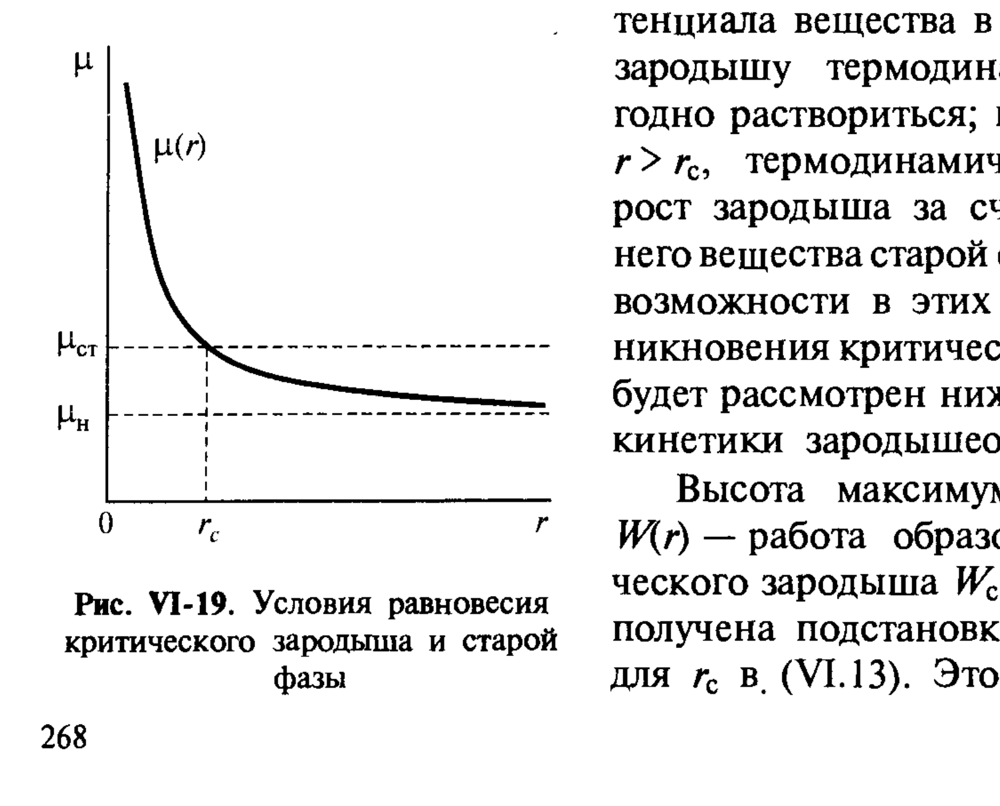
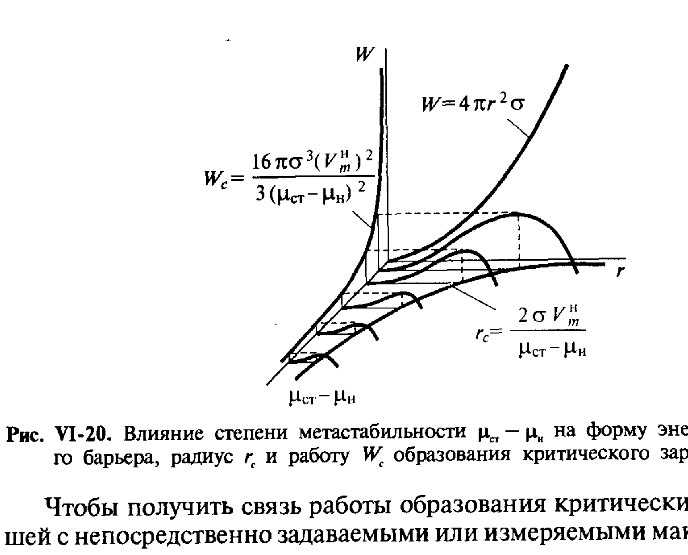

# Билет 33. Конденсационные методы получения лиофобных дисперсных систем. Работа образования зародышей новой фазы и метастабильность. Работа критического зародыша при разных фазовых переходах

## Тема 1: Метастабильность как условие конденсационного образования дисперсных систем

> [!note] Определение
> Возникновение дисперсной системы в результате образования (и последующего роста) зародышевых частиц новой стабильной фазы возможно в любой **метастабильной системе**. **Метастабильность** связана с удалением от состояния устойчивого равновесия системы и может быть вызвана:
> - **отклонением от равновесия в химическом составе фаз** (пересыщение),
> - либо вследствие **физико-химических воздействий на систему** (изменение температуры или давления).

> [!important] Конденсационные vs диспергационные методы
> Конденсационные методы получения дисперсных систем (в отличие от диспергационных, где исходная макрофаза механически измельчается) состоят в **образовании новой фазы «снизу» — из истинного раствора, пара или расплава**, через стадию зарождения и роста мельчайших частиц новой фазы.

---

## Тема 2: Термодинамические основы гомогенного зародышеобразования (по Гиббсу — Фольмеру)

### Работа образования зародыша

Рассмотрим образование в объёме старой (исходной) фазы, находящейся в метастабильном состоянии, зародыша новой более стабильной фазы; для простоты будем считать, что зародыш имеет сферическую форму и состоит из одного компонента, молярный объём которого равен $V_m$.

При образовании частицы (зародыша) радиусом $r$ возникает поверхность раздела старой и новой фаз площадью $4\pi r^2$, с которой связана избыточная поверхностная энергия $4\pi r^2 \sigma$. Вместе с тем переход вещества в более стабильное состояние сопровождается снижением его химического потенциала от значения $\mu_{ст}$ в старой фазе до более низкого значения $\mu_н$ в новой фазе. Частица содержит $4\pi r^3/(3V_m)$ молей вещества новой фазы, поэтому общее уменьшение свободной энергии системы при переходе в более стабильное состояние равно $4\pi r^3(\mu_{ст}-\mu_н)/(3V_m)$.

> [!important] Формула работы образования зародыша (VI.12)
> $$
> W = 4\pi r^2 \sigma - \frac{4}{3}\pi r^3\,\frac{\mu_{ст}-\mu_н}{V_m}.
> $$
>
> Здесь:
> - $W$ — работа образования зародыша радиусом $r$;
> - $\sigma$ — удельная свободная поверхностная энергия (поверхностное натяжение) на границе зародыш/старая фаза (см. [[билет_02]]);
> - $\mu_{ст}-\mu_н$ — разность химических потенциалов вещества в старой (метастабильной) и новой (стабильной) фазах — степень отклонения от равновесия;
> - $V_m$ — молярный объём вещества новой фазы.
>
> Первое слагаемое (поверхностное) — **положительно** и растёт с увеличением $r$ как $r^2$; второе (объёмное) при $\mu_{ст}-\mu_н > 0$ — **отрицательно** и по абсолютной величине растёт как $r^3$. Поэтому при наличии пересыщения на кривой зависимости $W(r)$ должен существовать **максимум**.

### Критический зародыш

Размер частицы $r_c$, отвечающий максимуму на кривой $W(r)$, находится из условия равенства нулю производной по радиусу $dW(r)/dr=0$ (при этом вторая производная меньше нуля, $d^2W(r)/dr^2 < 0$). Отсюда $r_c$ равно:

$$
r_c = \frac{2\sigma V_m}{\mu_{ст}-\mu_н}. \tag{VI.13}
$$

> [!note] Критический зародыш
> Частица радиусом $r_c$, соответствующим максимуму кривой $W(r)$, называется **критическим зародышем** новой фазы; она находится в **неустойчивом (лабильном) равновесии** со старой фазой.

*Рис. VI-19. Условия равновесия критического зародыша и старой фазы (Щукин, рис. VI-19)*

> [!important] Физический смысл неустойчивости (рис. VI-19)
> Химический потенциал $\mu(r)$ зародыша радиусом $r$ повышен по сравнению со значением для макроскопической новой фазы $\mu_н$ на величину $2\sigma V_m/r$ вследствие действия **капиллярного давления** (см. [[билет_12]], [[билет_14]]). Точка пересечения кривой $\mu(r)$ со значением химического потенциала старой фазы $\mu_{ст}$, т. е. зародыша со старой фазой, отвечает условию:
> $$
> \mu_{ст}=\mu(r)=\mu_н+\frac{2\sigma V_m}{r_c},
> $$
> что совпадает с выражением (VI.13).
>
> При $r < r_c$ зародышу термодинамически выгодно раствориться (его химический потенциал выше, чем у старой фазы); при $r > r_c$ термодинамически выгоден рост зародыша за счёт вещества старой фазы.

### Работа образования критического зародыша

Высота максимума на кривой $W(r)$ — работа образования критического зародыша $W_c$ — может быть получена подстановкой выражения для $r_c$ из (VI.13):

$$
W_c = \frac{16\pi\sigma^3 V_m^2}{3(\mu_{ст}-\mu_н)^2}. \tag{VI.14}
$$

Эта же величина может быть представлена ещё в двух эквивалентных формах:

$$
W_c = \tfrac{1}{3}\sigma S_c, \tag{VI.15}
$$

где $S_c$ — поверхность критического зародыша. Таким образом, **работа образования критического зародыша равна одной трети его поверхностной энергии**; остальные две трети компенсируются работой перехода вещества дисперсной фазы в более стабильное состояние.

$$
W_c = \tfrac{1}{2}(\mu_{ст}-\mu_н)\,V_c/V_m, \tag{VI.16}
$$

где $V_c$ — объём критического зародыша. Выражение (VI.16) будет использовано при рассмотрении гетерогенного образования зародышей (см. [[билет_34]]).

> [!note] Замечание (Русанов)
> Русановым было показано, что полученное Гиббсом выражение (VI.15) для работы образования критического зародыша может быть положено в основу наиболее строгой формулировки термодинамики дисперсных систем, в частности учитывающей зависимость поверхностного натяжения от радиуса частицы.

*Рис. VI-20. Влияние степени метастабильности $\mu_{ст}-\mu_н$ на форму энергетического барьера, радиус $r_c$ и работу $W_c$ образования критического зародыша (Щукин, рис. VI-20)*

> [!important] Энергетический барьер зародышеобразования (рис. VI-20)
> В отсутствие пересыщения ($\mu_{ст}-\mu_н=0$) зависимость $W(r)$ имеет вид параболы $W(r)=4\pi r^2\sigma$, при этом $r_c \to \infty$ и $W_c \to \infty$ — зародышеобразование невозможно. При внедрении в метастабильную область ($\mu_{ст}-\mu_н>0$) на кривой $W(r)$ появляется максимум, т. е. $W_c$ и $r_c$ имеют конечные значения, и **уменьшаются по мере роста пересыщения**.
>
> Работа образования критического зародыша $W_c$ может рассматриваться как **высота энергетического барьера**, который необходимо преодолеть для дальнейшего самопроизвольного роста зародышей новой фазы.

> [!important] Зависимость от пересыщения
> В соответствии с (VI.14) работа образования критического зародыша **обратно пропорциональна квадрату пересыщения** $(\mu_{ст}-\mu_н)^2$. Поэтому для самопроизвольного возникновения новой фазы в гомогенной системе необходимо заметное внедрение в метастабильную область. Часто наблюдаемое образование новой фазы при весьма малом пересыщении (и даже в его отсутствие) связано с наличием посторонних включений, определяющих протекание процесса по **гетерогенному механизму** (см. [[билет_34]]).

---

## Тема 3: Работа образования критического зародыша при различных фазовых переходах

Чтобы получить связь работы образования критических зародышей с непосредственно задаваемыми или измеряемыми макроскопическими параметрами, надо выразить через них величину $\mu_{ст}-\mu_н$, привлекая различные уравнения состояния в зависимости от фазового состояния старой и новой фаз.

### Конденсация пересыщенного пара

В качестве параметра, характеризующего состояние исходной метастабильной фазы, целесообразно использовать давление $p$. Степень внедрения в метастабильную область $\mu_{ст}-\mu_н$ можно выразить через отклонение давления исходного пересыщенного пара $p''$ от равновесного давления насыщенного пара $p_0$ (над плоской поверхностью). Используя соотношение (I.23) (уравнение Кельвина, см. [[билет_14]]):

$$
\mu_{ст}-\mu_н \approx RT\ln\frac{p''}{p_0}.
$$

Тогда для работы образования критического зародыша получаем:

$$
W_c = \frac{16\pi\sigma^3 V_m^2}{3\left(RT\ln\dfrac{p''}{p_0}\right)^2},
$$

где отношение $p''/p_0=\alpha$ есть **пересыщение пара**.

### Кристаллизация (конденсация) из раствора

Аналогично может быть рассмотрен процесс выделения твёрдой или жидкой фазы из раствора с пересыщением $\alpha=c/c_0$, где $c$ и $c_0$ — концентрация пересыщенного и насыщенного раствора. Если раствор близок к идеальному, то выражение для работы образования критического зародыша принимает вид:

$$
W_c = \frac{16\pi\sigma^3 V_m^2}{3\left(RT\ln\dfrac{c}{c_0}\right)^2}.
$$

> [!note] Для неидеального раствора
> В это выражение войдут коэффициенты активности вместо концентраций.

### Кипение и кавитация

> [!example] Кипение
> В процессах кипения и кавитации метастабильные зародыши новой газообразной фазы (пузырьков пара) возникают внутри метастабильной жидкой фазы. При кипении жидкости в открытом (незамкнутом) сосуде жидкость испаряется в неограниченный объём (атмосферу), и давление пара над плоской поверхностью жидкости не повышается, так что процесс кипения происходит при атмосферном давлении.
>
> При кипении давление $p''(r_c)$ в критическом зародыше радиусом $r_c$ превышает атмосферное на величину $2\sigma/r_c$.

> [!example] Кавитация
> При кавитации образование кавитационных пузырьков может иметь место в условиях **растяжения жидкости**, когда давление в ней **отрицательно**: $p' < 0$. Возникновение последующего захлопывания кавитационных пузырьков может вызывать ускоренный износ поверхности (например, при работе гребных винтов).
>
> Давление пара $p''(r_c)$ в кавитационном пузырьке с критическим размером $r_c$ оказывается лишь немного ниже давления $p_0$ насыщенного пара, тогда как значение отрицательного давления в жидкости может быть очень велико: $-p' \gg p_0$.

Возникновение критического зародыша при вскипании растянутой жидкости отвечает условию равенства химических потенциалов вещества в зародыше (паре) и в жидкости. С учётом соответствующих уравнений состояния жидкости и газа получаем:

$$
RT\ln\frac{p''(r_c)}{p_0}=V_m'\left[p''(r_c)-p'\right].
$$

### Кристаллизация из расплава

> [!important] Особый случай — переохлаждение расплава
> Так как в этом случае и возникающая (новая), и исходная (старая) фазы несжимаемы, умеренное увеличение давления не связано здесь с совершением заметной работы и не является эффективным способом внедрения в метастабильную область. Нужного эффекта можно достичь изменением температуры $T$.
>
> Применяя уравнение Гиббса — Гельмгольца к процессу затвердевания расплава, можно получить:
> $$
> \mu_{ст}-\mu_н = \mathcal{L}\,\frac{\Delta T}{T_{пл}}, \tag{VI.17}
> $$
> где $\mathcal{L}$ — теплота плавления (на моль вещества, считается не зависящей от температуры), $T_{пл}$ — температура плавления, $\Delta T = T_{пл}-T > 0$ — степень переохлаждения.

Подставляя (VI.17) в (VI.14), получаем для работы образования критического зародыша в расплаве:

$$
W_c = \frac{16}{3}\pi\sigma^3\left(\frac{V_m T_{пл}}{\mathcal{L}\,\Delta T}\right)^2,
$$

где $V_m$ — молярный объём твёрдой фазы.

> [!warning] Частая путаница
> Не путать роль давления и температуры как «параметров пересыщения»: для **пара** и **раствора** степень метастабильности выражают через отношение давлений/концентраций $p''/p_0$ или $c/c_0$ (логарифм от отношения), а для **расплава** — через **переохлаждение** $\Delta T = T_{пл}-T$ (линейная разность температур), так как объёмы твёрдой и жидкой фаз практически равны и давление неэффективно как параметр пересыщения.

---

## Источники

- Щукин Е.Д., Перцов А.В., Амелина Е.А. Коллоидная химия, 3-е изд. — раздел VI.5 «Конденсационное образование лиофобных дисперсных систем», подраздел VI.5.1 «Термодинамические основы гомогенного зародышеобразования (по Гиббсу — Фольмеру)», с. 267–272 (метастабильность, формулы VI.12–VI.17, рис. VI-19, VI-20, VI-21, VI-22, VI-23, конденсация пара, кристаллизация из раствора и расплава, кипение и кавитация).
