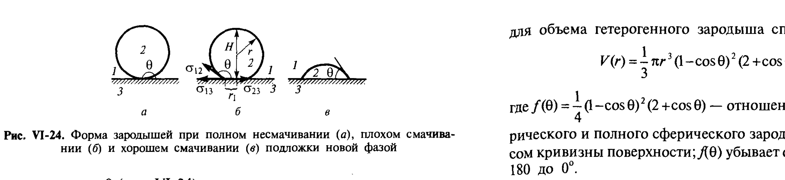

# Билет 34. Гетерогенное образование зародышей новой фазы: влияние смачивания и шероховатости поверхности на процесс нуклеации

## Тема 1: Гомогенное vs гетерогенное зародышеобразование

> [!note] Определение
> **Гомогенное зародышеобразование** наблюдается только тогда, когда в системе нет поверхностей, на которых может с достаточной скоростью происходить образование и рост зародышей новой фазы (см. [[билет_33]]). Если же такие поверхности имеются (например, стенки сосуда и особенно поверхности посторонних включений), то в зависимости от их природы может стать значительно более вероятным **гетерогенное образование** зародышей новой фазы на этих поверхностях.

> [!important] Затравки
> Если в систему введены **затравки** самого вещества новой фазы (или вещества, близкого ему по строению и свойствам), то выделение новой фазы идёт по поверхности этих затравок.

---

## Тема 2: Геометрия гетерогенного зародыша. Роль краевого угла смачивания

При возникновении зародыша новой фазы на имеющейся в системе поверхности раздела необходимо проанализировать условия равновесия такого зародыша со средой. В простейшем случае некристаллический зародыш (пар или жидкость) имеет форму, определяемую краевым углом $\theta$, причём в соответствии с **уравнением Юнга** (см. [[билет_09]]):

$$
\cos\theta=\frac{\sigma_{13}-\sigma_{23}}{\sigma_{12}},
$$

где $\sigma_{13}$, $\sigma_{23}$ и $\sigma_{12}$ — удельные свободные поверхностные энергии поверхностей раздела соответствующих фаз ($1$ — исходная фаза, $2$ — зародыш новой фазы, $3$ — включение).

> [!note] Расшифровка обозначений
> - $\theta$ — краевой угол на границе зародыша новой фазы (измеряется внутри новой фазы, $2$);
> - $\sigma_{12}$ — натяжение на границе исходная фаза / зародыш;
> - $\sigma_{13}$ — натяжение на границе исходная фаза / включение (подложка);
> - $\sigma_{23}$ — натяжение на границе зародыш / включение (подложка).
>
> Угол $\theta$ измеряется в данном случае независимо от агрегатного состояния фаз внутри новой фазы. Следует иметь в виду, что в различных случаях, в зависимости от свойств новой и исходной фаз, угол $\theta$, как и при избирательном смачивании (см. [[билет_11]]), может меняться от $0$ до $180°$.

*Рис. VI-24. Форма зародышей при полном несмачивании ($a$), плохом смачивании ($б$) и хорошем смачивании ($в$) подложки новой фазой (Щукин, рис. VI-24)*

> [!important] Три случая смачивания (рис. VI-24)
> Форма зародыша в конечном счёте определяется тем, какая из фаз — вновь возникающая или исходная (маточная) — лучше смачивает поверхность включения:
>
> | Случай | Краевой угол $\theta$ | Описание |
> |---|---|---|
> | **а** — полное несмачивание поверхности новой фазой | $\theta=180°$ | зародыш имеет форму полной сферы, касающейся подложки в одной точке (например, при образовании пузырьков пара в полностью смачивающей поверхность жидкости) |
> | **б** — преимущественное смачивание исходной фазой | $90°<\theta<180°$ | зародыш — сферический сегмент, прилегающий к подложке узкой «ножкой» |
> | **в** — лучшее смачивание новой фазой | $0°<\theta<90°$ (например, при конденсации пара в ограниченно смачивающей жидкости или при вскипании несмачивающей жидкости) | зародыш — широкий сферический сегмент, «растекающийся» по подложке |

> [!warning] Предельный случай идеального смачивания
> При $\theta=0°$ (идеальное смачивание новой фазой подложки) работа гетерогенного образования зародыша стремится к нулю — зародышеобразование облегчается максимально (см. ниже).

### Геометрические соотношения для зародыша-сегмента (рис. VI-24, $б$)

Высота зародыша $H$ и радиус линии контакта трёх фаз $r_1$ связаны с радиусом зародыша $r$ и краевым углом $\theta$ соотношениями:

$$
H=r(1-\cos\theta); \qquad r_1=r\sin\theta.
$$

Поскольку объём шарового сегмента равен:

$$
V=\frac{1}{3}\pi H^2(3r-H),
$$

для объёма гетерогенного зародыша справедливо выражение:

$$
V(r)=\frac{1}{3}\pi r^3(1-\cos\theta)^2(2+\cos\theta)=\frac{4}{3}\pi r^3 f(\theta),
$$

где:

$$
f(\theta)=\frac{1}{4}(1-\cos\theta)^2(2+\cos\theta)
$$

— **отношение объёмов усечённого сферического и полного сферического зародышей с одинаковым радиусом кривизны поверхности**; $f(\theta)$ убывает от $1$ до $0$ при изменении $\theta$ от $180°$ до $0°$.

---

## Тема 3: Площадь поверхности гетерогенного зародыша и изменение свободной энергии

Увеличение свободной поверхностной энергии системы при гетерогенном образовании зародыша согласно уравнению Юнга (I.20, см. [[билет_09]]) равно:

$$
\Delta\mathcal{F}_s = S_{12}\sigma_{12}+S_{23}(\sigma_{23}-\sigma_{13})=\sigma_{12}(S_{12}-S_{23}\cos\theta),
$$

где $S_{12}$ и $S_{23}$ — площади поверхности раздела зародыш — среда и зародыш — включение соответственно.

Поверхность шарового сегмента $S_{12}$ равна:

$$
S_{12}=2\pi rH=\pi(H^2+r_1^2).
$$

Площадь контакта зародыша с включением $S_{23}$ составляет $\pi r_1^2$. Отсюда с учётом выражений для $H$ и $r_1$ находим:

$$
\Delta\mathcal{F}_s=\sigma_{12}\left(S_{12}-S_{23}\cos\theta\right)=\pi\sigma_{12}\left[(H^2+r_1^2)-r_1^2\cos\theta\right]=
$$
$$
=\pi r^2\sigma_{12}\left[(1-\cos\theta)^2+\sin^2\theta(1-\cos\theta)\right]=\pi r^2\sigma_{12}(1-\cos\theta)^2(2+\cos\theta)=4\pi r^2\sigma_{12}f(\theta).
$$

> [!note] Геометрическая интерпретация $f(\theta)$
> Таким образом, коэффициент $f(\theta)$ описывает как отношение объёмов зародышей равного радиуса при гетерогенном $V^{гет}$ и гомогенном $V^{гом}$ образовании, так и отношение свободных поверхностных энергий $\Delta\mathcal{F}_s^{гет}$ и $\Delta\mathcal{F}_s^{гом}$ их образования.

---

## Тема 4: Работа гетерогенного образования критического зародыша

> [!important] Ключевая идея — радиус критического зародыша не зависит от наличия подложки
> Очевидно, что радиусы кривизны поверхности критического зародыша и при гомогенном, и при гетерогенном образовании одинаковы (условия равновесия частей поверхности, удалённых от области контакта с твёрдой поверхностью, не зависят от её наличия или отсутствия). Поэтому для гетерогенного зародыша применимо выражение (VI.16) (см. [[билет_33]]), т. е. **работа образования критического зародыша $W_c$ пропорциональна его объёму** $V_c$:
>
> $$
> W_c=\frac{(\mu_{ст}-\mu_н)}{2}\cdot\frac{V_c}{V_m}.
> $$

Тогда работа гетерогенного образования критического зародыша $W_c^{гет}$ равна работе гомогенного образования критического зародыша $W_c^{гом}$, умноженной на отношение их объёмов, т. е. на величину $f(\theta)$:

$$
\boxed{W_c^{гет}=f(\theta)\,W_c^{гом}}
$$

> [!important] Главный вывод билета (часто спрашивают на экзамене)
> Поскольку коэффициент $f(\theta)$ в зависимости от угла $\theta$ может меняться от $1$ до $0$, **работа гетерогенного образования критического зародыша убывает от своего максимального значения**, т. е. от работы гомогенного образования $W_c^{гом}$ (при полном несмачивании поверхности новой фазой, $\theta=180°$) **до нуля при $\theta=0°$**, т. е. при идеальном смачивании.
>
> Следовательно, **при хорошем смачивании поверхности новой фазой возникновение этой новой фазы может происходить даже при весьма малых пересыщениях** $(\mu_{ст}-\mu_н)$ — таких, при которых в гомогенной системе этот процесс невозможен.

| Условие смачивания подложки новой фазой | Краевой угол $\theta$ | $f(\theta)$ | $W_c^{гет}$ относительно $W_c^{гом}$ |
|---|---|---|---|
| Полное несмачивание | $180°$ | $1$ | $W_c^{гет}=W_c^{гом}$ (подложка не помогает) |
| Промежуточное (частичное смачивание) | $0°<\theta<180°$ | $0<f<1$ | $W_c^{гет}<W_c^{гом}$ (барьер снижен) |
| Идеальное смачивание | $0°$ | $0$ | $W_c^{гет}\to 0$ (барьер практически отсутствует) |

---

## Тема 5: Влияние шероховатости поверхности

> [!important] Шероховатость дополнительно снижает барьер зародышеобразования
> Если поверхность подложки **шероховатая**, то работа образования критического зародыша на такой поверхности может быть ещё сильнее снижена вследствие дополнительного уменьшения объёма критического зародыша, возникающего в углублениях поверхности.

> [!note] Геометрический смысл (рис. VI-25)
> В углублениях (порах, трещинах, выступах) шероховатой поверхности зародыш данного радиуса кривизны $r$ окружён подложкой с большей площадью контакта при меньшем эффективном объёме новой фазы, чем на плоской поверхности — т. е. эффективное значение $f(\theta)$ для таких участков меньше, чем для плоской поверхности с тем же краевым углом.

> [!example] Аналогия с капиллярной конденсацией
> Эта же геометрическая логика — облегчение зарождения новой фазы в углублениях/порах за счёт изменения эффективной кривизны — лежит в основе явления **капиллярной конденсации** (см. [[билет_14]]), хотя физический механизм там связан со снижением давления насыщенного пара над вогнутым мениском, а не с уменьшением работы образования зародыша.

> [!example] Кипение и кавитация в порах и капиллярах
> По этой причине **кипение жидкости облегчается при внесении в неё капилляров или кусочков пористых материалов**: на их шероховатой, частично смачиваемой поверхности работа образования критических зародышей пара (пузырьков) снижена по сравнению с гомогенным образованием в объёме жидкости.

---

## Тема 6: Заключение — условия наблюдения чисто гомогенного зародышеобразования

> [!warning] Гомогенное зародышеобразование — скорее идеализация
> Таким образом, наличие поверхностей, особенно шероховатых, избирательно смачиваемых новой фазой, существенно способствует её выделению, снижая работу образования критических зародышей, и тем больше, чем лучше смачивание. Поэтому **наблюдение чисто гомогенного образования новой фазы возможно лишь при отсутствии в системе посторонних включений и полном избирательном смачивании стенок сосуда** новой фазой исходной (маточной).

> [!tip] Мнемоника
> «Капля точит камень — но и камень помогает капле родиться»: твёрдая поверхность (особенно шероховатая и хорошо смачиваемая новой фазой) служит «трамплином», резко снижающим энергетический барьер зародышеобразования $W_c$ — отсюда практическое правило: **хочешь предотвратить кристаллизацию/кипение — убери все шероховатости и инородные частицы; хочешь вызвать — добавь затравки**.

> [!important] Связь с кинетикой зародышеобразования (продолжение раздела VI.5.3 у Щукина)
> Частота возникновения зародышей новой фазы $J$ экспоненциально зависит от высоты энергетического барьера, т. е. от работы образования критического зародыша $W_c$:
> $$
> J=J_0\exp\left(-\frac{W_c}{kT}\right). \tag{VI.18}
> $$
> Поскольку гетерогенное зародышеобразование снижает $W_c$ (за счёт множителя $f(\theta)<1$), оно резко (экспоненциально) увеличивает частоту зародышеобразования $J$ по сравнению с гомогенным механизмом при том же пересыщении.

---

## Источники

- Щукин Е.Д., Перцов А.В., Амелина Е.А. Коллоидная химия, 3-е изд. — раздел VI.5.2 «Гетерогенное образование новой фазы», с. 273–276 (уравнение Юнга для зародыша, рис. VI-24, геометрия зародыша-сегмента, формула $f(\theta)$, работа гетерогенного образования критического зародыша, влияние шероховатости, рис. VI-25).
- Щукин и др., раздел VI.5.3 «Кинетика возникновения зародышей новой фазы в метастабильной системе», с. 277 (формула VI.18, частота зародышеобразования $J$ — для связи гетерогенного механизма с кинетикой).
