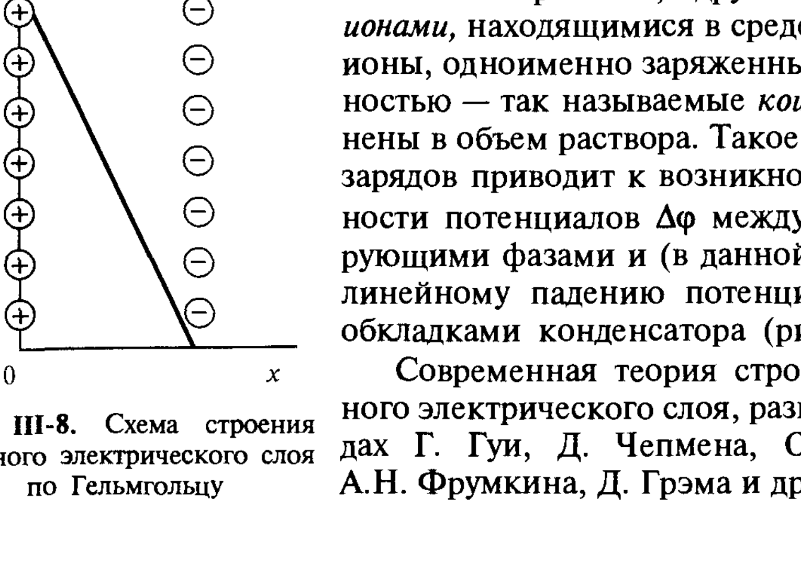
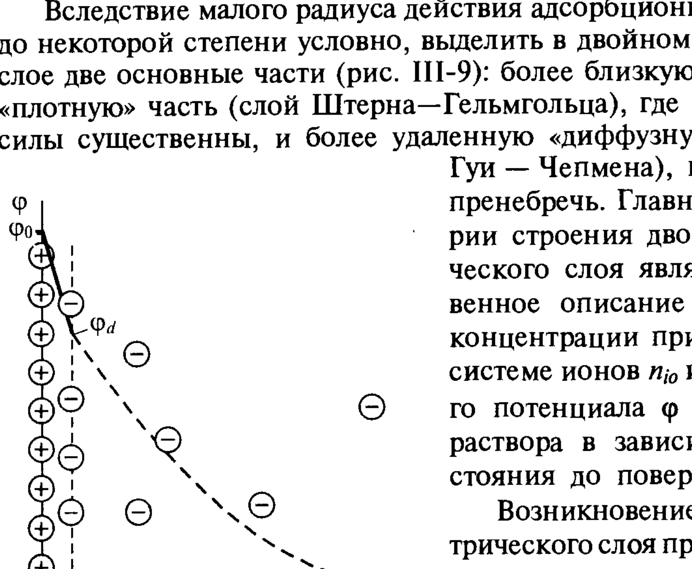

# Билет 35. Двойной электрический слой (ДЭС), причины его образования. Развитие представлений о строении ДЭС

## Тема 1: Причины образования ДЭС

> [!note] Определение
> При контакте двух фаз, обладающих различной электрической природой (например, твёрдая поверхность и водный раствор электролита), на границе их раздела происходит **пространственное разделение зарядов**, приводящее к возникновению **двойного электрического слоя (ДЭС)** — правильнее называть его **двойным ионным слоем**, поскольку речь идёт о разделении зарядов, переносимых ионами.

### Термодинамическое условие равновесия — равенство электрохимических потенциалов

Как известно из электрохимии, равновесие в системе, в которой контактирующие фазы имеют разные электрические потенциалы $\varphi$, определяется условием равенства **электрохимических потенциалов** ионов $\bar\mu_i$, связанных с их химическими потенциалами $\mu_i$ соотношением:

$$
\bar\mu_i=\mu_i+z_i e\varphi N_A.
$$

> [!note] Расшифровка обозначений
> - $\bar\mu_i$ — электрохимический потенциал $i$-го иона;
> - $\mu_i$ — (обычный) химический потенциал иона;
> - $z_i$ — заряд иона (с учётом знака);
> - $e$ — заряд электрона;
> - $N_A$ — число Авогадро; произведение $eN_A=F$ — число Фарадея;
> - $\varphi$ — электрический потенциал фазы.

При малой концентрации ионов $n_i$ (число ионов/м³) условию равновесия отвечает постоянное значение электрохимического потенциала по всей системе, т. е.:

$$
\bar\mu_i=\mu_{i0}+RT\ln n_i+z_ie\varphi N_A=\text{const}. \tag{III.2}
$$

> [!important] Три фактора, определяющие распределение ионов (ключевая формула билета)
> Соотношение (III.2) учитывает **три основных фактора**, определяющих поведение ионов в системе:
> 1. **молекулярное взаимодействие** ионов с окружающей средой $\mu_{i0}$;
> 2. **участие в тепловом движении** — энтропийный член $RT\ln n_i$;
> 3. **взаимодействие с электрическим полем** $z_ie\varphi N_A$.
>
> Соотношение (III.2) должно выполняться для всех ионов, присутствующих в системе.

> [!warning] Особые случаи
> Иногда какие-либо ионы практически отсутствуют в одной из фаз или в обеих контактирующих фазах. В этом случае ионы присутствуют только на поверхности раздела фаз (поверхностная диссоциация, характерная для неорганических веществ сложного строения, например силикатных и алюмосиликатных минералов). Кроме того, возможна **поляризация поверхности**, когда для одного из ионов из-за кинетических затруднений электрохимическое равновесие не устанавливается, и разность потенциалов между фазами без изменения их состава может быть задана приложением внешней разности потенциалов.

### Уравнение Нернста

В отсутствие поляризации поверхности изменение разности потенциалов между фазами всегда связано с изменением состава фаз; дифференцирование соотношения (III.2) приводит в этом случае к **уравнению Нернста**:

$$
-d\varphi=\frac{kT}{z_ie}\,d\ln n_i.
$$

> [!warning] Принципиальное ограничение
> Фигурирующая здесь разность потенциалов между фазами $\varphi$ **не может быть определена экспериментально**, тогда как её *изменения* измеряются сравнительно просто.

---

## Тема 2: Четыре механизма (причины) возникновения ДЭС

> [!important] Перечень причин возникновения слоя потенциалопределяющих ионов (часто спрашивают на экзамене)
> Можно выделить следующие причины возникновения на поверхности слоя **потенциалопределяющих ионов**:
>
> 1. **Избирательная адсорбция ионов из раствора.** При этом преимущественно адсорбируются ионы, имеющие высокий адсорбционный потенциал, и в первую очередь присутствующие в дисперсионной среде ионы, способные «достраивать» поверхность твёрдой фазы. В классическом примере формирования слоя потенциалопределяющих ионов на поверхности кристаллов AgI ионами $I^-$ в растворе KI или ионами $Ag^+$ в растворе AgNO₃ движущей силой такой достройки является специфическое химическое взаимодействие ионов с поверхностью кристалла.
> 2. **Ионизация молекул вещества твёрдой фазы** (например, диссоциация поверхностных групп силикатов в водной среде).
> 3. **Переход какого-либо иона из одной фазы в другую** при установлении электрохимического равновесия (например, при опускании пластинки серебра в раствор AgNO₃ с достаточно малой концентрацией ионов Ag⁺ происходит переход ионов Ag⁺ из металла в раствор и на поверхности металла возникает отрицательный заряд).
> 4. **Поляризация поверхности** при помощи внешнего источника тока (например, заряжение поверхности ртути в растворах электролитов).

> [!example] Классический пример — AgI
> Поверхность кристаллов AgI может приобретать как положительный заряд (при избытке ионов $Ag^+$ в растворе, которые «достраивают» кристаллическую решётку), так и отрицательный (при избытке ионов $I^-$). Знак и величина заряда определяются соотношением активностей этих ионов в растворе по сравнению с их значением в точке нулевого заряда.

---

## Тема 3: Модель Гельмгольца (плоский конденсатор)

> [!note] Простейшая модель — модель Гельмгольца
> В соответствии с простейшей моделью Гельмгольца пространственное разделение зарядов вблизи поверхности может рассматриваться как двойной электрический (ионный) слой, представляющий собой **две параллельные обкладки заряженного конденсатора**, разделённые прослойкой дисперсионной среды с некоторой средней (эффективной) толщиной $\delta$.
>
> - Одна обкладка конденсатора образована **потенциалопределяющими ионами**, закреплёнными на самой поверхности.
> - Другая — **противоионами**, находящимися в среде. При этом одноимённо заряженные с поверхностью ионы — так называемые **коионы** — оттеснены в объём раствора.

*Рис. III-8. Схема строения двойного электрического слоя по Гельмгольцу (Щукин, рис. III-8)*

> [!important] Главная черта модели Гельмгольца
> Такое разделение зарядов приводит к возникновению разности потенциалов $\Delta\varphi$ между контактирующими фазами и (в данной модели) к **линейному падению потенциала между обкладками конденсатора** (рис. III-8) — т. е. весь скачок потенциала $\Delta\varphi$ сосредоточен в тонком слое толщиной $\delta$, аналогично плоскому конденсатору.

> [!warning] Ограниченность модели Гельмгольца
> Модель Гельмгольца **не учитывает тепловое движение ионов**, которое стремится разупорядочить (размыть) жёсткое расположение противоионов строго на фиксированном расстоянии $\delta$ от поверхности. Поэтому модель Гельмгольца применима лишь как первое приближение и не описывает зависимость строения ДЭС от концентрации электролита.

---

## Тема 4: Развитие теории — Гуи, Чепмен, Штерн, Грэм

> [!note] Современная теория строения ДЭС
> Современная теория строения двойного электрического слоя, развитая в трудах **Г. Гуи, Д. Чепмена, О. Штерна, А.Н. Фрумкина, Д. Грэма** и др., основана на анализе электростатических взаимодействий ионов в двойном электрическом слое в сопоставлении с межмолекулярными взаимодействиями и тепловым движением ионов.

### Диффузная модель Гуи — Чепмена

> [!important] Идея Гуи и Чепмена
> Гуи и Чепмен сопоставили энергию электростатического взаимодействия ионов с энергией их теплового движения, допустив, что распределение концентрации ионов в двойном электрическом слое подчиняется **уравнению Больцмана**:
> $$
> n_i=n_{i0}\exp\left(-\frac{W_i}{kT}\right),
> $$
> где $W_i=z_ie\varphi(x,y,z)$ — работа переноса заряда $z_ie$ из бесконечно удалённых от поверхности областей раствора в данную точку $(x,y,z)$ (чисто электростатический характер).
>
> Тем самым было использовано приближение **идеального раствора ионов**. В результате вместо жёсткого слоя Гельмгольца возникает **диффузный (размытый) слой** противоионов, концентрация которых плавно убывает по мере удаления от поверхности (рис. III-10).

> [!example] Распределение ионов в диффузном слое (рис. III-10)
> В области диффузной части двойного электрического слоя концентрация **противоионов** повышена (знаки $z_i$ и $\varphi$ противоположны) и уменьшается до объёмного значения по мере удаления от поверхности. Концентрация **коионов**, заряженных одноимённо с поверхностью (знаки $z_i$ и $\varphi$ одинаковы), понижена и возрастает при удалении от поверхности. Такое обогащение диффузной части слоя противоионами и обеднение коионами приводит к возникновению **избыточной объёмной плотности заряда** $\rho_V$.

### Двухслойная модель Штерна — Грэма

> [!important] Объединение модели Гельмгольца и диффузной модели Гуи — Чепмена (главный вывод билета)
> Вследствие малого радиуса действия адсорбционных сил можно, до некоторой степени условно, выделить в двойном электрическом слое **две основные части** (рис. III-9):
> - более близкую к поверхности **«плотную» часть** (**слой Штерна — Гельмгольца**), где адсорбционные силы существенны;
> - более удалённую **«диффузную» часть** (**слой Гуи — Чепмена**), где ими можно пренебречь.

*Рис. III-9. Схема строения двойного электрического слоя (модель Штерна — Грэма): $\varphi_0$ — потенциал поверхности, $\varphi_d$ — потенциал на границе плотной и диффузной частей слоя (Щукин, рис. III-9)*

> [!note] Внутренняя и внешняя части слоя Штерна — Гельмгольца (по схеме Штерна — Грэма)
> Плотная часть ДЭС (слой Штерна — Гельмгольца), примыкающая к заряженной потенциалопределяющими ионами поверхности, в свою очередь может состоять из **внутренней** и **внешней** частей:
> - **внутренняя часть** (внутренняя плоскость Гельмгольца) образована специфически адсорбирующимися на данной поверхности частично или полностью дегидратированными ионами;
> - **внешнюю часть** (внешняя плоскость Гельмгольца) составляют гидратированные ионы, не проявляющие столь энергичной специфической адсорбции.
>
> Специфически адсорбирующиеся ионы, входящие в состав внутренней части слоя Штерна — Гельмгольца, могут иметь как противоположный, так и одинаковый с потенциалопределяющими ионами знак — это зависит от соотношения энергии электростатического взаимодействия ионов с заряженной поверхностью $z_ie\varphi_{d_1}$ ($\varphi_{d_1}$ — потенциал на границе внутренней части слоя Штерна — Гельмгольца) и энергии их специфического молекулярного взаимодействия с поверхностью $\Phi_i$.

### Заряд плотной части слоя (по Штерну, через изотерму Ленгмюра)

Следуя Штерну, для определения заряда плотного слоя можно воспользоваться рассмотренной в гл. II схемой мономолекулярной адсорбции Ленгмюра (см. [[билет_20]]). В этом случае работа переноса $i$-го иона из объёма раствора в плотную часть двойного слоя $W_{ас}(x=d)$ должна включать как величину $\Phi_i=(\mu_{i0}-\mu_{i0}^{w})/N_A$, отражающую *специфическое* адсорбционное взаимодействие иона с поверхностью (см. [[билет_17]]), так и работу *электростатического* взаимодействия иона с заряженной поверхностью $z_ie\varphi_{d}$, где $\varphi_d$ — потенциал плотного слоя. Тогда выражение (II.15) (см. [[билет_20]]) принимает вид:

$$
\Gamma_i\approx\Gamma_{max}\left[1+\frac{\Gamma_{max}}{2dn_{i0}}\exp\left(-\frac{\Phi_i-z_ie\varphi_d}{kT}\right)\right]^{-1},
$$

где $2d$ — толщина адсорбционного слоя, $\Gamma_{max}$ — предельная адсорбция. Из-за сильного взаимного отталкивания ионов высокие значения адсорбции, соизмеримые с $\Gamma_{max}$, как правило, не достигаются, и можно использовать приближённое соотношение, отвечающее начальной линейной области изотермы Ленгмюра:

$$
\Gamma_i=2dn_{i0}\exp\left(\frac{\Phi_i-z_ie\varphi_d}{kT}\right).
$$

Тогда общее число зарядов на единицу поверхности (поверхностная плотность заряда) $\rho_d$ в слое Штерна — Гельмгольца равно:

$$
\rho_d=\sum_i\Gamma_iz_ie=2de\sum_iz_in_{i0}\exp\left(\frac{\Phi_i-z_ie\varphi_d}{kT}\right).
$$

> [!note] Условие электронейтральности ДЭС в целом
> $$
> \rho_s+\rho_d+\rho_\delta=0,
> $$
> где $\rho_s$ — плотность заряда самой поверхности (потенциалопределяющих ионов), $\rho_d$ — заряд плотной части (слоя Штерна — Гельмгольца), $\rho_\delta$ — заряд диффузной части ДЭС, приходящийся на единицу поверхности.

> [!important] Случай отсутствия специфической адсорбции
> В отсутствие специфической адсорбции (при $\Phi_i=0$) заряд плотного слоя равен нулю: в этом случае плотный слой образован только противоионами, удерживаемыми вблизи поверхности только электростатическими силами — модель сводится к чисто диффузной модели Гуи — Чепмена.

---

## Тема 5: Практическое значение и ограничения теории Штерна — Грэма

> [!warning] Трудности экспериментальной проверки
> При исследовании дисперсных систем определение адсорбционных потенциалов $\Phi_i$ различных ионов представляет значительные трудности и не всегда может быть осуществлено; невозможно также измерить и величину $\varphi_d$, что ограничивает применимость количественных расчётов по теории Штерна — Грэма в коллоидной химии.

> [!important] Связь $\varphi_d$ с электрокинетическим потенциалом $\zeta$
> Вместе с тем представления этой теории позволяют объяснить некоторые случаи **перезарядки** поверхности при введении электролитов. Такие явления обнаруживаются при измерении **электрокинетического потенциала $\zeta$** — величины, близкой к потенциалу плотного слоя $\varphi_d$ (см. [[билет_37]], [[билет_38]]).

> [!tip] Мнемоника — структура ДЭС «снизу вверх»
> Поверхность (потенциалопределяющие ионы, $\rho_s$, потенциал $\varphi_0$) → внутренняя плоскость Гельмгольца (специфически адсорбированные дегидратированные ионы) → внешняя плоскость Гельмгольца (гидратированные ионы, потенциал $\varphi_d$) → диффузный слой Гуи — Чепмена (плавно убывающий избыток противоионов, $\rho_\delta$) → объём раствора ($\varphi=0$). Граница скольжения при электрокинетических явлениях проходит где-то в диффузной части или на границе плотной и диффузной частей — отсюда $\zeta\approx\varphi_d$.

---

## Источники

- Щукин Е.Д., Перцов А.В., Амелина Е.А. Коллоидная химия, 3-е изд. — раздел III.3 «Адсорбция ионов; строение двойного электрического слоя», с. 139–144 (причины образования ДЭС, уравнение III.2, уравнение Нернста, четыре причины возникновения слоя потенциалопределяющих ионов, модель Гельмгольца — рис. III-8, схема Штерна — Грэма — рис. III-9, заряд плотной части слоя).
- Щукин и др., с. 144–146 (теория Гуи — Чепмена, уравнение Больцмана, рис. III-10 — распределение ионов в диффузном слое) — упомянуто кратко как введение в подробный вывод уравнения Пуассона — Больцмана, который полностью раскрыт в [[билет_36]].
