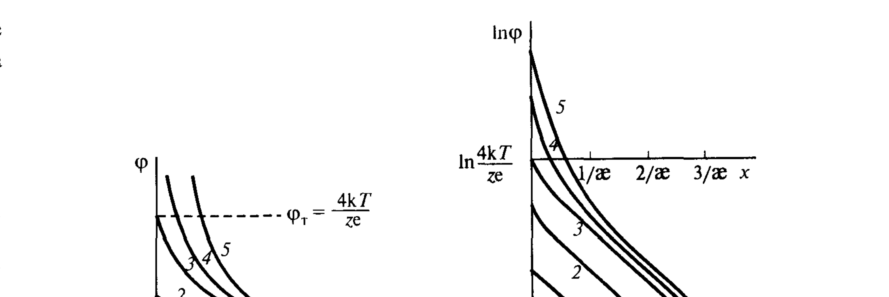
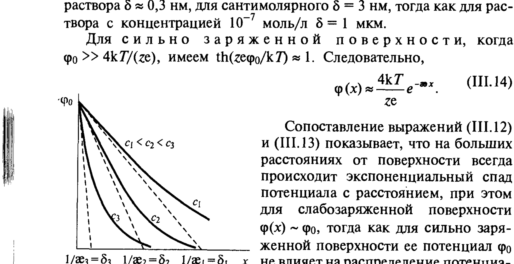

# Билет 36. Теория ДЭС по Гуи–Чепмену. Уравнение Пуассона–Больцмана для слабо- и сильнозаряженных поверхностей

> [!note] Связь с билетом 35
> Билет 35 разобрал причины образования ДЭС, модель Гельмгольца и качественную картину перехода к диффузной модели Гуи–Чепмена и схеме Штерна–Грэма (см. [[билет_35]]). Здесь — полный количественный вывод: уравнение Пуассона–Больцмана, его решение и анализ предельных случаев слабо- и сильнозаряженной поверхности.

## Тема 1: Постановка задачи — уравнение Пуассона и распределение Больцмана

> [!note] Диффузная часть ДЭС
> В диффузной части двойного электрического слоя ионы распределены не жёстко (как в модели Гельмгольца), а статистически — под действием двух противоположных факторов: электростатического притяжения/отталкивания заряженной поверхностью и теплового движения, стремящегося выровнять концентрации по объёму. Результирующее распределение концентраций ионов всех видов $n_i(x,y,z)$ создаёт локальную объёмную плотность заряда $\rho_V$.

Связь плотности заряда с потенциалом даёт **уравнение Пуассона** электростатики:

$$
\rho_V \operatorname{div}(\operatorname{grad}\varphi)=-\rho_V, \qquad \text{т.е.}\qquad \varepsilon\varepsilon_0\nabla^2\varphi=-\rho_V=-\sum_i n_iz_ie. \tag{III.4}
$$

> [!note] Расшифровка обозначений
> - $\varphi=\varphi(x,y,z)$ — электрический потенциал в точке диффузного слоя;
> - $\nabla^2=\dfrac{\partial^2}{\partial x^2}+\dfrac{\partial^2}{\partial y^2}+\dfrac{\partial^2}{\partial z^2}$ — оператор Лапласа;
> - $\varepsilon$ — диэлектрическая проницаемость среды, $\varepsilon_0$ — электрическая постоянная;
> - $\rho_V=\sum_i n_i z_i e$ — объёмная плотность заряда;
> - $n_i$ — локальная (зависящая от координат) концентрация ионов сорта $i$ (число ионов в единице объёма);
> - $z_i$ — заряд иона (с учётом знака), $e$ — элементарный заряд.

Подстановка в (III.4) распределения Больцмана $n_i=n_{i0}\exp\!\left(-\dfrac{z_ie\varphi}{kT}\right)$ (см. [[билет_35]], где это распределение уже введено для качественного анализа) даёт **основное уравнение теории диффузной части ДЭС — уравнение Пуассона–Больцмана**:

$$
\nabla^2\varphi=-\frac{1}{\varepsilon\varepsilon_0}\sum_i z_ien_{i0}\exp\!\left(-\frac{z_ie\varphi}{kT}\right). \tag{III.5}
$$

> [!important] Смысл уравнения Пуассона–Больцмана
> Это нелинейное дифференциальное уравнение в частных производных второго порядка связывает распределение потенциала $\varphi(x,y,z)$ с распределением зарядов, которое, в свою очередь, само определяется этим потенциалом через закон Больцмана. Уравнение должно решаться при заданных граничных условиях для конкретной геометрии (плоская поверхность, сфера и т.д.).

---

## Тема 2: Решение для плоского диффузного слоя — общий случай

Для плоского диффузного слоя у поверхности уравнение (III.5) переходит в одномерное:

$$
\frac{d^2\varphi}{dx^2}=-\frac{1}{\varepsilon\varepsilon_0}\sum_i z_ien_{i0}\exp\!\left(-\frac{z_ie\varphi}{kT}\right). \tag{}
$$

Граничные условия задачи:

> [!note] Граничные условия для диффузного слоя
> 1. **На границе плотного и диффузного слоёв** (граница слоя Штерна–Гельмгольца), $x=d$:
> $$
> \varphi=\varphi_d,\qquad \left(\frac{d\varphi}{dx}\right)_{x=d}=-\frac{1}{\varepsilon\varepsilon_0}\rho_d, \tag{III.6}
> $$
> где $\rho_d$ — заряд диффузной части, приходящийся на единицу площади (см. [[билет_35]] про условие электронейтральности $\rho_s+\rho_d+\rho_\delta=0$).
> 2. **На границе с объёмом раствора**, $x\to\infty$:
> $$
> \varphi\to0,\qquad \frac{d\varphi}{dx}\to0.
> $$

### Случай симметричного бинарного электролита (z:z)

Для электролита $z_+=-z_-=z$, $n_{+0}=n_{-0}=n_0$, уравнение (III.5) принимает вид:

$$
\frac{d^2\varphi}{dx^2}=-\frac{ze n_0}{\varepsilon\varepsilon_0}\left[\exp\!\left(-\frac{ze\varphi}{kT}\right)-\exp\!\left(\frac{ze\varphi}{kT}\right)\right]=\frac{2zen_0}{\varepsilon\varepsilon_0}\,\mathrm{sh}\!\left(\frac{ze\varphi}{kT}\right). \tag{}
$$

> [!tip] Приём интегрирования — гиперболические функции
> Используя гиперболические функции ($\mathrm{sh}$, $\mathrm{ch}$, $\mathrm{th}$) и тождество $\dfrac{d}{dx}\!\left(\dfrac{d\varphi}{dx}\right)^2=2\dfrac{d\varphi}{dx}\dfrac{d^2\varphi}{dx^2}$, уравнение второго порядка сводится к уравнению первого порядка — это стандартный приём для подобных нелинейных задач электростатики.

**Первое интегрирование** (с условием $\varphi\to0$, $d\varphi/dx\to0$ при $x\to\infty$) даёт:

$$
\frac{1}{2}\left(\frac{d\varphi}{dx}\right)^2=\frac{2kTn_0}{\varepsilon\varepsilon_0}\left\{\mathrm{ch}\!\left[\frac{ze\varphi(x)}{kT}\right]-1\right\}=\frac{4kTn_0}{\varepsilon\varepsilon_0}\,\mathrm{sh}^2\!\left[\frac{ze\varphi(x)}{2kT}\right],
$$

откуда

$$
\frac{d\varphi}{dx}=-\sqrt{\frac{8kTn_0}{\varepsilon\varepsilon_0}}\;\mathrm{sh}\!\left[\frac{ze\varphi(x)}{2kT}\right]. \tag{III.6'}
$$

(Знак минус — поскольку $\varphi$ убывает с ростом $x$ для поверхности, заряженной положительно.)

**Заряд диффузного слоя.** Сопоставляя (III.6') с граничным условием (III.6) при $x=d$, получаем выражение для заряда диффузной части ДЭС, приходящегося на единицу поверхности:

$$
\rho_\delta=\varepsilon\varepsilon_0\left(\frac{d\varphi}{dx}\right)_{x=d}=-\sqrt{8\varepsilon\varepsilon_0kTn_0}\;\mathrm{sh}\!\left(\frac{ze\varphi_d}{2kT}\right). \tag{III.7}
$$

> [!important] Знак заряда диффузного слоя (часто спрашивают)
> Знак минус подчёркивает, что при положительном потенциале поверхности (или, точнее, при положительном потенциале границы плотного слоя $\varphi_d$) противоионы диффузной части несут **отрицательный заряд**, т.е. заряд диффузного слоя противоположен по знаку потенциалу $\varphi_d$.

**Второе интегрирование** уравнения (III.6') (с использованием $\int \dfrac{dy}{\mathrm{sh}(y/2)}=\ln\,\mathrm{th}\dfrac{y}{4}+\text{const}$) и применением граничного условия $\varphi=\varphi_d$ при $x=d$ даёт явное распределение потенциала по толщине диффузного слоя:

$$
\mathrm{th}\!\left[\frac{ze\varphi(x)}{4kT}\right]=\mathrm{th}\!\left[\frac{ze\varphi_d}{4kT}\right]e^{-\varkappa(x-d)}, \tag{III.8}
$$

где введён параметр $\varkappa$:

$$
\varkappa=\sqrt{\frac{2z^2e^2n_0}{\varepsilon\varepsilon_0kT}}. \tag{III.9}
$$

> [!note] Расшифровка обозначений (III.7–III.9)
> - $\rho_\delta$ — поверхностная плотность заряда диффузной части ДЭС;
> - $\varphi_d$ — потенциал на границе плотной и диффузной частей слоя (потенциал внешней плоскости Гельмгольца, см. [[билет_35]]);
> - $\varkappa$ — параметр, обратный по размерности длине; $1/\varkappa$ — характерная толщина диффузной части ДЭС, называемая также **толщиной ионной атмосферы Дебая** (по аналогии с теорией Дебая–Хюккеля для сильных электролитов);
> - $n_0$ — концентрация электролита в объёме раствора (число ионов в единице объёма каждого знака);
> - $x-d$ — расстояние от границы плотного слоя.

---

## Тема 3: Толщина диффузного слоя $1/\varkappa$ (дебаевский радиус)

> [!important] Эффективная толщина диффузного слоя
> Величину $1/\varkappa$, характеризующую эффективную толщину диффузного слоя, называют **дебаевской длиной** или **толщиной ионной атмосферы**. Она зависит только от свойств раствора (его диэлектрической проницаемости, температуры, заряда и концентрации ионов электролита) и **не зависит от заряда/потенциала поверхности**.

Для водного раствора 1,1-валентного (z=1) электролита расчёт по (III.9) даёт оценку:

$$
\delta=\frac{1}{\varkappa}\approx 3\cdot10^{-10}\,c^{-1/2}\ \text{м} \quad (c\ \text{выражена в кмоль/м}^3).
$$

> [!example] Численные оценки толщины диффузного слоя
>
> | Концентрация электролита | Толщина диффузного слоя $\delta=1/\varkappa$ |
> |---|---|
> | 1 моль/л (одномолярный раствор) | $\approx 0{,}3$ нм |
> | $10^{-2}$ моль/л (сантимолярный) | $\approx 3$ нм |
> | $10^{-7}$ моль/л | $\approx 1$ мкм |
>
> Видно, что разбавление раствора на 5 порядков увеличивает толщину диффузного слоя примерно на 4 порядка — диффузный слой становится макроскопически толстым в очень разбавленных растворах.

> [!warning] Не путать $1/\varkappa$ с реальной "толщиной слоя жидкости"
> $1/\varkappa$ — это масштаб экспоненциального спада потенциала, а не физическая граница, на которой потенциал обрывается. Потенциал убывает плавно и асимптотически стремится к нулю на расстояниях порядка нескольких $1/\varkappa$.

---

## Тема 4: Предельные случаи — слабо- и сильнозаряженная поверхность

Общее решение (III.8) удобно проанализировать в двух предельных случаях по величине безразмерного параметра $ze\varphi_d/(kT)$.

### Слабозаряженная поверхность: линеаризация (приближение Дебая–Хюккеля)

> [!important] Случай слабого потенциала $ze\varphi_0\ll kT$ (линеаризованное уравнение)
> Когда $ze\varphi_0/(4kT)\ll1$, можно использовать приближение $\mathrm{th}(y)\approx y$ для малых аргументов. Тогда (III.8) упрощается, и распределение потенциала становится **простой экспонентой**:
> $$
> \varphi(x)\approx\frac{4kT}{ze}\,\mathrm{th}\!\left(\frac{ze\varphi_d}{4kT}\right)e^{-\varkappa(x-d)}. \tag{III.10}
> $$
> Если, кроме того, и $ze\varphi_d/(4kT)\ll1$, то $\mathrm{th}(ze\varphi_d/4kT)\approx ze\varphi_d/(4kT)$, и (III.10) переходит в простейшую линейную форму:
> $$
> \varphi(x)\approx\varphi_d\,e^{-\varkappa(x-d)}. \tag{III.11}
> $$

Соответствующая плотность заряда диффузного слоя (III.7) при малых $\varphi_d$ упрощается до:

$$
\rho_\delta\approx-\varepsilon\varepsilon_0\varkappa\varphi_d. \tag{III.12}
$$

> [!tip] Аналогия с плоским конденсатором
> Линеаризованное соотношение (III.12) формально аналогично формуле плоского конденсатора $\rho=\varepsilon\varepsilon_0\varphi/\delta$ с "толщиной" $\delta=1/\varkappa$ — отсюда и название "эффективная толщина диффузного слоя".

### Сильнозаряженная поверхность

> [!important] Случай большого потенциала $ze\varphi_0\gg kT$
> Когда $ze\varphi_0/(kT)\gg1$ (т.е. $\mathrm{th}(ze\varphi_0/kT)\approx1$), распределение потенциала вблизи поверхности **перестаёт зависеть от величины самого $\varphi_0$** и приобретает универсальную форму:
> $$
> \varphi(x)\approx\frac{4kT}{ze}\,e^{-\varkappa x}. \tag{III.13}
> $$

> [!warning] Ключевой вывод — независимость от $\varphi_0$ при больших потенциалах (частая ошибка)
> Сопоставление (III.12) и (III.13) показывает: на **больших расстояниях** от поверхности всегда происходит экспоненциальный спад потенциала, причём для **слабозаряженной** поверхности $\varphi(x)\sim\varphi_0$ (пропорционально начальному потенциалу), тогда как для **сильнозаряженной** поверхности её потенциал $\varphi_0$ **не влияет** на распределение потенциала в удалённых частях диффузного слоя — там потенциал стремится к универсальному пределу $\varphi_T=4kT/(ze)$. Это связано с сильным экранированием противоионами вблизи сильно заряженной поверхности.

*Рис. III-12. Зависимость потенциала $\varphi$ (а) и его логарифма $\ln\varphi$ (б) от расстояния от поверхности при различных значениях $\varphi_0$-потенциала: кривые 1–5 отвечают возрастающим значениям $\varphi_0$. На графике (б) видно, что при больших $x$ все кривые выходят на общую асимптоту с предельным значением $\ln(4kT/ze)$ — это и есть независимость "хвоста" распределения от $\varphi_0$ для сильнозаряженной поверхности (Щукин, рис. III-12)*

---

## Тема 5: Влияние концентрации электролита на распределение потенциала

> [!note] Качественная картина
> При увеличении концентрации электролита параметр $\varkappa$ растёт (см. III.9, $\varkappa\propto\sqrt{c}$), т.е. толщина диффузного слоя $1/\varkappa$ уменьшается — диффузный слой "сжимается" к поверхности, и потенциал спадает на более коротких расстояниях.

*Рис. III-11. Влияние концентрации электролита на падение потенциала $\varphi(x)$ в двойном электрическом слое: $c_1<c_2<c_3$, соответственно $\delta_1>\delta_2>\delta_3$ — с ростом концентрации толщина диффузного слоя уменьшается (Щукин, рис. III-11)*

> [!important] Связь с устойчивостью дисперсных систем (часто спрашивают)
> Сжатие диффузного слоя при увеличении концентрации электролита — ключевой механизм, лежащий в основе **электростатической составляющей расклинивающего давления** и теории **ДЛФО**: чем тоньше диффузный слой (меньше $1/\varkappa$), тем на более коротких расстояниях затухает электростатическое отталкивание между частицами, и тем легче происходит их сближение и коагуляция (см. [[билет_47]], [[билет_48]], [[билет_52]], [[билет_53]]).

---

## Тема 6: Сферическая геометрия (для коллоидных частиц)

> [!note] Уравнение Пуассона–Больцмана в сферических координатах
> Для сферической частицы радиусом $R$ с потенциалом $\varphi_0$ на поверхности уравнение Пуассона–Больцмана для симметричного $z$:$z$-электролита в линеаризованном (дебай-хюккелевском) приближении принимает вид:
> $$
> \frac{1}{R^2}\frac{d}{dR}\left(R^2\frac{d\varphi}{dR}\right)=\varkappa^2\varphi(R). \tag{III.15}
> $$
> Решением, убывающим на бесконечности, является:
> $$
> \varphi(R)=\varphi_0\,\frac{R_0}{R}\,e^{-\varkappa(R-R_0)},
> $$
> где $R_0$ — радиус частицы. Видно, что для сферической частицы потенциал убывает быстрее, чем для плоской поверхности — добавляется множитель $R_0/R$, отражающий "разбавление" поля при удалении в трёх измерениях.

> [!example] Применимость дебаевского приближения
> Линеаризованное (дебай-хюккелевское) рассмотрение справедливо при малых потенциалах поверхности ($ze\varphi_0\ll kT$, что при комнатной температуре соответствует $\varphi_0\lesssim 25$ мВ для $z=1$). Для типичных коллоидных частиц с $\zeta$-потенциалом порядка десятков милливольт это приближение часто оказывается лишь грубой оценкой, и в более точных расчётах нужно использовать полное нелинейное уравнение (III.5).

---

## Источники

- Щукин Е.Д., Перцов А.В., Амелина Е.А. Коллоидная химия, 3-е изд. — раздел III.3 «Адсорбция ионов; строение двойного электрического слоя», с. 146–153: уравнение Пуассона (III.4), уравнение Пуассона–Больцмана (III.5), вывод для симметричного электролита, граничные условия (III.6), интегрирование (III.6'–III.9), толщина диффузного слоя $1/\varkappa$ и численные оценки, предельные случаи слабо- и сильнозаряженной поверхности (III.10–III.14), рис. III-11 и III-12, сферическая геометрия (III.15).
- Численная оценка $\varphi_0\lesssim25$ мВ для применимости линейного приближения при $z=1$, T≈298 K — стандартная оценка из теории Дебая–Хюккеля/электрокинетики (дополнение, не из Щукина).
