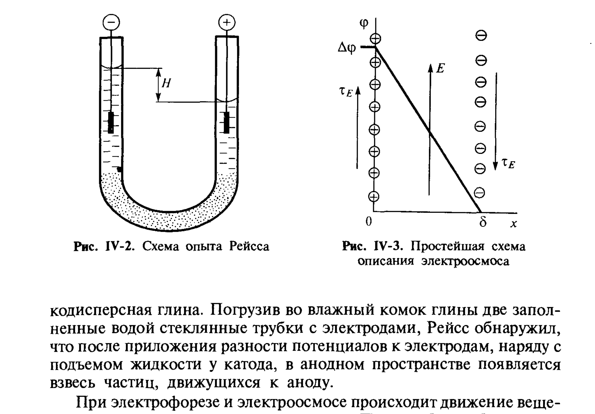
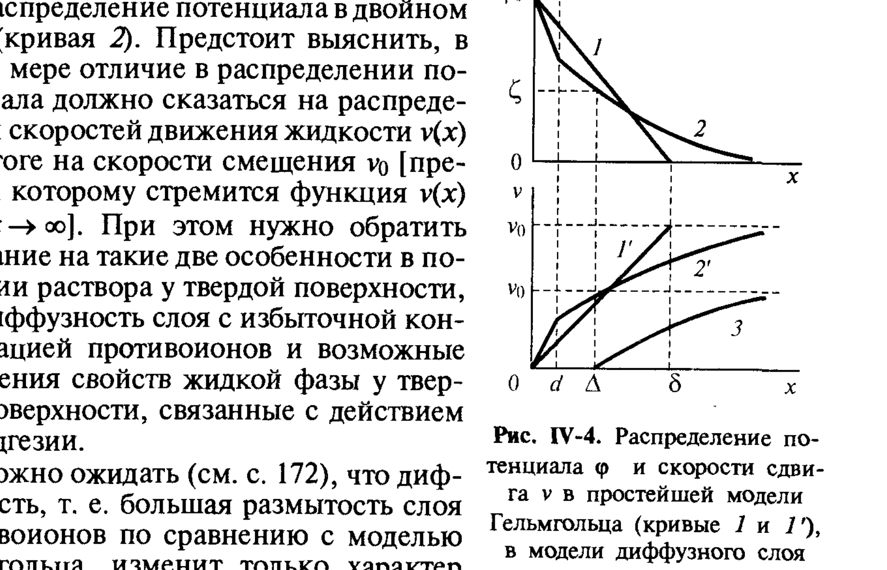

# Билет 37. Электрокинетические явления: электрофорез, электроосмос, потенциалы течения и оседания. ζ-потенциал, граница скольжения. Уравнение Гельмгольца–Смолуховского

## Тема 1: Открытие и классификация электрокинетических явлений

> [!note] Историческая справка
> Электрокинетические явления были впервые обнаружены профессором Московского университета **Ф.Ф. Рейссом (1808)**, который исследовал закономерности электролиза. Рейсс предотвращал взаимодействие продуктов электролиза с дисперсионной средой, помещая электроды в отдельные U-образные трубки, заполненные диафрагмой из тонкого песка (рис. IV-2).

*Рис. IV-2. Схема опыта Рейсса — U-образные трубки с увлажнённой глиной и электродами; при пропускании тока уровень жидкости у катода поднимается, а в анодном пространстве появляется взвесь частиц глины, движущихся к аноду. Рис. IV-3. Простейшая схема описания электроосмоса в модели Гельмгольца: линейное падение потенциала $\Delta\varphi$ в слое толщиной $\delta$, электрическое поле $E$ и сдвиговые напряжения $\tau_E$ (Щукин, рис. IV-2, IV-3)*

> [!important] Четыре электрокинетических явления (часто спрашивают на экзамене)
> При пропускании постоянного электрического тока через систему с пористой диафрагмой Рейсс обнаружил **электроосмос** — перенос дисперсионной среды (жидкости) через пористую перегородку или капилляр под действием электрического поля. Позднее были обнаружены и три родственных явления:
>
> | Явление | Что является причиной (внешним воздействием) | Что наблюдается (следствие) |
> |---|---|---|
> | **Электрофорез** | Внешнее электрическое поле | Направленное перемещение **дисперсной фазы** (частиц) относительно неподвижной дисперсионной среды |
> | **Электроосмос** | Внешнее электрическое поле | Направленное перемещение **дисперсионной среды** относительно неподвижной дисперсной фазы (через пористую диафрагму или капилляр) |
> | **Потенциал течения** | Принудительное течение жидкости через капилляр/диафрагму под давлением | Возникновение разности электрических потенциалов между концами капилляра |
> | **Потенциал седиментации (оседания)** | Принудительное оседание частиц дисперсной фазы (седиментация) | Возникновение разности электрических потенциалов между верхом и низом сосуда |

> [!note] Принципиальная природа всех четырёх явлений
> Все четыре электрокинетических явления объединены общей физической причиной — наличием на границе раздела фаз **двойного электрического слоя (ДЭС)** (см. [[билет_35]], [[билет_36]]). Электрофорез и электроосмос — это явления, в которых **внешнее поле вызывает движение**; потенциалы течения и оседания — обратные явления, в которых **относительное движение фаз вызывает возникновение поля** (электрического потенциала).

> [!tip] Мнемоника — два электрических явления и два механических
> "Электро-**форез**/**осмос**" — *поле → движение* (электрическая причина, механическое следствие). "Потенциал **течения**/**оседания**" — *движение → поле* (механическая причина, электрическое следствие). Каждой паре "движение фазы" соответствует пара "движение среды": электрофорез ↔ потенциал седиментации (движется дисперсная фаза), электроосмос ↔ потенциал течения (движется дисперсионная среда через неподвижный пористый каркас).

---

## Тема 2: Эксперимент Гельмгольца — модель плоского конденсатора и электроосмотическая скорость

> [!note] Постановка задачи
> Г. Гельмгольц первым высказал предположение, что возникновение электрокинетических явлений связано с пространственным разделением зарядов на границе фаз — то есть с ДЭС.

В простейшей модели Гельмгольца (рис. IV-3) ДЭС рассматривается как плоский конденсатор: разноимённые заряды поверхности и противоионов сосредоточены в обкладках, разделённых расстоянием $\delta$ (см. [[билет_35]]).

> [!important] Уравнение Гельмгольца для электроосмотической скорости — вывод
> Рассмотрим плоский капилляр, заполненный жидкостью, к которой приложено внешнее электрическое поле напряжённостью $E$ (тангенциально к поверхности). На единицу площади заряженного слоя действует электрическая сила:
> $$
> \tau_E=\rho_\delta E,
> $$
> где $\rho_\delta$ — поверхностная плотность заряда диффузной части ДЭС.
>
> Для плоского конденсатора (модель Гельмгольца) заряд связан с разностью потенциалов $\Delta\varphi$ соотношением плоского конденсатора:
> $$
> \rho_\delta=\frac{\varepsilon\varepsilon_0\Delta\varphi}{\delta}.
> $$
>
> Тогда сдвиговое напряжение, действующее на жидкость в пределах ДЭС:
> $$
> \tau_E=\frac{\varepsilon\varepsilon_0\Delta\varphi}{\delta}E. \tag{IV.7'}
> $$

В стационарном режиме это электрическое напряжение уравновешивается **вязким сопротивлением среды** по закону Ньютона (см. гл. IV.1):

$$
\tau_\eta=\eta\frac{dv}{dx}, \tag{IV.6}
$$

где $\eta$ — вязкость дисперсионной среды, $dv/dx$ — градиент скорости смещения слоёв жидкости относительно твёрдой поверхности.

> [!note] Расшифровка обозначений
> - $\tau_E$ — касательное (сдвиговое) напряжение, создаваемое электрическим полем;
> - $\tau_\eta$ — касательное напряжение вязкого трения;
> - $\rho_\delta$ — поверхностная плотность заряда диффузного слоя;
> - $E$ — напряжённость внешнего электрического поля;
> - $\Delta\varphi$ — разность потенциалов в пределах двойного слоя (в модели Гельмгольца);
> - $\delta$ — толщина двойного слоя (расстояние между обкладками конденсатора в модели Гельмгольца);
> - $\eta$ — вязкость дисперсионной среды;
> - $v(x)$ — скорость смещения жидкости как функция расстояния $x$ от поверхности;
> - $v_0$ — предельная (макроскопически наблюдаемая) скорость взаимного смещения фаз — скорость электроосмотического потока вдали от поверхности.

Считая $dv/dx$ постоянным в зазоре между обкладками конденсатора толщиной $\delta$, можно записать $dv/dx \approx v_0/\delta$. Приравнивая $\tau_E=\tau_\eta$:

$$
\frac{\varepsilon\varepsilon_0\Delta\varphi}{\delta}E=\eta\frac{v_0}{\delta},
$$

откуда **уравнение Гельмгольца–Смолуховского** для электроосмотической скорости:

$$
v_0=\frac{\varepsilon\varepsilon_0\Delta\varphi}{\eta}E. \tag{IV.7}
$$

> [!important] Замена $\Delta\varphi$ на $\zeta$-потенциал
> При более строгом рассмотрении (с учётом реальной диффузной структуры ДЭС, см. ниже) в уравнении (IV.7) вместо разности потенциалов модели Гельмгольца $\Delta\varphi$ используется **электрокинетический потенциал** $\zeta$:
> $$
> v_0=\frac{\varepsilon\varepsilon_0\zeta}{\eta}E. \tag{IV.8}
> $$
> Это уравнение называют **уравнением Гельмгольца–Смолуховского** — это базовая формула, связывающая макроскопически наблюдаемую электрокинетическую скорость (или, при анализе других электрокинетических явлений, соответствующий потенциал) с $\zeta$-потенциалом.

---

## Тема 3: От модели Гельмгольца к диффузной модели — граница скольжения и $\zeta$-потенциал

> [!note] Ограниченность простой модели Гельмгольца
> Простая модель плоского конденсатора (модель Гельмгольца) даёт лишь первое приближение. Она предполагает резкую границу между неподвижной (вместе с поверхностью) и подвижной частями жидкости на расстоянии $\delta$ от поверхности и линейное падение потенциала в этом зазоре.

В реальности же распределение потенциала в ДЭС описывается диффузной моделью Гуи–Чепмена–Штерна (см. [[билет_35]], [[билет_36]]) — потенциал спадает не линейно, а экспоненциально на масштабе $1/\varkappa$.

> [!important] Граница скольжения (плоскость скольжения)
> При относительном движении твёрдой и жидкой фаз (под действием внешнего поля или механического воздействия) часть жидкости, непосредственно прилегающая к твёрдой поверхности вместе с наиболее прочно связанными ионами **плотной части ДЭС**, остаётся неподвижной и перемещается вместе с твёрдой фазой как единое целое. Реальное относительное смещение фаз происходит по некоторой плоскости, расположенной на расстоянии $\Delta$ от поверхности — эту плоскость называют **границей (плоскостью) скольжения**.
>
> Потенциал в точке, отвечающей границе скольжения, и есть **электрокинетический потенциал** $\zeta$ (дзета-потенциал):
> $$
> \zeta=\varphi(x=\Delta).
> $$

*Рис. IV-4. Распределение потенциала $\varphi$ и скорости сдвига $v$ в простейшей модели Гельмгольца (кривые 1 и 1'), в модели диффузного слоя (кривые 2 и 2') и влияние структуры воды в пристенном слое на скорость смещения $v_0$ (кривая 3). По горизонтали отмечены: $d$ — граница плотной части ДЭС, $\Delta$ — граница скольжения, $\delta$ — толщина диффузного слоя $1/\varkappa$ (Щукин, рис. IV-4)*

> [!warning] Главное различие $\zeta$ и $\varphi_d$ — частая путаница (часто спрашивают)
> $\zeta$-потенциал — это потенциал на границе **скольжения** ($x=\Delta$), а $\varphi_d$ — потенциал на границе **плотной и диффузной частей ДЭС** ($x=d$, см. [[билет_35]], [[билет_36]]). Поскольку граница скольжения обычно находится несколько дальше от поверхности, чем граница плотного слоя ($\Delta\gtrsim d$), в общем случае:
> $$
> |\zeta|\leq|\varphi_d|.
> $$
> Часто, особенно в упрощённых рассмотрениях, $\zeta$ отождествляют с $\varphi_d$ (их близость отмечена и в [[билет_35]]), но строго это лишь приближение — точное положение границы скольжения экспериментально не определяется напрямую.

> [!example] Диффузность слоя и структура воды у поверхности
> Реальная диффузность слоя противоионов (по сравнению с жёсткой моделью Гельмгольца, кривые 1, 1') изменяет характер распределения скоростей смещения слоёв жидкости (кривые 2, 2'). Дополнительно на величину $v_0$ может влиять изменение структуры (вязкости, подвижности) воды в пристенном слое из-за гидратации поверхности и адсорбированных ионов (кривая 3) — это одна из причин расхождений между теоретическими и экспериментальными значениями $\zeta$-потенциала.

---

## Тема 4: Электрофорез — скорость и поправочные коэффициенты

> [!note] Электрофоретическая скорость
> Для электрофореза (движение частиц дисперсной фазы под действием поля $E$) уравнение Гельмгольца–Смолуховского для **плоской** поверхности частицы записывается аналогично (IV.8):
> $$
> v=\frac{\varepsilon\varepsilon_0\zeta}{\eta}E.
> $$

> [!important] Поправка Генри для сферических частиц
> Для частиц **сферической формы** конечного радиуса $a$ уравнение Гельмгольца–Смолуховского требует введения поправочного коэффициента $k_1$, зависящего от соотношения радиуса частицы и толщины диффузного слоя $\varkappa a$:
> $$
> v=k_1\frac{\varepsilon\varepsilon_0\zeta}{\eta}E.
> $$
> - При $\varkappa a\gg1$ (толщина диффузного слоя много меньше радиуса частицы — крупные частицы или концентрированные растворы электролита) $k_1\to1$ — формула Гельмгольца–Смолуховского применима без изменений.
> - При $\varkappa a\ll1$ (тонкие, "точечные" частицы по сравнению с толщиной диффузного слоя — очень малые частицы в разбавленных растворах) $k_1\to2/3$ — это предельный случай, известный как **уравнение Хюккеля**.
>
> Промежуточные значения $k_1$ (от 2/3 до 1) при $0,1\lesssim\varkappa a\lesssim 100$ табулированы (функция Генри).

> [!note] Электрофоретический поток (плотность тока)
> Соотношение между электрофоретической подвижностью частиц, их концентрацией и электрическим полем для плотности потока частиц $j_\kappa$ записывается как:
> $$
> j_\kappa=k_1\frac{\varepsilon\varepsilon_0\zeta n}{\eta}E, \tag{IV.9}
> $$
> где $n$ — числовая концентрация частиц, $E$ — напряжённость поля; $k_1$ — тот же поправочный коэффициент, что и для скорости.

---

## Тема 5: Потенциалы течения и седиментации (обратные явления)

> [!important] Потенциал течения
> При продавливании жидкости через капилляр или пористую диафрагму под действием перепада давления $\Delta P$ происходит механический "снос" подвижной части ДЭС (диффузного слоя) вдоль направления течения, что создаёт разделение зарядов вдоль капилляра — возникает разность потенциалов, называемая **потенциалом течения** $E_\tau$. Соотношение между $E_\tau$ и $\Delta P$ также выражается через $\zeta$-потенциал и параметры системы (вязкость $\eta$, проводимость раствора $\varkappa_{el}$, $\varepsilon\varepsilon_0$):
> $$
> \frac{E_\tau}{\Delta P}=\frac{\varepsilon\varepsilon_0\zeta}{\eta\varkappa_{el}}.
> $$

> [!important] Потенциал седиментации (оседания)
> При оседании (седиментации) заряженных частиц дисперсной фазы под действием силы тяжести (или центробежной силы) их движение относительно неподвижной дисперсионной среды по тому же механизму "сноса" диффузного слоя приводит к возникновению разности потенциалов между верхними и нижними слоями суспензии — **потенциала седиментации** (эффект Дорна). Этот эффект обратен электрофорезу так же, как потенциал течения обратен электроосмосу.

> [!tip] Принцип взаимности (онзагеровская симметрия пар явлений)
> Каждая пара "прямое — обратное" электрокинетическое явление (электроосмос ↔ потенциал течения; электрофорез ↔ потенциал седиментации) описывается формулами с одними и теми же характеристиками системы ($\zeta$, $\varepsilon$, $\eta$, $\varkappa_{el}$) — это следствие общей термодинамики необратимых процессов (соотношения взаимности Онзагера), хотя сам Щукин не углубляется в строгий онзагеровский формализм, ограничиваясь феноменологическим выводом через равновесие сил.

---

## Тема 6: Практическое и теоретическое значение $\zeta$-потенциала

> [!important] $\zeta$-потенциал как экспериментально измеримая характеристика ДЭС
> В отличие от полного скачка потенциала $\varphi_0$ на границе фаз (который не может быть измерен напрямую, см. [[билет_35]] про уравнение Нернста), **$\zeta$-потенциал — это единственная экспериментально доступная количественная характеристика заряженного состояния поверхности** в дисперсной системе. Его определяют по измерению скоростей электрофореза/электроосмоса или по потенциалам течения/седиментации с использованием уравнения Гельмгольца–Смолуховского.

> [!warning] $\zeta$ зависит от состава раствора — связь с устойчивостью
> Поскольку $\zeta$-потенциал определяется распределением потенциала в диффузной части ДЭС, он сильно зависит от концентрации и природы электролита в растворе (сжатие диффузного слоя, специфическая адсорбция ионов — см. [[билет_36]], [[билет_38]]). Именно изменение $\zeta$-потенциала при добавлении электролитов лежит в основе теории коагуляции лиофобных золей (см. [[билет_48]], [[билет_52]], [[билет_53]]).

---

## Источники

- Щукин Е.Д., Перцов А.В., Амелина Е.А. Коллоидная химия, 3-е изд. — раздел IV.2 «Общие представления о природе электрокинетических явлений», с. 168–175: история открытия (опыт Рейсса, рис. IV-2), классификация четырёх электрокинетических явлений, схема электроосмоса (рис. IV-3), вывод уравнения Гельмгольца (IV.6, IV.7) и переход к уравнению Гельмгольца–Смолуховского (IV.8), граница скольжения и $\zeta$-потенциал, рис. IV-4 (распределение потенциала и скорости), поправочные коэффициенты для сферических частиц $k_1$ (предел Хюккеля 2/3, предел Смолуховского 1), уравнение (IV.9) для электрофоретического потока.
- Численные диапазоны применимости поправки Генри ($0,1\lesssim\varkappa a\lesssim100$ — переходная область) — стандартное дополнение из теории электрофореза (не из прямого текста Щукина на указанных страницах, но согласуется с приведёнными предельными случаями).
