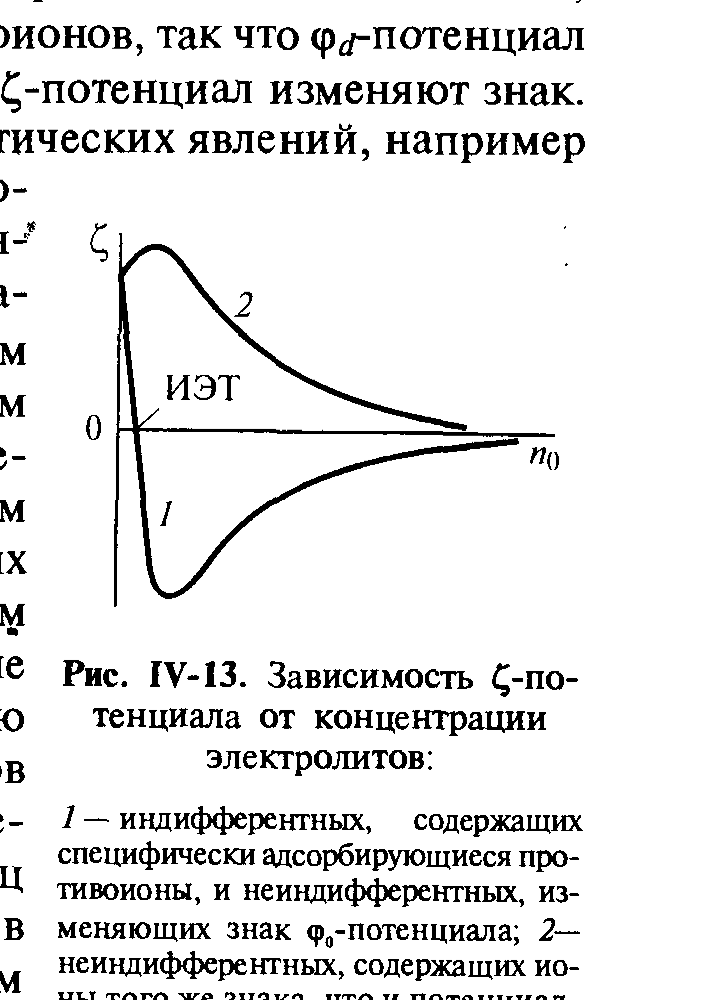
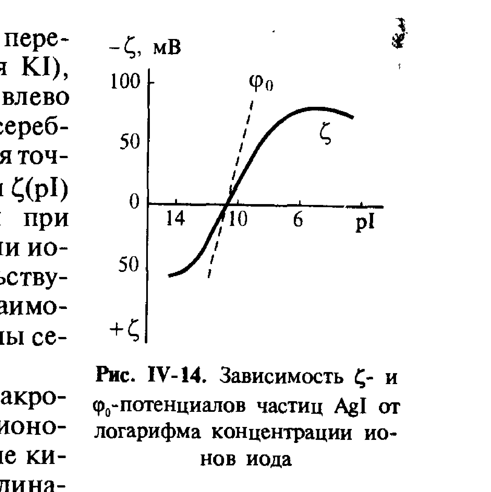

# Билет 38. Влияние индифферентных и неиндифферентных электролитов на ДЭС и ζ-потенциал. Перезарядка поверхности

> [!note] Связь с предыдущими билетами
> Этот билет опирается на представления о строении ДЭС (модель Гельмгольца, диффузная модель Гуи–Чепмена–Штерна, см. [[билет_35]], [[билет_36]]) и определение $\zeta$-потенциала через границу скольжения (см. [[билет_37]]). Здесь рассматривается, как добавление электролитов разной природы изменяет $\varphi_0$- и $\zeta$-потенциалы, вплоть до их изменения знака (перезарядки).

## Тема 1: Классификация электролитов по их влиянию на ДЭС

> [!important] Индифферентные и неиндифферентные электролиты — ключевое разграничение (часто спрашивают)
> В соответствии с рассмотренными представлениями о строении двойного электрического слоя, по характеру влияния на ДЭС электролиты делятся на два класса:
>
> - **Индифферентные электролиты** — электролиты, ионы которых **не способны специфически адсорбироваться** на поверхности и не входят в число потенциалопределяющих ионов исходного двойного слоя. Такие ионы могут влиять на ДЭС только своим присутствием в диффузной части (изменяя ионную силу раствора), но **не изменяют величину $\varphi_0$-потенциала** поверхности.
> - **Неиндифферентные электролиты** — электролиты, содержащие ионы, способные адсорбироваться (специфически или достраивая кристаллическую решётку) и тем самым **изменять величину и/или знак $\varphi_0$-потенциала** поверхности.

> [!tip] Мнемоника
> "Индифферентный" = "безразличный" к составу поверхности — ионы такого электролита просто экранируют существующий заряд, не вмешиваясь в его источник. "Неиндифферентный" — ионы вмешиваются непосредственно в формирование $\varphi_0$, то есть способны выступать в роли потенциалопределяющих ионов (или вытеснять/замещать их) — см. [[билет_35]] про четыре причины образования ДЭС.

---

## Тема 2: Действие индифферентных электролитов — сжатие диффузного слоя

> [!important] Эффект индифферентных электролитов: сжатие двойного слоя без изменения $\varphi_0$
> При введении индифферентного электролита его ионы накапливаются в диффузной части ДЭС в соответствии с распределением Больцмана (см. [[билет_36]]). Поскольку толщина диффузного слоя $1/\varkappa\propto1/\sqrt{c}$ (формула III.9, [[билет_36]]), увеличение концентрации индифферентного электролита приводит к **сжатию диффузного слоя**:
> $$
> 1/\varkappa\ \downarrow \quad\text{при}\quad c\ \uparrow.
> $$
> При этом $\varphi_0$-потенциал поверхности (определяемый соотношением потенциалопределяющих ионов, см. уравнение III.2 в [[билет_35]]) **остаётся неизменным**, однако $\zeta$-потенциал, отвечающий точке на границе скольжения внутри сжимающегося диффузного слоя, по абсолютной величине **уменьшается**.

> [!warning] Почему $\zeta$ уменьшается, хотя $\varphi_0$ не меняется — частая путаница
> Граница скольжения $\Delta$ (см. [[билет_37]]) находится на фиксированном (не зависящем от состава раствора) расстоянии от поверхности. При сжатии диффузного слоя ($1/\varkappa\downarrow$) потенциал спадает на всё более коротких расстояниях (экспоненциально, $\varphi(x)\sim e^{-\varkappa x}$, см. [[билет_36]]), и поэтому значение потенциала именно в точке $x=\Delta$ — то есть $\zeta$ — становится всё меньше по модулю, хотя сама величина $\varphi_0$ на поверхности ($x=0$) не изменилась.

При достаточно высоких концентрациях индифферентного электролита диффузный слой может сжаться настолько, что граница скольжения окажется практически совпадающей с границей плотного слоя, и $\zeta\to0$ — это явление называют **сжатием двойного электрического слоя**.

---

## Тема 3: Действие неиндифферентных электролитов

> [!note] Шесть характерных случаев влияния (по Щукину)
> Изменение свойств поверхности при адсорбции неиндифферентных электролитов зависит от соотношения знаков заряда поверхности и заряда адсорбирующегося иона, а также от того, является ли он потенциалопределяющим. Щукин выделяет следующую характеристику взаимодействия неиндифферентных электролитов с двойным слоем:

> [!important] Случаи изменения знака потенциалов при адсорбции противоположно заряженных ионов (главная часть билета)
> Если неиндифферентный электролит содержит ионы, **способные адсорбироваться с зарядом, противоположным знаку $\varphi_0$-потенциала** (то есть выступающие как противоионы по отношению к существующему заряду поверхности), и при этом склонные к специфической адсорбции, то возможны следующие сценарии в зависимости от концентрации электролита:
>
> 1. **Малые концентрации.** Адсорбция таких ионов в плотной части ДЭС увеличивает заряд $\rho_d$ слоя Штерна–Гельмгольца того же знака, что и противоионы (т.е. противоположного $\varphi_0$). Это приводит к **уменьшению абсолютной величины $\zeta$-потенциала** — диффузная часть теряет часть своего заряда, поскольку он теперь частично компенсируется в плотном слое.
> 2. **Промежуточные концентрации.** При достаточной специфической адсорбции заряд плотной части $\rho_d$ может **превысить по абсолютной величине** заряд поверхности $\rho_s$ (с учётом противоположных знаков). Тогда суммарный заряд "поверхность + плотный слой" $(\rho_s+\rho_d)$ меняет знак на противоположный исходному $\varphi_0$. Соответственно **диффузная часть** ДЭС, которая по условию электронейтральности компенсирует заряд $(\rho_s+\rho_d)$ (см. [[билет_35]], $\rho_s+\rho_d+\rho_\delta=0$), **тоже меняет знак** — а значит, и $\zeta$-потенциал меняет знак на противоположный исходному $\varphi_0$.
> 3. **Высокие концентрации.** При дальнейшем росте концентрации специфически адсорбирующихся противоионов перезаряженный $\zeta$-потенциал может снова приблизиться к нулю или поменять знак ещё раз — в зависимости от конкуренции механизмов сжатия слоя и специфической адсорбции.

> [!important] Перезарядка поверхности (определение)
> **Перезарядкой** называют изменение знака $\zeta$-потенциала (а в некоторых случаях и $\varphi_0$-потенциала) поверхности при адсорбции неиндифферентного электролита, содержащего специфически адсорбирующиеся противоионы. Перезарядка происходит, когда адсорбционное (специфическое, "химическое") взаимодействие противоионов с поверхностью преобладает над их чисто электростатическим притяжением.

*Рис. IV-13. Зависимость $\zeta$-потенциала от концентрации электролитов: кривая 1 — индифферентных электролитов, содержащих специфически адсорбирующиеся противоионы, и неиндифферентных, изменяющих знак $\varphi_0$-потенциала (классическая перезарядка с минимумом и переходом через ноль — ИЭТ); кривая 2 — неиндифферентных электролитов, содержащих ионы того же знака, что и потенциалопределяющие (ζ растёт по модулю без перезарядки) (Щукин, рис. IV-13)*

> [!example] Кривая 1 на рис. IV-13 — типичная "перезарядочная" зависимость
> При малых концентрациях $\zeta$ сначала уменьшается по модулю (этап 1 из перечня выше — экранирование), затем (после прохождения через ноль — изоэлектрическую точку, ИЭТ) приобретает **противоположный знак** и проходит через минимум (этап 2 — специфическая адсорбция доминирует), а при дальнейшем росте концентрации возвращается к нулю за счёт сжатия диффузного слоя нового знака (этап 3).

> [!example] Кривая 2 на рис. IV-13 — без перезарядки
> Если адсорбирующиеся ионы неиндифферентного электролита имеют **тот же знак**, что и исходные потенциалопределяющие ионы (т.е. усиливают существующий заряд поверхности, действуя как дополнительные потенциалопределяющие ионы), то $|\zeta|$ монотонно увеличивается с ростом концентрации электролита — перезарядки не происходит.

---

## Тема 4: Изоэлектрическая точка (ИЭТ)

> [!note] Определение изоэлектрической точки
> **Изоэлектрическая точка (ИЭТ)** — состояние системы (определённое значение концентрации потенциалопределяющих ионов, pH раствора и т.п.), при котором $\zeta$-потенциал поверхности равен нулю.

> [!warning] ИЭТ ≠ точка нулевого заряда (ТНЗ) — частая путаница
> **Точка нулевого заряда (ТНЗ, или изоионная точка)** — состояние, при котором равен нулю **сам $\varphi_0$-потенциал** (заряд поверхности $\rho_s=0$). **Изоэлектрическая точка** — состояние, при котором равен нулю **$\zeta$-потенциал** (заряд на границе скольжения). При наличии специфической адсорбции противоионов в плотной части ДЭС эти точки **не совпадают**: в ТНЗ (где $\varphi_0=0$) специфически адсорбированные ионы плотного слоя могут создавать ненулевой заряд $\rho_d$, который компенсируется диффузной частью — то есть $\zeta\neq0$ в точке, где $\varphi_0=0$, и наоборот.

*Рис. IV-14. Зависимость $\zeta$- и $\varphi_0$-потенциалов частиц AgI от $pI$ (отрицательного логарифма концентрации ионов $I^-$): обе кривые проходят через ноль, но **в разных точках** — это наглядно демонстрирует несовпадение ИЭТ и ТНЗ для системы с потенциалопределяющими ионами $Ag^+/I^-$ (Щукин, рис. IV-14)*

> [!example] Система AgI — классический пример (Г. Крайтон и др.)
> Для золя AgI (потенциалопределяющие ионы $Ag^+$ и $I^-$, см. [[билет_35]]) экспериментально показано, что $\varphi_0(pI)$ и $\zeta(pI)$ — разные кривые, пересекающие ноль при разных значениях $pI=-\lg[I^-]$. По мере увеличения концентрации ионов $I^-$ (уменьшения $pI$, сдвиг влево, добавление KI) система проходит через свою изоионную точку, а затем (при других концентрациях) — через изоэлектрическую точку. Малорастворимые соли серебра — пример системы, где это расхождение хорошо документировано количественно.

---

## Тема 5: Изоэлектрическая точка для амфотерных поверхностей (оксиды, белки)

> [!note] Амфотерные поверхности
> Для **амфотерных гидроксидов** (например, гидроксидов алюминия, железа) поверхностные группы могут как присоединять, так и отдавать протоны $H^+$ в зависимости от pH раствора, выступая в роли потенциалопределяющих ионов $H^+$/$OH^-$. Поэтому для амфотерных поверхностей $\varphi_0$- и $\zeta$-потенциалы являются функциями **pH** раствора, и изоэлектрической точке отвечает определённое значение **pH** — называемое в этом случае также **изоэлектрической точкой по pH**.

> [!example] Белки — изоэлектрическая точка макромолекул
> Для **амфотерных полиэлектролитов** (белков), содержащих различные ионогенные группы (кислотные — например, $-COOH$, и основные — например, $-NH_2$), знак и величина суммарного заряда макромолекулы зависят от pH среды:
> - при pH ниже ИЭТ преобладает диссоциация основных групп → молекула заряжена положительно;
> - при pH выше ИЭТ преобладает диссоциация кислотных групп → молекула заряжена отрицательно;
> - в самой ИЭТ суммарный заряд молекулы равен нулю (число диссоциированных кислотных и основных групп одинаково), хотя локально заряженные группы на поверхности молекулы остаются.
>
> Положение ИЭТ белка определяется соотношением констант диссоциации кислотных $K_{кисл}$ и основных $K_{осн}$ групп:
> $$
> pH_и=\lg K_{кисл}^{1/2}+\lg K_{осн}^{1/2}-\lg K_{вода}
> $$
> (приближённое соотношение Михаэлиса), где $K_{вода}$ — константа диссоциации воды.

---

## Тема 6: Практическое значение перезарядки и изоэлектрической точки

> [!important] Связь с устойчивостью дисперсных систем
> При приближении к ИЭТ ($\zeta\to0$) электростатическая составляющая отталкивания между частицами (см. [[билет_47]], [[билет_48]]) исчезает, что резко снижает агрегативную устойчивость дисперсной системы — в окрестности ИЭТ наблюдается минимум устойчивости и максимум скорости коагуляции (см. [[билет_44]], [[билет_52]], [[билет_53]]).

> [!tip] Практическое применение перезарядки
> Явление перезарядки используется для целенаправленного изменения знака заряда частиц — например, для адсорбционного модифицирования поверхности (нанесение полиэлектролитов противоположного знака, см. [[билет_23]] про правило уравнивания полярностей), при очистке воды (флокуляция с перезарядкой), а также в технологии получения многослойных покрытий методом послойной адсорбции противоположно заряженных полиэлектролитов.

---

## Источники

- Щукин Е.Д., Перцов А.В., Амелина Е.А. Коллоидная химия, 3-е изд. — раздел IV.5 «Влияние электролитов на электрокинетические явления», с. 190–193: классификация индифферентных и неиндифферентных электролитов, сжатие диффузного слоя, влияние специфической адсорбции противоионов на $\rho_d$ и $\zeta$, перезарядка, рис. IV-13 (зависимость $\zeta$ от концентрации электролитов), рис. IV-14 (зависимость $\zeta$ и $\varphi_0$ для AgI от $pI$), изоэлектрическая точка для амфотерных поверхностей и pH.
- Раздел III.3 «Адсорбция ионов; строение двойного электрического слоя», с. 139–153 — базовые представления о строении ДЭС, плотной и диффузной частях, заряде $\rho_s$, $\rho_d$, $\rho_\delta$ и условии электронейтральности (см. [[билет_35]], [[билет_36]]), на которых основан анализ перезарядки в данном билете.
- Соотношение Михаэлиса для ИЭТ белков по константам диссоциации кислотных/основных групп — стандартное дополнение из биофизической химии (не из указанных страниц Щукина), приведено для иллюстрации общности понятия ИЭТ для амфотерных систем.
