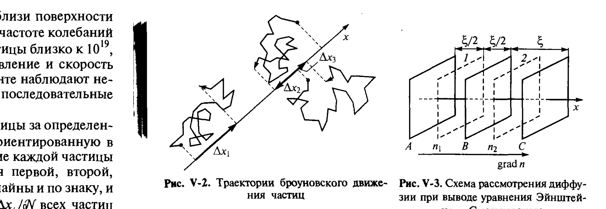

# Билет 40. Броуновское движение и диффузия в дисперсных системах

## Тема 1: Броуновское движение — историческая справка и природа явления

> [!note] Историческая справка
> Хаотическое движение мелких взвешенных частиц было впервые подробно описано английским ботаником **Р. Броуном (1827)**, наблюдавшим в микроскоп беспорядочное движение мельчайших частичек цветочной пыльцы в воде. Брюун убедился, что это явление не связано с жизнедеятельностью клеток (наблюдал его и для частиц неорганических минералов), но не смог объяснить его природу.

> [!important] Молекулярно-кинетическая природа броуновского движения
> Современное объяснение: **броуновское движение** — это результат непрекращающихся хаотических ударов молекул дисперсионной среды (находящихся в тепловом движении) по взвешенным частицам дисперсной фазы. Из-за огромного числа ударов в единицу времени ($\sim10^{19}$–$10^{20}$ ударов в секунду для частицы размером $\sim1$ мкм) и их случайного, нескомпенсированного по направлениям характера результирующая сила, действующая на частицу, непрерывно и хаотически меняется по величине и направлению, вызывая беспорядочные смещения частицы.

> [!example] Численная оценка частоты ударов молекул о частицу
> Число молекул в жидкой дисперсионной среде вблизи поверхности частицы с размером $\sim1$ мкм составляет $\sim10^7$. При частоте колебаний молекул $\sim10^{12}\,c^{-1}$ число ударов о поверхность частицы близко к $10^{19}$, столько же раз за секунду частица меняет направление и скорость своего движения. Поэтому в реальном эксперименте наблюдают не сами мгновенные траектории, а некоторые усреднённые последовательные положения частицы.

---

## Тема 2: Траектория броуновской частицы и среднее квадратичное смещение

> [!note] Регистрация траектории
> Можно скорректировать наблюдение каждой частицы за определённый промежуток времени $\Delta t$ и произвольно ориентированную в пространстве ось $x$ (рис. V-2). Так как перемещение каждой частицы случайно, соответствующие проекции смещения первой, второй, третьей и т.д. частиц $\Delta x_1, \Delta x_2, \Delta x_3 ...$ также случайны и по знаку, и по модулю.

> [!important] Среднее значение смещения равно нулю — но среднее квадратичное смещение нет
> Поэтому **среднее смещение** $\overline{\Delta x}=\dfrac{1}{N}\sum\Delta x_i$ при достаточно большом $N$ оказывается равным нулю $(\overline{\Delta x}\to0$ при отсутствии направленного потока, например, под действием гравитации в седиментирующей дисперсии). Однако величина смещений в среднем увеличивается с ростом времени наблюдения $\Delta t$ — характерным для интенсивности броуновского движения числовым параметром служит не сам $\overline{\Delta x}$, а **среднее квадратичное смещение**:
> $$
> \overline{(\Delta x)^2}=\frac{1}{N}\sum_{i=1}^{N}(\Delta x_i)^2.
> $$
> Среднее квадратичное смещение увеличивается с увеличением времени наблюдения $\Delta t$, и смещение $(\Delta x)^2$ за достаточно длительный промежуток времени связано со случайными смещениями за более короткие промежутки.

*Рис. V-2. Типичная зигзагообразная траектория броуновского движения частицы — последовательные положения частицы, регистрируемые через равные промежутки времени, соединены прямыми отрезками (реальная траектория между точками регистрации значительно сложнее). Рис. V-3. Схема рассмотрения диффузии при выводе уравнения Эйнштейна–Смолуховского: плоскости 1 и 2 на расстоянии $\xi$ друг от друга, через которые частицы переходят за время $\Delta t$ (Щукин, рис. V-2, V-3)*

---

## Тема 3: Диффузия — законы Фика

> [!note] Диффузия как макроскопическое проявление броуновского движения
> **Диффузия** — самопроизвольный процесс выравнивания концентрации вещества в результате теплового (в т.ч. броуновского) движения частиц/молекул, направленный из области с большей концентрацией в область с меньшей.

> [!important] Первый закон Фика
> Поток диффузии $j_д$ (количество вещества, проходящее через единицу площади сечения в единицу времени) пропорционален градиенту концентрации и направлен против него:
> $$
> j_{диф}=-D\frac{dn}{dx}, \tag{V.7}
> $$
> где $D$ — коэффициент диффузии (размерность м²/с), $dn/dx$ — градиент концентрации частиц по координате $x$. Знак минус отражает направление потока — из области большей концентрации в область меньшей.

> [!important] Второй закон Фика
> Закономерности нестационарной диффузии описываются дифференциальным уравнением в частных производных второго порядка:
> $$
> \frac{dc}{dt}=D\frac{d^2c}{dx^2}, \tag{V.8}
> $$
> которое иногда называют **вторым законом Фика**. Его интегрирование позволяет, например, найти распределение концентрации раствора $c(x,t)$ вблизи источника на расстоянии $x$ в момент времени $t$ от некоторого начального распределения.

> [!note] Решение для одномерной диффузии (распределение Гаусса)
> Решение уравнения (V.8) для частицы, начинающей путь из начала координат, имеет вид распределения Гаусса:
> $$
> x(c^*,t)=k\sqrt{2Dt},
> $$
> где константа $k$ является функцией концентрации $c^*$.

---

## Тема 4: Уравнение Эйнштейна для коэффициента диффузии

> [!note] Связь коэффициента диффузии с подвижностью частицы (закон Стокса)
> Сила сопротивления, испытываемая сферической частицей радиусом $r$ при движении в вязкой среде с малой скоростью (ламинарный режим), даётся **законом Стокса**:
> $$
> F=B\cdot v=6\pi\eta r\cdot v,
> $$
> где $B=6\pi\eta r$ — коэффициент трения (сопротивления), $\eta$ — вязкость среды, $v$ — скорость частицы.

> [!important] Уравнение Эйнштейна — вывод коэффициента диффузии (главная формула билета)
> Связь коэффициента диффузии $D$ с размером частицы и вязкостью среды устанавливается через коэффициент трения $B$ — **уравнение Эйнштейна**:
> $$
> D=\frac{kT}{B}=\frac{kT}{6\pi\eta r}. \tag{V.6}
> $$
> Это выражение впервые получено **А. Эйнштейном (1905)**, причём при его выводе совершенно не обходимы вопросы конкретной природы вязкого сопротивления среды $B$ — оно справедливо в неэлектролитической среде для сферических частиц.

> [!note] Расшифровка обозначений
> - $D$ — коэффициент диффузии частицы (м²/с);
> - $k$ — постоянная Больцмана;
> - $T$ — абсолютная температура;
> - $B=6\pi\eta r$ — коэффициент трения по Стоксу;
> - $\eta$ — динамическая вязкость дисперсионной среды;
> - $r$ — радиус частицы (для сферических частиц).

> [!example] Применение уравнения Эйнштейна для определения размера частиц
> Уравнение (V.6) широко используют экспериментально для определения коэффициента диффузии $D$ частиц высокодисперсных систем — затем по уравнению (V.6) находят радиус частицы $r$ при известных $\eta$ и $T$. Для сахарозы в водном растворе экспериментальное значение коэффициента диффузии составило $D\approx0{,}384\,$см²/сут, что согласуется с молекулярным размером сахарозы и её кристаллической структурой.

---

## Тема 5: Уравнение Эйнштейна–Смолуховского — вывод среднего квадратичного смещения

> [!important] Вывод уравнения Эйнштейна–Смолуховского (полный вывод — часто спрашивают)
> Рассмотрим элементарный объём дисперсной системы, разделённый на тонкие слои толщиной $\xi$ (рис. V-3). Пусть в некоторый момент времени концентрации частиц в двух соседних слоях 1 и 2, отстоящих друг от друга на расстояние $\xi$ между средними точками, равны $n_1$ и $n_2$.
>
> За время $\Delta t$ из-за хаотичности броуновского движения каждая частица в каждом слое смещается на расстояние $\xi$ влево или вправо с вероятностью $1/2$ для каждого направления (предполагается, что за время $\Delta t$ частица смещается ровно на $\xi$ — упрощающее предположение схемы). Тогда из плоскости 1 в плоскость 2 переходит $\frac{1}{2}n_1$ частиц, а из плоскости 2 в плоскость 1 — $\frac{1}{2}n_2$ частиц (на единицу площади). Результирующий поток частиц через среднюю плоскость $B$ составляет:
> $$
> j_д=\frac{n_1-n_2}{2\Delta t}\xi.
> $$
>
> При этом градиент концентрации, отвечающий ee изменению на расстоянии $\xi$ между средними точками 1 и 2, равен:
> $$
> \frac{dn}{dx}=\frac{n_2-n_1}{\xi}.
> $$
>
> Сопоставляя закон Фика (V.5) с этими уравнениями, можно записать:
> $$
> j_д=\frac{n_1-n_2}{2\Delta t}\xi=-D\frac{n_2-n_1}{\xi}.
> $$
>
> Отсюда получаем соотношение:
> $$
> \xi^2=2D\Delta t. \tag{}
> $$

> [!important] Уравнение Эйнштейна–Смолуховского (итоговая формула)
> Установленное **Эйнштейном и Смолуховским (1905–1906)** соотношение между **средним квадратичным сдвигом** $\overline{\xi^2}$ (или $\overline{\Delta x^2}$) частицы за время $\Delta t$ и коэффициентом диффузии $D$:
> $$
> \overline{\Delta x^2}=2D\Delta t. \tag{V.5}
> $$
> Подставляя сюда выражение Эйнштейна для $D$ (V.6), получаем итоговую связь среднего квадратичного смещения с молекулярными параметрами:
> $$
> \overline{\Delta x^2}=\frac{kT}{3\pi\eta r}\Delta t.
> $$

> [!warning] Важность статистического (макроскопического и микроскопического) смысла
> Соотношение $\overline{\xi^2}=2D\Delta t$ замечательно тем, что через коэффициент диффузии $D$ оказались сомкнуты **макроскопическое** (наблюдаемое в опытах по диффузии, $D$ из уравнения V.7–V.8) и **микроскопическое** (наблюдаемое под микроскопом для отдельных частиц, $\overline{\xi^2}$) описания процесса диффузии — это один из первых примеров строгой связи между статистической механикой отдельных частиц и термодинамическими (макроскопическими) величинами.

---

## Тема 6: Экспериментальная проверка — опыты Перрена и Сведберга

> [!important] Экспериментальная проверка теории — опыты Ж. Перрена и Т. Сведберга
> Проверка теории броуновского движения была осуществлена многими учёными (Т. Сведберг, А. Вестгрен, Ж. Перрен, Л. де Бройль и др.) как при наблюдении за отдельными частицами, так и при изучении диффузии в дисперсионной среде. При этом изучали разные параметры (температура, вязкость дисперсионной среды, размер частиц и др.), но во всех случаях изменение измеряемого среднего квадратичного смещения $\overline{\Delta x^2}$ описывалось уравнением Эйнштейна–Смолуховского с высокой точностью.

> [!example] Численная проверка — определение постоянной Больцмана/Авогадро
> Перенос членов в уравнении (V.5) с учётом (V.6) позволяет выразить постоянную Больцмана $k$ через измеряемые величины:
> $$
> k=\frac{6\pi\eta r\,\overline{\Delta x^2}}{2\Delta t},\qquad N_A=R/k.
> $$
> Такие измерения, проведённые Перреном с сотрудниками на суспензии гуммигута, дали значение $N_A\approx(5{,}6\div9{,}4)\cdot10^{17}$, близкое к полученному из других независимых методов значение $N_A\approx6{,}03\cdot10^{23}$ моль⁻¹ (числа в оригинальном тексте Щукина приведены в исторических, отличных от современных, единицах — порядок величины и принцип согласования с независимыми методами важнее точного числового совпадения).

> [!tip] Историческое значение опытов Перрена
> Опыты Перрена считаются одним из решающих экспериментальных подтверждений **молекулярно-кинетической теории** и реальности существования атомов и молекул — именно за эти эксперименты Перрен был удостоен Нобелевской премии по физике (1926). Это пример того, как изучение коллоидных систем (видимых под обычным микроскопом частиц) позволило получить информацию о невидимом молекулярном мире.

---

## Тема 7: Вращательное броуновское движение

> [!note] Вращательная диффузия
> Помимо поступательного (трансляционного) броуновского движения, частицы испытывают также **вращательное броуновское движение** — хаотическое изменение ориентации частицы под действием случайных моментов сил со стороны молекул среды.

> [!important] Коэффициент вращательной диффузии
> По аналогии с поступательной диффузией, вращательное броуновское движение характеризуется **средним квадратом угла поворота** частицы $\overline{\Delta\varphi^2}$ за время $\Delta t$, связанным с коэффициентом вращательной диффузии $D_{вр}$ соотношением, аналогичным уравнению Эйнштейна–Смолуховского:
> $$
> \overline{\Delta\varphi^2}=2D_{вр}\Delta t.
> $$
> Коэффициент вращательной диффузии для сферической частицы определяется по формуле, аналогичной уравнению Эйнштейна (V.6), но с заменой коэффициента поступательного трения Стокса $6\pi\eta r$ на коэффициент вращательного трения $8\pi\eta r^3$:
> $$
> D_{вр}=\frac{kT}{8\pi\eta r^3}.
> $$

> [!example] Применение вращательной диффузии
> Измерение коэффициента вращательной диффузии (например, методами деполяризации флуоресценции или динамического рассеяния света) позволяет определять не только размер, но и **форму (анизометрию)** частиц — для несферических (палочкообразных, дискообразных) частиц $D_{вр}$ существенно отличается от значения для сферы того же объёма, что используется для оценки степени асимметрии молекул и наночастиц.

---

## Тема 8: Значение броуновского движения и диффузии для устойчивости дисперсных систем

> [!important] Связь с агрегативной и седиментационной устойчивостью
> Интенсивность броуновского движения определяет, способна ли дисперсная система противостоять седиментации под действием силы тяжести: если характерное броуновское смещение за разумное время сопоставимо с размерами системы, частицы не успевают осесть — устанавливается **седиментационно-диффузионное равновесие** (см. [[билет_41]]). Кроме того, броуновское движение обеспечивает частоту столкновений частиц, необходимую для протекания коагуляции (см. [[билет_44]], [[билет_52]], [[билет_53]]) — частота диффузионных столкновений входит в кинетические уравнения коагуляции.

> [!warning] Граница применимости — крупные частицы
> Для частиц с размером, заметно превышающим $\sim1$ мкм, интенсивность броуновского движения резко падает (среднее смещение $\propto1/r$ по уравнению Эйнштейна), и для таких систем седиментация преобладает над диффузией — броуновское движение перестаёт играть значимую роль в кинетической устойчивости (см. [[билет_42]] про седиментационный анализ грубодисперсных систем).

---

## Источники

- Щукин Е.Д., Перцов А.В., Амелина Е.А. Коллоидная химия, 3-е изд. — раздел V.1 «Седиментация и диффузия в дисперсных системах», с. 195–199: закон Стокса, седиментационный поток (V.1–V.3), диффузионный поток и первый закон Фика (V.4, V.7), уравнение Эйнштейна для коэффициента диффузии (V.6).
- Раздел V.2 «Броуновское движение и флуктуации концентрации частиц дисперсной фазы», с. 200–205: история открытия (Броун, 1827), молекулярно-кинетическая природа, среднее квадратичное смещение, рис. V-2 (траектория) и рис. V-3 (схема вывода Эйнштейна–Смолуховского), второй закон Фика (V.8), уравнение Эйнштейна–Смолуховского (V.5), экспериментальная проверка (Перрен, Сведберг, определение $N_A$), вращательное броуновское движение и коэффициент вращательной диффузии $D_{вр}=kT/(8\pi\eta r^3)$.
- Указание на Нобелевскую премию Перрена (1926) за экспериментальное подтверждение молекулярно-кинетической теории — общеизвестный исторический факт, дополнение не из текста Щукина.
