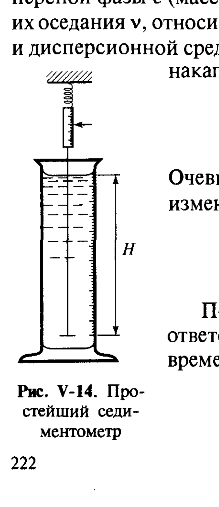
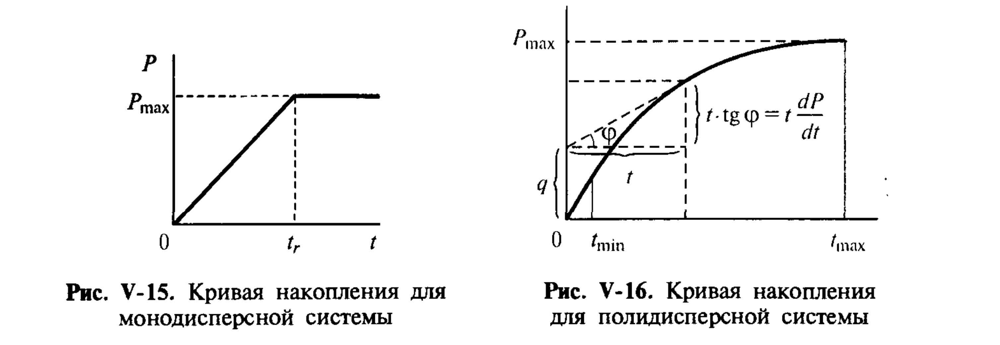
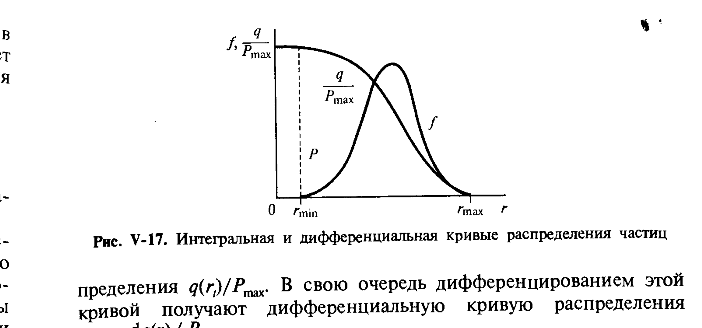

# Билет 42. Седиментационный анализ суспензий и эмульсий

## Тема: Седиментационный анализ как метод дисперсионного анализа

### Общие принципы дисперсионного анализа

> [!note] Определение
> **Дисперсионный анализ** — определение размеров частиц дисперсной фазы и функции их распределения по размерам.

Разные методы дисперсионного анализа в качестве первичной информации дают различные функции распределения, в зависимости от того, какие параметры измеряются в эксперименте; при пересчёте к другим параметрам могут возникать погрешности, величина которых может быть различной в разных интервалах размеров частиц. Соответственно, по-разному определяются и средние размеры частиц. В общем случае средний радиус:

$$\bar r = \frac{\int_0^\infty rf(r)\,\mathrm{d}r}{\int_0^\infty f(r)\,\mathrm{d}r} = \frac{\int_0^\infty r^n f_v(r)\,\mathrm{d}r}{\int_0^\infty r^{n-1}f_v(r)\,\mathrm{d}r}$$

где показатель степени $n$ определяется видом использованной функции распределения.

> [!note] Седиментационный анализ — определение
> **Седиментационный анализ** — распространённый и простой метод определения размеров частиц и функции их распределения по размерам, основанный на различии скоростей оседания в поле силы тяжести частиц разного размера.

В соответствии с уравнением Стокса (V.2, см. [[билет_41]]) скорость оседания (седиментации) пропорциональна квадрату радиуса частиц:

$$v = \frac{2r^2(\rho-\rho_0)g}{9\eta}$$

Поэтому определение скорости седиментации частиц известной плотностью может быть положено в основу определения их размера (для монодисперсной системы) или, если система полидисперсна, — распределения по размерам.

> [!tip] Прямое или косвенное наблюдение
> Как правило, используют **не непосредственное наблюдение** за оседанием отдельных частиц, а изучение изменения во времени какого-либо суммарного параметра, характеризующего состав системы. Так, можно изучать изменение во времени светопропускания системы в тонком слое раствора (фотоседиментационный анализ) или веса осадка — это и есть классический седиментационный анализ.

---

### Простейший седиментометр

Для проведения анализа в хорошо перемешанную дисперсную систему, в которой частицы оказываются равномерно распределёнными по всей высоте $H$ объёма дисперсионной среды, помещается чашечка, и регистрируется изменение во времени $t$ веса $P$ осадка на чашечке.

*Рис. V-14. Простейший седиментометр (по Щукину). Чашечка весов подвешена на высоте $H$ от дна цилиндра с равномерно распределённой суспензией.*

---

### Монодисперсная система: кривая накопления

Для монодисперсной системы зависимость веса осадка $P$ от времени представляет собой прямую линию (рис. V-15).

> [!note] Тангенс угла наклона
> Тангенс угла наклона прямой $P(t)$ к оси абсцисс пропорционален концентрации дисперсной фазы $c$ (массе частиц в единице объёма системы), скорости их оседания $v$, относительной разности плотностей дисперсной фазы и дисперсионной среды $(\rho-\rho_0)/\rho$ и площади чашечки $S$, на которой накапливается осадок:
>
> $$\frac{\mathrm{d}P}{\mathrm{d}t} = \frac{P}{t} = c\left(\frac{\rho-\rho_0}{\rho}\right)vSg$$

Изменение веса осадка связано при этом с изменением его массы $m = cvSt$ соотношением:

$$\frac{\mathrm{d}P}{\mathrm{d}t} = \left(\frac{\rho-\rho_0}{\rho}\right)g\frac{\mathrm{d}m}{\mathrm{d}t}$$

Постоянная скорость накапливания осадка наблюдается вплоть до момента времени $t_r$, по истечении которого все частицы радиусом $r$ полностью осели:

$$t_r = \frac{H}{v} = \frac{9\eta H}{2r^2(\rho-\rho_0)g} \tag{V.18}$$

К моменту $t_r$ вес осадка достигает максимального значения:

$$P_\max = c\left(\frac{\rho-\rho_0}{\rho}\right)SHg, \qquad m_\max = cSH$$

К этому моменту времени полностью оседают и те частицы, которые первоначально находились в самом верхнем слое суспензии — на расстоянии $H$ от чашечки.

В любой промежуточный момент времени $t<t_r$ доля осадка на чашечке составляет:

$$\frac{P(t)}{P_\max} = \frac{m(t)}{m_\max} = \frac{t}{t_r}$$

а относительная скорость накапливания осадка равна:

$$\frac{\mathrm{d}(P/P_\max)}{\mathrm{d}t} = \frac{\mathrm{d}(m/m_\max)}{\mathrm{d}t} = \frac{1}{t_r}$$

В дальнейшем при $t>t_r$ вес осадка на чашечке, естественно, не меняется, и на кривой зависимости $P(t)$ должен появиться **излом** при $t=t_r$.

> [!important] Определение размера частиц по излому
> Значение $t_r$ позволяет определить скорость движения частиц, прошедших путь $H$ за это время: $v = H/t_r$, а следовательно, и размер частиц $r$:
>
> $$r = \sqrt{\frac{9\eta}{2(\rho-\rho_0)g}\cdot\frac{H}{t_r}}$$

*Рис. V-15 (слева). Кривая накопления для монодисперсной системы — прямая до момента $t_r$, затем плато на уровне $P_\max$. Рис. V-16 (справа). Кривая накопления для полидисперсной системы — плавная кривая, на которой выделяются начальный линейный участок (при $t<t_\min$) и конечный участок постоянного веса осадка (при $t>t_\max$).*

---

### Полидисперсная система

> [!note] Функция распределения по размерам
> В реальной полидисперсной системе значения $r$ распределены в некотором интервале от $r_\min$ до $r_\max$, а фракционный состав может быть охарактеризован функцией распределения массы частиц по их размерам $f(r)$:
>
> $$f(r) = \frac{1}{m_\max}\frac{\mathrm{d}m(r)}{\mathrm{d}r}$$
>
> где $f(r)\,\mathrm{d}r$ — доля массы частиц, имеющих радиус в интервале от $r$ до $r+\mathrm{d}r$.

Обычно предполагается, что при седиментации полидисперсной системы частицы различных размеров оседают **независимо друг от друга** и движутся с определённой для каждого размера скоростью $v(r)$. Поэтому вместо характерной для монодисперсной системы постоянной скорости накопления осадка в течение всего времени оседания при седиментации полидисперсных систем происходит непрерывное изменение скорости накопления осадка, и соответственно зависимость веса осадка от времени имеет вид плавной кривой (рис. V-16). На этой кривой выделяются начальный линейный участок (при $t<t_\min$) и конечный участок постоянного веса осадка (при $t>t_\max$).

#### Уравнение Сведберга–Одена

При обработке данных седиментационного анализа обычно используется графическое дифференцирование кривой накопления осадка. Этот способ определения кривой распределения частиц по размерам основан на **уравнении Сведберга–Одена**:

$$P = q + t\frac{\mathrm{d}P}{\mathrm{d}t} \tag{V.??}$$

где $q$ — вес частиц размером, бо́льшим размера частиц $r_t = r(t)$, заканчивающих оседание в момент времени $t$, т. е. всех тех фракций, которые полностью осели к моменту $t$.

> [!note] Физический смысл уравнения Сведберга–Одена
> Скорость увеличения веса осадка $\mathrm{d}P/\mathrm{d}t$ в любой заданный момент времени $t$ обусловлена оседанием частиц размером, **меньшим** $r_t = r(t)$. Поскольку до этого момента накопление таких частиц шло с постоянной скоростью, произведение $t(\mathrm{d}P/\mathrm{d}t)$ представляет собой вес частиц размером $r<r_t$, осевших ко времени $t$ на чашечку седиментометра, а остаток $q = P - t(\mathrm{d}P/\mathrm{d}t)$ — вес более крупных частиц, уже завершивших оседание.

Величина $q$ графически представляет собой отрезок, отсекаемый на оси ординат **касательной к кривой $P(t)$** (см. рис. V-16). Проводя такие касательные к разным точкам кривой и определяя для каждой соответствующие значения $q(r_i)$ и $r_i$, получают данные для построения **интегральной кривой распределения** $q(r_i)/P_\max$.

#### Интегральная и дифференциальная кривые распределения

Дифференцированием интегральной кривой $q(r)/P_\max$ получают **дифференциальную кривую распределения**:

$$f(r) = \frac{\mathrm{d}\big(q(r)/P_\max\big)}{\mathrm{d}r}$$

*Рис. V-17. Интегральная ($q/P_\max$) и дифференциальная ($f$) кривые распределения частиц по размерам. Величина $f(r)$ отлична от нуля при $r_\min<r<r_\max$; значения $r_\min$ и $r_\max$ определяются из времён $t_\max$ и $t_\min$ соответственно.*

---

### Область применимости и факторы, ограничивающие точность

> [!warning] Границы применимости седиментационного анализа
> Седиментационный метод дисперсионного анализа обычно применим лишь для систем, содержащих частицы, радиусы которых лежат в пределах **1–100 мкм**.
>
> - При оседании более **крупных** частиц в маловязких средах (например, в воде) необходимо учитывать отклонения от уравнения Стокса, связанные с турбулентным обтеканием частиц средой, а также вводить поправки на ускорение движения частиц в начале седиментации.
> - На осаждение частиц размером в доли мкм и меньше существенно влияют **диффузионные явления** — в этом случае седиментация перестаёт быть единственным фактором, определяющим движение частиц (см. седиментационно-диффузионное равновесие, [[билет_41]]).

---

### Использование центрифуг и ультрацентрифуг

> [!note] Назначение
> Методы дисперсионного анализа с использованием центрифуг и, особенно, высокоскоростных ультрацентрифуг — одни из наиболее распространённых методов получения молекулярно-массового распределения высокомолекулярных соединений; в меньшей степени они используются для изучения распределения по размерам в коллоидных системах (наночастиц).

При оседании частицы радиусом $r$ в центробежном поле скорость её движения $\mathrm{d}R/\mathrm{d}t$ определяется центробежным ускорением $\omega^2 R$, где $\omega$ — угловая частота вращения ротора центрифуги, $R$ — расстояние частицы от оси вращения:

$$\frac{\mathrm{d}R}{\mathrm{d}t} = \frac{4}{3}\frac{\pi r^3(\rho-\rho_0)\omega^2 R}{B} \tag{V.19'}$$

где $B$ — коэффициент вязкого сопротивления (для сферических частиц $B=6\pi\eta r$). Отсюда:

$$\ln\frac{R}{R_0} = \frac{4/3\,\pi r^3(\rho-\rho_0)}{B}\,\omega^2\Delta t = \frac{m}{B}\left(1-\frac{\rho_0}{\rho}\right)\omega^2\Delta t \equiv S \tag{V.19}$$

где $R_0$ и $R$ — расстояния частицы от оси вращения в начале осаждения и через время $\Delta t$ соответственно; $m$ — масса частицы. Величину $S$ называют **константой седиментации**.

> [!note] Приближённая форма
> Если $\Delta R = R - R_0 \ll R_0$, то выражение (V.19) можно приближённо записать в виде:
>
> $$S \approx \frac{\Delta R}{R_0\,\Delta t\,\omega^2} \tag{V.20}$$

Для **сферических частиц** коэффициент сопротивления $B$ равен $6\pi\eta r$, и соответственно константа седиментации связана с радиусом частиц $r$ соотношением:

$$S = \frac{2r^2(\rho-\rho_0)}{9\eta} \tag{V.21}$$

> [!tip] Согласие методов
> Независимые определения размеров сферических частиц диффузионными методами ($r\propto D^{-1}$) и методами седиментации ($r\propto S^{1/2}$) обычно дают хорошо согласующиеся результаты.

#### Несферические частицы

Для **несферических частиц** коэффициент вязкого сопротивления $B$ зависит не только от размера, но и от формы. Поэтому применение какого-либо одного метода (седиментационного или диффузионного) даёт лишь условный («эквивалентный») радиус частиц, равный радиусу сферической частицы с тем же значением коэффициента диффузии или константы седиментации. Подобные эквивалентные радиусы могут различаться в зависимости от используемого экспериментального метода.

> [!important] Истинный размер несферических частиц
> Для определения истинного размера или массы $m$ несферических частиц, а также для получения сведений об их форме обычно необходимо сочетание двух различных методов — диффузионного и седиментационного, т. е. независимое определение констант седиментации и коэффициентов трения частиц. Произведение этих величин не зависит от формы частиц и пропорционально их массе:
>
> $$SB = m\left(1-\frac{\rho_0}{\rho}\right) \tag{V.22}$$
>
> значение коэффициента вязкого сопротивления $B$ при известной массе частиц характеризует их форму. Подобные исследования получили интенсивное развитие в связи с анализом строения макромолекул из растворов.

---

### Седиментационный анализ с применением центрифуг: методические особенности

При проведении седиментационного анализа с применением центрифуг в случае сравнительно грубодисперсных систем используют **весовые методы** (центробежные весы). Для **высокодисперсных систем** и растворов высокомолекулярных веществ применяют ультрацентрифуги со значениями $\omega^2 R$, доходящими до $10^4 g$, с **оптической системой регистрации** изменения концентрации $c=c(R,\Delta t)$.

> [!example] Метод наслаивания
> При этом часто используют методику наслаивания, когда дисперсная система или раствор полимера наслаивается на чистую дисперсионную среду, в которую затем происходит движение частиц. Если скорости седиментации и диффузии в этих условиях соизмеримы, то даже для **монодисперсной** системы наблюдается размывание фронта оседания (рис. V-18).

#### Влияние диффузии на форму фронта оседания

Можно считать, что процессы седиментации и диффузии частиц дисперсной фазы независимы и их скорости суммируются. Это означает, что кривые рис. V-18 получены из кривой рис. V-1 (изменение распределения концентрации при диффузии, см. [[билет_41]]) путём сдвига начала координат $x=0$, которому отвечает значение концентрации раствора $c=c_0/2$.

> [!warning] Текстовое описание (рисунки V-18, V-19 не извлечены отдельно как изображения)
> **Рис. V-18** — влияние диффузии на изменение формы фронта при центрифугировании монодисперсной системы: кривые $c(R)$ при разных $\Delta t$ ($\Delta t_1<\Delta t_2<\Delta t_3$) показывают постепенное размывание первоначально резкого скачка концентрации в области $R = R_0+\Delta R$.
> **Рис. V-19** — влияние диффузии на форму седиментационных кривых в координатах $c-\Delta R/\Delta t$: с увеличением времени седиментации кривые $c(\Delta R/\Delta t)$ сближаются, что позволяет, экстраполируя к $\Delta t \to 0$, получить «истинную» (неосложнённую диффузией) седиментационную кривую.

В полидисперсных системах размывание фронта оседания связано как с диффузией, так и с различиями в скоростях оседания частиц разных размеров. Если диффузией можно пренебречь, то зависимость $c(R)$ в любой момент времени непосредственно отражает форму интегральной кривой распределения частиц по размерам.

Для получения кривой $q(r_i)/P_\max$ из седиментационной кривой $c(R,\Delta t = \text{const})$ по оси ординат откладывают концентрацию, выраженную в относительных единицах $c/c_0$, а по оси абсцисс — смещение частицы $\Delta R$ за время $\Delta t$, к радиусу частиц $r$ с помощью соотношения (V.22).

В случае пренебрежимо малых скоростей седиментации кривые $c=c(\Delta R/\Delta t)$ для всех времён седиментации совпадают, что позволяет и в полидисперсных системах разделить эффекты, связанные с седиментацией и диффузией.

> [!important] Метод экстраполяции к $\Delta t \to 0$
> Для разделения вкладов седиментации и диффузии кривые представляют в координатах $c - \Delta R/\Delta t$ (рис. V-19). Различие полученных таким способом кривых для разных $\Delta t$ целиком обусловлено вкладом диффузионных процессов в размывание фронта седиментации. На основе анализа изменения формы кривых $c(\Delta R/\Delta t)$ с увеличением времени седиментации может быть определено среднее значение коэффициента диффузии $D$ (или, при более детальном анализе, значения $D$ для различных фракций).
>
> Поскольку диффузионное смещение пропорционально $(\Delta t)^{1/2}$, кривые $c(\Delta R/\Delta t)$ могут быть пересчитаны на нулевое время седиментации $\Delta t = 0$. В результате получают истинную (неосложнённую диффузией) седиментационную кривую. Из этой кривой рассчитывают интегральную кривую распределения частиц по константам седиментации. Затем, используя значения коэффициента $B$, найденные из коэффициента диффузии, от констант седиментации переходят к размерам частиц.

> [!note] Регистрация градиента показателя преломления
> Следует отметить, что в большинстве высокоскоростных центрифуг используют специальную систему, позволяющую регистрировать **градиент показателя преломления**, пропорциональный градиенту концентрации частиц дисперсной фазы. Полученные экспериментальные кривые, сходные по форме с дифференциальными кривыми распределения частиц по размерам, обычно переводят численным интегрированием в кривые зависимости $c(\Delta R)$, а затем рассчитывают величины $D$, $S$, $B$ и размеров частиц.

---

## Источники

**Щукин Е. Д., Перцов А. В., Амелина Е. А. Коллоидная химия**, 3-е изд., М.: Высшая школа, 2004:
- Глава V, §V.5 «Методы дисперсионного анализа», вводная часть, с. 220–221: общие принципы, средний радиус, краткий обзор методов (ситовой анализ, кондуктометрический анализ — счётчики Коултера, рентгеновские методы).
- §V.5.1 «Седиментационный анализ», с. 222–227: простейший седиментометр (рис. V-14), кривые накопления для моно- и полидисперсных систем (рис. V-15, V-16), уравнение Сведберга–Одена, интегральная и дифференциальная кривые распределения (рис. V-17), область применимости (1–100 мкм).
- §V.5.2 «Использование центрифуг и ультрацентрифуг в дисперсионном анализе», с. 225–227: константа седиментации $S$ (V.19–V.21), несферические частицы (V.22), влияние диффузии на форму фронта оседания (рис. V-18, V-19), метод экстраполяции к $\Delta t\to0$.

**Иллюстрации из Щукина:** рис. V-14 (простейший седиментометр), рис. V-15 и V-16 (кривые накопления для моно- и полидисперсной систем), рис. V-17 (интегральная и дифференциальная кривые распределения).
