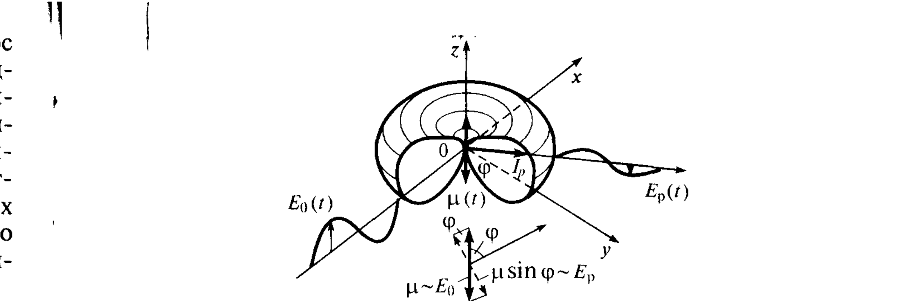
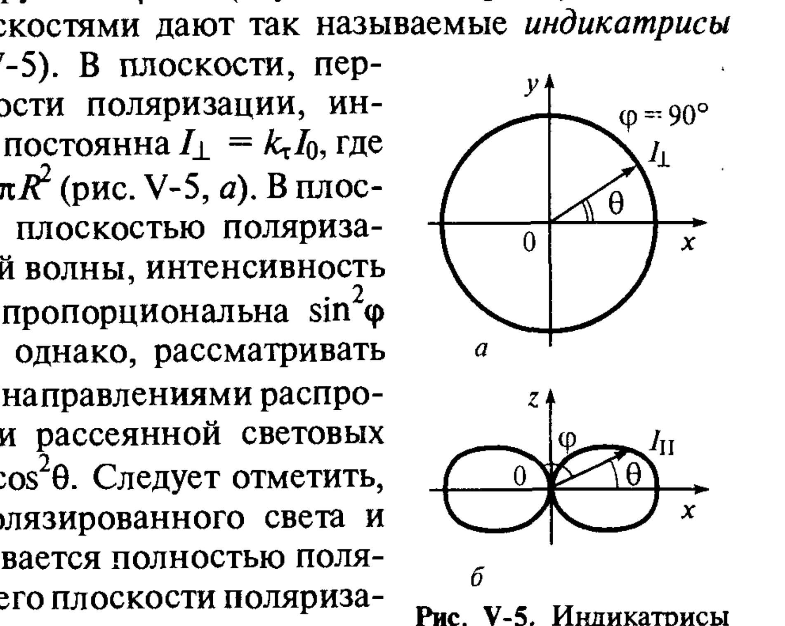
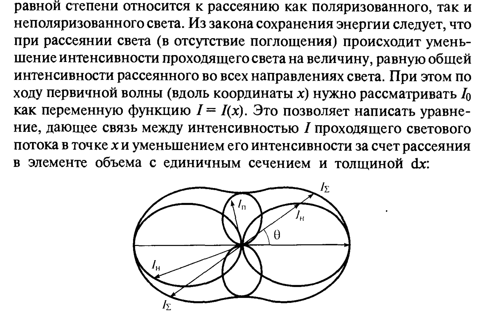
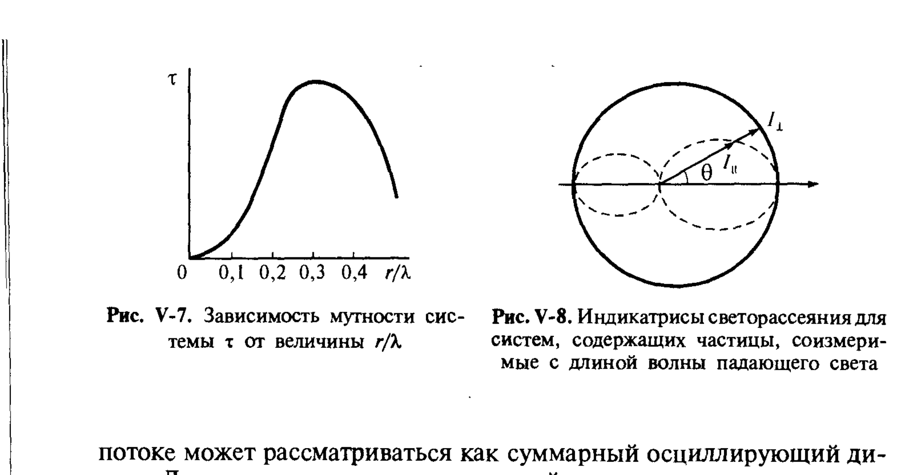
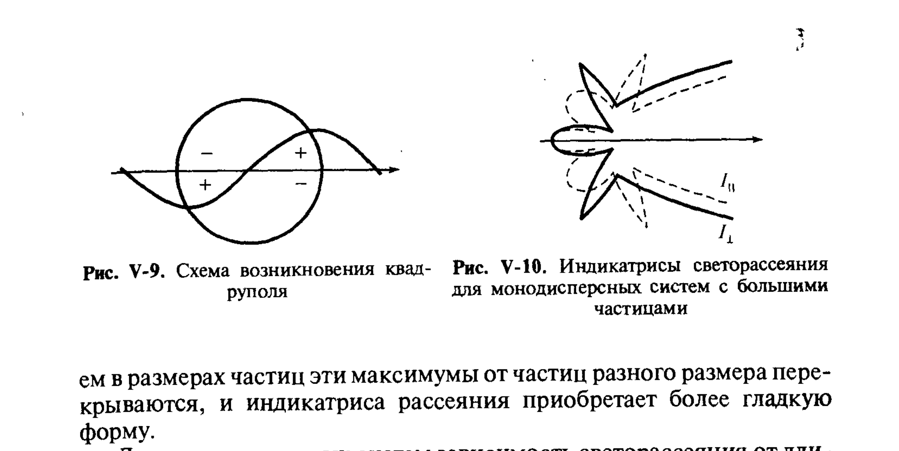
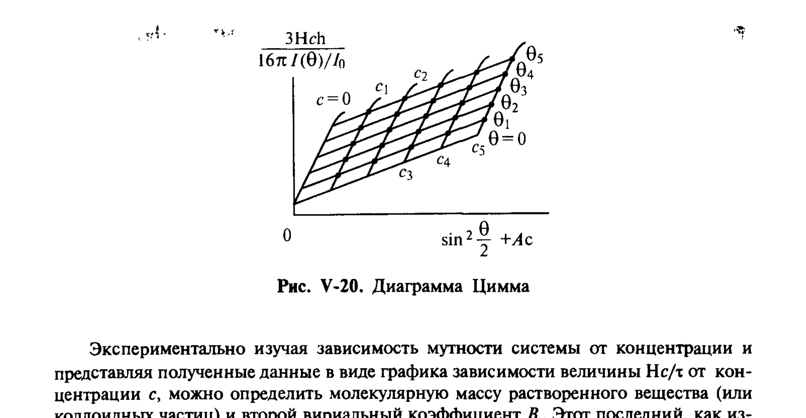

# Билет 43. Оптические свойства дисперсных систем. Уравнение Рэлея и оптические методы

## Тема: Рассеяние света малыми частицами (по Рэлею), оптика крупных частиц и оптические методы дисперсионного анализа

### Введение: оптические явления в дисперсных системах

> [!note] Контекст
> Особым видом процессов переноса в дисперсных системах является проникновение через них различных видов лучистой энергии — прежде всего видимого света, рентгеновских лучей и нейтронов. Закономерности распространения такого излучения определяются соотношением длины волны излучения и размера частиц.

При прохождении видимого света через высокодисперсную систему его длина волны оказывается **больше размера частиц** — это определяет характерные оптические свойства таких систем (релеевское рассеяние). При увеличении размера частиц до значений, соизмеримых с длиной волны, картина рассеяния качественно усложняется.

> [!note] Опалесценция и эффект Тиндаля
> Наиболее характерные оптические свойства дисперсных систем связаны с рассеянием в них света — превращением части падающего излучения во вторичное, распространяющееся в направлениях, отличных от направления распространения первичной световой волны. Это явление называется **опалесценцией** и приводит к возникновению **эффекта Тиндаля**: луч света в дисперсной системе становится видимым.

> [!warning] Опалесценция vs люминесценция
> При опалесценции **не происходит изменения длины волны**; такое рассеяние называют «упругим». Поэтому при освещении системы монохроматическим светом опалесценция имеет тот же цвет. Это отличает опалесценцию от люминесценции (флуоресценции, фосфоресценции), при которой излучаемый свет неполяризован и имеет другую длину волны.

---

## Раздел 1. Рассеяние света малыми частицами (по Рэлею)

### Условия применимости теории Рэлея

Рэлеем рассмотрено рассеяние света в дисперсной системе, удовлетворяющей следующим условиям:

> [!important] Четыре условия Рэлея
> 1. **Размер и форма частиц**: рассеивающие частицы малы и их форма близка к изометричной, так что наибольший размер частиц более чем в 30 раз меньше длины волны падающего света;
> 2. **Оптические свойства**: частицы не окрашены, не проводят электрического тока и оптически изотропны;
> 3. **Концентрация**: концентрация частиц мала, так что расстояние между ними значительно больше длины волны падающего света;
> 4. **Однократность рассеяния**: объём дисперсной системы, через который проходит рассеянный свет, мал, и можно не учитывать вторичное рассеяние света.

### Физический механизм: осциллирующий диполь

По Рэлею рассеяние света связано с возникновением в частице дисперсной фазы переменного (осциллирующего) дипольного момента $\mu(t)$, лежащего в плоскости поляризации световой волны и перпендикулярного направлению её распространения.

*Рис. V-4. Падающая волна $E_0(t)$, осциллирующий диполь $\mu(t)$, рассеянная волна $E_p(t)$ и распределение интенсивности рассеянного света $I_p$.*

Поляризованная световая волна описывается изменением во времени вектора электрической напряжённости:

$$E(t) = E_a\cos\frac{2\pi ct}{\lambda}$$

где:
- $E_a$ — амплитудное значение;
- $c$ — скорость света;
- $\lambda$ — длина световой волны;
- плоскостью поляризации называют плоскость, в которой происходят колебания вектора электрической напряжённости.

Интенсивность $I$ светового луча, т. е. энергия, переносимая волной через единицу площади, нормальной к ней, за единицу времени, пропорциональна $E_a^2$.

Под действием переменного вектора электрической напряжённости падающей поляризованной волны в частице дисперсной фазы возникает избыточный (некомпенсированный по сравнению с дисперсионной средой) дипольный момент $\mu(t) \sim E(t)$. Этот момент является источником рассеянного света.

> [!note] Условия пропорциональности дипольного момента объёму
> При выполнении первых двух условий рэлеевского рассеяния света дипольный момент пропорционален объёму частицы $V$ и параллелен вектору $E$, так что $\mu(t) \sim E(t)V$.

#### Вывод закономерностей рассеяния

Из электродинамики известно, что излучение осциллирующего диполя обладает цилиндрической симметрией относительно его оси, причём интенсивность излучаемой волны пропорциональна квадрату синуса угла $\varphi$ между моментом диполя и направлением распространения рассеянной волны, и второй производной дипольного момента по времени $(\mathrm{d}^2\mu/\mathrm{d}t^2)^2 \sim V^2(\mathrm{d}^2 E(t)/\mathrm{d}t^2)^2$, и обратно пропорциональна квадрату расстояния $R$ от диполя.

> [!important] Цепочка пропорциональностей
> Двойное дифференцирование $E(t)$ с последующим возведением в квадрат приводит к появлению в уравнении Рэлея **четвёртой степени длины волны падающего света** в знаменателе. При малой концентрации частиц свет, рассеянный разными частицами, не интерферирует, поэтому интенсивность рассеянного света **пропорциональна концентрации частиц**.

### Уравнение Рэлея

Общий световой поток $\mathcal{R}$, рассеянный единицей объёма системы во всех направлениях (или энергия, рассеиваемая единицей объёма дисперсной системы за единицу времени), определяется интегрированием уравнения Рэлея (V.15) по сфере:

$$\mathcal{R} = \int_0^\pi I_V(\varphi)2\pi R\sin\varphi\, R\,\mathrm{d}\varphi$$

При рассеянии **поляризованного** света связь интенсивностей падающего на единицу объёма дисперсной системы $I_0$ и рассеянного $I_V$ света описывается выражением:

$$I_V = 9\pi^2\left(\frac{n^2-n_0^2}{n^2+2n_0^2}\right)^2\frac{nV^2}{R^2\lambda^4}\sin^2\varphi\, I_0 \tag{V.15}$$

где:
- $n$ и $n_0$ — показатели преломления частиц и среды соответственно;
- $n$ (во втором множителе) — концентрация частиц;
- $V$ — объём частицы;
- $R$ — расстояние от рассеивающего объёма до точки регистрации интенсивности рассеянного света;
- $\lambda$ — длина волны падающего света;
- $\varphi$ — угол между направлением распространения рассеянной световой волны и осью осциллирующего диполя $\mu(t)$.

Интегрирование уравнения Рэлея по сфере даёт:

$$\mathcal{R} = 24\pi^3\left(\frac{n^2-n_0^2}{n^2+2n_0^2}\right)^2\frac{nV^2}{\lambda^4}I_0 = \tau I_0 \tag{V.16}$$

> [!note] Мутность дисперсной системы
> Величина $\tau$ (м⁻¹) называется **мутностью дисперсной системы**.

> [!important] Резкая зависимость от длины волны и размера частиц
> Уравнение Рэлея предсказывает резкое возрастание интенсивности светорассеяния:
> - с **уменьшением длины волны** падающего света (зависимость $\sim 1/\lambda^4$);
> - с **увеличением размера частиц** (зависимость $\sim V^2 \sim r^6$, разумеется лишь в области применимости первого условия).

> [!example] Голубой цвет неба и красный закат
> Согласно (V.16), мутность при рэлеевском рассеянии резко падает с увеличением длины волны. При освещении системы белым светом преимущественное рассеяние коротких волн определяет **голубую окраску опалесценции** — цвет неба связан с рассеянием света на неоднородностях атмосферы. При прохождении света через большую толщу атмосферы (восход и заход солнца) рассеянный голубой свет теряется из проходящего пучка, обедняя его синими лучами, и проходящий свет приобретает **красную окраску** — типичную картину восхода и заката.

### Индикатрисы светорассеяния

В соответствии с уравнением Рэлея распределение интенсивности рассеянного дисперсной системой поляризованного света в пространстве может быть описано поверхностью вращения функции $\sin^2\varphi$ вокруг оси $\varphi=0$ («бублик без дырки»). Сечения этой поверхности плоскостями дают так называемые **индикатрисы светорассеяния**.

*Рис. V-5. Индикатрисы светорассеяния в плоскостях, перпендикулярной (а) и параллельной (б) оси осциллирующего диполя.*

> [!note] Две плоскости поляризации
> - В плоскости, **перпендикулярной плоскости поляризации**, интенсивность рассеяния постоянна: $I_\perp = k_\tau I_0$, где коэффициент $k_\tau = 3\tau/8\pi R^2$ (рис. V-5, *а* — окружность).
> - В плоскости, **совпадающей с плоскостью поляризации** падающей волны, интенсивность рассеянного света $I_\parallel$ пропорциональна $\sin^2\varphi$ (рис. V-5, *б*).

Удобнее, однако, рассматривать угол $\theta = 90°-\varphi$ между направлениями распространения падающего и рассеянного световых волн, так что $I_\parallel = k_\tau I_0\cos^2\theta$.

> [!important] Полная поляризация при рассеянии вбок
> При рассеянии поляризованного света и рассеянный свет оказывается **полностью поляризованным**, причём в его плоскости поляризации лежат направление распространения рассеянной световой волны и осциллирующий дипольный момент.

#### Рассеяние неполяризованного света

При рассеянии **неполяризованного** света падающий свет можно разложить на две равные по интенсивности составляющие — например, с горизонтальной и вертикальной поляризацией; обе эти составляющие рассеиваются независимо, и интенсивности создаваемых ими световых потоков складываются. Общая интенсивность рассеянного неполяризованного света $I_\Sigma$ по Рэлею равна:

$$I_\Sigma = \frac{9}{2}\pi^2\left(\frac{n^2-n_0^2}{n^2+2n_0^2}\right)^2\frac{nV^2}{R^2\lambda^4}(1+\cos^2\theta)I_0$$

Эту величину можно рассматривать как сумму двух составляющих:
- **неполяризованного** рассеянного света с интенсивностью $I_\text{н}$, пропорциональной $\cos^2\theta$;
- **поляризованного** света с интенсивностью $I_\text{п}$, пропорциональной $1-\cos^2\theta = \sin^2\theta$.

*Рис. V-6. Индикатрисы рэлеевского светорассеяния: $I_\Sigma$ — общая интенсивность рассеянного света; $I_\text{н}$ и $I_\text{п}$ — интенсивность неполяризованного и поляризованного света.*

> [!important] Симметрия рассеяния вперёд/назад при рэлеевском рассеянии
> При рэлеевском светорассеянии картины рассеяния вперёд ($\theta<90°$) и назад ($\theta>90°$) **полностью симметричны**, причём наибольшая общая интенсивность рассеянного света отвечает углам $0°$ и $180°$, а под углом $90°$ свет оказывается полностью поляризованным.

> [!warning] Второе важное отличие опалесценции от люминесценции
> **Поляризация света** — второе важное отличие опалесценции от люминесценции, при которой излучаемый свет неполяризован.

### Закон Бугера–Ламберта–Бера и связь с мутностью

Из закона сохранения энергии следует, что при рассеянии света (в отсутствие поглощения) происходит уменьшение интенсивности проходящего света на величину, равную общей интенсивности рассеянного во всех направлениях света:

$$\mathrm{d}I = -\mathcal{R}\,\mathrm{d}x = -\tau I\,\mathrm{d}x$$

Интегрирование этого выражения даёт **закон Бугера–Ламберта–Бера**:

$$I = I_0 e^{-\tau x}$$

где $I_0$ — интенсивность светового потока в точке $x=0$; $\tau$ — мутность.

> [!note] Экстинкция
> Величину $\tau$ называют также (кажущимся) коэффициентом поглощения. Так как $\tau$ как сомножитель включает концентрацию рассеивающих частиц, $\tau$ представляет собой величину, обратную расстоянию, на котором интенсивность проходящей световой волны падает в $e$ раз. Величина $\varepsilon = \lg I_0/I \approx 0{,}43\tau x$ называется **экстинцией** или **оптической плотностью** системы.

### Зависимость мутности от концентрации, объёма частиц и длины волны

Согласно выражению (V.16), при рэлеевском светорассеянии мутность системы:
- пропорциональна **концентрации** дисперсной фазы;
- пропорциональна **квадрату объёма** частиц дисперсной фазы;
- обратно пропорциональна **четвёртой степени длины волны**.

> [!important] Условие применимости и переход к коагуляции
> Поскольку мутность дисперсной системы при рэлеевском рассеянии резко падает с увеличением длины волны, при их освещении белым светом появляется **красная окраска в проходящем свете**. Мутность также растёт с ростом разности показателей преломления вещества дисперсной фазы $n$ и дисперсионной среды $n_0$. При $\Delta n = n-n_0 \ll n$ можно написать:
> $$\left(\frac{n^2-n_0^2}{n^2+2n_0^2}\right)^2 \approx \frac{4}{9}\left(\frac{\Delta n}{n_0}\right)^2 \tag{V.17}$$

При постоянной весовой концентрации вещества дисперсной фазы в дисперсной системе ($Vn=\text{const}$) мутность системы пропорциональна объёму частиц дисперсной фазы и **растёт при укрупнении частиц**, связанном с их коагуляцией или изотермической перегонкой (см. [[билет_44]], [[билет_45]]). Однако при увеличении частиц до размеров, соизмеримых с длиной волны падающего света, уравнение Рэлея перестаёт выполняться.

---

## Раздел 2. Оптические свойства дисперсных систем при увеличении размера частиц

> [!note] Граница применимости рэлеевского рассеяния
> Закономерности рэлеевского рассеяния соблюдаются для частиц с радиусом $r$, меньшим $0{,}1-0{,}05\,\lambda$. При этом все молекулы, составляющие частицу, поляризуются **в одной фазе**, и частица в световом потоке может рассматриваться как суммарный осциллирующий диполь.

### Несовпадение фаз: появление максимумов мутности

Для частиц, соизмеримых с длиной волны падающего света, поляризация молекул не совпадает по фазе, и возникающий дипольный момент $\mu$ не пропорционален объёму частицы. В результате интенсивность рассеянного света и мутность системы при постоянной объёмной доле (концентрации) вещества дисперсной фазы перестаёт линейно нарастать с увеличением объёма частицы, и на кривой зависимости $\tau(r/\lambda)$ при размере частиц $\sim\lambda/3$ возникает **максимум** (рис. V-7).

*Рис. V-7 (слева). Зависимость мутности системы $\tau$ от величины $r/\lambda$. Рис. V-8 (справа). Индикатрисы светорассеяния для систем, содержащих частицы, соизмеримые с длиной волны падающего света.*

> [!important] Асимметрия рассеяния вперёд/назад
> По отношению к свету, рассеянному в направлениях, близких к направлению проходящего светового потока, осцилляции молекулярных диполей более близки по фазе и складываются. Наоборот, для света, рассеянного в обратном направлении, осцилляции могут оказаться в противофазе, что приводит к резкому уменьшению интенсивности света, рассеянного в обратном направлении (рис. V-8). Таким образом, появляется **асимметрия рассеяния вперёд/назад**, отсутствовавшая при чисто рэлеевском рассеянии (рис. V-6).

### Квадруполи и мультиполи в крупных частицах

Кроме того, в частицах, наряду с дипольными, индуцируются квадруполи (рис. V-9), а в более крупных частицах возникают мультиполи более высокого порядка (рис. V-10). Показано (Г. Ми, Г. Блумер, Р. Ганс и др.), что для таких крупных частиц вид индикатрис рассеяния существенно изменяется: в них появляются резко выраженные экстремумы, число которых тем больше, чем больше размер частиц дисперсной фазы (рис. V-10).

*Рис. V-9 (слева). Схема возникновения квадруполя. Рис. V-10 (справа). Индикатрисы светорассеяния для монодисперсных систем с большими частицами.*

> [!example] Спектры Тиндаля
> Это явление, предсказанное теорией Г. Ми, наблюдал В. Ла-Мер на весьма монодисперсных золях серы (см. [[билет_33]] о нуклеации). Цвет таких золей при освещении белым светом многократно изменяется в зависимости от угла наблюдения, образуя **спектры Тиндаля** различных порядков. В зависимости от размеров частиц наблюдалось различное число порядков спектров; при увеличении частиц усложняется и картина поляризации.

В полидисперсных системах изменения в размерах частиц приводят к тому, что эти максимумы от частиц разного размера перекрываются, и индикатриса рассеяния приобретает более гладкую форму.

### Зависимость R~λ⁻ˣ для полидисперсных систем

Для полидисперсных систем зависимость светорассеяния от длины волны описывается уравнением:

$$\mathcal{R}\sim\lambda^{-x} \tag{V.18}$$

где показатель степени $x$ зависит от радиуса частиц $r$. Теоретическое рассмотрение и экспериментальное изучение светорассеяния показывает, что на вид функции $x(r)$ влияет соотношение показателей преломления вещества дисперсной фазы и дисперсионной среды.

> [!tip] Использование как градуировочной зависимости
> Используя зависимости $x(r)$ при сильном и слабом отличии показателей преломления как градуировочные, можно по экспериментально определённым кривым $\mathcal{R}(\lambda)$ оценить размеры частиц. На этом принципе основаны некоторые современные методы изучения дисперсных систем и растворов ВМС, например метод «спектра мутности» и спектротурбидиметрическое титрование.

### Поглощение света окрашенными и проводящими частицами

Теория Ми и её последователей объясняет также характер рассеяния и поглощения света **проводящими** частицами и частицами, специфически поглощающими свет за счёт собственной окраски вещества дисперсной фазы. В этом случае уменьшение светового потока при прохождении через дисперсную систему обусловлено не только кажущимся поглощением света за счёт рассеяния, но и истинным поглощением света частицами с превращением энергии световой волны в тепловую.

> [!example] Окраска золей золота
> С увеличением дисперсности золей золота максимум поглощения сдвигается в сторону меньших длин волн. Для сравнительно грубодисперсных золей золота характерно довольно слабое истинное поглощение в оранжевой области спектра. Так же происходит и рассеяние света — это приводит к синей или фиолетовой окраске таких золей в проходящем свете и красновато-бурому цвету опалесценции. По мере увеличения дисперсности золя истинного поглощения сдвигается к жёлто-зелёной части спектра, постепенно приближаясь к жёлтому спектру поглощения ионов AuCl₄⁻. Поэтому с повышением дисперсности такие золи меняют свою окраску в проходящем свете, становясь красными (~40 нм), далее зелёными и жёлтыми (при очень высокой дисперсности). Для высокодисперсных золей характерен голубой цвет опалесценции.

> [!note] Применение
> Возможность получения окрашенных золей с самыми различными цветами (усиливающимися за счёт многократного рассеяния) издавна используется для получения красителей и окрашенных стёкол. Например, рубиновые стёкла — это коллоидные растворы золота в стекле ($\sim 10^{-4}\%$).

### Анизотропия и двойное лучепреломление

Ряд специфических оптических свойств наблюдается в системах с частицами дисперсной фазы, обладающими **анизотропией поляризуемости**. При этом ось диполя, наведённого первичной волной в частице, не совпадает с направлением вектора электрической напряжённости падающей световой волны. Это приводит к тому, что дипольные моменты, возникающие в хаотически расположенных частицах при освещении системы поляризованным светом, направлены под различными углами к исходному направлению поляризации. В результате в рассеянной световой волне появляются компоненты света с перпендикулярной поляризацией, т. е. происходит **частичная деполяризация света**.

> [!warning] Рисунок V-12 (схема частичной деполяризации света) не извлечён отдельным файлом — описан текстом выше.

> [!important] Двойное лучепреломление и эффект Максвелла
> Системы с анизотропными и анизометричными частицами проявляют возможность ориентировки частиц под действием внешних сил. При этом не только резко изменяются условия светорассеяния, но и возникает **двойное лучепреломление**, т. е. для лучей со взаимно перпендикулярной поляризацией средние значения показателей преломления оказываются различными. Ориентировка частиц и возникновение двулучепреломления могут быть обусловлены воздействием на дисперсную систему электрического (эффект Керра) или магнитного (эффект Коттона–Мутона) полей, а для анизометричных частиц — течением среды (**эффект Максвелла**).

> [!warning] Различение собственного и формового двойного лучепреломления
> Двойное лучепреломление частицы, характеризуемое разностью показателей преломления необыкновенного $n_e$ и обыкновенного $n_o$ лучей, не зависит от показателя преломления среды и сохраняется в точке $O$, где $n_e=n_o$. Как показано П. Винером, для ориентированных в потоке оптически изотропных, но анизометричных частиц двулучепреломление $n_e-n_o$ пропорционально величине $(n^2-n_0^2)^2$. Для частиц, обладающих собственными оптической анизотропией и анизометрией, эти эффекты складываются.

> [!tip] Как разделить два вклада в двулучепреломление
> Чтобы различить две составляющие двулучепреломления, измеряют зависимость $n_e-n_o$ от показателя преломления среды. Для палочкообразных частиц обнаруживается минимальное двулучепреломление, а для плоских — максимальное (рис. V-13). Двулучепреломление в точке экстремума обусловлено лишь собственной анизотропией частиц.

> [!example] Применение деполяризационных плёнок
> Двулучепреломление может сочетаться с дихроизмом — избирательным поглощением одного из преломлённых лучей. В таком случае дисперсная система с сориентированными частицами может служить эффективным поляризатором света. На этом явлении основано действие поляризационных плёнок, содержащих анизометричные кристаллики, например, герапатит (иодосульфат хинина).

---

## Раздел 3. Оптические методы дисперсионного анализа

> [!note] Связь оптики с дисперсионным анализом
> Изучение особенностей рассеяния света в растворах и коллоидных системах является основой широко распространённых в настоящее время методов дисперсионного анализа и изучения характера взаимодействия молекул в растворах.

### Нефелометрия и абсорбциометрия

Для систем, к которым применимо уравнение Рэлея, методы, основанные на измерении мутности по уменьшению интенсивности прошедшего света (**абсорбциометрия, турбидиметрия**) и по определению интенсивности света, рассеянного под тем или иным углом (**нефелометрия**), при правильном выборе условий эквивалентны.

> [!tip] Относительный метод
> Чаще используют относительный метод: оптические свойства исследуемой системы сопоставляют со свойствами системы с известными концентрацией и размером частиц, и из условия $V^2n=\text{const}$ определяют объём частиц в изучаемой системе (или концентрацию вещества при известном размере частиц).

> [!example] Чувствительность нефелометрии
> Эти методы очень чувствительны: заметная мутность золя сернистого мышьяка может быть обнаружена при концентрации $10^{-3}\%$, а золя золота — даже до $10^{-5}\%$. Нефелометрические методы применимы в широком диапазоне концентраций, в том числе очень низких, тогда как методы абсорбциометрии или турбидиметрии обычно используют при более высоких концентрациях.

> [!warning] Требования к нефелометрическим измерениям
> При нефелометрических исследованиях очень разбавленных систем необходимо тщательно удалять пыль из исследуемой системы и учитывать рассеяние света на флуктуациях плотности и концентрации (см. ниже).

### Ультрамикроскопия

Наряду с изучением рассеяния света дисперсной системой в целом, применяют также методы, основанные на регистрации рассеяния (дифракции) света на единичных частицах — **ультрамикроскопию**, имевшую большое значение в становлении коллоидной химии.

> [!note] Принцип действия
> Для наблюдения рассеяния света отдельными частицами применяют оптические системы с тёмным полем — ультрамикроскопы (сфокусированный световой поток направляется сбоку на исследуемую систему), а также конденсоры тёмного поля (используют на обычных микроскопах для создания бокового освещения). На тёмном фоне хорошо видны светящиеся точки, создаваемые светом, рассеянным отдельными частицами.

Это позволяет определять концентрацию частиц дисперсной фазы, наблюдать флуктуации концентрации и броуновское движение. Такие опыты позволили подтвердить правильность теории броуновского движения и молекулярно-кинетической концепции в целом (см. [[билет_40]]).

> [!example] Метод С. И. Вавилова
> С. И. Вавиловым был разработан метод изучения броуновского движения, основанный на фотосъёмке частиц дисперсной фазы, находящихся в броуновском движении. Перемещение частиц приводило к тому, что их изображения на пластинках имели вид размазанных пятен. В полном согласии с теорией броуновского движения средняя площадь этих пятен оказалась пропорциональной времени экспозиции.

> [!tip] Поточный ультрамикроскоп
> Для определения концентрации частиц дисперсной фазы вместо обычного ультрамикроскопа часто используют разработанный Б. В. Дерягиным и Г. Я. Власенко **поточный ультрамикроскоп**, в котором фиксируется число частиц, проходящих за единицу времени в поле зрения микроскопа при течении дисперсной системы, что позволяет быстро определять среднюю концентрацию частиц в золе. Применение оптико-электронных систем регистрации интенсивностей светового потока от отдельных частиц позволяет получать и кривые распределения частиц по размерам.

### Рассеяние света на флуктуациях концентрации

> [!note] Почему истинные растворы тоже рассеивают свет
> В соответствии с уравнением Рэлея, рассеяние света в гомогенных системах — чистых жидкостях и истинных (молекулярных) растворах — должно быть очень мало из-за малого размера рассеивающих частиц. Однако в действительности и в этих системах происходит заметное рассеяние, связанное с существованием **флуктуаций плотности и концентрации**, служащих рассеивающими центрами. Особенно сильное рассеяние наблюдается в системах, находящихся в состоянии, близком к критическому (см. [[билет_32]] о критических эмульсиях), когда линейные размеры флуктуаций становятся велики и приближаются к длине световой волны.

#### Теория Эйнштейна–Смолуховского для флуктуаций концентрации

Следуя Л. И. Мандельштаму и П. Дебаю, рассмотрим рассеяние света на флуктуациях концентрации. В соответствии с общей теорией флуктуаций Эйнштейна–Смолуховского (см. также [[билет_40]]) средний квадрат флуктуаций концентрации $\overline{\Delta c^2}$ в объёме $V$ определяется производной осмотического давления $\Pi$ по концентрации:

$$\overline{\Delta c^2} = \frac{ckT}{V\,\mathrm{d}\Pi/\mathrm{d}c}$$

Считая, что флуктуация показателя преломления $\Delta n$ пропорциональна флуктуации концентрации $\Delta c$:

$$\Delta n = \frac{\mathrm{d}n}{\mathrm{d}c}\Delta c, \qquad \frac{\mathrm{d}n}{\mathrm{d}c}=\text{const}$$

получаем:

$$\frac{\overline{\Delta n^2}}{n_0^2} = \frac{ckT}{V\,\mathrm{d}\Pi/\mathrm{d}c}\left(\frac{\mathrm{d}n}{\mathrm{d}c}\right)^2\frac{1}{n_0^2} \tag{V.23}$$

Мысленно разделим единицу объёма дисперсной системы на $n'$ равных частей объёмом $V=1/n'$, удовлетворяющим условию $V^{1/3}\ll\lambda$. Тогда, отождествляя каждый микрообъём с частицей дисперсной фазы и применяя уравнения (V.16), (V.17) и (V.23), получаем для мутности:

$$\tau = \frac{32}{3}\pi^3\frac{ckT}{n_0^2\lambda^4\,\mathrm{d}\Pi/\mathrm{d}c}\left(\frac{\mathrm{d}n}{\mathrm{d}c}\right)^2 \tag{V.24}$$

Поскольку $\lambda n_0$ представляет собой длину волны используемого света *в вакууме* $\lambda_v$, выражение может быть также представлено в виде:

$$\tau = \frac{32}{3}\pi^3\frac{n_0^2}{\lambda_v^4}\frac{ckT}{\mathrm{d}\Pi/\mathrm{d}c}\left(\frac{\mathrm{d}n}{\mathrm{d}c}\right)^2$$

> [!note] Независимость от выбора объёма
> В выражение для мутности (V.24) **не входит объём** (условных) флуктуаций, который можно рассматривать как некоторое среднее значение; можно также сказать, что флуктуации в разных объёмах дают равный вклад в мутность системы.

#### Вириальное разложение и определение молярной массы

Применим вириальное разложение для осмотического давления (система не предполагается идеальной):

$$\frac{\mathrm{d}\Pi}{\mathrm{d}c} = \frac{RT}{M}+2B_2c+\ldots \tag{V.25}$$

где $M$ — молярная масса растворённого вещества; $B_2$ — второй вириальный коэффициент; $c$ — концентрация, кг/м³.

Соотношение (V.24) с учётом (V.25) можно записать в виде:

$$\frac{Hc}{\tau} = \frac{\mathrm{d}\Pi}{\mathrm{d}c}\frac{1}{RT} = \frac{1}{M}+\frac{2B_2c}{RT}+\ldots$$

где введено обозначение $H$ (м²·кг⁻³):

$$H = \frac{32}{3}\pi^3\frac{n_0^2}{\lambda_v^4 N_A}\left(\frac{\mathrm{d}n}{\mathrm{d}c}\right)^2$$

> [!important] Метод "двойной экстраполяции" (диаграмма Цимма)
> Экспериментально изучая зависимость мутности системы от концентрации и представляя полученные данные в виде графика зависимости величины $Hc/\tau$ от концентрации $c$, можно определить **молярную массу растворённого вещества** (или коллоидных частиц) и **второй вириальный коэффициент** $B_2$. Этот последний характеризует взаимодействие между растворёнными молекулами (частицами), а для заряженных частиц, например мицелл ионогенных ПАВ, — эффективный заряд частиц.

*Рис. V-20. Диаграмма Цимма: $\dfrac{3Hch}{16\pi I(\theta)/I_0}$ в зависимости от $\sin^2(\theta/2)+Ac$, где $h$ — постоянная прибора, $A$ — произвольная постоянная, выбираемая так, чтобы произведение на максимальную используемую концентрацию раствора было близко к единице.*

> [!note] Учёт угловой зависимости (теория Ми)
> Более общее описание светорассеяния, основанное на теории Ми, показывает, что для частиц большого размера, для которых уравнение Рэлея неприменимо, определение молекулярной массы, второго вириального коэффициента, а также сведений о строении молекул (конформации) возможно, если одновременно с концентрационной зависимостью наблюдают угловую зависимость интенсивности светорассеяния $I(\theta)$ при разных концентрациях. Тогда экспериментальные данные приближённо (при небольших концентрациях) описываются соотношением:
> $$\frac{3}{16\pi}\frac{Hch}{I(\theta)/I_0} = \frac{1}{M}+\frac{2B_2c}{RT}+k_\theta\sin^2\left(\frac{\theta}{2}\right)$$
> где $k_\theta$ зависит от размеров макромолекулы (среднеквадратичного расстояния между концами цепей макромолекулы).

Для более точного определения $M$, $B_2$ и $k_\theta$ используют метод «двойной экстраполяции» (диаграмма Цимма): экспериментальные точки образуют два семейства прямых $c=\text{const}$ и $\theta=\text{const}$. Тангенс угла наклона прямых $\theta=\text{const}$ даёт $B_2$, а тангенс угла наклона прямых $c=\text{const}-k_\theta$. Экстраполяцией получают прямые $\theta=0$ и $c=0$, точка пересечения которых с осью ординат даёт молярную массу $M$.

> [!tip] Связь с другими методами
> В дальнейшем подобный подход используется при рассмотрении электрических свойств аэрозолей.

---

## Источники

**Щукин Е. Д., Перцов А. В., Амелина Е. А. Коллоидная химия**, 3-е изд., М.: Высшая школа, 2004:
- Глава V, §V.3 «Рассеяние света малыми частицами (по Рэлею)», с. 208–212: условия применимости теории Рэлея, осциллирующий диполь, уравнение Рэлея (V.15–V.16), мутность, индикатрисы рассеяния (рис. V-4, V-5, V-6), закон Бугера–Ламберта–Бера, зависимость мутности от концентрации и размера частиц (V.17).
- §V.4 «Оптические свойства дисперсных систем при увеличении размера частиц», с. 213–217: максимум мутности (рис. V-7), асимметрия рассеяния (рис. V-8), квадруполи и мультиполи (рис. V-9, V-10), спектры Тиндаля, зависимость $\mathcal{R}\sim\lambda^{-x}$ (V.18, рис. V-11), поглощение проводящими и окрашенными частицами (золи золота), анизотропия и двулучепреломление (рис. V-12, V-13), эффекты Керра, Коттона–Мутона, Максвелла.
- §V.5.3 «Нефелометрия. Ультрамикроскопия», с. 228: нефелометрия, абсорбциометрия/турбидиметрия, ультрамикроскопия, поточный ультрамикроскоп Дерягина–Власенко, метод С. И. Вавилова.
- §V.5.4 «Рассеяние света на флуктуациях концентрации», с. 229–231: теория Эйнштейна–Смолуховского для флуктуаций концентрации (V.23–V.25), диаграмма Цимма (рис. V-20), определение молярной массы и второго вириального коэффициента.

**Иллюстрации из Щукина:** рис. V-4 (осциллирующий диполь), рис. V-5 (индикатрисы в перпендикулярной и параллельной плоскостях), рис. V-6 (общая индикатриса рэлеевского рассеяния), рис. V-7 и V-8 (мутность и индикатрисы для частиц соизмеримых с λ), рис. V-9 и V-10 (квадруполь и индикатрисы для крупных частиц), рис. V-20 (диаграмма Цимма).
