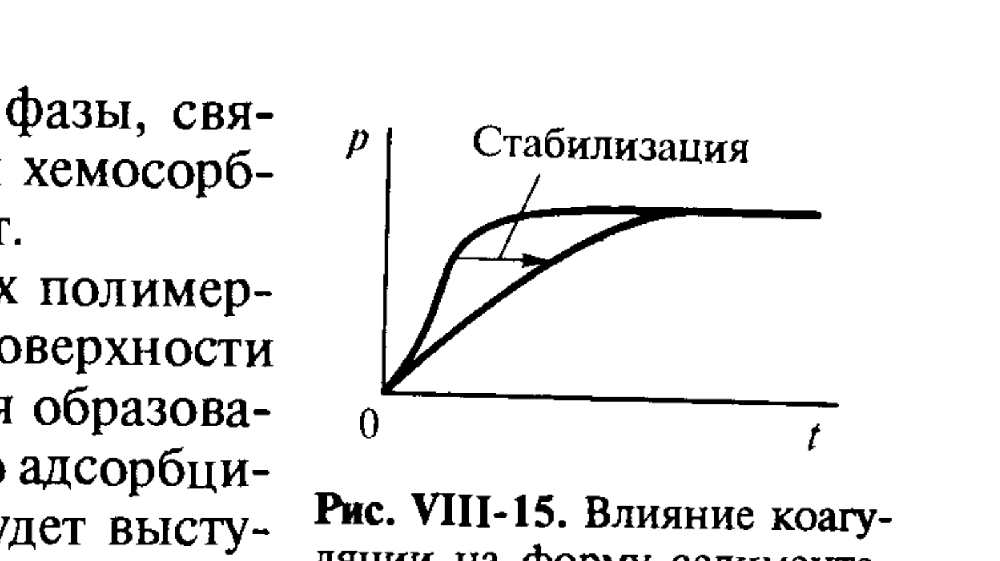

# Билет 45. Обратимость коагуляции. Пептизация. Псевдолиофильные системы

## Тема: Термодинамическая природа агрегативной устойчивости и обратимость коагуляции

### Два типа агрегативной устойчивости

> [!note] Кинетическая и термодинамическая устойчивость
> Природа агрегативной устойчивости дисперсных систем с частицами твёрдой дисперсной фазы и жидкой дисперсионной средой определяется составом этих фаз, дисперсностью и концентрацией частиц.
>
> - Устойчивость гидрозолей при малой концентрации электролита обычно связана с проявлением **электростатической составляющей расклинивающего давления** (см. [[билет_46]], [[билет_47]]), обусловленной перекрытием диффузных частей двойных электрических слоёв — это устойчивость преимущественно **кинетической** природы.
> - Вместе с тем агрегативная устойчивость золя может иметь и **термодинамическую** природу (см. [[билет_44]]). Дисперсная система — золь — обнаруживает термодинамическую устойчивость, если глубина потенциального минимума, характерная для частиц данной дисперсной системы, оказывается меньше выигрыша свободной энергии системы за счёт включения частиц в тепловое движение.

> [!important] Связь с критерием (VII.1)
> Это утверждение — прямое следствие термодинамического критерия пептизации, разобранного в [[билет_44]]:
> $$u_к < \frac{\beta^* kT}{\frac{1}{2}Z} = (10\div15)kT \tag{VII.1}$$
> где $u_к$ — энергия сцепления частиц в контакте, $Z$ — координационное число, $\beta^*\approx10\div20$ — энтропийный коэффициент, $k$ — постоянная Больцмана, $T$ — температура. Если глубина потенциальной ямы взаимодействия частиц $u_к$ меньше указанной величины (порядка $10$–$15\,kT$), агрегирование частиц термодинамически невыгодно — система остаётся в виде золя (свободнодисперсной системы).

---

### Обратимость коагуляции

> [!note] Определение обратимости
> **Обратимость коагуляции** (или, что то же самое, способность коагулята к **пептизации**) — это возможность перехода связнодисперсной системы (агрегата, осадка, коагулята), образовавшейся в результате коагуляции, обратно в свободнодисперсную систему (золь) при изменении внешних условий (например, при удалении избытка коагулирующего электролита, разбавлении, введении пептизатора, изменении температуры).

Согласно изложенному в [[билет_44]], равновесию между процессами агрегирования и пептизации частиц дисперсной фазы отвечает условие $u_к\approx\beta^*kT/(\tfrac12 Z)$, которому соответствует определённая равновесная концентрация частиц в свободнодисперсной системе по отношению к осадку:

$$n_п = n_a\exp\left(-\frac{1}{2}\frac{Zu_к}{kT}\right) \tag{VII.2}$$

где $n_п$ — равновесная концентрация пептизированных (диспергированных) частиц, $n_a$ — концентрация частиц в агрегированном состоянии (осадке).

> [!important] Условное термодинамическое равновесие
> Частицы, описываемые уравнением (VII.2), находятся в состоянии **условного термодинамического равновесия**: для них термодинамически невыгодно дальнейшее агрегирование, но остаётся выгодной коалесценция или изотермическая перегонка с уменьшением дисперсности системы (т. е. полное равновесие не достигается).

#### Старение коагулятов

> [!warning] Коагуляция — не всегда обратима на практике
> Коагуляция, как и обратное ей явление пептизации, чувствительна к тепловым, механическим, ультразвуковым воздействиям. Существен также временной фактор. Так, при длительном выдерживании золя часто наблюдается **спонтанная коагуляция** (без введения коагулянтов). Пептизация, как правило, реализуется для достаточно свежих коагулятов, так как **с течением времени происходит их старение**, сопровождающееся необратимым изменением осадка, связанным со срастанием частиц в результате изотермической перегонки вещества (см. [[билет_44]]).

> [!example] Эффект привыкания при коагуляции
> В ряде случаев при коагуляции имеет место эффект **привыкания** золя к электролиту, который заключается в том, что при медленном введении электролита в золь коагуляция происходит при большей концентрации электролита, чем при быстром добавлении. Иногда наблюдается и обратная картина — **отрицательное привыкание**, когда коагуляция вызывается меньшим количеством электролита при его медленном введении.
>
> С точки зрения теории ДЛФО более обоснованным является отрицательное привыкание: при медленном добавлении электролита происходит постепенное снижение энергетического барьера и увеличивается доля эффективных столкновений частиц. В этих условиях каждая последующая порция электролита действует уже на качественно иной золь, менее стабильный, чем исходный, и для коагуляции требуется меньше электролита. Реже наблюдаемые случаи положительного привыкания могут быть результатом частичной пептизации системы, когда она возможна даже при малых добавках электролита.

---

## Тема: Пептизация

### Определение и условия пептизации

> [!note] Определение
> **Пептизация** — процесс самопроизвольного (или вызываемого внешним воздействием) распада агрегатов частиц (коагулятов, осадков) с переходом связнодисперсной системы обратно в свободнодисперсную (золь).

Как показано в [[билет_44]], изменение полной свободной энергии при диспергировании агрегата складывается из двух вкладов:

$$\Delta\mathcal{F} = \underbrace{\frac{1}{2}Z\mathcal{N}u_к}_{\text{рост }\mathcal{F}_s\text{ (новая поверхность контактов)}} \;-\; \underbrace{\beta^*\mathcal{N}kT}_{\text{рост энтропийного вклада }T\Delta S}$$

Пептизация термодинамически выгодна ($\Delta\mathcal{F}<0$), если выполняется условие (VII.1).

> [!tip] Как способствовать пептизации практически
> Поскольку самопроизвольная пептизация по (VII.1) реализуется лишь при достаточно малых $u_к$ (слабое сцепление частиц в контакте), на практике пептизацию осадков обычно вызывают, **уменьшая энергию сцепления частиц** $u_к$ — то есть усиливая электростатическую и/или стерическую составляющие расклинивающего давления в прослойках между частицами. Способы пептизации:
> 1. **отмывка** осадка от избытка коагулирующего электролита (понижение концентрации противоионов, рост толщины ДЭС);
> 2. введение **пептизатора** — поверхностно-активного электролита или ПАВ, специфически адсорбирующегося на частицах и создающего электростатический и/или стерический барьер;
> 3. **механическое или ультразвуковое воздействие**, разрушающее наименее прочные контакты в рыхлом агрегате.

> [!example] Промывание промышленных осадков
> Классический пример пептизации — отмывание свежеосаждённого осадка гидроксида металла (например, $\mathrm{Fe(OH)_3}$ или $\mathrm{Al(OH)_3}$) водой от избытка электролита-коагулянта: осадок постепенно переходит обратно в золь.

---

### Псевдолиофильные системы

> [!note] Определение
> Если из-за ничтожной растворимости вещества дисперсной фазы в дисперсионной среде процессы изотермической перегонки за реальные времена наблюдения практически не происходят, то условная термодинамическая равновесность пептизированного состояния (уравнение VII.2) становится **практически полной**. Подобные системы — строго говоря лиофобные по природе межфазной границы, но по величине энергии взаимодействия частиц $u_к$ и по характеру равновесия близкие к истинно лиофильным дисперсным системам — называют **«псевдолиофильными»**.

> [!warning] Не путать с истинно лиофильными системами
> Истинно **лиофильные** дисперсные системы (см. [[билет_26]]) образуются самопроизвольно при сколь угодно малом межфазном натяжении $\sigma$, удовлетворяющем условию Ребиндера–Щукина $\sigma\le\beta kT/(\alpha d^2)$, и термодинамически устойчивы по определению (равновесная дисперсность достигается из любого начального состояния).
>
> **Псевдолиофильные** системы остаются формально лиофобными (граница раздела фаз резкая, $\sigma$ конечно и не обязательно мало), но кинетически и в условиях практического наблюдения ведут себя как устойчивые: переход агрегат ⇄ золь обратим и описывается тем же равновесием (VII.2), а необратимая деградация (изотермическая перегонка) подавлена малой растворимостью вещества.

| Признак | Лиофильные системы | Псевдолиофильные системы | Типичные лиофобные системы |
|---|---|---|---|
| Условие образования | $\sigma \le \beta kT/(\alpha d^2)$ — самопроизвольное диспергирование | $u_к$ удовлетворяет (VII.1), но $\sigma$ не обязательно мало | $u_к$ не удовлетворяет (VII.1) |
| Обратимость коагуляции | Не возникает (диспергирование самопроизвольно) | Обратима (пептизация по VII.2) | Практически необратима (старение) |
| Роль изотермической перегонки | — | Подавлена малой растворимостью вещества | Может протекать, ускоряя старение |
| Термодинамическая устойчивость | Полная, истинная | Условная (метастабильное равновесие) | Отсутствует |

---

## Тема: Суспензии и золи. Коагуляция, флокуляция, защита дисперсий

### Суспензии и золи: классификация по дисперсности

> [!note] Определение
> Дисперсные системы с твёрдой дисперсной фазой и жидкой дисперсионной средой называют **золями** при коллоидной дисперсности вещества дисперсной фазы и **суспензиями** в случае более грубой дисперсности и седиментационной неустойчивости. Высококонцентрированные суспензии называют **пастами**.

Золи — основной объект изучения в классической коллоидной химии; суспензии — объект производственных процессов химической технологии (производство удобрений, катализаторов, красителей и др.) и других областей промышленности (производство строительных материалов, алмазного и твердосплавного инструмента, керамическое производство и т. д.).

> [!important] Получение материалов через коагуляцию
> Получение материалов с необходимыми свойствами во многих случаях включает в качестве технологических процессов образование (диспергационное или конденсационное) частиц дисперсной фазы и их **коагуляцию** в жидкой дисперсионной среде. С другой стороны, коагуляция и осаждение взвесей являются одним из этапов процессов **водоочистки** — это относится не только к вредным бытовым взвесям и отходам различных технологических процессов, но и к специально получаемым золям гидроксидов металлов, которые вводят в воду для улавливания примесей ПАВ и ионов тяжёлых металлов.

> [!example] Геологическая роль коагуляции
> Эти коллоидно-химические явления лежат в основе многих геологических процессов, например, ведущих к формированию почвенного слоя, явившегося основой развития жизни на поверхности Земли.

---

### Защита дисперсных систем от коагуляции

> [!note] Защитные коллоиды и ПАВ
> Наиболее эффективная защита системы (особенно концентрированной) от протекания процессов коагуляции, в том числе при введении электролитов, обеспечивается применением поверхностно-активных веществ: низкомолекулярных мицеллообразующих ПАВ и высокомолекулярных, так называемых **«защитных коллоидов»**.

Адсорбция таких высокоэффективных стабилизаторов приводит к возникновению на поверхности частиц **структурно-механического барьера** (по Ребиндеру), полностью предотвращающего коагуляцию частиц и возникновение между ними непосредственного контакта; развитие этого барьера может вызвать необратимое изменение свойств систем.

> [!important] Структурно-механический барьер
> Роль структурно-механического барьера особенно велика при стабилизации обратных систем — суспензий и золей полярных веществ в неполярных средах, в которых электростатическое отталкивание, как правило, несущественно. Полное предотвращение слипания частиц благодаря образованию защитного слоя ПАВ может происходить не только в разбавленных золях, но и в концентрированных пастах; в последнем случае ПАВ служит **пластификатором**, обеспечивающим легкоподвижность системы (см. [[билет_58]]).

> [!tip] Подбор ПАВ для стабилизации суспензий и золей
> Подбор ПАВ для стабилизации суспензий и золей различного типа схож с выбором ПАВ для стабилизации прямых и обратных эмульсий (см. [[билет_36]]): это должны быть ПАВ, относящиеся к третьей и четвёртой группам по классификации ГЛБ — с высокими значениями ГЛБ при стабилизации суспензий и золей в полярных средах и низкими (маслорастворимые ПАВ) — в неполярных.

---

### Флокуляция

> [!note] Определение флокуляции
> Близким по внешним проявлениям к процессу коагуляции является **флокуляция**, наблюдаемая при добавлении к суспензиям и золям некоторых высокомолекулярных ПВ — **флокулянтов** — в очень малых количествах (обычно не выше $0{,}01\%$).

> [!important] Механизм мостичной флокуляции (по Ла-Меру)
> Согласно Ла-Меру, при флокуляции образуются более рыхлые, чем при коагуляции, агрегаты, в которых частицы находятся на значительных расстояниях и связаны между собой молекулами полимеров, причём между частицами сохраняются свободные участки цепей макромолекул — **флокуляция происходит по механизму образования мостиков**. Это связано с тем, что при малых концентрациях молекула поверхностно-активного полимера, содержащая в своей цепи множество активных групп, оказывается достаточно «развёрнутой» и может закрепляться сразу на нескольких частицах дисперсной фазы, связывая их (особенно прочно при хемосорбции) в единый рыхлый агрегат.

> [!warning] Флокуляция vs стабилизация полимером — зависит от концентрации
> Полимеры, не способные к адсорбции на поверхности частиц, также могут в зависимости от концентрации вызывать флокуляцию или стабилизацию частиц дисперсной фазы, однако в этом случае механизм их действия будет иным:
>
> - **При низких концентрациях** полимерных молекул флокуляция обусловлена их вытеснением из зазора в объём раствора и возникновением вследствие этого осмотической составляющей **расклинивающего давления** (притягивающей частицы — см. [[билет_47]]).
> - **При высоких концентрациях** полимера, когда адсорбция на поверхности частиц велика и сопровождается образованием плотного лиофилизирующего адсорбционного слоя, тот же полимер выступает в роли **стабилизатора дисперсии**, действующего по механизму структурно-механического барьера. Стабилизация при высоких концентрациях полимера связана с **энтропийными эффектами**, вызванными изменениями конформационного состояния макромолекул в зазоре между частицами.

> [!example] Применение флокуляции
> Флокуляция с помощью полимеров находит широкое применение во многих прикладных областях:
> - в водоочистке — для ускорения осаждения частиц (и особенно доосаждения мелких фракций);
> - в агротехнике — для управления фильтрационными и структурно-механическими свойствами почв, в том числе для предотвращения ветровой эрозии (что особенно актуально после черно­быльской катастрофы);
> - в инженерной геологии — для закрепления грунтов;
> - в бумажной промышленности — для регулирования связности целлюлозных волокон на разных этапах переработки бумажной пульпы.
>
> В качестве флокулянтов водных дисперсий используются различные полиэлектролиты — полиакриламиды, полиэтиленимины и другие.

---

### Влияние коагуляции и флокуляции на седиментацию

> [!important] Образование рыхлых агрегатов и пространственных сеток
> Коагуляция разбавленных золей при недостаточно эффективной их стабилизации (или при введении электролитов в систему, стабилизированную только за счёт электростатического фактора устойчивости) для изометричных частиц обычно приводит к возникновению отдельных агрегатов. В результате система теряет седиментационную устойчивость, и образуется более или менее рыхлый осадок.
>
> Наоборот, в системах с резко анизометричными частицами и в концентрированных системах коагуляция может приводить к образованию **пространственной сетки частиц** дисперсной фазы со свободнодисперсной потерей седиментационной устойчивости: система из свободнодисперсного состояния (золь) переходит в **связнодисперсное (гель)** — см. [[билет_58]].

В суспензиях процессы коагуляции могут проявляться как в ходе оседания дисперсной фазы, так и в сформированном осадке.

> [!note] Влияние на форму кривых накопления осадка
> Коагуляция в процессе оседания приводит к отклонению формы кривой накопления осадка (см. [[билет_42]]) от обычно наблюдающейся для агрегативно устойчивых систем: если коагуляция сопровождается увеличением размера и скорости оседания агрегатов, то на кривых накопления осадка может появиться **точка перегиба**.

*Рис. VIII-15. Влияние коагуляции на форму седиментационных кривых: тонкая линия — кривая накопления осадка для агрегативно устойчивой системы (без коагуляции); жирная линия с точкой перегиба и подписью «Стабилизация» — изменение формы кривой при коагуляции/последующей стабилизации введением ПАВ.*

> [!tip] Изучение кинетики коагуляции по кривым накопления осадка
> Изменение формы кривой накопления осадка в агрегативно неустойчивой системе после её стабилизации введением ПАВ (см. рис. VIII-15) позволяет изучать закономерности коагуляции в такой системе.

> [!example] Увеличение объёма осадка
> Другим проявлением коагуляции при оседании суспензии является **увеличение объёма осадка**. Образование вследствие коагуляции сравнительно рыхлых агрегатов частиц приводит к увеличению объёма осадка по сравнению с агрегативно устойчивой системой, где частицы способны свободно перемещаться относительно друг друга и плотно упаковываться.

---

## Источники

**Щукин Е. Д., Перцов А. В., Амелина Е. А. Коллоидная химия**, 3-е изд., М.: Высшая школа, 2004:
- §VII.1 «Седиментационная и агрегативная устойчивость дисперсных систем. Роль теплового движения», с. 292–296: термодинамический критерий пептизации (VII.1), уравнение равновесной концентрации пептизированных частиц (VII.2), понятие псевдолиофильных систем, обратимость коагуляции (материал детально разобран в [[билет_44]]).
- §VIII.4 «Суспензии и золи», с. 364–367: классификация суспензий и золей по дисперсности; термодинамическая природа агрегативной устойчивости золей; защитные коллоиды и структурно-механический барьер; подбор ПАВ для стабилизации суспензий; флокуляция и механизм мостикообразования по Ла-Меру; флокуляция при низких/высоких концентрациях неадсорбирующихся полимеров; практическое применение флокуляции; влияние коагуляции на форму седиментационных кривых и объём осадка (рис. VIII-15).

**Иллюстрации:** б45_влияние_коагуляции_седиментация_VIII15_v2.png — рис. VIII-15 (с. 367).

**Дополнение (вне Щукина):** ссылка на полиэлектролиты (полиакриламиды, полиэтиленимины) как типичные флокулянты приведена непосредственно по тексту Щукина; явных сторонних дополнений в этом билете не использовано.
