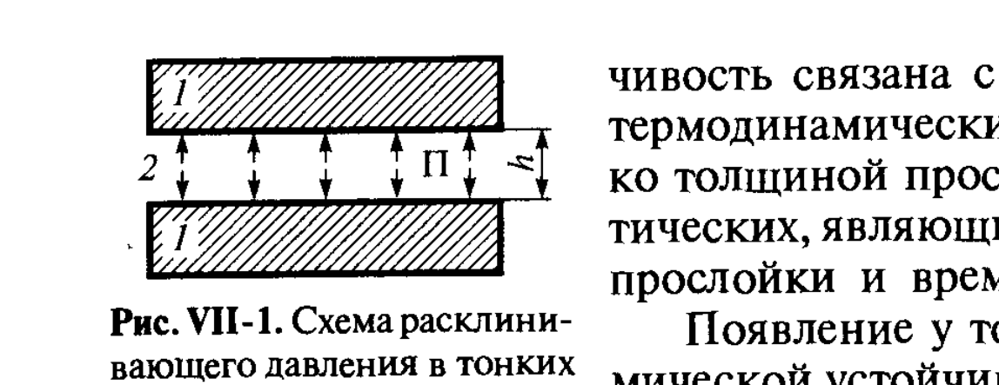
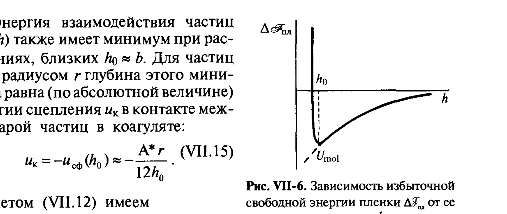

# Билет 46. Расклинивающее давление и его составляющие. Молекулярная составляющая расклинивающего давления для симметричных и несимметричных плёнок

## Тема: Расклинивающее давление — общее понятие

### Тонкие плёнки и расклинивающее давление

> [!note] Определение
> **Тонкая плёнка** — слой жидкости (или газа), разделяющий две поверхности раздела фаз и настолько тонкий, что эти поверхности «чувствуют» присутствие друг друга, т. е. перекрываются их поверхностные слои. Толщина такой плёнки $h$ — это расстояние между разделяющими поверхностями (рис. VII-1).

В толстой прослойке вдали от границ свойства жидкости такие же, как в объёмной фазе, и удельная свободная энергия плёнки равна сумме энергий двух независимых межфазных границ: $\mathscr{F}_{\text{пл}} = 2\sigma$. При уменьшении толщины $h$ до значений, при которых поверхностные слои начинают перекрываться, появляется **избыточная** (по сравнению с $2\sigma$) свободная энергия плёнки:

$$\Delta\mathscr{F}_{\text{пл}}(h) = \mathscr{F}_{\text{пл}}(h) - 2\sigma \tag{VII.1}$$

где $\Delta\mathscr{F}_{\text{пл}}(h)$ — избыточная свободная энергия плёнки на единицу площади, Дж/м².

> [!important] Определение расклинивающего давления (по Дерягину)
> **Расклинивающее давление** $\Pi$ — это избыточное (по сравнению с давлением в объёмной фазе $p_0$) давление, которое необходимо приложить к границам плёнки, чтобы удержать её равновесную толщину $h$:
> $$\Pi(h) = -\frac{d\Delta\mathscr{F}_{\text{пл}}}{dh} \tag{VII.3}$$
> Соответственно:
> $$\Delta\mathscr{F}_{\text{пл}}(h) = -\int_{\infty}^{h}\Pi(h')\,dh' = \int_{h}^{\infty}\Pi(h')\,dh' \tag{VII.4}$$

Здесь $\Pi(h)$ имеет размерность давления (Па или Дж/м³).

> [!tip] Как запомнить знак
> Если $\Pi > 0$ — поверхности **отталкиваются**, плёнка стремится утолщиться (устойчивая прослойка, препятствует слипанию частиц/коалесценции). Если $\Pi < 0$ — поверхности **притягиваются**, плёнка стремится утоньшиться и разорваться (неустойчивая прослойка). Название «расклинивающее» отражает именно положительный (отталкивающий, «расклинивающий» поверхности) случай — исторически первый и наиболее изученный Б. В. Дерягиным.

### Капиллярное давление и каналы Гиббса–Плато

В реальных дисперсных системах (пены, эмульсии) тонкие плёнки граничат с объёмными прослойками — **каналами Гиббса–Плато** (рис. VII-2). Поскольку каналы имеют значительно большую кривизну поверхности, чем плоская плёнка, давление в них $p_k$ отличается от давления в плёнке $p_\sigma$ на величину капиллярного давления:

$$p_\sigma = \sigma\left(\frac{1}{r_1}+\frac{1}{r_2}\right) \tag{VII.5}$$

где $r_1, r_2$ — главные радиусы кривизны поверхности канала ($r_1 \approx r$, $r_2 \to \infty$ для цилиндрического канала, $p_\sigma \approx \sigma/r$).

При условии $\Delta\sigma_{\text{пл}} < 0$ (избыточное натяжение плёнки отрицательно) на стыке плёнки с каналом образуется краевой угол $\theta$ (рис. VII-3), определяемый соотношением:

$$\Delta\sigma_{\text{пл}} = 2\sigma(1-\cos\theta) \tag{VII.6}$$

Откуда:
$$-\Delta\sigma_{\text{пл}} = 2\sigma(1-\cos\theta)$$

> [!example] Интерферометрия плёнок
> Толщину плёнок $h$ в зависимости от $p_\sigma$ изучают интерферометрически: при отражении монохроматического света от двух поверхностей плёнки возникает интерференционная картина (рис. VII-4), интенсивность которой зависит от отношения толщины плёнки к длине световой волны $h/\lambda$. По числу и положению полос можно построить кривую утончения плёнки во времени и определить равновесную толщину при заданном капиллярном давлении.

В большинстве экспериментов измеряемой величиной является не сама толщина $h$, а **равновесное расклинивающее давление** $\Pi(h)$, поскольку именно равновесие $\Pi(h_0) = p_\sigma$ (при заданном капиллярном давлении в канале Гиббса–Плато) определяет наблюдаемую толщину $h_0$.

> [!important] Связь равновесной толщины с капиллярным давлением
> Условие равновесия плоской плёнки, граничащей с каналом Гиббса–Плато:
> $$\Pi(h_0) = p_\sigma \tag{VII.2}$$
> Меняя $p_\sigma$ (например, через концентрацию раствора, влажность воздуха, внешнее давление), экспериментально получают зависимость $\Pi(h)$ — изотерму расклинивающего давления.

*Рис. VII-1. Схема расклинивающего давления в тонких плёнках: 1 — фазы, ограничивающие плёнку; 2 — прослойка толщиной $h$, в которой возникает давление $\Pi$.*

> [!warning] Не путать
> Расклинивающее давление $\Pi$ — **не то же самое**, что капиллярное давление Лапласа $p_\sigma = \sigma(1/r_1+1/r_2)$ (см. [[билет_12]]). Капиллярное давление — это избыточное давление под искривлённой поверхностью объёмной фазы; расклинивающее давление — давление, возникающее именно в **тонкой прослойке** из-за перекрытия поверхностных слоёв. В равновесии (VII.2) они **численно равны**, но по физической природе различны: $p_\sigma$ определяется кривизной макроскопической поверхности, а $\Pi$ — взаимодействием поверхностных слоёв на молекулярном уровне.

---

## Тема: Молекулярная составляющая расклинивающего давления

### Природа молекулярной составляющей

> [!note] Определение
> **Молекулярная (ван-дер-ваальсова) составляющая** расклинивающего давления $\Pi_{mol}$ обусловлена дисперсионными (а в общем случае — всеми ван-дер-ваальсовыми) взаимодействиями между молекулами фаз, разделённых прослойкой. Она рассчитывается на основе теории де Бура–Гамакера (см. [[билет_05]], [[билет_06]]).

Энергия молекулярного взаимодействия двух полубесконечных конденсированных фаз через зазор толщиной $h$ (формула Гамакера, см. [[билет_05]], аналог I.9 для плоскопараллельных тел):

$$U_{mol}(h) = -\frac{A}{12\pi h^2} \tag{VII.5'}$$

где $A$ — константа Гамакера, определяемая числом молекул в единице объёма взаимодействующих сред $n_1, n_2$ и лондоновской константой взаимодействия молекул $\beta_L$ (или $a_L$, см. [[билет_05]]):

$$A = (3/4)\pi h\nu_e n_1^2 a_L^2$$

> [!important] Молекулярная составляющая расклинивающего давления для симметричной плёнки (VII.6)
> Для симметричной плёнки фазы $1$ в среде $2$ (тип «1-2-1», например, водная плёнка между пузырьками воздуха или капля масла в воде):
> $$\Pi_{mol}(h) = -\frac{dU_{mol}}{dh} = -\frac{A}{6\pi h^3} \tag{VII.6}$$
> где $A$ — **сложная (эффективная) константа Гамакера**, учитывающая взаимодействие через прослойку (см. [[билет_06]]).

### Сложная константа Гамакера и знак $\Pi_{mol}$

Для системы из трёх различных фаз ($1$ и $3$ — конденсированные фазы, $2$ — прослойка между ними) сложная константа Гамакера выражается через индивидуальные константы Гамакера фаз $A_{11}, A_{22}, A_{33}$ и перекрёстные константы $A_{12}, A_{13}, A_{23}$:

$$\Pi_{mol} = \frac{A_{11}+A_{33}-A_{13}-A_{31}}{12\pi h^3} = \frac{A^*}{6\pi h^3} \tag{VII.7}$$

(для симметричных плёнок типа «1-2-1», где фазы $1$ и $3$ совпадают)

$$\Pi_{mol} = \frac{A_{11}+A_{22}-2A_{12}}{12\pi h^3} = -\frac{A^*}{6\pi h^3} \tag{VII.8}$$

где $A^*$ — сложная константа Гамакера в формулировке (I.13), см. [[билет_06]]:

$$A^* \approx (\sqrt{A_{11}}-\sqrt{A_{22}})^2 \tag{VII.9}$$

(приближение Гамакера, аналог I.13)

Для **дисимметричных** (несимметричных) плёнок типа «1-2-3» (фазы $1$ и $3$ различны, например, плёнка масла $2$ между водой $1$ и воздухом $3$) сложная константа Гамакера:

$$A^* = A_{12}+A_{23}-A_{22}-A_{13} \tag{VII.10}$$

> [!important] Знак сложной константы Гамакера определяет знак $\Pi_{mol}$
> - Для **симметричных плёнок** (1-2-1) сложная константа Гамакера $A^* > 0$ **всегда** (это следствие того, что $A_{11}+A_{33}-2A_{13}\ge 0$ для любых фаз — неравенство Гамакера). Соответственно, $\Pi_{mol} = -A^*/(6\pi h^3) < 0$ — молекулярная составляющая для симметричных плёнок **всегда отрицательна** (стремление к утоньшению, силы притяжения между поверхностями плёнки преобладают).
> - Для **дисимметричных плёнок** (1-2-3) знак $A^*$ может быть как положительным, так и отрицательным в зависимости от соотношения констант Гамакера фаз $1, 2, 3$. Соответственно, $\Pi_{mol}$ может быть как отрицательной, так и положительной (отталкивание).

> [!example] Качественные следствия
> Так как для большинства жидкофазных плёнок (вода, углеводороды, разделённые воздухом или другой жидкостью) молекулярная составляющая отрицательна, **именно она** в первую очередь дестабилизирует тонкие плёнки (пенные, эмульсионные), вызывая их утоньшение и последующий разрыв. Положительная электростатическая составляющая (см. [[билет_47]]) может скомпенсировать это притяжение и обеспечить устойчивость плёнки — это и составляет основу теории ДЛФО (см. [[билет_48]]).

### Энергия и сила взаимодействия частиц через прослойку

Аналогично можно рассмотреть взаимодействие двух сферических частиц радиуса $r$ ($r \gg h$), разделённых тонкой прослойкой толщиной $h$ (рис. VII-5):

$$U_{mol}(h) = -\frac{A^*r}{12h} \tag{VII.11}$$

где $A^*$ — сложная константа Гамакера для системы «частица–прослойка–частица».

Соответствующая сила притяжения:

$$F(h) = -\frac{dU_{mol}}{dh} = -\frac{A^*r}{12h^2} \tag{VII.12}$$

> [!example] Численная оценка
> Для типичных лиофобных систем $A^* \sim 10^{-19}$ Дж, при $r \sim 10^{-4}$ см и $h_0 \sim 2\cdot10^{-7}$ см энергия взаимодействия частиц в контакте по формуле (VII.15) составляет:
> $$u_k = -u_{св}(h_0) \approx \frac{A^*r}{12h_0} \sim \frac{10^{-19}\cdot10^{-6}}{12\cdot2\cdot10^{-9}} \approx 4\cdot10^{-21}\,\text{Дж} \approx 100\,kT$$
> Это означает, что энергия слипания частиц в коагуляте на порядок-два превышает $kT$ — частицы в первичном (ближнем) минимуме связаны достаточно прочно, чтобы тепловое движение не могло их разъединить (см. [[билет_48]] для анализа потенциальных кривых).

### Зависимость избыточной энергии плёнки от толщины

Зависимость $\Delta\mathscr{F}_{\text{пл}}(h)$ для системы, в которой действует только молекулярная составляющая (притяжение), имеет минимум при малых $h_0 \approx b$ (порядка молекулярных размеров) — рис. VII-6. Глубина этого минимума $u_к$ (по абсолютной величине) равна энергии сцепления частиц в контакте (в коагуляте):

$$u_k = -u_{св}(h_0) \approx \frac{A^*r}{12h_0} \tag{VII.15}$$

*Рис. VII-6. Зависимость избыточной свободной энергии плёнки $\Delta\mathscr{F}_{\text{пл}}$ от её толщины $h$ при доминировании молекулярного притяжения: минимум при $h_0\approx b$ соответствует энергии сцепления $u_к$ в контакте между частицами в коагуляте.*

> [!important] Условие коагуляции
> Именно величина $u_к$ используется как критерий равновесия пептизация $\leftrightarrow$ коагуляция: устойчивость дисперсной системы к коагуляции согласно (VII.16) определяется тем, что $u_к \gg kT$ или $u_к \lesssim kT$ (подробнее см. [[билет_45]] — обратимость коагуляции, пептизация).

---

## Тема: Структурная (адсорбционно-сольватная) составляющая (краткое упоминание)

> [!note] Помимо молекулярной составляющей
> Расклинивающее давление в общем случае представляет собой сумму нескольких составляющих, имеющих разную физическую природу:
> $$\Pi = \Pi_{mol} + \Pi_{el} + \Pi_{ст} + \dots \tag{VII.2'}$$
> где $\Pi_{el}$ — электростатическая составляющая (см. [[билет_47]]), $\Pi_{ст}$ — структурная составляющая, обусловленная изменением структуры растворителя (например, воды) вблизи поверхностей раздела фаз (структурно-механический барьер, см. [[билет_49]]).

Качественно, молекулярная составляющая является дальнодействующей и при больших $h$ убывает по степенному закону $\Pi_{mol}\propto h^{-3}$, тогда как структурная составляющая — короткодействующая (несколько молекулярных слоёв) и убывает экспоненциально.

---

## Источники

**Щукин Е.Д., Перцов А.В., Амелина Е.А. Коллоидная химия. — 3-е изд. — М.: Высшая школа, 2004.** Использованы разделы:
- §VII.2 «Тонкие плёнки», с. 298–301 (определение тонкой плёнки и расклинивающего давления, формулы VII.1–VII.4, рис. VII-1, каналы Гиббса–Плато, формулы VII.5–VII.6, рис. VII-2–VII-4).
- §VII.3 «Молекулярные взаимодействия в дисперсных системах», с. 303–309 (молекулярная составляющая расклинивающего давления, формулы VII.6–VII.10, рис. VII-5, VII-6, симметричные и дисимметричные плёнки, сложная константа Гамакера).

**Дополнения (не из Щукина, явно отмечены):**
- Связь степенной зависимости $\Pi_{mol}\propto h^{-3}$ с дальнодействующим характером ван-дер-ваальсовых сил vs экспоненциальное убывание структурных сил — общее представление теории ДЛФО, дополняет материал учебника для целостности картины (см. также [[билет_48]]).
