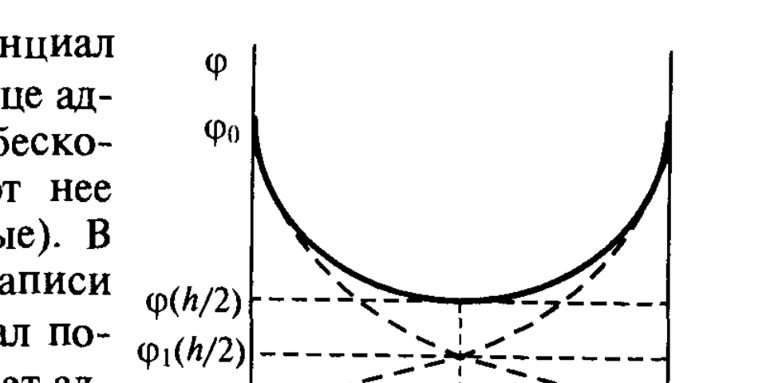
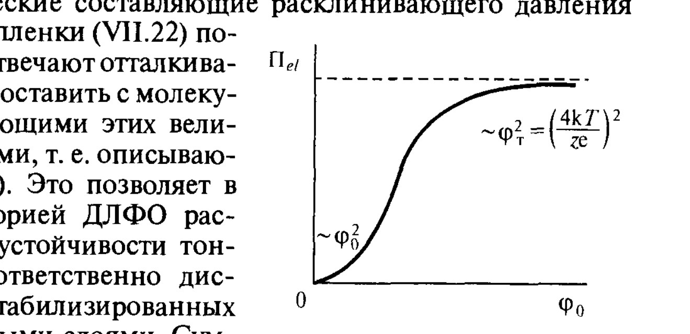

# Билет 47. Расклинивающее давление и его составляющие. Электростатическая составляющая расклинивающего давления

## Тема: Электростатическая составляющая расклинивающего давления

### Постановка задачи

> [!note] Напоминание
> Расклинивающее давление $\Pi(h)$ — избыточное давление в тонкой прослойке (плёнке) толщиной $h$, удерживающее её равновесную толщину (см. [[билет_46]], формулы VII.1–VII.4). Помимо молекулярной составляющей $\Pi_{mol}$ (см. [[билет_46]]), в водных прослойках, разделяющих заряженные поверхности, присутствует **электростатическая составляющая** $\Pi_{el}$, связанная с перекрытием диффузных ионных атмосфер двойных электрических слоёв (ДЭС, см. [[билет_35]], [[билет_36]]).

Когда две одинаково заряженные поверхности сближаются настолько, что их диффузные слои противоионов начинают перекрываться (рис. VII-8), концентрация ионов в зазоре между поверхностями возрастает по сравнению с концентрацией в объёме раствора. Это создаёт дополнительное **осмотическое давление**, стремящееся раздвинуть поверхности — отсюда положительный (отталкивающий) знак $\Pi_{el}$.

*Рис. VII-8. Распределение потенциала $\varphi$ в зазоре толщиной $h$ между двумя заряженными поверхностями в растворе электролита: сплошная кривая — потенциал при перекрытии диффузных слоёв; пунктирные кривые — потенциал каждого из слоёв по отдельности (без перекрытия), $\varphi_1(h/2)$ — их сумма в центре зазора.*

### Вывод формулы для электростатической составляющей

Для расчёта $\Pi_{el}(h)$ нужно решить уравнение Пуассона–Больцмана (см. [[билет_36]], формулы III.4–III.9) в зазоре между двумя плоскопараллельными заряженными поверхностями с граничными условиями $d\varphi/dx = 0$ при $x \to \infty$ (отдельный слой) и $d\varphi/dx = 0$ при $x = h/2$ (плоскость симметрии в зазоре, где $\varphi(h/2) \neq 0$).

Точное решение требует эллиптических интегралов, однако на достаточно больших расстояниях между поверхностями (по сравнению с дебаевской длиной $1/\varkappa$, см. [[билет_36]]) потенциалы обоих слоёв можно считать аддитивными — приближение **суперпозиции**:

$$\varphi(h/2) \approx 2\varphi_1(h/2)$$

где $\varphi_1(h/2)$ — значение потенциала одиночного (неперекрытого) диффузного слоя на расстоянии $h/2$ от поверхности.

> [!important] Электростатическая составляющая расклинивающего давления (формула VII.21)
> Для слабозаряженных поверхностей ($\varphi_0 < 25$ мВ при $z=1$) в приближении суперпозиции электростатическая составляющая расклинивающего давления выражается как:
> $$\Pi_{el} = 64 n_0 kT \gamma^2 e^{-\varkappa h} \tag{VII.21}$$
> где:
> - $n_0$ — концентрация (числовая плотность) ионов электролита в объёме раствора, м⁻³;
> - $k$ — постоянная Больцмана;
> - $T$ — абсолютная температура;
> - $\gamma = \tanh\left(\dfrac{ze\varphi_0}{4kT}\right)$ — безразмерный параметр, зависящий от поверхностного потенциала $\varphi_0$, заряда противоиона $z$ и заряда электрона $e$;
> - $\varkappa$ — параметр Дебая, обратная толщина диффузного слоя, $\varkappa^{-1}$ — дебаевская длина (см. [[билет_36]]);
> - $h$ — толщина прослойки.

> [!example] Предельные случаи
> - **Для слабозаряженных поверхностей**, когда $\dfrac{ze\varphi_0}{4kT} \ll 1$, $\tanh x \approx x$, и $\gamma^2 \approx \left(\dfrac{ze\varphi_0}{4kT}\right)^2$, поэтому $\Pi_{el} \propto \varphi_0^2 e^{-\varkappa h}$ — давление пропорционально квадрату поверхностного потенциала.
> - **Для сильно заряженных поверхностей**, когда $\varphi_0 \to \infty$, $\gamma \to 1$, и
> $$\Pi_{el} \to 64 n_0 kT e^{-\varkappa h}$$
> т. е. $\Pi_{el}$ перестаёт зависеть от потенциала поверхности $\varphi_0$ — происходит «насыщение»: дальнейшее увеличение заряда поверхности не увеличивает электростатическое отталкивание, поскольку противоионы экранируют поверхность всё эффективнее (так называемая «конденсация противоионов»).

*Рис. VII-9. Качественная зависимость электростатической составляющей расклинивающего давления $\Pi_{el}$ от поверхностного потенциала $\varphi_0$: при малых $\varphi_0$ — квадратичный рост $\Pi_{el}\sim\varphi_0^2$, при больших $\varphi_0$ — насыщение на уровне $\sim\varphi_T^2 = (4kT/ze)^2$.*

### Соответствующая избыточная свободная энергия плёнки

Интегрированием выражения (VII.21) по формуле (VII.4) получают избыточную свободную энергию плёнки, связанную с электростатическим взаимодействием:

$$\Delta\mathscr{F}_{el}(h) = \frac{64 n_0 kT \gamma^2}{\varkappa} e^{-\varkappa h} \tag{VII.22}$$

> [!important] Знак и дальнодействие
> Электростатическая составляющая $\Pi_{el}$ (VII.21) и $\Delta\mathscr{F}_{el}$ (VII.22) **всегда положительны**, т. е. отвечают **отталкиванию** между одноимённо заряженными поверхностями. По характеру убывания с расстоянием — экспоненциальная зависимость $e^{-\varkappa h}$ — электростатическая составляющая является дальнодействующей на масштабе дебаевской длины $1/\varkappa$, но убывает быстрее, чем степенная молекулярная составляющая $\Pi_{mol}\propto h^{-3}$ при больших $h$.

### Влияние электролитов на $\Pi_{el}$

> [!warning] Сжатие диффузного слоя при увеличении концентрации электролита
> Параметр Дебая $\varkappa$ растёт с увеличением концентрации электролита $n_0$ как $\varkappa \propto \sqrt{n_0}$ (см. [[билет_36]], формула III.10). Поэтому при увеличении концентрации индифферентного электролита:
> 1. дебаевская длина $1/\varkappa$ уменьшается — диффузный слой «сжимается»;
> 2. электростатическая составляющая $\Pi_{el}(h)$ при заданной толщине $h$ убывает быстрее с расстоянием — эффективный радиус электростатического отталкивания сокращается;
> 3. это приводит к снижению полного расклинивающего давления и, в рамках теории ДЛФО (см. [[билет_48]]), к **коагуляции** дисперсной системы при достаточной концентрации электролита (см. [[билет_38]] — сжатие диффузного слоя, перезарядка).

> [!tip] Связь с электрокинетикой
> На практике в формулу (VII.21) вместо термодинамического потенциала поверхности $\varphi_0$ часто подставляют экспериментально измеримый $\zeta$-потенциал (см. [[билет_37]]), поскольку именно он характеризует заряд диффузной части ДЭС, ответственной за электростатическое отталкивание.

---

## Источники

**Щукин Е.Д., Перцов А.В., Амелина Е.А. Коллоидная химия. — 3-е изд. — М.: Высшая школа, 2004.** Использован раздел:
- §VII.5 «Электростатическая составляющая расклинивающего давления и её роль в устойчивости. Основы теории ДЛФО», с. 316–319 (постановка задачи, рис. VII-8, приближение суперпозиции, вывод формул VII.21–VII.22, рис. VII-9, влияние электролитов).

**Дополнения (не из Щукина, явно отмечены):** термин «конденсация противоионов» для описания насыщения $\Pi_{el}$ при больших $\varphi_0$ — общепринятое в коллоидной химии понятие, дополняет качественное описание учебника.
