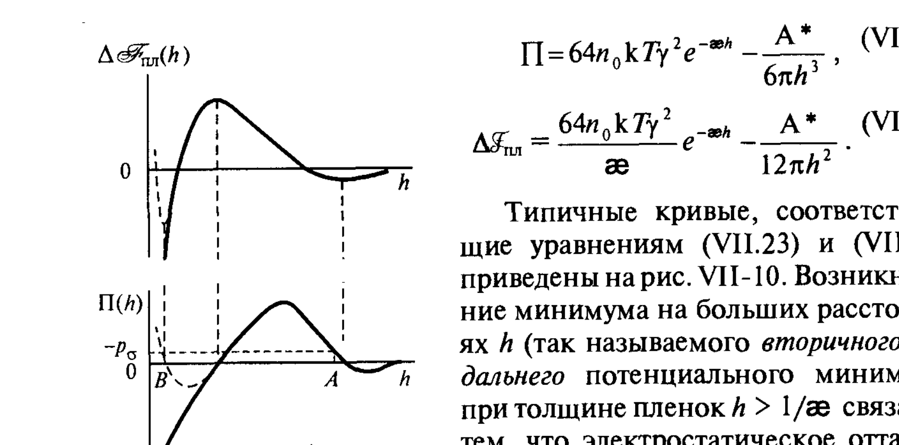
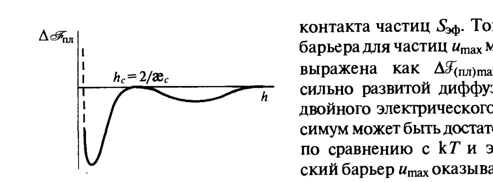

# Билет 48. Теория ДЛФО (Дерягина–Ландау–Фервея–Овербека)

## Тема: Основы теории ДЛФО

### Происхождение и суть теории

> [!note] Определение
> **Теория ДЛФО** (по именам авторов — Б. В. Дерягина и Л. Д. Ландау (1937–1941), а также независимо Э. Фервея и Я. Овербека) — теория агрегативной устойчивости лиофобных дисперсных систем, основанная на расчёте суммарной энергии взаимодействия двух частиц (или плоских поверхностей, разделённых тонкой прослойкой) как суммы **молекулярной** (ван-дер-ваальсовой) и **электростатической** составляющих расклинивающего давления.

Суммарное расклинивающее давление складывается из составляющих, имеющих разную физическую природу и разный знак (см. [[билет_46]], [[билет_47]]):

$$\Pi(h) = \Pi_{mol}(h) + \Pi_{el}(h) \tag{VII.2''}$$

где:
- $\Pi_{mol}(h) = -\dfrac{A^*}{6\pi h^3}$ (формула VII.6/VII.8) — молекулярная составляющая, **отрицательна** для симметричных плёнок, дальнодействует по степенному закону $\propto h^{-3}$ (см. [[билет_46]]);
- $\Pi_{el}(h) = 64 n_0 kT \gamma^2 e^{-\varkappa h}$ (формула VII.21) — электростатическая составляющая, **положительна**, убывает экспоненциально на масштабе дебаевской длины $1/\varkappa$ (см. [[билет_47]]).

> [!important] Ключевая идея ДЛФО
> Поскольку $\Pi_{mol}$ убывает с расстоянием медленнее (степенной закон $h^{-3}$), чем $\Pi_{el}$ (экспоненциальный закон $e^{-\varkappa h}$), на **малых** и **больших** $h$ преобладает притяжение, а на **промежуточных** расстояниях (порядка дебаевской длины) может преобладать электростатическое отталкивание. Это формирует характерную немонотонную зависимость суммарной избыточной энергии плёнки $\Delta\mathscr{F}_{\text{пл}}(h)$ от толщины — с **энергетическим барьером** и **двумя минимумами**.

### Суммарная кривая энергии взаимодействия

Соответствующая суммарная избыточная свободная энергия плёнки:

$$\Delta\mathscr{F}_{\text{пл}}(h) = \frac{64 n_0 kT \gamma^2}{\varkappa}e^{-\varkappa h} - \frac{A^*}{12\pi h^2} \tag{VII.23}$$

и суммарное расклинивающее давление:

$$\Pi(h) = 64 n_0 kT \gamma^2 e^{-\varkappa h} - \frac{A^*}{6\pi h^3} \tag{VII.24}$$

*Рис. VII-10. Типичные кривые $\Delta\mathscr{F}_{\text{пл}}(h)$ и $\Pi(h)$, соответствующие уравнениям (VII.23) и (VII.24): первичный (ближний) минимум при малых $h$, потенциальный барьер $\Delta\mathscr{F}_{max}$, вторичный (дальний) минимум при больших $h$. На графике $\Pi(h)$: $-p_\sigma$ — уровень капиллярного давления, точки $A$ и $B$ — точки пересечения, определяющие возможные равновесные толщины.*

> [!note] Анатомия кривой $\Delta\mathscr{F}_{\text{пл}}(h)$
> Суммарная кривая (рис. VII-10) имеет три характерные области:
> 1. **Первичный (ближний) минимум** при малых $h$ ($h\sim$ молекулярные размеры) — глубокий минимум, где доминирует молекулярное притяжение (см. [[билет_46]], формула VII.15). Попадание частиц в этот минимум соответствует **необратимой коагуляции** (жёсткий, прочный контакт «частица в частице», часто разделённый лишь тонкой прослойкой среды).
> 2. **Потенциальный барьер** $\Delta\mathscr{F}_{max}$ на промежуточных расстояниях — область, где преобладает электростатическое отталкивание. Высота барьера определяет **кинетическую устойчивость** системы: если $\Delta\mathscr{F}_{max} \gg kT$, частицы практически не могут преодолеть барьер за счёт теплового движения, и система остаётся агрегативно устойчивой.
> 3. **Вторичный (дальний) минимум** при бóльших $h$ — неглубокий минимум, обусловленный остаточным молекулярным притяжением на расстояниях, где электростатическое отталкивание уже спало почти до нуля. Попадание в этот минимум соответствует **слабой, обратимой коагуляции** (флокуляции) — частицы связаны рыхло, через прослойку среды, и могут быть разъединены при встряхивании или разбавлении (см. [[билет_45]] — пептизация).

> [!example] Связь с устойчивостью реальных систем
> - Если барьер $\Delta\mathscr{F}_{max} \gg kT$ и вторичный минимум неглубок ($|\Delta\mathscr{F}_{min,2}| \lesssim kT$) — система **агрегативно устойчива** (частицы не слипаются вовсе).
> - Если барьер исчезает (например, при добавлении электролита, см. ниже) — частицы беспрепятственно попадают в первичный минимум — **быстрая необратимая коагуляция**.
> - Если барьер высок, но вторичный минимум глубок ($|\Delta\mathscr{F}_{min,2}| \gg kT$) — происходит **обратимая флокуляция** без слипания в первичном минимуме.

### Условие исчезновения потенциального барьера

При увеличении концентрации индифферентного электролита параметр Дебая $\varkappa$ растёт ($\varkappa\propto\sqrt{n_0}$, см. [[билет_36]], [[билет_47]]), электростатическая составляющая $\Pi_{el}(h)$ «сжимается» к малым $h$, и высота барьера $\Delta\mathscr{F}_{max}$ уменьшается. При некоторой **критической концентрации электролита** барьер вырождается в точку перегиба (рис. VII-11):

> [!important] Критерий исчезновения барьера
> Барьер исчезает, когда одновременно выполняются условия:
> $$\Delta\mathscr{F}_{\text{пл}}(h_c) = 0 \quad \text{и} \quad \frac{d\Delta\mathscr{F}_{\text{пл}}}{dh}\bigg|_{h_c} = 0 \tag{VII.25, VII.26}$$
> где $h_c = 2/\varkappa_c$ — критическая толщина в точке исчезновения барьера. Решение системы (VII.25)–(VII.26) даёт связь между критическим параметром Дебая $\varkappa_c$ и сложной константой Гамакера $A^*$:
> $$64\, n_0 \gamma^2 kT e^{-\varkappa_c h_c} = \frac{A^*}{6\pi h_c^3}, \qquad \frac{64 n_0 \gamma^2 kT}{\varkappa_c}e^{-\varkappa_c h_c}=\frac{A^*}{12\pi h_c^2}$$

*Рис. VII-11. Условие полной потери устойчивости (исчезновения потенциального барьера) при критической концентрации электролита: $h_c = 2/\varkappa_c$.*

### Критическая концентрация коагуляции (порог быстрой коагуляции)

Решая систему уравнений (VII.25)–(VII.26) для предельного случая сильно заряженных поверхностей ($\gamma \to 1$), получают выражение для **критической концентрации электролита** $n_c$ (порога быстрой коагуляции):

$$n_c = k_2 \frac{(\varepsilon\varepsilon_0)^3 (kT)^5}{(A^*)^2 z^6 e^6} \tag{VII.27}$$

где $k_2$ — численный коэффициент порядка $\sim 800$ для сильно заряженных частиц; $\varepsilon, \varepsilon_0$ — диэлектрическая проницаемость среды и электрическая постоянная; $z$ — заряд (валентность) противоиона; $e$ — заряд электрона.

> [!important] Правило Шульце–Гарди (предварительная формулировка)
> Из (VII.27) следует знаменитая зависимость порога коагуляции от заряда противоиона:
> $$n_c \propto \frac{1}{z^6}$$
> т. е. критическая концентрация электролита, необходимая для коагуляции, обратно пропорциональна **шестой степени заряда** противоиона. Это и есть теоретическое (на основе ДЛФО) обоснование эмпирического правила Шульце–Гарди, подробно рассматриваемого в [[билет_52]] и [[билет_53]].

Для слабозаряженных поверхностей (малых $\varphi_0$), когда $\gamma \approx ze\varphi_0/(4kT)$, аналогичный анализ даёт:

$$n_c \propto \frac{(\varepsilon\varepsilon_0 kT)^3 \varphi_0^4}{(A^*)^2 z^2 e^2}$$

— зависимость от заряда противоиона значительно слабее ($\propto z^{-2}$), что соответствует менее выраженной зависимости порога коагуляции от валентности противоионов в системах с малым поверхностным потенциалом.

> [!warning] Не путать первичный и вторичный минимумы с порогом коагуляции
> Критическая концентрация $n_c$ (VII.27) определяет условие **исчезновения барьера**, после чего частицы беспрепятственно попадают в **первичный минимум** (необратимая коагуляция). Это отличается от условия попадания во **вторичный минимум** (обратимая флокуляция), которое может реализоваться и при докритических концентрациях электролита, если глубина вторичного минимума достаточна по сравнению с $kT$ — см. [[билет_49]] (факторы устойчивости) и [[билет_44]] (агрегативная устойчивость, тепловое движение).

---

## Источники

**Щукин Е.Д., Перцов А.В., Амелина Е.А. Коллоидная химия. — 3-е изд. — М.: Высшая школа, 2004.** Использован раздел:
- §VII.5 «Электростатическая составляющая расклинивающего давления и её роль в устойчивости. Основы теории ДЛФО», с. 318–323 (формулы VII.23–VII.24, рис. VII-10, VII-11, условие исчезновения барьера VII.25–VII.26, критическая концентрация коагуляции VII.27–VII.28, правило Шульце–Гарди как следствие ДЛФО).

**Дополнения (не из Щукина, явно отмечены):** имена создателей теории (Дерягин, Ландау, Фервей, Овербек) и исторические даты (1937–1941) — общеизвестный факт истории коллоидной химии, дополняет материал учебника. Термины «первичный/вторичный минимум» и «флокуляция vs коагуляция» используются в учебнике (см. [[билет_45]]) и применены здесь для систематизации.
