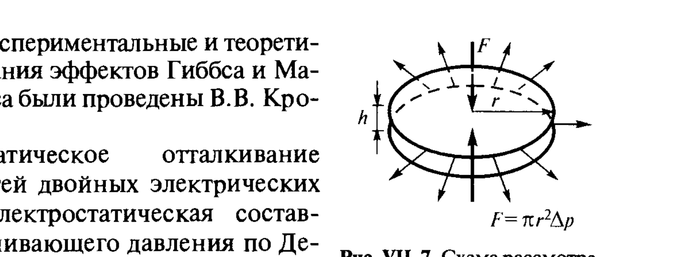

# Билет 49. Факторы агрегативной устойчивости лиофобных дисперсных систем

## Тема: Факторы стабилизации дисперсных систем

### Общая постановка

> [!note] Напоминание
> Лиофобные дисперсные системы термодинамически неустойчивы (избыток поверхностной энергии, см. [[билет_26]], [[билет_44]]) и стремятся к уменьшению дисперсности через коагуляцию. Однако кинетически они могут существовать длительное время, если между частицами действуют факторы, препятствующие их сближению до расстояний, на которых преобладает молекулярное притяжение (первичный минимум, см. [[билет_48]]).

> [!important] Классификация факторов устойчивости (по Ребиндеру)
> Щукин выделяет несколько факторов агрегативной устойчивости дисперсных систем, действующих независимо или совместно:
> 1. **Электростатический фактор** — наличие ДЭС и электростатического отталкивания (рассмотрен в [[билет_47]], [[билет_48]] — теория ДЛФО);
> 2. **Адсорбционно-сольватный (структурный) фактор** — упругость адсорбционных слоёв ПАВ/ВМС и граничных слоёв растворителя;
> 3. **Структурно-механический барьер** — прочные гелеобразные адсорбционные слои;
> 4. **Энтропийный (термодинамический) фактор** — броуновское движение, противодействующее агрегации;
> 5. **Гидродинамический фактор** — вязкое сопротивление среды сближению частиц.

### 1. Адсорбционно-сольватный фактор

> [!note] Определение
> **Адсорбционно-сольватный фактор устойчивости** связан с наличием на поверхности частиц адсорбционных слоёв ПАВ или сольватных (гидратных) оболочек, обладающих собственной **упругостью** при деформации (сжатии).

При сближении двух частиц, покрытых адсорбционными слоями ПАВ, происходит локальное изменение толщины и/или концентрации адсорбционного слоя в зоне контакта. Это вызывает локальное изменение поверхностного натяжения $\delta\sigma$ и появление **расклинивающего эффекта**, известного как **эффект Гиббса–Марангони**:

$$E_\sigma = 2\left(\frac{\delta\sigma}{\delta \ln(S/S_0)}\right)_{\Delta T = \text{const}} = 2\frac{d\sigma}{d\ln S} \tag{VII.18}$$

где $E_\sigma$ — поверхностная упругость (модуль упругости плёнки), $S$ — площадь поверхности.

> [!important] Эффект Гиббса–Марангони
> При локальном растяжении адсорбционного слоя (например, в зоне утоньшения плёнки между сближающимися частицами) локальная концентрация ПАВ на поверхности уменьшается, что приводит к **локальному увеличению $\sigma$** в этом месте. Возникающий градиент поверхностного натяжения вызывает поверхностный поток жидкости (от мест с низким $\sigma$ к местам с высоким $\sigma$), который **увлекает за собой объёмную жидкость** обратно в утончающийся участок плёнки, противодействуя утоньшению. Это термодинамический «само-залечивающий» механизм, обеспечивающий устойчивость пенных и эмульсионных плёнок.

> [!example] Появление поверхностной вязкости
> Появление у адсорбционного слоя собственной (двумерной) вязкости и упругости (структурированный, «гелеобразный» адсорбционный слой ПАВ или ВМС) дополнительно тормозит течение жидкости по поверхности и усиливает действие эффекта Марангони — это и составляет термодинамическую основу адсорбционно-сольватного фактора устойчивости.

### 2. Гидродинамическое сопротивление утоньшению прослойки

> [!note] Определение
> **Гидродинамический фактор устойчивости** — сопротивление вязкого течения среды, выдавливаемой из зазора между сближающимися частицами, которое замедляет утоньшение прослойки независимо от термодинамических факторов.

Рассмотрим сближение двух плоскопараллельных дисков радиуса $r$, разделённых прослойкой толщиной $h$ (рис. VII-7). Внешняя сила $F$, прижимающая диски, связана с избыточным давлением $\Delta p$ в прослойке:

$$F = \pi r^2 \Delta p$$

*Рис. VII-7. Схема рассмотрения кинетики утоньшения плёнки между сближающимися дисками радиуса $r$, разделёнными прослойкой толщиной $h$.*

Скорость утоньшения прослойки выражается через объёмный расход вытесняемой жидкости:

$$\frac{dh}{dt} = -\frac{1}{\pi r^2}\frac{dV}{dt}$$

Если $\Delta p$ — некоторое среднее значение избыточного давления, под действием которого жидкость вытекает из зазора, то в соответствии с уравнением Ньютона для вязкости величина $dV/dt$ пропорциональна $\Delta p$ и обратно пропорциональна вязкости среды $\eta$ и (в высокой степени) толщине зазора $h$:

> [!important] Уравнение Рейнольдса (VII.19)
> Для сближения плоскопараллельных дисков радиуса $r$ скорость утоньшения прослойки описывается уравнением Рейнольдса:
> $$\frac{dh}{dt} = -\frac{2}{3}\frac{\Delta p\, h^3}{\eta r^2} \tag{VII.19}$$
> или, в форме, удобной для сопоставления с экспериментальными данными по интерференции (см. [[билет_46]]):
> $$\frac{d(1/h^2)}{dt} = \frac{4}{3}\frac{\Delta p}{\eta r^2} \tag{VII.20}$$

> [!example] Физический смысл
> Согласно (VII.19), скорость утоньшения $dh/dt \propto h^3$ — чем тоньше плёнка, тем **медленнее** идёт дальнейшее утоньшение (при постоянном $\Delta p$). Это означает, что по мере приближения частиц гидродинамическое сопротивление резко нарастает, и для достижения равновесной толщины (или для разрыва плёнки) требуется конечное, иногда весьма продолжительное время — **кинетика коагуляции** определяется не только термодинамикой (высотой барьера $\Delta\mathscr{F}_{max}$, см. [[билет_48]]), но и гидродинамикой подхода частиц друг к другу.

> [!tip] Связь параметров уравнения Рейнольдса
> Большую роль играет вязкость среды $\eta$ в зазоре, которая может значительно превышать вязкость объёмной фазы при наличии адсорбционных слоёв (структурированных слоёв ПАВ) — повышенная эффективная вязкость прослойки дополнительно усиливает гидродинамический фактор устойчивости.

### 3. Энтропийный (тепловой) фактор

> [!note] Определение
> **Энтропийный фактор устойчивости** связан с броуновским движением частиц (см. [[билет_40]]), которое противодействует их детерминированному сближению под действием притяжения и стремится к равномерному (хаотичному) распределению частиц в объёме — увеличению энтропии системы.

> [!important] Критерий теплового движения (напоминание из [[билет_44]])
> Для лиофильных систем критерий устойчивости Ребиндера–Щукина (см. [[билет_26]]) требует, чтобы характеристическая высота седиментационно-диффузионного распределения $H_{1/e}$ (см. [[билет_41]]) была много больше радиуса частицы $r$:
> $$\frac{H_{1/e}}{r} \gg 1$$
> Для лиофобных систем энтропийный фактор не обеспечивает термодинамической устойчивости сам по себе, но определяет, насколько эффективно частицы могут «находить» друг друга и преодолевать (или не преодолевать) потенциальный барьер ДЛФО за счёт теплового движения.

### 4. Структурно-механический барьер (фактор Ребиндера)

> [!note] Определение
> **Структурно-механический барьер (СМБ)** — фактор устойчивости, впервые подробно исследованный П. А. Ребиндером, связанный с сильно структурированными (гелеобразными, твёрдообразными) адсорбционными слоями ПАВ, ВМС или их смесей на поверхности частиц/капель.

Адсорбционные слои, образующие СМБ, обладают двумя принципиальными особенностями:
1. высокая структурная вязкость и упругость, способные к восстановлению структуры после деформации (тиксотропия);
2. способность к образованию гелеобразного, **«панцирного»** слоя, толщина которого может значительно превышать длину отдельной молекулы ПАВ за счёт вовлечения молекул растворителя (сольватных оболочек).

> [!example] Природа веществ, создающих СМБ
> Наиболее сильным стабилизирующим действием обладают вещества, способные к образованию **гелеобразной структурированной** прослойки в межфазном слое: смеси ПАВ различной природы, белки, природные полисахариды (камеди), высокомолекулярные ПАВ. Многокомпонентные стабилизирующие системы (например, смесь ионогенного и неионогенного ПАВ) часто эффективнее, чем индивидуальные вещества — за счёт более плотной упаковки и взаимного «сшивания» молекул в межфазном слое.

> [!important] Отличие СМБ от электростатического фактора
> СМБ действует на **малых** расстояниях между поверхностями (сравнимых с толщиной самого адсорбционного слоя, обычно несколько нм) и носит **чисто механическую** (упруго-вязкую) природу — в отличие от электростатического отталкивания (дальнодействующего, экспоненциально убывающего на масштабе $1/\varkappa$, см. [[билет_47]]). СМБ может стабилизировать систему даже в отсутствие заряда поверхности (например, в неводных средах, где ДЭС слабо выражен, см. [[билет_30]]), что делает его особенно важным для **неионогенных** стабилизаторов и обратных эмульсий.

> [!tip] Как запомнить
> Структурно-механический барьер — это «механическая броня» вокруг частицы из плотно упакованных, структурированных молекул стабилизатора, тогда как электростатический барьер — это «силовое поле» заряда, действующее на расстоянии. Первый — контактный и упругий, второй — дальнодействующий и электрический.

---

## Тема: Сопоставление факторов устойчивости — итоговая таблица

| Фактор | Природа | Радиус действия | Главный параметр | Связанные билеты |
|---|---|---|---|---|
| Электростатический | электрическое отталкивание перекрывающихся ДЭС | дальнодействующий ($\sim 1/\varkappa$) | $\varphi_0$ (или $\zeta$), $\varkappa$ | [[билет_47]], [[билет_48]] |
| Молекулярное притяжение (дестабилизирующий) | силы Ван-дер-Ваальса | дальнодействующий ($\propto h^{-3}$) | $A^*$ (сложная константа Гамакера) | [[билет_46]], [[билет_48]] |
| Адсорбционно-сольватный | упругость адсорбционных слоёв, эффект Марангони | малый ($\sim$ толщина слоя ПАВ) | $E_\sigma$ (поверхностная упругость) | — |
| Структурно-механический барьер | гелеобразные структурированные слои (Ребиндер) | малый, контактный | структурная вязкость/упругость слоя | [[билет_30]], [[билет_61]] |
| Энтропийный (тепловой) | броуновское движение | определяет частоту столкновений | $H_{1/e}/r$ | [[билет_26]], [[билет_40]], [[билет_41]] |
| Гидродинамический | вязкое сопротивление утоньшению плёнки | определяет кинетику сближения | $\eta$, ур. Рейнольдса (VII.19) | [[билет_46]] |

> [!warning] Частая путаница на экзамене
> Не путать **факторы устойчивости** (перечисленные выше — почему система НЕ коагулирует) с **факторами/механизмами разрушения системы** (изотермическая перегонка, коалесценция, коагуляция — см. [[билет_44]]). Факторы устойчивости — это то, что препятствует реализации этих механизмов разрушения.

---

## Источники

**Щукин Е.Д., Перцов А.В., Амелина Е.А. Коллоидная химия. — 3-е изд. — М.: Высшая школа, 2004.** Использованы разделы:
- §VII.4 «Факторы стабилизации дисперсных систем», с. 311–315 (классификация факторов, эффект Гиббса–Марангони, формула VII.18, поверхностная упругость, гидродинамическое сопротивление, рис. VII-7, уравнения Рейнольдса VII.19–VII.20).
- §VII.6 «Структурно-механический барьер», с. 325–327 (структурно-механический барьер по Ребиндеру, природа веществ-стабилизаторов, гелеобразные слои).

**Дополнения (не из Щукина, явно отмечены):** сводная таблица сопоставления факторов устойчивости составлена для систематизации материала из разных параграфов учебника (§VII.1, VII.4–VII.6) и не является прямой репродукцией таблицы из Щукина.
