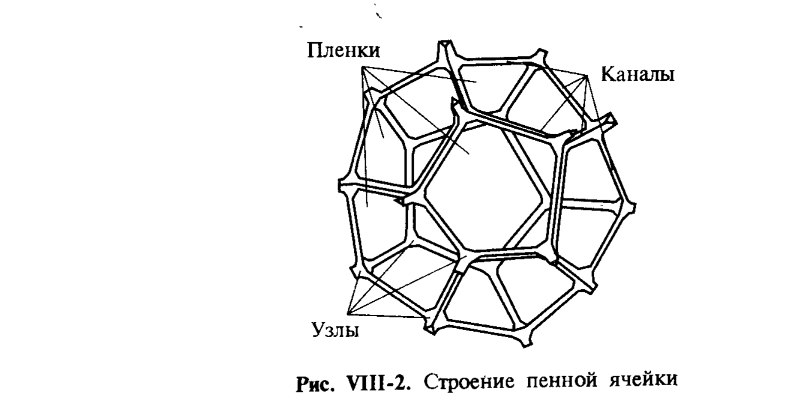
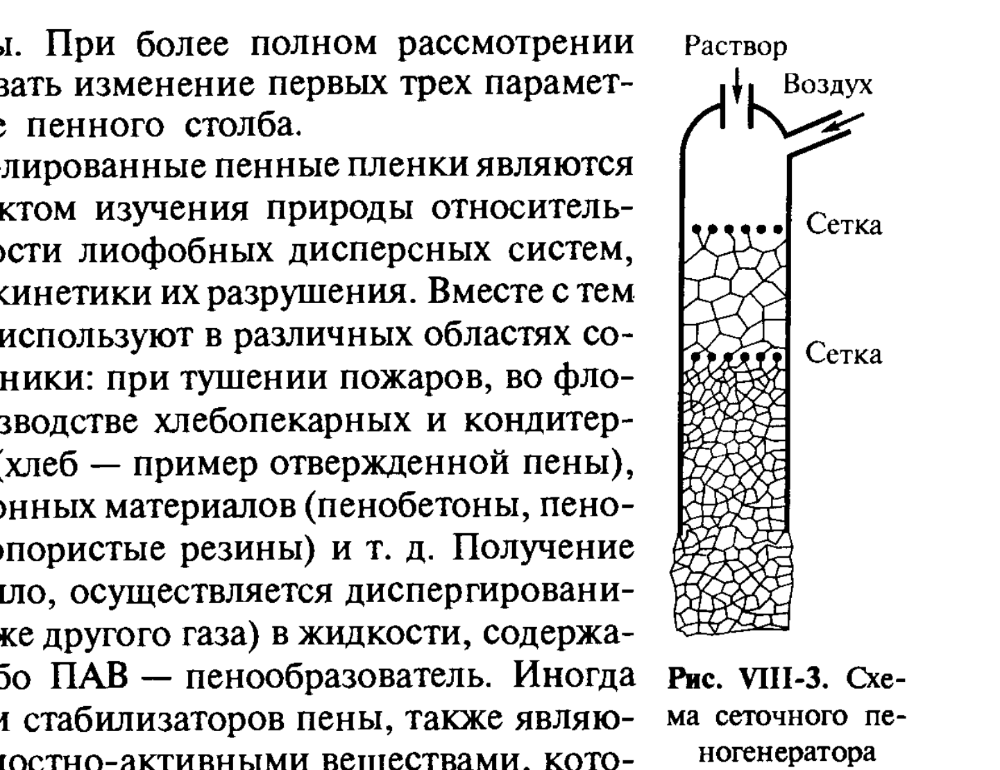
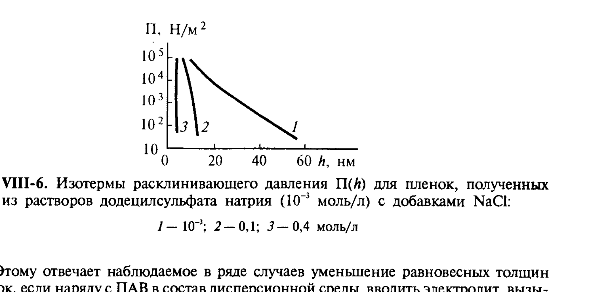

# Билет 50. Пены как термодинамически неустойчивые системы. Капиллярные эффекты в пенах. Синерезис. Чёрные плёнки. Применение

## Тема: Пены как дисперсные системы

### Определение и строение

> [!note] Определение
> **Пена** — высококонцентрированная дисперсная система типа «газ в жидкости», в которой объёмная доля дисперсной фазы (газа) настолько велика (обычно $> 90\%$), что пузырьки газа теряют сферическую форму и превращаются в многогранные ячейки, разделённые тонкими жидкими **плёнками**.

Структурными элементами пены являются (рис. VIII-2):
- **плёнки** — тонкие прослойки жидкости между соседними газовыми ячейками;
- **каналы Гиббса–Плато** — утолщения на стыке трёх плёнок (треугольное в сечении ребро многогранника);
- **узлы** — точки схождения нескольких каналов Гиббса–Плато (в идеальной пене — по 4 канала в узле под тетраэдрическими углами).

*Рис. VIII-2. Строение пенной ячейки: плёнки, каналы Гиббса–Плато и узлы их схождения.*

> [!important] Правила Плато
> Геометрия идеализированной пены подчиняется **правилам Плато**: в каждом узле сходятся ровно 4 канала Гиббса–Плато под углами $\approx 109°28'$ (тетраэдрический угол), а в каждом канале сходятся ровно 3 плёнки под углами $120°$. Это обеспечивает минимум суммарной поверхностной энергии при заданном объёме газовой фазы — пена представляет собой природный пример **минимальных поверхностей** (структуры, родственные структуре пентагональных додекаэдров, см. рис. VIII-2).

> [!example] Получение пен
> Пены получают диспергационным или конденсационным методом (см. [[билет_33]] для общих принципов конденсационного образования дисперсных систем):
> - **диспергационный** — пропускание газа через жидкость, содержащую ПАВ-пенообразователь: барботаж, встряхивание, продавливание через сетку (рис. VIII-3 — схема сеточного пеногенератора);
> - **конденсационный** — выделение растворённого газа (например, $\text{CO}_2$) при изменении давления или в результате химической реакции (хлеб, пенобетоны).

*Рис. VIII-3. Схема сеточного пеногенератора: раствор ПАВ и воздух подаются через сетки, дробящие газ на пузырьки.*

> [!note] Параметры, характеризующие пену
> Пену характеризуют: толщина плёнок $h$; средний эквивалентный радиус ячеек $r$; кратность пены $K = V_{\text{пена}}/V_{\text{жидкость}}$ — отношение полного объёма пены к объёму содержащейся в ней жидкости; дисперсность (распределение ячеек по размерам); и средний эквивалентный радиус столба пены $H_n$.

---

## Тема: Термодинамическая неустойчивость пен и механизмы разрушения

> [!important] Пена — термодинамически неустойчивая система
> Пена обладает огромной избыточной поверхностной энергией (большая суммарная площадь газ–жидкость на единицу объёма) и поэтому термодинамически **абсолютно неустойчива** — она самопроизвольно стремится к минимуму поверхности, т. е. к разрушению (см. общий критерий Ребиндера–Щукина, [[билет_26]]). Время жизни реальных пен определяется кинетикой нескольких процессов разрушения, протекающих параллельно.

### Механизмы разрушения пены

1. **Истечение (дренаж) жидкости из плёнок и каналов Гиббса–Плато** под действием силы тяжести и капиллярного давления — приводит к утоньшению плёнок.
2. **Изотермическая перегонка (диффузионный перенос газа)** — газ из мелких ячеек (с большим капиллярным давлением, по закону Лапласа $\Delta p = 2\sigma/r$, см. [[билет_12]], [[билет_14]]) диффундирует через плёнки в крупные ячейки, что приводит к укрупнению ячеек со временем (аналог изотермической перегонки в эмульсиях и суспензиях, см. [[билет_14]], [[билет_45]]).
3. **Коалесценция** — слияние соседних ячеек при разрыве разделяющей их плёнки.

> [!note] Синерезис пены
> **Синерезис** — самопроизвольное вытекание (отделение) дисперсионной среды (жидкости) из пены под действием силы тяжести и капиллярного всасывания в каналы Гиббса–Плато. Синерезис приводит к утоньшению плёнок и постепенному увеличению кратности пены $K$ со временем — это первая, наиболее быстрая стадия разрушения пены, предшествующая массовому разрыву плёнок.

> [!warning] Не путать причины утоньшения
> Утоньшение плёнок в пене происходит под действием **двух различных** механизмов: (1) гидродинамический отток жидкости (синерезис, дренаж) — описывается уравнением Рейнольдса (см. [[билет_49]], формулы VII.19–VII.20); и (2) термодинамическое равновесие при заданном капиллярном давлении в канале Гиббса–Плато — определяется изотермой расклинивающего давления $\Pi(h) = p_\sigma$ (см. [[билет_46]], формула VII.2). Первый механизм — кинетический (определяет скорость утоньшения), второй — определяет конечную равновесную толщину.

---

## Тема: Капиллярные эффекты в пенах. Чёрные плёнки

### Капиллярное давление в каналах Гиббса–Плато

Как и в общем случае тонких плёнок (см. [[билет_46]]), плоская плёнка пены граничит с каналом Гиббса–Плато, в котором давление $p_k$ ниже атмосферного на величину капиллярного давления $p_\sigma = \sigma/r_k$ ($r_k$ — радиус кривизны канала, см. формулу VII.5 в [[билет_46]]). Это пониженное давление в канале «всасывает» жидкость из плёнок — капиллярный механизм синерезиса.

Равновесная толщина плёнки $h_0$ определяется условием (формула VII.2, см. [[билет_46]]):

$$\Pi(h_0) = p_\sigma$$

При увеличении капиллярного давления $p_\sigma$ (например, в результате осушения пены, испарения или дополнительного дренажа) равновесная толщина $h_0$ уменьшается — плёнка утоньшается до тех пор, пока расклинивающее давление при новой, меньшей толщине не уравновесит возросшее $p_\sigma$.

### Изотермы расклинивающего давления и влияние электролитов

*Рис. VIII-6. Изотермы расклинивающего давления $\Pi(h)$ для плёнок, полученных из растворов додецилсульфата натрия ($10^{-3}$ моль/л) с добавками NaCl: 1 — $10^{-3}$; 2 — $0{,}1$; 3 — $0{,}4$ моль/л.*

> [!important] Влияние электролита на толщину плёнок пены
> С ростом концентрации электролита (рис. VIII-6) равновесная толщина плёнки при заданном $p_\sigma$ резко **уменьшается** — это прямое следствие сжатия диффузного слоя ДЭС и уменьшения электростатической составляющей расклинивающего давления $\Pi_{el}$ (см. [[билет_47]], [[билет_48]]). При высоких концентрациях электролита ($\sim 0{,}4$ моль/л NaCl) пенные плёнки утоньшаются до толщин в несколько нанометров — образуются так называемые **чёрные плёнки**.

> [!note] Чёрные плёнки
> **Чёрные плёнки** — пенные плёнки, толщина которых ($h \lesssim \lambda/4$, где $\lambda$ — длина волны видимого света) настолько мала, что интерференционное отражение от обеих поверхностей плёнки практически исчезает (деструктивная интерференция), и плёнка визуально выглядит чёрной на фоне обычных, более толстых («цветных», радужных) плёнок. Различают:
> - **первичные («серые») чёрные плёнки** — толщиной порядка $5$–$15$ нм, в которых ещё сохраняется небольшое расклинивающее давление, преимущественно электростатической природы;
> - **вторичные (ньютоновские) чёрные плёнки** — наиболее тонкие ($h \sim 4$–$5$ нм, толщиной порядка двух адсорбционных слоёв ПАВ с прослойкой воды между ними), отвечающие глубокому минимуму на изотерме $\Pi(h)$, часто близкому ко вторичному минимуму на кривой ДЛФО (см. [[билет_48]]).

> [!example] Связь с устойчивостью
> Переход плёнки в состояние «чёрной» не означает её немедленного разрыва — напротив, ньютоновские чёрные плёнки могут быть весьма стабильны (метастабильны) благодаря остаточному электростатическому и/или структурному отталкиванию (структурно-механический барьер, см. [[билет_49]]). Однако при дальнейшем повышении концентрации электролита выше критической (см. [[билет_48]], формула VII.27 — критическая концентрация коагуляции) расклинивающее давление падает до нуля, и плёнка теряет устойчивость, разрываясь.

---

## Тема: Факторы устойчивости и применение пен

### Факторы устойчивости пен

Устойчивость пен определяется теми же общими факторами, что и устойчивость других дисперсных систем (см. [[билет_49]]), с учётом специфики плоских плёнок:

- **электростатический фактор** — отталкивание заряженных поверхностей плёнки через водную прослойку (особенно важен для ионогенных ПАВ-пенообразователей, рис. VIII-6);
- **структурно-механический барьер** — особенно эффективен при использовании смесей ПАВ или ПАВ с ВМС/белками, образующих гелеобразный адсорбционный слой (классический пример — пены на основе сапонинов, белковые пены);
- **эффект Гиббса–Марангони** (поверхностная упругость, см. [[билет_49]], формула VII.18) — при локальном утоньшении плёнки локальное повышение $\sigma$ вызывает поверхностный поток жидкости, «залечивающий» утончённый участок;
- **повышенная вязкость дисперсионной среды** — замедляет дренаж (гидродинамический фактор, см. [[билет_49]], уравнение Рейнольдса).

> [!tip] Мнемоника: «4 кита устойчивости пены»
> Электро + Структура + Марангони + Вязкость — четыре независимых рычага управления устойчивостью пены, каждый из которых может стать «слабым звеном» в конкретной формуляции пенообразователя.

### Применение пен

> [!example] Практическое значение
> Пены широко применяются в технике и быту:
> - **пожаротушение** — пены изолируют горящую поверхность от кислорода воздуха;
> - **флотация** — пенный слой выносит на поверхность гидрофобизированные частицы полезного ископаемого (см. [[билет_11]], [[билет_23]] — применение ПАВ для управления смачиванием);
> - **пищевая промышленность** — взбитые сливки, кремы, хлебобулочные изделия (отверждённая пена);
> - **строительные материалы** — пенобетоны, пенопласты, пористые резины (твёрдые пены, получаемые отверждением жидкой пены);
> - **косметика и бытовая химия** — пены шампуней, моющих средств (где устойчивость пены часто используется как косвенный индикатор моющей способности, хотя прямой корреляции нет, см. [[билет_25]]).

> [!warning] Частая путаница
> Не путать **пены** (дисперсная фаза — газ, дисперсионная среда — жидкость, структурные элементы — плёнки/каналы/узлы) с **газовыми эмульсиями** (низкая кратность, пузырьки сохраняют сферическую форму, не образуют общих плёнок) и с **твёрдыми пенами** (пенопласты, пенобетоны — газовая фаза диспергирована в твёрдой дисперсионной среде, структура «заморожена» на стадии жидкой пены).

---

## Источники

**Щукин Е.Д., Перцов А.В., Амелина Е.А. Коллоидная химия. — 3-е изд. — М.: Высшая школа, 2004.** Использован раздел:
- §VIII.2 «Пены и пенные плёнки», с. 347–353 (определение пены, строение пенной ячейки — рис. VIII-2, правила Плато, получение пен — рис. VIII-3, термодинамическая неустойчивость, механизмы разрушения, синерезис, изотермы расклинивающего давления — рис. VIII-6, влияние электролитов, чёрные плёнки — первичные и вторичные/ньютоновские, применение пен).

**Дополнения (не из Щукина, явно отмечены):** мнемоника «4 кита устойчивости пены» составлена для систематизации факторов устойчивости применительно к пенам; пример с пенами шампуней/бытовой химии — общеизвестный иллюстративный пример, дополняет материал учебника.
