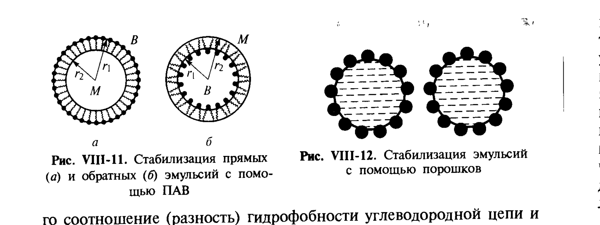

# Билет 51. Эмульсии: получение, типы, эмульгаторы, устойчивость, обращение фаз, эмульсии Пикеринга

## Тема 1: Эмульсии — определение, типы, получение

> [!note] Определение
> **Эмульсии** — дисперсные системы, в которых обе фазы (дисперсная и дисперсионная среда) представляют собой **жидкости, нерастворимые или малорастворимые друг в друге**. Наиболее распространены эмульсии, в которых одна из фаз — вода (полярная жидкость), а другая — органическая жидкость, условно называемая «маслом» (неполярная или малополярная жидкость, не смешивающаяся с водой).

По соотношению фаз и характеру их распределения эмульсии делятся на два типа:

| Тип | Обозначение | Дисперсная фаза | Дисперсионная среда |
|---|---|---|---|
| **Прямые** ("масло в воде") | М/В (O/W) | масло (неполярная жидкость) | вода (полярная жидкость) |
| **Обратные** ("вода в масле") | В/М (W/O) | вода (полярная жидкость) | масло (неполярная жидкость) |

> [!example] Примеры эмульсий
> Молоко, сливки, майонез — прямые эмульсии (М/В). Сливочное масло, маргарин, многие косметические крема, нефтяные эмульсии (буровые растворы) — часто обратные (В/М).

**Способы получения эмульсий:**

1. **Механическое эмульгирование** (диспергирование) — интенсивное перемешивание, гомогенизация, ультразвуковое воздействие. Чем выше степень диспергирования (меньше размер капель), тем больше затрачиваемая энергия и тем существеннее роль стабилизатора (ПАВ), без которого свежеобразованные капли быстро коалесцируют.
2. **Конденсационный путь** — образование новой жидкой фазы из истинного раствора при изменении условий (температуры, состава), аналогично конденсационным методам получения лиофобных систем (см. [[билет_33]]).

> [!important] Какая фаза станет дисперсной?
> Тип образующейся эмульсии (прямая или обратная) определяется в первую очередь **природой и концентрацией эмульгатора** (правило Банкрофта, см. Тему 2), а также соотношением объёмов фаз: при сильном различии объёмов фаза, присутствующая в меньшем количестве, чаще оказывается дисперсной (хотя это не строгое правило — стабилизация эмульгатором может «переопределить» исход).

---

## Тема 2: Выбор эмульгатора. ПАВ как стабилизаторы эмульсий. Правило Банкрофта

### Механизм стабилизации эмульсий молекулами ПАВ

Свежеобразованные капли эмульсии **термодинамически неустойчивы** — система стремится уменьшить площадь межфазной поверхности (а значит, избыточную поверхностную энергию $G_s = \sigma \cdot A$), что приводит к слиянию (коалесценции) капель. Чтобы затормозить этот процесс, в систему вводят **эмульгатор** — поверхностно-активное вещество, адсорбирующееся на межфазной границе.

Молекулы ПАВ — дифильны: состоят из полярной (гидрофильной) головной группы и неполярного (гидрофобного) углеводородного хвоста. На границе раздела «вода–масло» молекула ПАВ ориентируется так, чтобы:

- полярная группа была обращена в водную фазу;
- неполярный хвост — в масляную фазу.

> [!note] Геометрическая модель Банкрофта (правило Банкрофта)
> Та фаза, в которую обращена **большая по объёму часть молекулы ПАВ** (то есть та фаза, которая лучше "смачивает" молекулу эмульгатора), становится **дисперсионной средой**, а противоположная фаза — дисперсной.
>
> - Если гидрофильная часть молекулы ПАВ больше гидрофобной ($r_2 > r_1$ на рис. VIII-11, *а*) — формируется **прямая эмульсия М/В**;
> - если гидрофобная часть больше гидрофильной ($r_1 > r_2$ на рис. VIII-11, *б*) — формируется **обратная эмульсия В/М**.

*Рис. VIII-11. Стабилизация прямых (а) и обратных (б) эмульсий с помощью ПАВ; Рис. VIII-12. Стабилизация эмульсий с помощью порошков (Щукин, с. 358–359)*

Таким образом, выбор эмульгатора напрямую определяет тип получаемой эмульсии — это центральный практический вопрос для составления рецептур (косметика, пищевые продукты, буровые жидкости, лекарственные формы).

### Гидрофильно-липофильный баланс (ГЛБ) при выборе эмульгатора

> [!important] Подбор эмульгатора по ГЛБ
> Согласно классификации Гриффина (см. подробнее [[билет_25]]), значения числа ГЛБ соответствуют определённым областям применения ПАВ:
>
> | Диапазон ГЛБ | Назначение |
> |---|---|
> | 3–6 | эмульгаторы для эмульсий В/М |
> | 7–9 | смачиватели |
> | 8–18 | эмульгаторы для эмульсий М/В |
> | 13–15 | моющие средства |
> | 15–18 | солюбилизаторы |
>
> Чем выше ГЛБ ПАВ, тем сильнее проявляется его гидрофильность, и тем более вероятно образование прямой эмульсии (М/В), и наоборот.

Эмульгаторы выбирают, исходя из требуемого типа эмульсии и природы фаз: для эмульсий М/В обычно применяют ионогенные ПАВ с высоким ГЛБ (мыла, алкилсульфаты) или смеси неионогенных ПАВ (например, эфиры сорбита, этоксилированные спирты); для эмульсий В/М — ПАВ с низким ГЛБ (моноглицериды, лецитин и др.).

> [!tip] Мнемоника правила Банкрофта
> «Куда смотрит большая голова ПАВ, там и вода» — гидрофильная (полярная) часть молекулы, обращённая в большую по объёму фазу, делает эту фазу дисперсионной средой.

### Стабилизация твёрдыми порошками — эмульсии Пикеринга

Помимо молекулярных ПАВ, эмульсии могут стабилизироваться **тонкодисперсными твёрдыми частицами**, избирательно смачиваемыми обеими жидкостями (см. избирательное смачивание, [[билет_11]]).

> [!note] Эмульсии Пикеринга
> **Эмульсии Пикеринга** — эмульсии, стабилизированные адсорбционным слоем твёрдых частиц на межфазной поверхности капель, а не молекулами ПАВ. Частицы располагаются на границе раздела фаз так, что их краевой угол смачивания $\theta$ определяет тип образующейся эмульсии (аналог правила Банкрофта для порошков):
>
> - если частицы лучше смачиваются водой ($\theta < 90°$, гидрофильные порошки, например мел, гидроксиды металлов) — образуется **прямая эмульсия М/В** (рис. VIII-12, частицы преимущественно в водной фазе, выпуклой стороной обращены к маслу);
> - если частицы лучше смачиваются маслом ($\theta > 90°$, гидрофобные порошки, например сажа, частицы, обработанные ПАВ) — образуется **обратная эмульсия В/М**.

> [!example] Пример эмульсии Пикеринга
> Частицы каолина или гидроксида железа стабилизируют прямые эмульсии (М/В); частицы сажи или гидрофобизированного диоксида кремния — обратные (В/М). Эмульсии Пикеринга отличаются высокой устойчивостью к коалесценции, поскольку для удаления твёрдой частицы из адсорбционного слоя требуется значительная работа (частица «застревает» в обоих энергетических минимумах на границе раздела фаз).

---

## Тема 3: Факторы устойчивости эмульсий

Эмульсии, как и другие лиофобные дисперсные системы, термодинамически неустойчивы: процесс **коалесценции** (слияния капель) сопровождается уменьшением суммарной площади межфазной поверхности и, следовательно, уменьшением избыточной поверхностной энергии $\sigma \cdot A$.

> [!important] Факторы, повышающие устойчивость эмульсий
> 1. **Адсорбционный (плотный) слой эмульгатора** на поверхности капель, создающий механический барьер для их сближения и слияния (структурно-механический барьер по Ребиндеру, см. [[билет_49]]).
> 2. **Электростатический фактор** — для эмульсий, стабилизированных ионогенными ПАВ или содержащих заряженные частицы, на поверхности капель возникает двойной электрический слой (ДЭС, см. [[билет_35]]), и взаимодействие капель описывается теорией ДЛФО ([[билет_48]]): расклинивающее давление в прослойке между сближающимися каплями препятствует их слиянию.
> 3. **Высоковязкие адсорбционные (гелеобразные) слои** на поверхности капель — особенно эффективны при использовании высокомолекулярных ПАВ или их смесей с обычными ПАВ; такие слои обладают повышенной структурной прочностью и медленно разрушаются при столкновении капель.
> 4. **Близость значений ГЛБ эмульгатора к оптимальному** для данного типа эмульсии и пары жидкостей (см. Тему 2).

> [!warning] Агрегирование (флокуляция) vs коалесценция
> Не следует путать два процесса разрушения эмульсий:
>
> - **Агрегирование (флокуляция)** капель — обратимое слипание капель без слияния их внутреннего содержимого, капли сохраняют индивидуальность и разделены тонкой прослойкой дисперсионной среды; контролируется теорией ДЛФО (электростатический фактор).
> - **Коалесценция** — необратимое слияние капель в одну, сопровождающееся разрывом межфазных адсорбционных слоёв; определяется механической прочностью и реологическими свойствами адсорбционного слоя (структурно-механический барьер).
>
> Агрегирование может предшествовать коалесценции, но не обязательно приводит к ней — устойчивая агрегированная эмульсия может существовать длительное время без слияния капель.

### Дополнительные процессы потери устойчивости эмульсий

- **Седиментация (отстаивание, расслоение)** — разделение фаз под действием силы тяжести вследствие разности плотностей дисперсной фазы и дисперсионной среды; происходит без изменения дисперсности капель.
- **Изотермическая перегонка (переконденсация, оствальдово созревание)** — перенос вещества от мелких капель к крупным через дисперсионную среду вследствие зависимости растворимости от размера (уравнение Кельвина, см. [[билет_14]]); приводит к укрупнению капель без слияния.

> [!tip] Запоминание трёх путей разрушения эмульсии
> Капли эмульсии могут «разойтись» (седиментация — разделение по плотности), «слиться» (коалесценция — потеря межфазной границы) или «обменяться веществом» (изотермическая перегонка — перенос через среду).

---

## Тема 4: Обращение фаз эмульсий

> [!note] Определение
> **Обращение (инверсия) фаз** — переход эмульсии одного типа в эмульсию противоположного типа (М/В → В/М или наоборот) под действием изменения внешних условий (концентрации эмульгатора, соотношения объёмов фаз, температуры, введения электролита и т. п.), при котором бывшая дисперсная фаза становится дисперсионной средой, и наоборот.

**Причины и механизмы обращения фаз:**

1. **Изменение концентрации эмульгатора** — при достаточно большом изменении концентрации ПАВ может измениться эффективное значение ГЛБ системы (особенно при использовании смесей эмульгаторов), что переключает предпочтительный тип эмульсии согласно правилу Банкрофта.
2. **Изменение температуры** — для неионогенных ПАВ растворимость в воде падает при нагревании (приближение к точке помутнения, см. [[билет_29]]), эффективная гидрофильность ПАВ снижается, что может вызвать переход М/В → В/М при нагреве (используется в так называемой методике инверсии фаз, или PIT-методе — Phase Inversion Temperature).
3. **Превышение критического соотношения объёмов фаз** — при увеличении доли дисперсной фазы выше некоторого предела (теоретический максимум плотной упаковки сферических капель — около 74 об. %, практически обращение часто происходит раньше) система становится неустойчивой к обращению, так как эмульгатора становится недостаточно для покрытия резко возросшей суммарной поверхности капель.
4. **Введение электролита** — для эмульсий, стабилизированных ионогенными ПАВ, добавление электролита может изменить эффективную гидрофильность адсорбционного слоя (за счёт сжатия ДЭС, см. [[билет_38]]), способствуя обращению фаз.

> [!example] Практическое значение обращения фаз
> Метод обращения фаз эмульгирования (PIT-метод) широко используется в промышленности косметических и пищевых эмульсий: эмульсию готовят, нагревая систему выше температуры обращения фаз (где образуется тонкодисперсная переходная структура — микроэмульсия или биконтинуальная фаза, см. [[билет_32]]), а затем быстро охлаждают — это позволяет получить очень тонкодисперсные и устойчивые эмульсии с минимальными затратами механической энергии.

---

## Тема 5: Применение и практическое значение эмульсий

Эмульсии широко используются в технике и химической технологии: косметические и фармацевтические препараты (крема, мази, эмульсии для инъекций), пищевая промышленность (молоко, майонез, маргарин), нефтедобыча и нефтепереработка (буровые растворы, обратные эмульсии для бурения, разрушение водонефтяных эмульсий перед переработкой), смазочно-охлаждающие жидкости, эмульсионная полимеризация.

> [!important] Деэмульгирование
> Разрушение (деэмульгирование) технических эмульсий — важная технологическая задача, например при подготовке нефти: содержание воды в добываемой нефти может достигать 50–60 %, и её необходимо снизить перед переработкой. Используются деэмульгаторы — ПАВ, разрушающие защитный адсорбционный слой природного эмульгатора (асфальтенов, смол, порфиринов), а также термические и электрические методы (повышение температуры снижает вязкость адсорбционных слоёв, электрическое поле способствует коалесценции капель воды).

---

## Источники

- Щукин Е.Д., Перцов А.В., Амелина Е.А. Коллоидная химия. 3-е изд. М.: Высшая школа, 2004. С. 354–363 (раздел VIII.3 «Эмульсии и эмульсионные плёнки»): типы эмульсий, стабилизация молекулами ПАВ (рис. VIII-11), стабилизация порошками — эмульсии Пикеринга (рис. VIII-10, VIII-12), факторы устойчивости.
- ГЛБ и подбор эмульгаторов — см. [[билет_25]] (Щукин, с. 111–119, 124–125, табл. III.1/III.2).
- *Дополнение (не из Щукина):* классификация PIT-метода (Phase Inversion Temperature) и количественный критерий плотной упаковки капель (~74 об. %) приведены как общепринятые сведения коллоидной химии эмульсий, не противоречащие материалу учебника.
