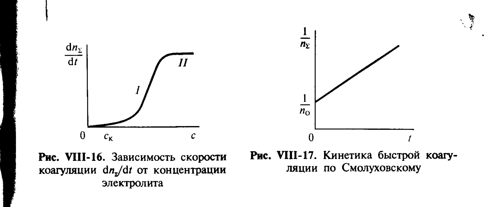

# Билет 52. Коагуляция гидрофобных золей электролитами. Правило Шульце–Гарди и его обоснование в теории ДЛФО

## Тема 1: Коагуляция золей электролитами — общая картина

> [!note] Определение
> **Коагуляция** — потеря агрегативной устойчивости дисперсной системы, проявляющаяся в слипании (агрегировании) частиц дисперсной фазы с образованием более крупных агрегатов, что в конечном счёте приводит к выпадению осадка (коагулята) или образованию пространственной структуры (геля).

Склонность гидрозолей к разрушению (коагуляции) под действием небольших добавок электролитов была замечена давно и послужила объектом обширных экспериментальных и теоретических исследований. Было установлено, что концентрация электролита, при которой начинается заметная коагуляция, зависит главным образом от **заряда коагулирующего иона** — иона, знак заряда которого противоположен знаку заряда коллоидных частиц.

> [!important] Ключевой эмпирический факт
> При постепенном увеличении концентрации электролита коагуляция начинается не сразу — она становится заметной лишь по достижении некоторой минимальной концентрации, называемой **порогом коагуляции** $c_{\text{к}}$ (или критической концентрацией коагуляции, ККК).

---

## Тема 2: Порог коагуляции и правило Шульце–Гарди

> [!note] Порог коагуляции
> **Порог коагуляции** $c_{\text{к}}$ — минимальная концентрация электролита, при достижении которой начинается заметная (видимая по изменению оптических или седиментационных свойств) коагуляция золя за определённый промежуток времени.

Зависимость скорости коагуляции $\dfrac{dn_\Sigma}{dt}$ (где $n_\Sigma$ — суммарное число частиц в единице объёма, включая агрегаты) от концентрации электролита $c$ имеет характерный S-образный вид (рис. VIII-16): при $c < c_{\text{к}}$ скорость коагуляции практически равна нулю (область **I**, медленная коагуляция), затем резко возрастает и при $c \gg c_{\text{к}}$ выходит на постоянное предельное значение (область **II**, быстрая коагуляция).

*Рис. VIII-16. Зависимость скорости коагуляции $dn_\Sigma/dt$ от концентрации электролита; Рис. VIII-17. Кинетика быстрой коагуляции по Смолуховскому (Щукин, с. 368–369)*

> [!important] Правило Шульце–Гарди (правило значности)
> Эмпирическое **правило Шульце–Гарди**: порог коагуляции $c_{\text{к}}$ резко уменьшается с увеличением **заряда (валентности) $z$ противоиона** — иона, знак которого противоположен знаку заряда поверхности коллоидных частиц. Количественно для типичных гидрофобных золей соотношение порогов коагуляции для одно-, двух- и трёхзарядных противоионов составляет приблизительно:
>
> $$c_{\text{к}}(1) : c_{\text{к}}(2) : c_{\text{к}}(3) \approx 1{,}016 : 0{,}0035 : 0{,}0015 \quad (\text{Щукин приводит близкое соотношение } 1{:}10^{-1,5}{:}10^{-2,7})$$
>
> Часто это записывается как приближённое отношение $1:1/60:1/700$, а само правило часто формулируют как пропорциональность $c_{\text{к}} \propto z^{-6}$ (теоретическое обоснование — см. Тему 3).

> [!example] Иллюстрация правила
> Для отрицательно заряженного золя $\text{As}_2\text{S}_3$ порог коагуляции электролитами с разными катионами уменьшается в ряду: $\text{Na}^+ \gg \text{Ca}^{2+} \gg \text{Al}^{3+}$ — то есть чтобы вызвать коагуляцию, требуется в десятки–сотни раз меньшая концентрация соли алюминия, чем соли натрия.

> [!tip] Запоминание
> «Чем выше заряд противоиона — тем меньше его нужно для коагуляции, причём очень резко (примерно как шестая степень заряда)».

---

## Тема 3: Теоретическое обоснование правила Шульце–Гарди в теории ДЛФО

Полное количественное обоснование правила Шульце–Гарди даёт теория ДЛФО (Дерягина–Ландау–Фервея–Овербека, см. подробный вывод в [[билет_48]]).

> [!note] Напоминание: суммарная кривая энергии взаимодействия (ДЛФО)
> Энергия взаимодействия двух сближающихся частиц через прослойку дисперсионной среды складывается из молекулярной (всегда притягивающей) и электростатической (отталкивающей при одноимённых ДЭС) составляющих:
>
> $$\Delta F(h) = \Delta F_{\text{мол}}(h) + \Delta F_{\text{эл}}(h)$$
>
> При достаточно большом заряде поверхности (большом $\psi_0$ или $\zeta$-потенциале) на кривой $\Delta F(h)$ возникает **потенциальный барьер** $\Delta F_{\max}$, преодоление которого требуется для сближения частиц на расстояние, где доминируют силы притяжения (коагуляция). См. [[билет_48]] для полного вывода формул VII.23–VII.27.

В рамках ДЛФО показано, что критическая концентрация коагуляции $n_{\text{к}}$ (или $c_{\text{к}}$), при которой потенциальный барьер $\Delta F_{\max}$ обращается в нуль (формула VII.27, см. [[билет_48]]), пропорциональна:

$$c_{\text{к}} \propto \frac{(kT)^5 \varepsilon^3}{A^2 e^6 z^6}$$

где $k$ — постоянная Больцмана, $T$ — температура, $\varepsilon$ — диэлектрическая проницаемость среды, $A$ — константа Гамакера (см. [[билет_05]], [[билет_06]]), $e$ — заряд электрона, $z$ — заряд противоиона.

> [!important] Главный результат: степень $z^{-6}$
> Из формулы видно, что критическая концентрация коагуляции **обратно пропорциональна шестой степени заряда противоиона**:
>
> $$c_{\text{к}} \propto z^{-6}$$
>
> Это и есть теоретическое (количественное) обоснование эмпирического правила Шульце–Гарди: переход от однозарядного к двухзарядному противоиону должен снижать порог коагуляции в $2^6 = 64$ раза, а к трёхзарядному — в $3^6 = 729$ раз, что качественно (по порядку величины) согласуется с экспериментальными отношениями (см. Тему 2).

> [!warning] Почему именно $z^{-6}$, а не $z^{-1}$ или $z^{-2}$?
> Резкая зависимость от заряда противоиона связана с тем, что увеличение $z$ влияет на два фактора одновременно: (1) увеличивает интенсивность сжатия диффузного слоя при одинаковой концентрации (через дебаевскую длину $1/\varkappa$, см. [[билет_36]]) и (2) увеличивает специфическую адсорбцию противоионов в плотном слое, снижая $\psi_0$ и $\zeta$-потенциал (см. [[билет_38]]). Оба эффекта совместно дают высокую степень при $z$.

---

## Тема 4: Быстрая коагуляция и кинетика по Смолуховскому

При концентрациях электролита $c \gg c_{\text{к}}$ (область **II** на рис. VIII-16) потенциальный барьер полностью отсутствует, и **каждое столкновение частиц приводит к их слипанию** — такой режим называется **быстрой коагуляцией**.

> [!note] Уравнение Смолуховского для быстрой коагуляции
> Для быстрой коагуляции скорость убывания суммарного числа частиц $n_\Sigma$ описывается уравнением второго порядка:
>
> $$-\frac{dn_\Sigma}{dt} = k_{\text{б}} \, n_\Sigma^2$$
>
> где $k_{\text{б}}$ — константа скорости быстрой коагуляции по Смолуховскому. Интегрирование даёт линейную зависимость обратной концентрации частиц от времени (рис. VIII-17):
>
> $$\frac{1}{n_\Sigma} = \frac{1}{n_0} + k_{\text{б}} t$$
>
> где $n_0$ — начальная концентрация частиц. Линейный характер зависимости $1/n_\Sigma$ от $t$ экспериментально подтверждает применимость теории Смолуховского для области быстрой коагуляции.

При $c < c_{\text{к}}$ (область **I**, медленная коагуляция) присутствие остаточного потенциального барьера снижает эффективность столкновений — лишь часть столкновений приводит к слипанию частиц, что и обеспечивает резкий рост скорости коагуляции с концентрацией электролита по мере приближения к $c_{\text{к}}$.

---

## Источники

- Щукин Е.Д., Перцов А.В., Амелина Е.А. Коллоидная химия. 3-е изд. М.: Высшая школа, 2004. С. 366–369 (раздел VIII.5 «Коагуляция гидрофобных золей электролитами»): правило Шульце–Гарди, эмпирические соотношения порогов коагуляции, кинетика быстрой коагуляции по Смолуховскому (рис. VIII-16, VIII-17).
- Теория ДЛФО, формулы VII.23–VII.27 для критической концентрации коагуляции — см. [[билет_48]] (Щукин, с. 318–323).
- Константа Гамакера $A$ — см. [[билет_05]], [[билет_06]]; дебаевская длина и сжатие ДЭС — см. [[билет_36]], [[билет_38]].
- *Дополнение (не из Щукина):* численная иллюстрация соотношения порогов коагуляции для золя $\text{As}_2\text{S}_3$ — классический пример из учебной литературы по коллоидной химии, не противоречащий материалу учебника.
