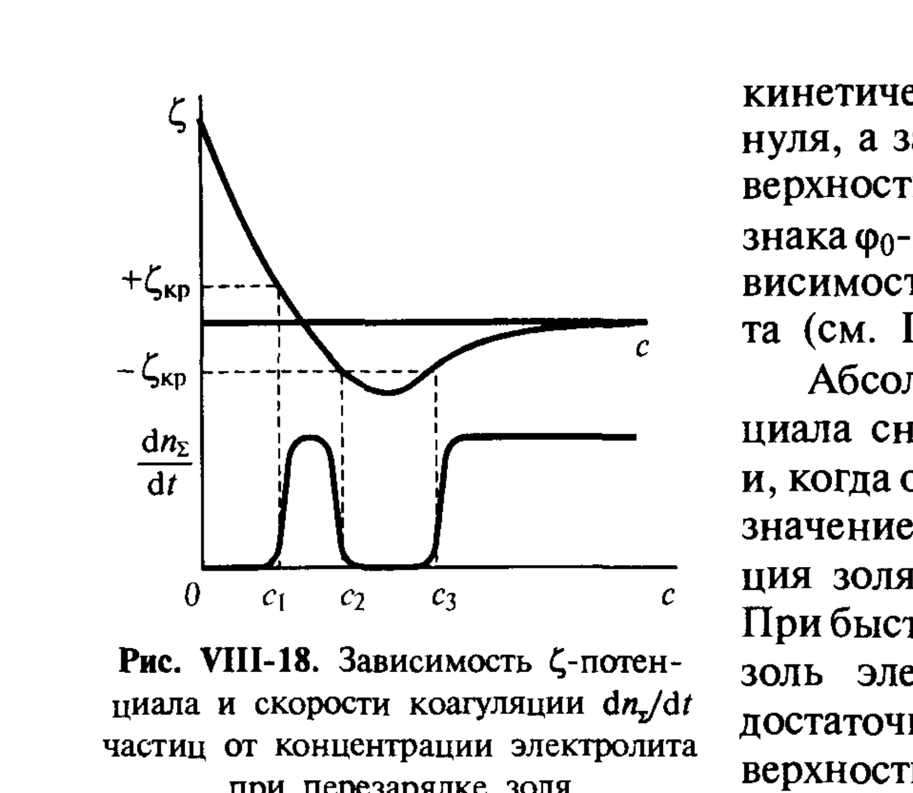

# Билет 53. Коагуляция золей электролитами: критерий Эйлерса–Корфа, зоны коагуляции, обоснование в ДЛФО

## Тема 1: Зоны коагуляции при перезарядке золя

В [[билет_52]] рассмотрена простейшая картина: монотонное увеличение скорости коагуляции с концентрацией электролита от нуля (область медленной коагуляции) до постоянного предельного значения (область быстрой коагуляции). Однако для золей, способных к **перезарядке** поверхности при адсорбции избытка противоионов (см. [[билет_38]]), зависимость скорости коагуляции от концентрации электролита оказывается **более сложной — немонотонной**.

> [!note] Перезарядка золя
> При высоких концентрациях электролита, особенно содержащего многозарядные или специфически адсорбирующиеся противоионы, заряд плотной части ДЭС $\sigma_d$ может по абсолютной величине превысить заряд поверхности $\sigma_0$, что приводит к изменению знака $\zeta$-потенциала — **перезарядке** коллоидной частицы (см. подробнее [[билет_38]]).

> [!important] Три зоны (области) коагуляции
> При постепенном увеличении концентрации электролита $c$, способного вызвать перезарядку, $\zeta$-потенциал и скорость коагуляции $dn_\Sigma/dt$ изменяются немонотонно (рис. VIII-18), образуя **три характерные зоны**:
>
> | Зона | Концентрация $c$ | $|\zeta|$ | Скорость коагуляции |
> |---|---|---|---|
> | **I — устойчивость** | $c < c_1$ | $|\zeta| > |\zeta_{\text{кр}}|$ | практически нулевая |
> | **II — первая зона коагуляции** | $c_1 < c < c_2$ | $|\zeta| < |\zeta_{\text{кр}}|$ (исходный знак) | заметная коагуляция |
> | **между II и III — повторная устойчивость** | $c_2 < c < c_3$ | $|\zeta| < |\zeta_{\text{кр}}|$, но знак уже изменился (перезарядка), $|\zeta|$ растёт | устойчивость восстанавливается |
> | **III — вторая зона коагуляции** | $c > c_3$ | $|\zeta| > |\zeta_{\text{кр}}|$ (новый знак), при дальнейшем росте $c$ начинается сжатие ДЭС | новая коагуляция |

*Рис. VIII-18. Зависимость $\zeta$-потенциала и скорости коагуляции $dn_\Sigma/dt$ частиц от концентрации электролита при перезарядке золя (Щукин, с. 370–371)*

> [!note] Критический ζ-потенциал
> Существует критическое (по модулю) значение $\zeta$-потенциала $\zeta_{\text{кр}}$, ниже которого (по абсолютной величине) электростатический барьер недостаточен для обеспечения агрегативной устойчивости, и начинается заметная коагуляция. На рис. VIII-18 границы зон коагуляции ($c_1$, $c_2$, $c_3$) соответствуют точкам пересечения кривой $\zeta(c)$ с уровнями $\pm\zeta_{\text{кр}}$.

> [!example] Физический смысл «окна коагуляции»
> Между точками $c_1$ и $c_2$ золь находится в первой зоне коагуляции — $\zeta$-потенциал по абсолютной величине упал ниже критического, частицы слипаются. При дальнейшем увеличении концентрации электролита (между $c_2$ и $c_3$) происходит перезарядка: знак $\zeta$-потенциала меняется на противоположный, и по мере роста $|\zeta|$ в новой полярности устойчивость снова восстанавливается («окно устойчивости»). При $c > c_3$ $|\zeta|$ в новой полярности снова падает ниже $\zeta_{\text{кр}}$ — наступает вторая, окончательная зона коагуляции, в которой золь остаётся неустойчивым при любом дальнейшем увеличении концентрации (поскольку с ростом $c$ дебаевская длина $1/\varkappa$ продолжает уменьшаться, см. [[билет_36]]).

> [!warning] Не путать с правилом Шульце–Гарди
> Правило Шульце–Гарди ([[билет_52]]) описывает положение **первого** порога коагуляции $c_{\text{к}} \approx c_1$ и его зависимость от заряда противоиона. Зоны коагуляции и критерий Эйлерса–Корфа (Тема 2) описывают **немонотонный ход** $\zeta(c)$ и существование возможной повторной устойчивости — это более тонкий эффект, проявляющийся при склонности системы к перезарядке (типично для золей с многозарядными или поверхностно-активными противоионами).

---

## Тема 2: Критерий Эйлерса–Корфа

> [!note] Критерий Эйлерса–Корфа
> **Критерий (правило) Эйлерса–Корфа** связывает устойчивость золя с соотношением высоты потенциального барьера $\Delta F_{\max}$ на суммарной кривой ДЛФО (см. [[билет_48]]) и средней энергии теплового движения частиц $kT$:
>
> $$\frac{\Delta F_{\max}}{kT} = \text{const}$$
>
> Согласно критерию Эйлерса–Корфа, для перехода системы из устойчивого состояния в состояние быстрой коагуляции отношение высоты барьера к $kT$ должно достигать определённого порядового значения (порядка $\sim 15$–$25\,kT$ по разным оценкам) — при превышении этого значения барьер эффективно предотвращает коагуляцию (частицы практически никогда не преодолевают барьер за счёт теплового движения), а при его снижении до этого порога коагуляция резко становится заметной.

> [!important] Связь критерия Эйлерса–Корфа с теорией ДЛФО
> Критерий Эйлерса–Корфа — это, по сути, **количественная формулировка условия исчезновения (или резкого снижения) потенциального барьера** $\Delta F_{\max}$ на суммарной кривой $\Delta F(h) = \Delta F_{\text{мол}} + \Delta F_{\text{эл}}$ (см. формулы VII.23–VII.26 в [[билет_48]]), выраженная через сравнение барьера с энергией теплового движения $kT$ — той же величиной, что определяет броуновское движение частиц (см. [[билет_40]]) и седиментационно-диффузионное равновесие ([[билет_41]]).
>
> Поскольку $\Delta F_{\max}$ зависит от концентрации электролита (через дебаевскую длину $1/\varkappa$ в электростатической составляющей $\Delta F_{\text{эл}}$, см. [[билет_47]]), критерий Эйлерса–Корфа задаёт **связь между концентрацией электролита и устойчивостью** золя — то есть фактически даёт второй (более общий, термодинамико-кинетический) путь к тому же результату, что и правило Шульце–Гарди в [[билет_52]]: оба критерия описывают условие, при котором система переходит от агрегативно устойчивого состояния к быстрой коагуляции.

> [!tip] Мнемоника: два взгляда на один переход
> Правило Шульце–Гарди отвечает на вопрос «**какая концентрация** (и зависимость от заряда противоиона $z^{-6}$) нужна для коагуляции?». Критерий Эйлерса–Корфа отвечает на вопрос «**насколько высоким** должен быть потенциальный барьер (в единицах $kT$), чтобы система оставалась устойчивой?» — оба критерия — следствия одной и той же суммарной кривой ДЛФО $\Delta F(h)$.

---

## Тема 3: Практическое значение зон коагуляции и критерия Эйлерса–Корфа

> [!example] Практические следствия
> Существование зон коагуляции и повторной устойчивости при перезарядке имеет важное практическое значение: например, при подборе концентрации коагулянта в технологиях очистки воды нужно учитывать, что слишком большая доза коагулянта (попадание в зону повторной устойчивости $c_2$–$c_3$ или превышение $c_3$ при определённых условиях) может, в принципе, привести к неожиданному результату — вместо ожидаемого осаждения частиц система может временно восстановить устойчивость или, наоборот, перейти во вторую необратимую зону коагуляции при избыточном сжатии ДЭС.

Критерий Эйлерса–Корфа также подчёркивает фундаментальную роль **теплового движения** в агрегативной устойчивости: при повышении температуры энергия теплового движения $kT$ возрастает, что при прочих равных условиях облегчает преодоление барьера и способствует коагуляции — это согласуется с общим представлением о роли теплового движения в седиментационной и агрегативной устойчивости дисперсных систем (см. [[билет_44]]).

---

## Источники

- Щукин Е.Д., Перцов А.В., Амелина Е.А. Коллоидная химия. 3-е изд. М.: Высшая школа, 2004. С. 368–371 (раздел VIII.5 «Коагуляция гидрофобных золей электролитами»): зоны коагуляции при перезарядке золя, рис. VIII-18 ($\zeta$-потенциал и скорость коагуляции в зависимости от концентрации электролита).
- Критерий Эйлерса–Корфа в формулировке через отношение $\Delta F_{\max}/kT$ — *дополнение, не из Щукина напрямую*: формулировка критерия в данном виде является стандартной для учебной литературы по коллоидной химии (например, Фридрихсберг Д.А. «Курс коллоидной химии») и согласуется с количественными выводами теории ДЛФО, изложенными в Щукине (с. 318–323, формулы VII.23–VII.27, см. [[билет_48]]).
- Связь с ДЭС, перезарядкой и сжатием диффузного слоя — см. [[билет_36]], [[билет_38]]; теория ДЛФО и потенциальный барьер — см. [[билет_47]], [[билет_48]]; роль теплового движения в устойчивости — см. [[билет_40]], [[билет_44]].
