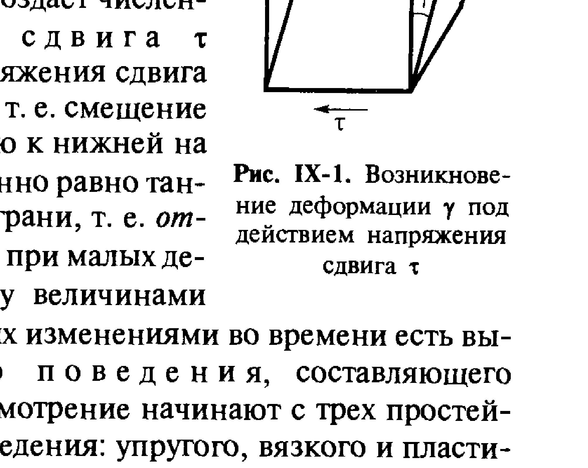
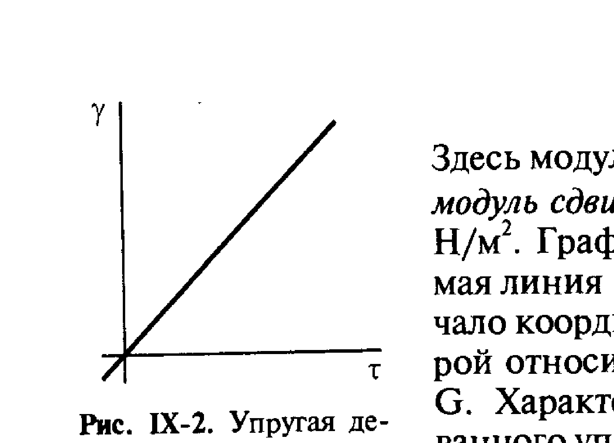
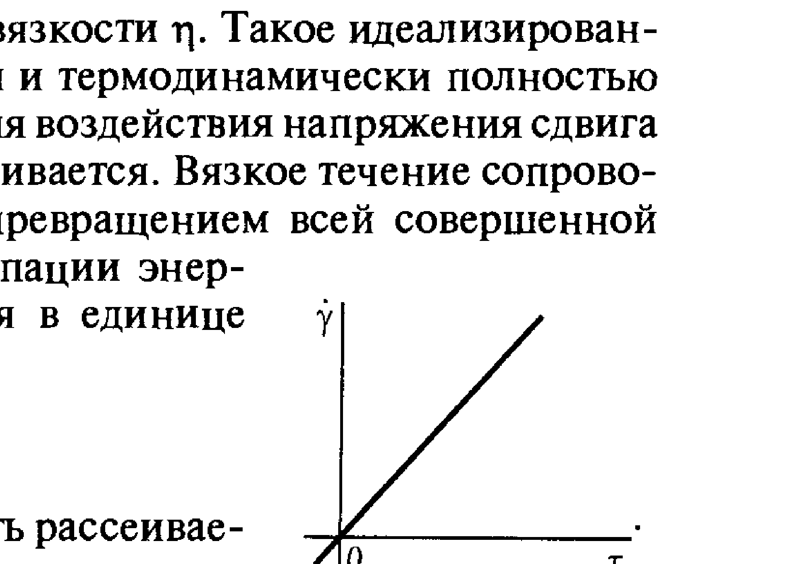
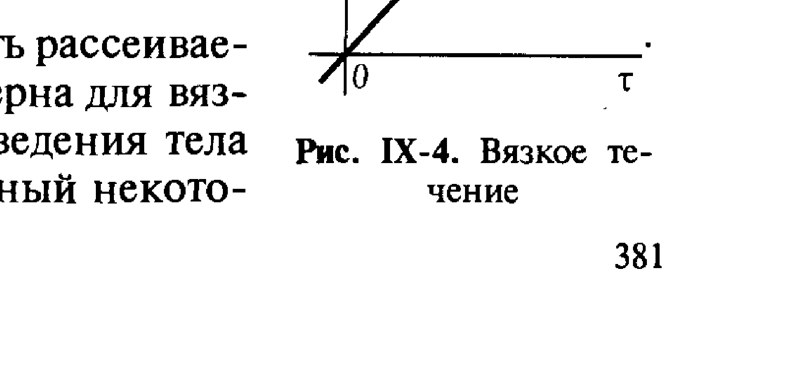
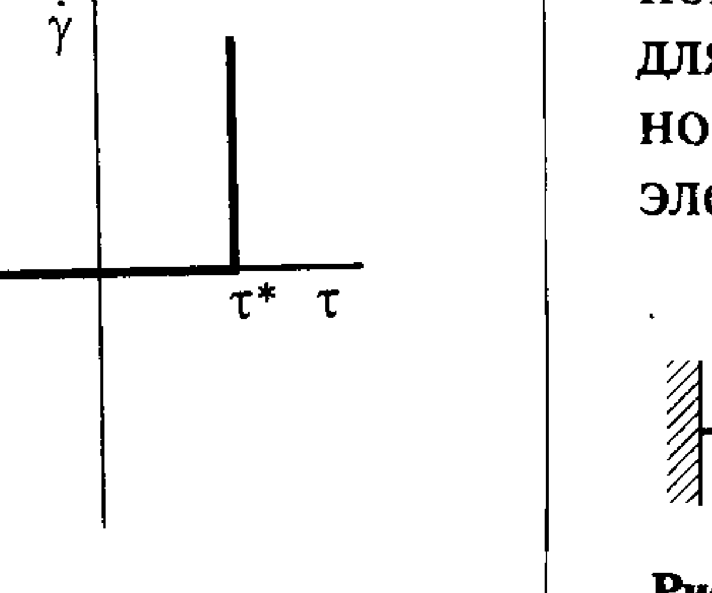
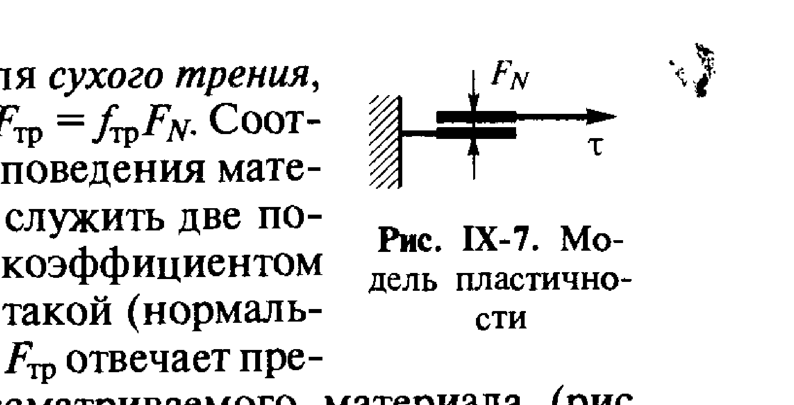

# Билет 54. Реология дисперсных систем: предмет, основные характеристики деформации и течения. Элементарные модели — Гука, Ньютона, Кулона

## Тема 1: Предмет реологии. Основные виды деформации

> [!note] Определение
> **Реология** — раздел физики (и физико-химии дисперсных систем), изучающий механическое поведение тел: их способность **деформироваться** и **течь** под действием приложенных напряжений. Реологические свойства определяют, ведёт ли себя тело как твёрдое (упругое), как жидкость (вязкое) или проявляет промежуточное, более сложное поведение (вязкоупругое, пластическое).

Для дисперсных систем (суспензий, паст, гелей, эмульсий) реологическое поведение часто сильно отличается от поведения индивидуальных фаз: появление структуры (см. [[билет_58]], [[билет_59]]) придаёт системе свойства, промежуточные между свойствами твёрдого тела и жидкости.

> [!important] Деформация сдвига — основной объект реологии
> Простейший и наиболее показательный вид деформации для реологических измерений — **деформация сдвига**. Рассматривается элемент материала (кубик), к верхней грани которого приложена сдвигающая (тангенциальная) сила; нижняя грань закреплена.

*Рис. IX-1. Возникновение деформации сдвига под действием тангенциального напряжения $\tau$ (Щукин, с. 378–379)*

> [!note] Основные величины
> - **Напряжение сдвига** $\tau$ — тангенциальная сила, приложенная к единице площади грани тела: $\tau = F/S$, где $F$ — сила, $S$ — площадь поверхности, к которой приложена сила. Размерность — Па (Н/м²).
> - **Деформация сдвига** $\gamma$ — относительное смещение слоёв материала, безразмерная величина: $\gamma = \Delta x / h$, где $\Delta x$ — абсолютное смещение верхней грани относительно нижней, $h$ — высота образца (расстояние между гранями). Геометрически $\gamma = \tan\alpha$, где $\alpha$ — угол сдвига.
> - **Скорость деформации сдвига (скорость сдвига)** $\dot\gamma = d\gamma/dt$ — изменение деформации сдвига во времени, размерность — с⁻¹.

> [!tip] Мнемоника
> $\tau$ (тау) — «нагрузка» (напряжение), $\gamma$ (гамма) — «отклик» (деформация). Реологическая модель — это математическая связь между $\tau$, $\gamma$ и $\dot\gamma$ (а иногда и их производными по времени), описывающая, как тело отвечает на приложенное напряжение.

---

## Тема 2: Модель Гука — упругая деформация

> [!note] Закон Гука для сдвига
> При **упругой деформации** напряжение сдвига $\tau$ пропорционально деформации сдвига $\gamma$:
>
> $$\tau = G\gamma$$
>
> где $G$ — **модуль сдвига** (модуль упругости при сдвиге), Па. Деформация $\gamma$ возникает **мгновенно** при приложении напряжения и **мгновенно и полностью исчезает** при его снятии — тело полностью восстанавливает первоначальную форму.

*Рис. IX-2. Упругая деформация: линейная зависимость $\gamma(\tau)$, тангенс угла наклона определяется величиной $1/G$ (Щукин, с. 378–379)*

> [!important] Энергия упругой деформации полностью обратима
> Вся работа, затраченная на упругую деформацию, запасается в теле в виде потенциальной энергии и полностью возвращается при снятии нагрузки — деформация **не сопровождается рассеянием (диссипацией) энергии**. В этом принципиальное отличие модели Гука от моделей Ньютона (Тема 3) и Кулона (Тема 4), где энергия рассеивается.

> [!example] Модель Гука: упругий элемент (пружина)
> Механический аналог упругого поведения — **пружина**, жёсткость которой характеризуется модулем $G$. Удлинение (деформация) пружины пропорционально приложенной силе (напряжению) и мгновенно исчезает при её снятии.

*Рис. IX-3. Механическая модель упругого поведения по Гуку — пружина с модулем сдвига $G$, нагруженная напряжением $\tau$ (Щукин, с. 378–379)*

> [!warning] Идеальная упругость — предельный случай
> Строго гуковское поведение ($\tau = G\gamma$ при любых $\tau$) — идеализация. Реальные твёрдые тела подчиняются закону Гука лишь в области малых деформаций; при больших напряжениях возникают пластические или вязкоупругие эффекты (см. [[билет_55]]).

---

## Тема 3: Модель Ньютона — вязкое течение

> [!note] Закон Ньютона для вязкого течения
> При **вязком течении** напряжение сдвига $\tau$ пропорционально **скорости** деформации сдвига $\dot\gamma$ (а не самой деформации):
>
> $$\tau = \eta \dot\gamma$$
>
> где $\eta$ — **коэффициент вязкости** (динамическая вязкость), Па·с. В отличие от упругой деформации, при вязком течении деформация $\gamma$ при постоянном $\tau$ **растёт неограниченно во времени** (течение), а при снятии напряжения деформация **не восстанавливается** — она необратима (остаточная).

*Рис. IX-4. Вязкое (ньютоновское) течение: линейная зависимость скорости сдвига $\dot\gamma$ от напряжения $\tau$, проходящая через начало координат (Щукин, с. 378–379)*

> [!important] Полная диссипация энергии
> Вся работа, затрачиваемая на вязкое течение, **полностью переходит в теплоту** (диссипирует) за счёт внутреннего трения между слоями жидкости — в отличие от упругой деформации, энергия не запасается и не возвращается.

> [!example] Ньютоновские и неньютоновские жидкости
> Жидкости, подчиняющиеся закону Ньютона (вязкость $\eta$ не зависит от $\tau$ и $\dot\gamma$) — **ньютоновские** (вода, низкомолекулярные жидкости). Многие дисперсные системы (суспензии, полимерные растворы, пасты) — **неньютоновские**: их эффективная вязкость зависит от скорости сдвига (псевдопластичность, дилатансия и др.) — это связано с перестройкой структуры частиц при течении (см. [[билет_58]]).

> [!tip] Запоминание: Гук — от γ, Ньютон — от γ̇
> $\tau = G\gamma$ (Гук — напряжение пропорционально **деформации**) и $\tau = \eta\dot\gamma$ (Ньютон — напряжение пропорционально **скорости** деформации) — легко запомнить по аналогии с механикой: упругость как у пружины (закон Гука для силы), вязкость как сила сопротивления, пропорциональная скорости (аналог закона трения в жидкости).

---

## Тема 4: Модель Кулона — пластическое течение

> [!note] Пластическое (кулоновское) течение
> **Пластическое течение** характеризуется существованием **предельного напряжения сдвига (предела текучести)** $\tau^*$: при $\tau < \tau^*$ деформация отсутствует (тело ведёт себя как жёсткое, недеформируемое), а при $\tau \geq \tau^*$ начинается течение со скоростью $\dot\gamma$, зависящей от превышения напряжения над $\tau^*$.
>
> В простейшем (идеально пластическом, кулоновском) случае:
>
> $$\dot\gamma = 0 \quad \text{при } \tau < \tau^*$$
> $$\dot\gamma \to \infty \quad (\text{мгновенное течение}) \quad \text{при } \tau \geq \tau^*$$

*Рис. IX-6. Пластическое течение: при $\tau < \tau^*$ скорость деформации $\dot\gamma = 0$, при достижении $\tau^*$ — резкий («скачкообразный») переход к течению (Щукин, с. 380–381)*

> [!important] Аналогия с законом трения Кулона
> Название «модель Кулона» связано с аналогией с **законом трения Кулона**: $F_{\text{тр}} = f_{\text{тр}} F_N$, где $F_{\text{тр}}$ — сила трения, $f_{\text{тр}}$ — коэффициент трения, $F_N$ — нормальная (прижимающая) сила. Пока касательная сила меньше силы трения, тело остаётся неподвижным («залипшим»); как только касательная сила превышает предельную силу трения, начинается скольжение (течение).

> [!example] Механическая модель пластичности
> Механический аналог пластического поведения — **две пластины, прижатые друг к другу нормальной силой $F_N$** и способные скользить друг по другу: пока тангенциальная нагрузка $\tau$ не превышает предельное значение $\tau^*$ (определяемое силой трения между пластинами), относительного смещения (сдвига) не происходит.

*Рис. IX-7. Механическая модель пластического поведения по Кулону — две пластины, прижатые силой $F_N$, скользящие друг по другу при $\tau \geq \tau^*$ (Щукин, с. 380–381)*

> [!warning] Не путать предел текучести с порогом коагуляции
> Предел текучести $\tau^*$ (реологическая характеристика, Па) — это не то же самое, что порог коагуляции $c_{\text{к}}$ ([[билет_52]]) — концентрационная характеристика устойчивости золя. Однако оба понятия связаны со структурой дисперсной системы: возникновение предела текучести у концентрированных дисперсных систем часто обусловлено образованием пространственной структуры из частиц (структурообразование, см. [[билет_58]], [[билет_59]]), а структура, в свою очередь, формируется в результате коагуляционных контактов между частицами.

---

## Тема 5: Три простейших модели — сводная таблица и переход к комбинированным моделям

> [!important] Три простейших случая механического поведения
> Модели Гука, Ньютона и Кулона — три **предельных, простейших** случая реологического поведения тела. Реальные дисперсные системы, как правило, проявляют **комбинацию** этих типов поведения (вязкоупругость, вязкопластичность), которая описывается **составными моделями**, получаемыми путём последовательного и/или параллельного соединения элементарных элементов (пружина — модель Гука, поршень в вязкой среде — модель Ньютона, элемент трения — модель Кулона). Подробный разбор составных моделей (Максвелла, Кельвина, Бингама) — см. [[билет_55]].

| Модель | Связь | Характер деформации | Обратимость | Энергия |
|---|---|---|---|---|
| **Гука** (упругость) | $\tau = G\gamma$ | мгновенная, конечная | полностью обратима | запасается |
| **Ньютона** (вязкость) | $\tau = \eta\dot\gamma$ | непрерывное течение | необратима | полностью рассеивается |
| **Кулона** (пластичность) | $\dot\gamma=0$ при $\tau<\tau^*$; течение при $\tau\geq\tau^*$ | пороговая | необратима (после $\tau^*$) | рассеивается (после $\tau^*$) |

> [!tip] Мнемоника для трёх моделей
> «Пружина (Гук) — помнит форму. Поршень в масле (Ньютон) — течёт пропорционально скорости. Кирпич с трением (Кулон) — стоит насмерть, пока не толкнёшь сильнее предела».

---

## Источники

- Щукин Е.Д., Перцов А.В., Амелина Е.А. Коллоидная химия. 3-е изд. М.: Высшая школа, 2004. С. 378–381 (раздел IX.1 «Реологические свойства дисперсных систем»): деформация сдвига, основные реологические величины ($\tau$, $\gamma$, $\dot\gamma$), модели Гука (рис. IX-2, IX-3), Ньютона (рис. IX-4), Кулона (рис. IX-6, IX-7).
- Связь предела текучести со структурообразованием в дисперсных системах — см. [[билет_58]], [[билет_59]] (Щукин, соответствующие разделы).
- Составные реологические модели (Максвелла, Кельвина, Бингама) — см. [[билет_55]] (Щукин, с. 382–387).
