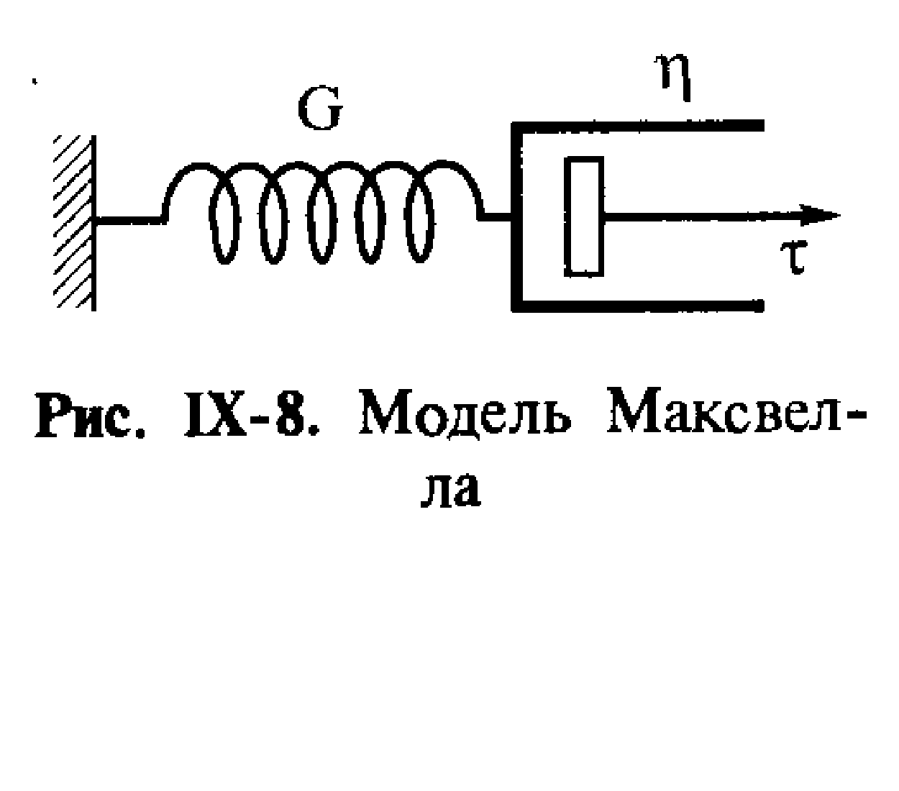
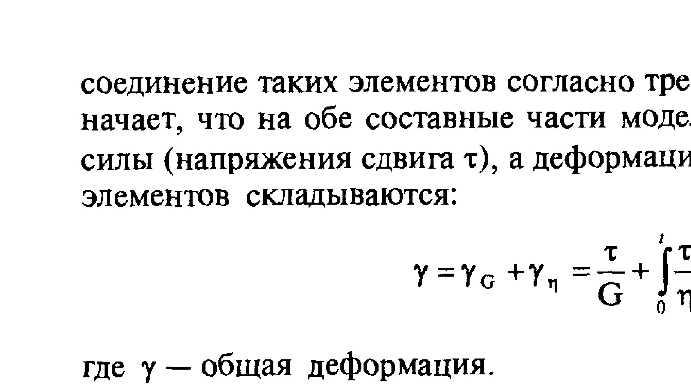
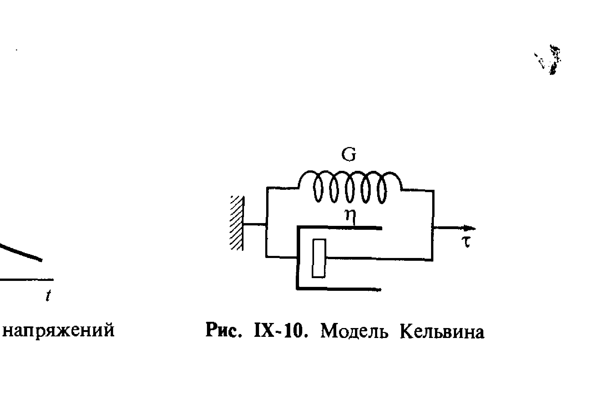
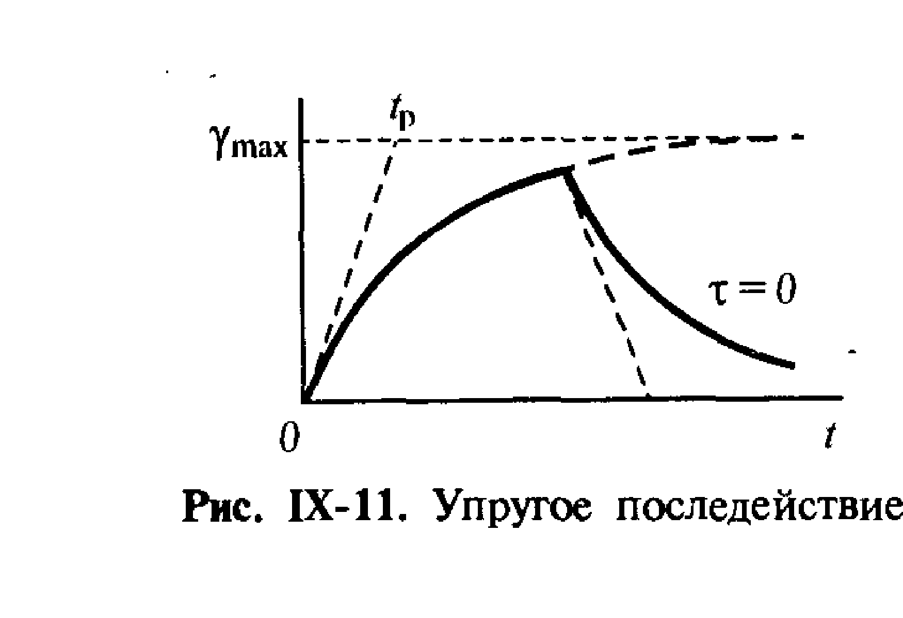
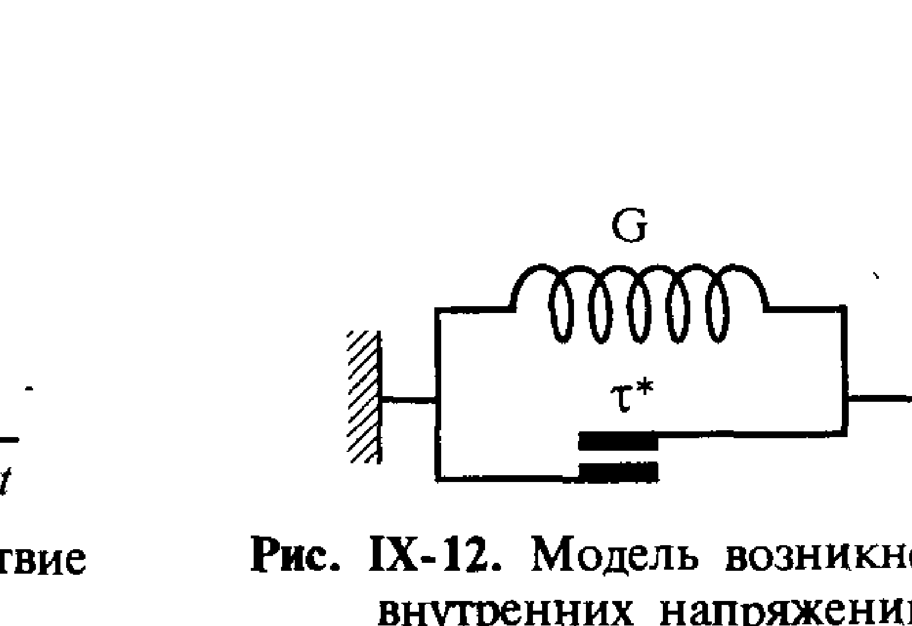
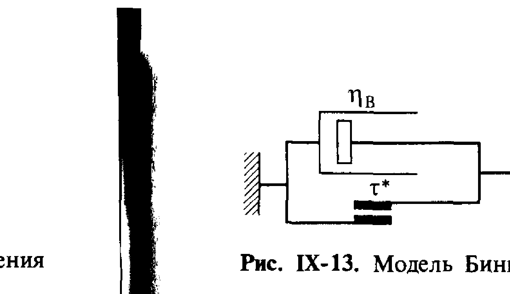
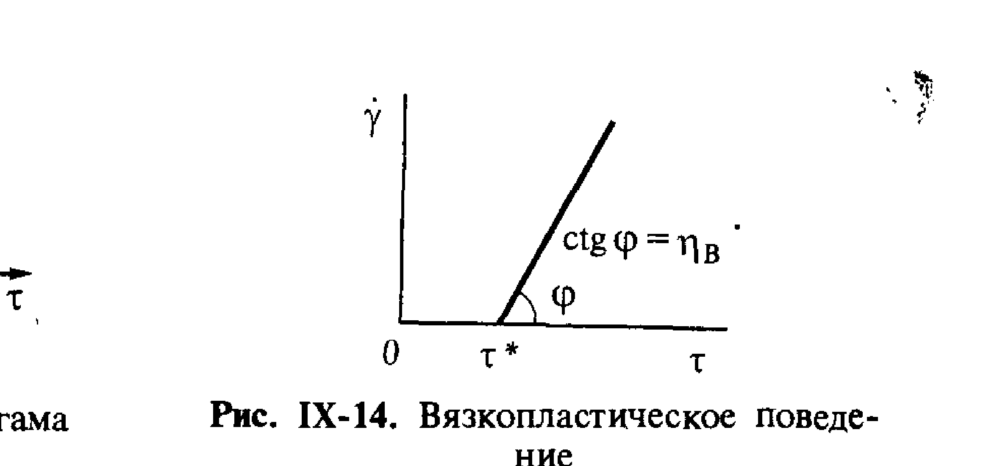

# Билет 55. Составные реологические модели: модель Максвелла (релаксация напряжений), модель Кельвина (упругое последействие), модель Бингама (вязкопластичность)

## Тема 1: От элементарных моделей к составным

В [[билет_54]] рассмотрены три простейшие реологические модели — Гука (упругость, $\tau=G\gamma$), Ньютона (вязкость, $\tau=\eta\dot\gamma$) и Кулона (пластичность, пороговое течение при $\tau\geq\tau^*$). Реальные дисперсные системы редко описываются одной элементарной моделью — они проявляют **комбинированное** поведение: упругость + вязкость (вязкоупругость) или вязкость + пластичность (вязкопластичность).

> [!important] Принцип построения составных моделей
> Составные модели получают, соединяя элементарные элементы (пружину — модель Гука; поршень в вязкой среде — модель Ньютона; элемент сухого трения — модель Кулона) **последовательно** или **параллельно**, согласно правилам, аналогичным правилам для электрических цепей:
>
> - **Последовательное соединение**: на оба элемента действует **одинаковое напряжение** $\tau$, а **деформации складываются**: $\gamma = \gamma_1 + \gamma_2$.
> - **Параллельное соединение**: оба элемента испытывают **одинаковую деформацию** $\gamma$, а **напряжения складываются**: $\tau = \tau_1 + \tau_2$.

> [!tip] Электромеханическая аналогия
> Реологические модели часто сравнивают с электрическими RC/RL-цепями: упругий элемент (пружина, $G$) аналогичен **конденсатору** (накопление энергии, обратимость), вязкий элемент (поршень, $\eta$) — **резистору** (диссипация энергии). Последовательное соединение пружины и поршня (модель Максвелла) аналогично RC-цепи, разряжающейся через резистор — отсюда экспоненциальный характер релаксации напряжения, как при разряде конденсатора.

---

## Тема 2: Модель Максвелла — последовательное соединение упругости и вязкости

> [!note] Модель Максвелла
> **Модель Максвелла** — это **последовательное** соединение упругого элемента (пружина с модулем сдвига $G$) и вязкого элемента (поршень с вязкостью $\eta$).

*Рис. IX-8. Модель Максвелла — последовательное соединение упругого элемента ($G$) и вязкого элемента ($\eta$) (Щукин, с. 382–383)*

Поскольку соединение последовательное, на оба элемента действует одинаковое напряжение $\tau$, а деформации складываются:

$$\gamma = \gamma_G + \gamma_\eta = \frac{\tau}{G} + \int_0^t \frac{\tau}{\eta}\,dt \tag{IX.2}$$

Дифференцируя по времени, получаем основное реологическое уравнение модели Максвелла:

$$\dot\gamma = \dot\gamma_G + \dot\gamma_\eta = \frac{1}{G}\frac{d\tau}{dt} + \frac{\tau}{\eta}$$

> [!important] Релаксация напряжений по Максвеллу
> Характерный режим для модели Максвелла — **релаксация напряжений**: образцу мгновенно задают некоторую деформацию $\gamma = \text{const}$ и далее поддерживают её постоянной ($\dot\gamma=0$, начальное напряжение $\tau_0 = G\gamma_0$). При этом уравнение принимает вид:
>
> $$\frac{1}{G}\frac{d\tau}{dt} + \frac{\tau}{\eta} = 0$$
>
> Интегрируя это уравнение с начальным условием $\tau(t{=}0)=\tau_0$, получаем:
>
> $$\tau = \tau_0 e^{-t/t_p}$$
>
> где $t_p = \eta/G$ — **время релаксации** (период релаксации), имеющее размерность времени и являющееся важнейшей характеристической величиной модели Максвелла.

*Рис. IX-9. Релаксация напряжений: экспоненциальное убывание $\tau(t)$ от начального значения $\tau_0$ при постоянной деформации; касательная в точке $t=0$ отсекает на оси времени отрезок $t_p$ (время релаксации) (Щукин, с. 384–385)*

> [!note] Физический смысл времени релаксации
> Время релаксации $t_p = \eta/G$ — время, за которое начальное напряжение $\tau_0$ уменьшается в $e$ раз ($\approx 2{,}72$ раза). Графически $t_p$ соответствует отрезку, отсекаемому на оси времени касательной к кривой $\tau(t)$ в точке $t=0$ (рис. IX-9).

> [!example] Физический смысл релаксации
> При мгновенной деформации $\gamma_0$ всё напряжение первоначально воспринимается упругим элементом ($\tau_0 = G\gamma_0$). Со временем деформация «перетекает» из упругого элемента в вязкий (поршень медленно смещается под действием напряжения), и напряжение в системе постепенно убывает до нуля — при этом полная деформация $\gamma_0$ сохраняется, но перераспределяется между $\gamma_G$ (упруго) и $\gamma_\eta$ (вязко, необратимо).

> [!warning] Модель Максвелла описывает жидкость, а не твёрдое тело
> При длительном времени наблюдения ($t \to \infty$) напряжение в модели Максвелла полностью релаксирует к нулю ($\tau \to 0$), а деформация продолжает нарастать неограниченно (вязкое течение поршня) — то есть модель Максвелла в пределе ведёт себя как **жидкость** (хотя и с упругим «запаздыванием» на малых временах). Это отличает модель Максвелла от модели Кельвина (Тема 3), которая описывает поведение, более характерное для твёрдого тела.

---

## Тема 3: Модель Кельвина — параллельное соединение упругости и вязкости. Упругое последействие

> [!note] Модель Кельвина
> **Модель Кельвина** (Кельвина–Фойгта) — это **параллельное** соединение упругого элемента ($G$) и вязкого элемента ($\eta$).

*Рис. IX-10. Модель Кельвина — параллельное соединение упругого элемента ($G$) и вязкого элемента ($\eta$) (Щукин, с. 384–385)*

Поскольку соединение параллельное, оба элемента испытывают одинаковую деформацию $\gamma$, а напряжения складываются:

$$\tau = \tau_G + \tau_\eta = G\gamma + \eta\dot\gamma$$

> [!important] Упругое последействие (запаздывающая упругость)
> Наиболее характерный режим деформирования для модели Кельвина — приложение постоянного напряжения сдвига $\tau = \tau_0 = \text{const}$. В отличие от модели Максвелла, вязкий элемент здесь является **тормозом** на пути упругой деформации: мгновенная деформация невозможна, деформация нарастает с течением времени, постепенно стремясь к предельной величине, отвечающей чисто упругой деформации гуковского элемента. Решая уравнение модели:
>
> $$\eta\frac{d\gamma}{dt} = \tau_0 - G\gamma$$
>
> с начальным условием $\gamma(0)=0$, получаем:
>
> $$\gamma = \frac{\tau_0}{G}\left(1 - e^{-t/t_p}\right)$$
>
> где $t_p = \eta/G$ — то же время релаксации (период запаздывания), что и в модели Максвелла. Этому соответствует постепенное замедляющееся нарастание деформации (рис. IX-11), асимптотически стремящееся к пределу $\gamma_{\max} = \tau_0/G$, определяемому модулем упругости гуковского элемента.

*Рис. IX-11. Упругое последействие: деформация $\gamma(t)$ при постоянном напряжении $\tau_0$ постепенно (по экспоненциальному закону) нарастает к пределу $\gamma_{\max}=\tau_0/G$ (Щукин, с. 384–385)*

> [!note] Определение: упругое последействие
> **Упругое последействие (запаздывающая упругость)** — явление, при котором деформация тела при приложении (или снятии) нагрузки нарастает (или убывает) не мгновенно, а постепенно, асимптотически приближаясь к равновесному значению. Такой процесс называют **упругим последействием**: эластическое поведение механической системы, в отличие от жидкости, обратимо — при снятии напряжения деформация со временем полностью исчезает, постепенно возвращаясь к исходной форме за счёт восстановления исходной формы вязкоупругим элементом.

> [!example] Внутренние напряжения (модель IX-12)
> При снятии внешней нагрузки в момент, когда деформация еще не достигла предельного значения, в модели Кельвина возникают **внутренние напряжения**, которые продолжают медленно «разряжаться» — деформация постепенно убывает к нулю по тому же экспоненциальному закону, что и её рост, что и обнаруживается в твердообразных системах с эластическим поведением (рис. IX-12).

*Рис. IX-12. Модель возникновения внутренних напряжений (Щукин, с. 386–387)*

> [!tip] Максвелл vs Кельвин — мнемоника
> **Максвелл** (последовательно) → при постоянной деформации напряжение **релаксирует к нулю** — «жидкостное» поведение. **Кельвин** (параллельно) → при постоянном напряжении деформация **стремится к конечному пределу** — «твердообразное» поведение с упругим последействием. Обе модели характеризуются одним и тем же временем релаксации $t_p=\eta/G$, но проявляют его в противоположных режимах нагружения.

---

## Тема 4: Модель Бингама — вязкопластическое течение

> [!note] Модель Бингама
> **Модель Бингама** — параллельное соединение элемента сухого трения (модель Кулона, предел текучести $\tau^*$, см. [[билет_54]]) и вязкого элемента ($\eta_B$). Поскольку соединение параллельное, до тех пор, пока приложенное напряжение $\tau$ не превышает предельное напряжение сдвига $\tau^*$, деформация (течение) не происходит — фрикционный элемент полностью «запирает» систему. Только при $\tau \geq \tau^*$ начинается вязкое течение.

*Рис. IX-13. Модель Бингама — параллельное соединение пластического элемента (предел текучести $\tau^*$) и вязкого элемента $\eta_B$ (Щукин, с. 386–387)*

> [!important] Уравнение Бингама
> При $\tau < \tau^*$ течение не происходит ($\dot\gamma = 0$). При $\tau \geq \tau^*$ скорость деформации сдвига определяется уравнением:
>
> $$\dot\gamma = \frac{\tau - \tau^*}{\eta_B}$$
>
> где $\eta_B$ — **бингамовская (пластическая) вязкость** — параметр модели, имеющий смысл наклона прямой $\dot\gamma(\tau)$ при $\tau > \tau^*$, но не равный истинной (ньютоновской) вязкости системы при отсутствии предела текучести.

*Рис. IX-14. Вязкопластическое поведение по Бингаму: при $\tau<\tau^*$ течения нет, при $\tau\geq\tau^*$ зависимость $\dot\gamma(\tau)$ линейна с наклоном $\operatorname{ctg}\varphi = \eta_B$ (Щукин, с. 386–387)*

> [!note] Эффективная вязкость бингамовской системы
> Поскольку зависимость $\dot\gamma(\tau)$ для бингамовского тела не проходит через начало координат, удобно ввести **эффективную вязкость** системы:
>
> $$\eta_{\text{эф}} = \frac{\tau}{\dot\gamma}$$
>
> Эффективная вязкость бингамовской системы **зависит от скорости сдвига** $\dot\gamma$ (убывает с ростом $\dot\gamma$, приближаясь к $\eta_B$ при больших $\dot\gamma$) — то есть бингамовская система формально является **неньютоновской жидкостью**.

> [!example] Пример: концентрированные суспензии и пасты
> Модель Бингама — широко используемое приближение для описания течения концентрированных коллоидных систем с коагуляционными контактами между частицами (см. [[билет_58]], [[билет_59]]): водных суспензий глинистых минералов, паст, буровых растворов, зубных паст, кетчупа. Существование предела текучести $\tau^*$ у таких систем обусловлено необходимостью разрушить пространственную структуру (коагуляционную сетку) частиц, прежде чем начнётся течение; величина $\tau^*$ связана с параметрами этой структуры (например, $G \sim \eta/t_p$, где $G$ — модуль упругости структурированной системы, $\eta$ — вязкость дисперсионной среды).

> [!warning] Не путать модуль $G$ модели Бингама с модулем модели Гука
> В модели Бингама также может присутствовать упругий элемент с модулем $G$, отвечающий за упругую деформацию структурированной системы до достижения предела текучести (комбинация Бингама с упругостью даёт более сложную модель Шведова–Бингама). Базовая модель Бингама (рис. IX-13, IX-14) включает только пластический и вязкий элементы, без упругого.

---

## Источники

- Щукин Е.Д., Перцов А.В., Амелина Е.А. Коллоидная химия. 3-е изд. М.: Высшая школа, 2004. С. 382–387 (раздел IX.1 «Реологические свойства дисперсных систем»): модель Максвелла и релаксация напряжений (формула IX.2, рис. IX-8, IX-9), модель Кельвина и упругое последействие (рис. IX-10, IX-11, IX-12), модель Бингама и вязкопластическое поведение (рис. IX-13, IX-14).
- Элементарные модели (Гука, Ньютона, Кулона) — см. [[билет_54]] (Щукин, с. 378–381).
- Структурообразование в дисперсных системах как причина возникновения предела текучести — см. [[билет_58]], [[билет_59]].
