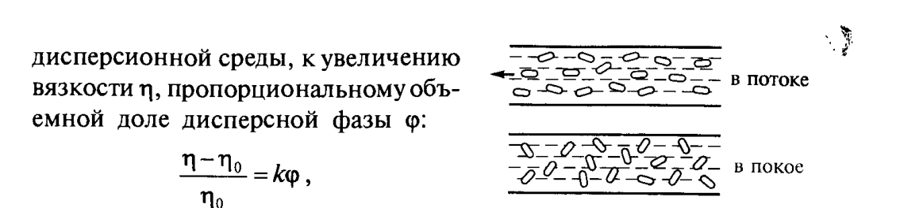
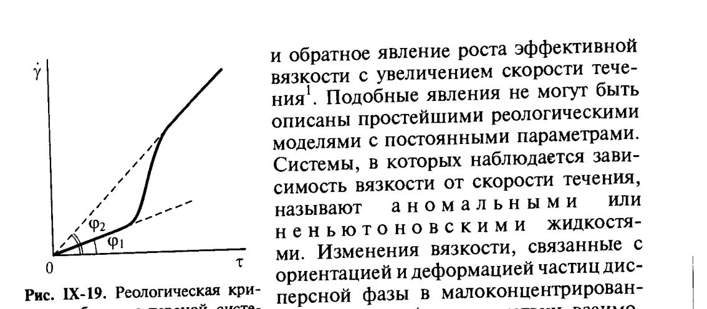

# Билет 56. Реология свободнодисперсных систем: закон Эйнштейна, аномалия вязкости

## Тема: Реологические свойства свободнодисперсных систем. Закон Эйнштейна. Аномалия вязкости

### Реология дисперсных систем — общие понятия

> [!note] Определение
> **Реология** — раздел физики, изучающий деформационное поведение тел под действием механических напряжений: течение жидкостей, упругую и пластическую деформацию твёрдых тел, а также промежуточные (вязкоупругие, вязкопластичные) типы поведения.
>
> Реологические свойства дисперсных систем определяются совокупностью **межчастичных взаимодействий и структуры**, а не только свойствами отдельных компонентов.

Различают два предельных типа дисперсных систем по реологическому поведению:

| Тип системы | Структура | Поведение |
|---|---|---|
| **Свободнодисперсная** | частицы не связаны друг с другом, разобщены прослойками среды | вязкость определяется в основном вязкостью дисперсионной среды и объёмной долей частиц |
| **Связнодисперсная** | частицы образуют непрерывный пространственный «каркас» (структуру) | появляется предел текучести, аномалия вязкости, тиксотропия (см. [[билет_57]]) |

> [!important] Часто спрашивают
> На экзамене важно чётко различать: свободнодисперсные системы (этот билет) описываются **уравнением Эйнштейна** и подчиняются (при малых концентрациях) **закону Ньютона**; связнодисперсные структурированные системы (билет 57) — нет, для них характерна аномалия вязкости и полная реологическая кривая с участками I–IV.

---

### Вязкость малоконцентрированных свободнодисперсных систем. Уравнение Эйнштейна

Для разбавленной суспензии сферических недеформируемых частиц, не взаимодействующих друг с другом, А. Эйнштейн (1906) показал, что введение в дисперсионную среду частиц дисперсной фазы (малой концентрации, при отсутствии их взаимодействия между собой) приводит — вследствие диссипации энергии при вращении частиц в поле сдвиговых напряжений — к увеличению вязкости $\eta$, пропорциональному объёмной доле дисперсной фазы $\varphi$:

$$
\frac{\eta - \eta_0}{\eta_0} = k\varphi \qquad \text{(IX.1)}
$$

> [!note] Расшифровка символов
> - $\eta$ — вязкость дисперсной системы (суспензии);
> - $\eta_0$ — вязкость чистой дисперсионной среды;
> - $\varphi$ — объёмная доля дисперсной фазы (отношение объёма частиц к общему объёму системы);
> - $k$ — коэффициент, зависящий от формы частиц.

Для сферических частиц коэффициент $k = 2{,}5$ (классическое значение Эйнштейна).

> [!important] Ключевой вывод уравнения Эйнштейна
> При $k = 2{,}5$ (сферические частицы, отсутствие межчастичного взаимодействия) дисперсная система **ведёт себя как ньютоновская жидкость**, но с несколько повышенной по сравнению с дисперсионной средой вязкостью. То есть вязкость суспензии **не зависит от скорости (градиента) течения** — это критерий «нормального», ньютоновского поведения.

> [!example] Иллюстрация смысла уравнения
> Если в воде ($\eta_0$) находится 10 % (по объёму) взвешенных сферических частиц ($\varphi = 0{,}1$), то по Эйнштейну:
> $$\eta = \eta_0(1 + 2{,}5 \cdot 0{,}1) = 1{,}25\,\eta_0$$
> То есть вязкость возрастает на 25 % — линейно с концентрацией, без изменения характера течения.

---

### Аномалия вязкости при анизометричных частицах

Если частицы дисперсной фазы **анизометричны** (эллипсоиды, палочки, пластинки) или способны деформироваться (капельки, макромолекулы), то в потоке дисперсионной среды различные тенденции проявляются в зависимости от природы и размеров частиц дисперсной фазы:

- сдвиговые напряжения стремятся **ориентировать** анизометричные частицы вдоль линий потока;
- этому противодействует **вращательная диффузия** частиц (броуновское движение), стремящаяся к хаотической ориентации.

> [!note] Определение — аномалия вязкости
> **Аномальными** (или **неньютоновскими**) называют жидкости (системы), у которых наблюдается **зависимость вязкости от скорости течения** $\dot\gamma$ — в отличие от ньютоновских жидкостей, где $\eta = \text{const}$.

В результате конкуренции ориентирующего действия потока и разупорядочивающей вращательной диффузии **степень ориентации частиц существенно зависит от скорости деформации**:

- при **малых** скоростях сдвига течение может быть полностью разориентировано (близко к хаотическому, как в покое);
- при **больших** скоростях сдвига частицы преимущественно ориентируются вдоль потока — степень ориентации фиксируется оптическими методами (см. гл. V учебника, методы изучения ориентации частиц в потоке).

*Рис. IX-18. Ориентация анизометричных частиц в потоке (в потоке частицы выстраиваются вдоль линий течения; в покое — хаотическая ориентация). Щукин, с. 403.*

#### Эффективная вязкость и её зависимость от скорости деформации

Поскольку при таком поведении вязкость перестаёт быть постоянной характеристикой системы, вводят понятие **эффективной вязкости**:

$$
\eta_{\text{эф}} = \frac{\tau}{\dot\gamma} = \frac{d\tau}{d\dot\gamma} \qquad \text{(условное обозначение, см. Щукин с. 403)}
$$

> [!note] Расшифровка символов
> - $\tau$ — напряжение сдвига;
> - $\dot\gamma$ — скорость деформации (градиент скорости сдвига);
> - $\eta_{\text{эф}}$ — эффективная (кажущаяся) вязкость в данной точке кривой течения — отношение, а не постоянная величина.

При **малых напряжениях сдвига** (область неориентированных частиц) эффективная вязкость **максимальна**. По мере увеличения напряжения сдвига вязкость **постепенно падает** до некоторого минимального значения, соответствующего полностью ориентированным в потоке частицам.

*Рис. IX-19. Реологическая кривая свободнодисперсной системы с анизометричными частицами: $\dot\gamma$ — скорость деформации, $\tau$ — напряжение сдвига; углы $\varphi_1$, $\varphi_2$ соответствуют разным эффективным вязкостям на начальном и конечном участках кривой. Щукин, с. 404.*

> [!important] Типичная ошибка на экзамене
> Не путать **аномалию вязкости из-за ориентации частиц** (этот билет, свободнодисперсные системы с анизометричными/деформируемыми частицами) с **аномалией вязкости структурированных (связнодисперсных) систем** из-за разрушения/восстановления пространственной структуры (билет 57). Физическая причина разная: в первом случае — ориентация отдельных частиц потоком, во втором — разрушение/восстановление сетки контактов между частицами.

#### Дилатансия и реопексия

> [!warning] Частые путаницы — типы аномального поведения
> - **Псевдопластичность** — вязкость убывает с ростом скорости сдвига (наиболее распространённый случай, например, при ориентации анизометричных частиц).
> - **Дилатансия** — вязкость, наоборот, **растёт** с увеличением скорости течения (обратное явление); в концентрированных суспензиях это может быть связано с дилатансионным увеличением плотности упаковки частиц при деформации, что увеличивает гидродинамическое сопротивление.
> - Оба явления **не описываются простейшими реологическими моделями с постоянными параметрами** (для них нужна зависимость $\eta(\dot\gamma)$, см. Щукин, с. 404).

> [!example] Практический пример
> Суспензии глин, латексов, крахмальных паст, а также растворы некоторых полимеров (макромолекулы, способные к конформационным изменениям в потоке) часто проявляют аномалию вязкости. Классический бытовой пример дилатансии — концентрированная смесь крахмала с водой («oobleck»): при быстром ударе ведёт себя как твёрдое тело, при медленном надавливании — как жидкость.

---

### Вязкость дисперсионной среды как фактор

> [!tip] Мнемоника
> Запомнить порядок величин вязкости дисперсионных сред (Щукин, с. 401):
> - газы: $\eta_0 \sim 10^{-5}\,\text{Па·с}$;
> - жидкоподобные тела: до $10^{10}\,\text{Па·с}$;
> - стёкла и твёрдые тела: $10^{15}$–$10^{20}\,\text{Па·с}$ и более.
>
> Чем шире диапазон возможных $\eta_0$, тем разнообразнее реологическое поведение систем на их основе.

---

## Источники

- Щукин Е.Д., Перцов А.В., Амелина Е.А. «Коллоидная химия» (3-е изд., 2004): с. 401–404 (раздел IX.3, начало — вязкость малоконцентрированных свободнодисперсных систем, уравнение Эйнштейна, ориентация анизометричных частиц, аномалия вязкости, рис. IX-18, IX-19).
- Сопутствующие темы и перекрёстные ссылки: [[билет_57]] (реология связнодисперсных систем, полная реологическая кривая, тиксотропия), [[билет_54]], [[билет_55]] (реологические модели Гука, Ньютона, Кулона, Максвелла, Кельвина, Бингама).
- Дополнение (не из Щукина, общие знания, не противоречит учебнику): пример дилатансии (смесь крахмала с водой) приведён как общеизвестная иллюстрация явления, упомянутого в тексте Щукина.
