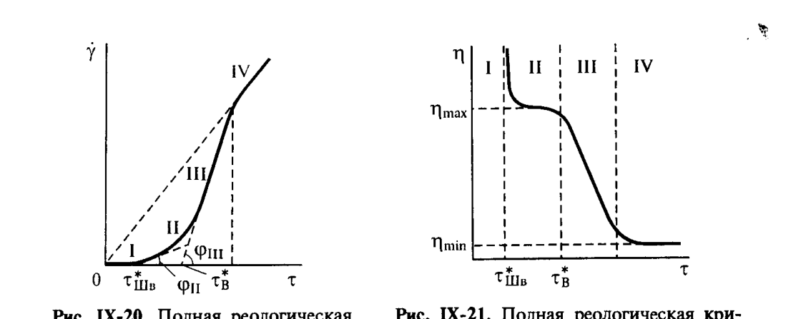
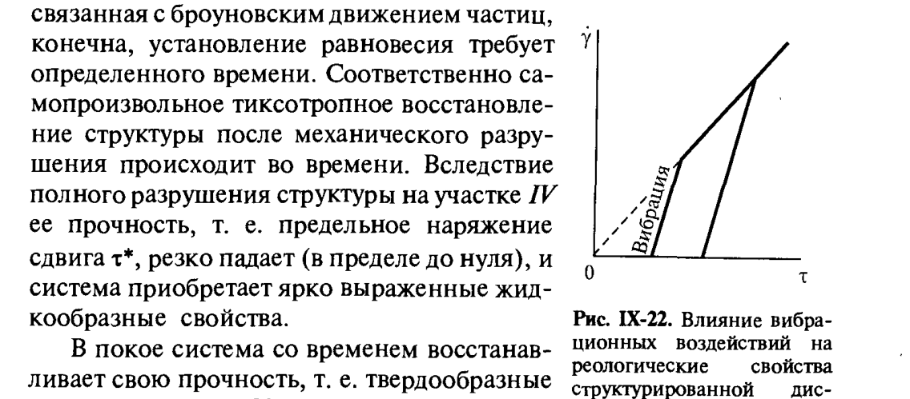
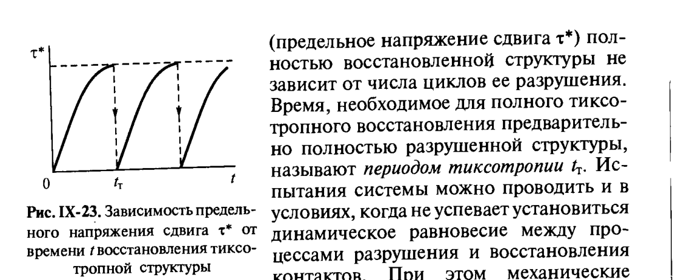

# Билет 57. Реология связнодисперсных систем: дифференциальная и эффективная вязкость, полная реологическая кривая

## Тема: Реологические свойства связнодисперсных (структурированных) систем

### От свободнодисперсных к связнодисперсным системам

> [!note] Определение
> **Связнодисперсные системы** — системы, в которых частицы дисперсной фазы образуют непрерывную пространственную **структуру (каркас)**, пронизывающую весь объём дисперсионной среды. В отличие от свободнодисперсных систем (см. [[билет_56]]), здесь вязкость определяется не только свойствами отдельных частиц, но и **прочностью и состоянием межчастичных контактов**.

Реологическое поведение связнодисперсных систем существенно зависит от скорости течения (деформации). Системы, в которых наблюдается такая зависимость, называют **аномальными**, или **неньютоновскими**.

> [!important] Главная идея билета
> Связнодисперсную систему с коагуляционной структурой (см. [[билет_58]]) можно рассматривать как **целый спектр промежуточных состояний** между двумя крайними:
> - **неразрушенная** структура — максимальная прочность, максимальная вязкость;
> - **полностью разрушенная** структура — минимальная вязкость, поведение близкое к ньютоновскому.
>
> Реологические свойства такой системы могут меняться в зависимости от приложенного напряжения сдвига (скорости течения), присущих твердообразным телам, до свойств, характерных для ньютоновских жидкостей.

---

### Дифференциальная и эффективная вязкость

Поскольку $\eta = \text{const}$ больше не выполняется, вводят два связанных, но различных понятия:

> [!note] Эффективная вязкость
> $$
> \eta_{\text{эф}} = \frac{\tau}{\dot\gamma}
> $$
> — отношение напряжения сдвига к скорости деформации **в данной точке** кривой течения. Характеризует «среднюю» вязкость системы при заданном режиме течения.

> [!note] Дифференциальная (структурная) вязкость
> $$
> \eta_{\text{диф}} = \frac{d\tau}{d\dot\gamma}
> $$
> — тангенс угла наклона касательной к кривой течения в данной точке. Характеризует **локальный отклик** системы на малое изменение скорости деформации, то есть «истинную» вязкость в данном структурном состоянии.

> [!warning] Частая путаница
> $\eta_{\text{эф}}$ и $\eta_{\text{диф}}$ совпадают **только для ньютоновской жидкости** (прямая через начало координат, $\eta = \text{const}$). На реологической кривой структурированной системы это, как правило, разные величины: $\eta_{\text{эф}}$ — секущая (от начала координат до точки), $\eta_{\text{диф}}$ — тангенс (касательная в точке).

---

### Полная реологическая кривая структурированной дисперсной системы

На рис. IX-20 представлена **полная реологическая кривая** — зависимость скорости деформации $\dot\gamma$ от напряжения сдвига $\tau$ для тонкодисперсного коагуляционно-структурированного бентонита. На ней выделяют **четыре характерных участка**:

*Рис. IX-20. Полная реологическая кривая структурированной дисперсной системы: $\operatorname{ctg}\varphi_{II} = \eta_{\text{IIIэф}}$, $\operatorname{ctg}\varphi_{III} = \eta_{\text{в}}$. Рис. IX-21. Та же кривая в координатах $\eta - \tau$. Щукин, с. 405.*

| Участок | Название / характеристика | Поведение |
|---|---|---|
| **I** | малые напряжения сдвига $\tau < \tau^*_{\text{Шв}}$ | система ведёт себя как твёрдообразная, с высокой вязкостью (упругое последствие, связанное с взаимной ориентацией анизометричных частиц, способных участвовать в тепловом движении — энтропийная природа упругости) |
| **II** | $\tau^*_{\text{Шв}}$ — **предел текучести по Шведову** | начинается медленное вязкопластическое течение в практически неразрушенной структуре — «область ползучести по Шведову»; сдвиг идёт за счёт флуктуационного разрушения и последующего восстановления коагуляционных контактов; такой механизм течения можно рассматривать по аналогии с представлениями о механизме течения жидкостей Я. Б. Френкеля и Г. Эйринга |
| **III** | напряжение приобретает направленность; $\tau$ от $\tau^*_{\text{Шв}}$ до $\tau^*_{\text{в}}$ | при достижении сдвиговым напряжением некоторого порога $\tau^*_{\text{IIIв}}$ устанавливается равновесие между разрушением и восстановлением контактов, смещающееся в сторону разрушения, тем сильнее, чем выше $\tau$. Эта область течения энергично разрушаемой структуры описывается **моделью Бингама** с существенно иными значениями параметров — относительно большим пределом текучести по Бингаму $\tau^*_{\text{в}}$ и невысокой дифференциальной вязкостью $\eta_{\text{в}}$ |
| **IV** | $\tau > \tau^*_{\text{в}}$, полное разрушение структуры | после полного разрушения структуры дисперсная система проявляет свойства **ньютоновской жидкости** с постоянной наименьшей вязкостью $\eta_{\text{min}}$ |

> [!note] Бингамовское предельное напряжение сдвига
> $$
> \tau - \tau^*_{\text{в}} = \eta_{\text{в}}\,\dot\gamma
> $$
> где $\tau^*_{\text{в}}$ соответствует началу интенсивного разрушения структуры и может рассматриваться как характеристика прочности структуры (на сдвиг); $\eta_{\text{в}}$ — бингамовская дифференциальная вязкость на участке III.

> [!important] Смещение равновесия и эффективная вязкость
> Смещение равновесия в сторону разрушения контактов приводит к падению (иногда на много порядков) эффективной вязкости:
> $$
> \eta_{\text{эф}} = \frac{\tau}{\dot\gamma} = \eta_{\text{в}} \cdot \frac{1}{1 - (\tau^*_{\text{в}}/\tau)}
> $$
> Аналогичное выражение для участка II:
> $$
> \eta_{\text{эф}} = \frac{1}{\eta_{\text{IIIэф}}\left(1 - \tau^*_{\text{IIIв}}/\tau\right)}
> $$
> где $\eta_{\text{IIIэф}} = \operatorname{ctg}\varphi_{\text{III}}$ — котангенс угла наклона кривой $\dot\gamma(\tau)$ на участке II.

> [!example] Численный диапазон
> Для рассматриваемых суспензий бентонитовых глин эффективная вязкость может меняться **в пределах нескольких порядков** — например, от $10^{6}$ до $\sim 10^{-2}\,\text{Па·с}$ при переходе от практически неразрушенной структуры (участок I) к полностью разрушенной (участок IV).

После полного разрушения структуры дисперсная система в условиях ламинарного течения проявляет свойства ньютоновской жидкости с постоянной наименьшей вязкостью $\eta_{\text{min}}$ (см. рис. IX-20, участок IV). Вязкость $\eta_{\text{min}}$ такими системами повышена по сравнению с вязкостью дисперсионной среды большей степени, чем соответствует уравнению Эйнштейна (см. [[билет_56]]), поскольку даже при полном разрушении структуры частицы взаимодействуют между собой. При последующем увеличении напряжения сдвига наблюдается отклонение от уравнения Ньютона, связанное с возникновением турбулентности — раннее появление турбулентного течения в некоторых случаях не позволяет реализоваться участку IV.

---

### Тиксотропия и влияние вибрации

> [!note] Определение — тиксотропия
> **Тиксотропия** — свойство коагуляционных структур самопроизвольно восстанавливать прочность (структуру) после механического разрушения, в неподвижной (или малоподвижной) дисперсионной среде, без затраты дополнительной энергии (за счёт броуновского движения частиц).

Реологические характеристики структурированных дисперсных систем существенно изменяются в условиях **вибрационных воздействий**. Вибрация, способствуя разрушению контактов между частицами, приводит к разжижению системы при более низких напряжениях сдвига — кривая зависимости $\dot\gamma(\tau)$ смещается влево.

*Рис. IX-22. Влияние вибрационных воздействий на реологические свойства структурированной дисперсной системы. Щукин, с. 407.*

> [!example] Применение
> В современной технике вибрационные воздействия широко используют для управления реологическими свойствами разнообразных дисперсных систем: концентрированных суспензий, паст, порошков (например, при укладке бетонных смесей, разжижении буровых растворов).

#### Восстановление прочности во времени

Реологическое поведение структурированной дисперсной системы во многом зависит не только от того, в какую сторону сдвигается равновесие процессов разрушения и восстановления контактов между частицами, но и **от скорости восстановления контактов**, связанной с броуновским движением частиц. Поскольку установление равновесия требует определённого времени, самопроизвольное тиксотропное восстановление структуры после механического разрушения происходит во времени.

После полного разрушения структуры на участке IV предельное напряжение сдвига $\tau^*$ резко падает (в пределе до нуля), и система приобретает ярко выраженные жидкообразные свойства. В покое система со временем восстанавливает свою прочность, то есть твёрдообразные свойства (рис. IX-23).

*Рис. IX-23. Зависимость предельного напряжения сдвига $\tau^*$ от времени $t$ восстановления тиксотропной структуры. Щукин, с. 408.*

> [!important] Период тиксотропии
> Время, необходимое для полного тиксотропного восстановления предварительно полностью разрушенной структуры, называют **периодом тиксотропии** $t_{\text{т}}$. Истинные значения реологических характеристик системы можно проводить в условиях, когда за время испытаний система не успевает установиться к динамическому равновесию между процессами разрушения и восстановления контактов.

> [!tip] Мнемоника
> «Тиксо-» (от греч. *thixis* — прикосновение) + «-тропия» (изменение) → свойство **менять консистенцию от прикосновения/перемешивания и восстанавливать её в покое**. Примеры: кетчуп, тиксотропные краски (легко наносятся при перемешивании кистью, но не растекаются и не стекают с вертикальной поверхности после нанесения), буровые растворы на основе бентонита.

---

### Микрореологический подход

Анализ полной реологической кривой показывает, как сложное механическое поведение системы может быть расчленено на несколько участков, в каждом из них представляемое простой моделью, использующей лишь один-два постоянных параметра. Поэтому такие разные по молекулярному механизму явления, как пластическое течение по Шведову и вязкопластическое течение по Бингаму, можно описывать одной и той же моделью, но с существенно разными параметрами.

> [!note] Определение — микрореология
> **Универсальная роль макрореологии** состоит в том, что сложное поведение системы расчленяется на ограниченное число простых, имеющих конкретные количественные характеристики элементарных поведений. Раскрытие механизма каждого из этих элементарных поведений требует привлечения молекулярно-кинетических представлений и может быть охарактеризовано как **микрореологический подход**.

---

## Источники

- Щукин Е.Д., Перцов А.В., Амелина Е.А. «Коллоидная химия» (3-е изд., 2004): с. 404–409 (раздел IX.3 — реология связнодисперсных систем, дифференциальная и эффективная вязкость, полная реологическая кривая структурированных систем, тиксотропия, вибрация, микрореологический подход, рис. IX-20, IX-21, IX-22, IX-23).
- Перекрёстные ссылки: [[билет_56]] (реология свободнодисперсных систем, уравнение Эйнштейна), [[билет_58]] (коагуляционные структуры, на которых формируется рассмотренное реологическое поведение), [[билет_54]], [[билет_55]] (реологические модели Гука, Ньютона, Шведова, Бингама, Кельвина, Максвелла).
- Дополнение (не из Щукина, общие знания, не противоречит учебнику): бытовые примеры тиксотропных материалов (кетчуп, тиксотропные краски) — общеизвестные иллюстрации термина, не противоречащие описанию в учебнике.
