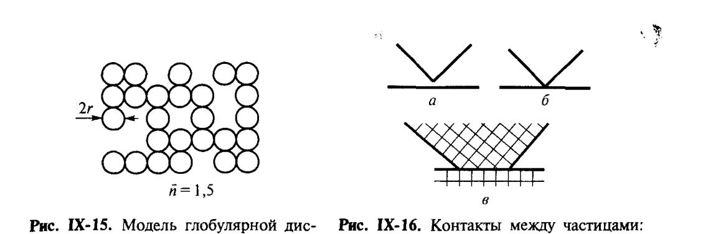
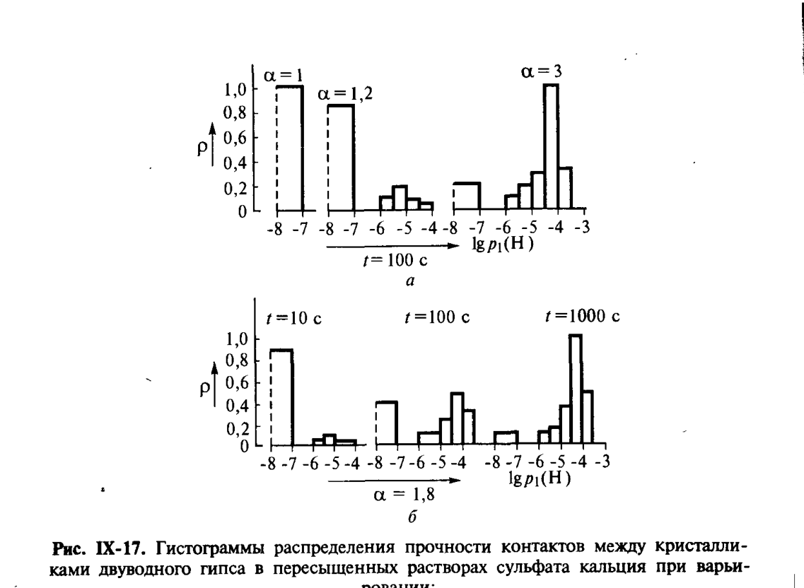

# Билет 58. Структурообразование в дисперсных системах: коагуляционные структуры

## Тема: Пространственные структуры в дисперсных системах. Контакты между частицами. Коагуляционные структуры

### Структурообразование как термодинамически выгодный процесс

> [!note] Определение
> **Структурообразование** в дисперсных системах — самопроизвольно протекающий (термодинамически выгодный) процесс сцепления частиц, приводящий к уменьшению свободной энергии системы — например, вследствие процессов коагуляции дисперсной фазы или конденсации вещества в местах контакта частиц.

Развитие пространственных сеток (дисперсных структур) различных типов лежит в основе способности дисперсной системы становиться материалом с определёнными механическими свойствами, то есть выступать в новом по сравнению с исходным (несвязным) состоянием качестве.

> [!note] Прочность как механическая характеристика структуры
> Важнейшей механической характеристикой материала является его **прочность** $P_c$ (Н/м²) — величина, определяющая способность материала противостоять разрушению под действием внешних напряжений.

---

### Глобулярная модель дисперсной структуры

Для широкого круга дисперсных структурированных систем (систем с **глобулярными** частицами, рис. IX-15) прочность $P_c$ обусловливается совокупностью сил сцепления частиц во всех местах их контакта, то есть прочностью $p_1$ (единицы силы, Н) индивидуальных контактов между частицами и их числом на единицу поверхности разрушения $\chi$ (единицы м⁻²). В таком аддитивном приближении:

$$
P_c \approx \chi p_1 \qquad \text{(IX.1)}
$$

> [!note] Расшифровка символов
> - $P_c$ — прочность дисперсной структуры (Н/м²);
> - $\chi$ — число контактов между частицами на единицу площади сечения разрушения (м⁻²);
> - $p_1$ — прочность одного индивидуального контакта (Н).

> [!important] Главный вывод
> Обе величины $p_1$ и $\chi$ поддаются прямой и независимой экспериментальной и теоретической оценке — что позволяет рассчитывать прочность реальных дисперсных структур, исходя из природы межчастичных контактов и геометрии упаковки частиц.

*Рис. IX-15. Модель глобулярной дисперсной структуры ($2r$ — диаметр частицы, $\bar n = 1{,}5$ — координационное число). Рис. IX-16. Контакты между частицами: $а$ и $б$ — коагуляционные; $в$ — фазовый. Щукин, с. 389.*

#### Оценка числа контактов $\chi$

Величина $\chi$ определяется геометрией системы, прежде всего размером частиц $r$ и плотностью их упаковки. Эта последняя характеризуется пористостью структуры $\Pi$ — отношением объёма пор $V_n$ к общему объёму пористой структуры $V$: $\Pi = V_n/V$.

В первом приближении для не очень рыхлых структур можно положить:

$$
\chi \approx \frac{1}{(2r)^2}
$$

В простейшем случае рыхлых монодисперсных структур со сферическими частицами, образующими пересекающиеся цепочки, имеющие в среднем $n$ частиц от узла до узла (рис. IX-15), эту зависимость с пористостью $\Pi \geq 48\,\%$ можно описать соотношениями:

$$
\chi = \frac{1}{(2r)^2 (\bar n)} \, ; \qquad \Pi = 1 - \frac{\pi}{6(\bar n)^3}(3\bar n - 2)
$$

> [!example] Численная оценка
> Для частиц диаметром $2r \approx 100$ мкм: $\chi \approx 10^3$–$10^4$ контактов на 1 см².
> Для $2r \approx 1$ мкм: $\chi \approx 10^7$–$10^8$ контактов на 1 см².
> Для $2r \approx 10$ нм: $\chi \approx 10^{11}$–$10^{12}$ контактов на 1 см² (с учётом полидисперсности и анизометричности частиц возможны существенные изменения этих оценок).

---

### Типы контактов между частицами

> [!note] Классификация контактов (рис. IX-16)
>
> | Тип контакта | Обозначение | Характеристика |
> |---|---|---|
> | **Коагуляционный, через прослойку среды** | $а$ | частицы разделены тонкой равновесной прослойкой дисперсионной среды; контакт сохраняет некоторую подвижность частиц относительно друг друга |
> | **Коагуляционный, точечный** | $б$ | частицы соприкасаются «вершинами», прослойка минимальна; контакт также сохраняет подвижность |
> | **Фазовый** | $в$ | происходит срастание (сращивание) частиц через образование новой фазы в зоне контакта — контакт жёсткий, не допускает взаимного смещения частиц |

> [!important] Часто спрашивают
> Различие коагуляционных и фазовых контактов — ключевая идея всего раздела «структурообразование»: именно **тип контактов определяет тип структуры** (коагуляционная — этот билет, или кристаллизационная/конденсационная — [[билет_59]]) и, следовательно, её механические свойства (тиксотропия, обратимость, прочность).

---

### Коагуляционные структуры

> [!note] Определение
> **Коагуляционные структуры** образуются при потере дисперсной системой агрегативной устойчивости (см. билеты о коагуляции, [[билет_52]], [[билет_53]]); при достаточном содержании дисперсной фазы они обеспечивают армирование всего объёма дисперсионной среды.

Соответствующее содержание коллоидно-дисперсной фазы, способное «отвердевать» жидкую дисперсионную среду, может быть очень малым (особенно для резко анизометричных частиц) — например, всего лишь 6 % по массе для четырёх бентонитовых глин и менее 0,01 % для нитевидных частиц $\text{V}_2\text{O}_5$.

> [!important] Характерное свойство — тиксотропия
> Характерным свойством коагуляционных структур наряду с относительно невысокой прочностью является их **обратимость** по отношению к механическим воздействиям, то есть способность к самопроизвольному восстановлению после механических разрушений (в подвижной дисперсионной среде). Это свойство называют **тиксотропией** (подробнее о реологических проявлениях тиксотропии — [[билет_57]]).

> [!example] Примеры коагуляционных структур
> - Пигменты и наполнители лаков, красок, полимеров.
> - Тиксотропные структуры в виде пространственных сеток — характерный пример высококонцентрированных (бентонитовые, монтмориллонитовые) глины, широко используемые как основной компонент промывочных буровых растворов (см. [[билет_13]] — капиллярная сила между частицами как один из факторов взаимодействия в таких структурах).

#### Экспериментальная оценка прочности индивидуальных контактов

Прочность отдельных контактов между частицами $p_1$ (см. уравнение IX.1) распределена статистически — для реальных дисперсных структур прочность контактов варьируется в широких пределах и описывается функцией распределения.

*Рис. IX-17. Гистограммы распределения прочности контактов между кристалликами двуводного гипса в пересыщенных растворах сульфата кальция при варьировании: $а$ — пересыщения раствора; $б$ — времени контактирования. Щукин, с. 394.*

> [!note] Пояснение к рисунку
> Гистограммы показывают плотность вероятности $\rho$ для логарифма прочности контакта $\lg p_1(\text{H})$. С ростом степени пересыщения раствора ($\alpha$ от 1 до 3) и с ростом времени контактирования $t$ (от 10 до 1000 с) распределение прочности контактов смещается в сторону **больших значений** — то есть контакты «созревают» и упрочняются во времени. Подробнее о формировании таких (кристаллизационных) контактов между кристалликами гипса — [[билет_59]].

---

### Дисперсные структуры с фазовыми контактами

В отличие от коагуляционных, структуры с фазовыми контактами образуются в самых разнообразных физико-химических условиях, в том числе при спекании и прессовании порошков. Дисперсные структуры с фазовыми контактами, возникающие в процессе выделения новой фазы из метастабильных растворов или расплавов, принято называть **конденсационными**. Если при этом возникающие структуры имеют ярко выраженный кристаллический характер, такие структуры называют **конденсационно-кристаллизационными**, или просто **кристаллизационными**, противопоставляя их конденсационным структурам в аморфных новообразованиях.

> [!note] Связка с билетом 59
> Подробное рассмотрение **кристаллизационных структур** — формирование, свойства, классический пример гипсовых структур — дано в [[билет_59]]. Здесь зафиксируем главное отличие: фазовые контакты — жёсткие, необратимые при разрушении (в отличие от тиксотропных коагуляционных), что определяет принципиально иной характер прочности и механического поведения.

---

## Источники

- Щукин Е.Д., Перцов А.В., Амелина Е.А. «Коллоидная химия» (3-е изд., 2004): с. 388–389 (раздел IX.2 — структурообразование в дисперсных системах, глобулярная модель, оценка числа контактов, рис. IX-15), с. 389–390 (типы контактов, коагуляционные и фазовые структуры, рис. IX-16).
- Перекрёстные ссылки: [[билет_59]] (кристаллизационные/конденсационные структуры — подробный разбор), [[билет_57]] (реологические проявления тиксотропии коагуляционных структур), [[билет_52]], [[билет_53]] (коагуляция и устойчивость дисперсных систем), [[билет_13]] (капиллярные силы между частицами).
