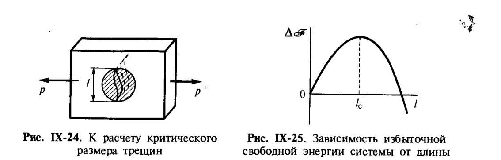

# Билет 60. Соотношение между прочностью и поверхностной энергией. Вывод уравнения Гриффитса

## Тема: Связь прочности твёрдого тела с поверхностной энергией. Уравнение Гриффитса

### Постановка задачи

> [!note] Определение
> Рассматривается величина **межфазной поверхностной энергии** как основной параметр, характеризующий взаимодействие твёрдого тела и среды и определяющий их химическим составом. Цель — получить связь между **прочностью** твёрдого тела и его **поверхностной энергией** для тела, имеющего дефект в виде микротрещины.

Рассмотрим твёрдое тело, а именно пластину единичной толщины, к которой приложено растягивающее напряжение $p$ (в Н/м²) (рис. IX-24).

---

### Шаг 1. Упругая энергия деформации (закон Гука)

В соответствии с законом Гука, упругая деформация тела плотностью $\rho$ приводит к накоплению в нём упругой энергии $W_{\text{упр}}$, отнесённой к единице объёма:

$$
W_{\text{упр}} = \frac{p^2}{2E} \qquad \text{(IX.2)}
$$

> [!note] Расшифровка символов
> - $W_{\text{упр}}$ — плотность упругой энергии деформации (Дж/м³);
> - $p$ — растягивающее напряжение (Н/м²);
> - $E$ — модуль Юнга материала (Н/м²).

---

### Шаг 2. Релаксация напряжений вблизи трещины

Пусть в теле возникает сквозная трещина (надрез) длиной $l$, при этом в части объёма тела происходит **спад упругой деформации** и соответственное уменьшение плотности упругой энергии $W_{\text{упр}}$.

> [!important] Ключевое приближение
> Можно приближённо считать, что подобная релаксация напряжений происходит в области с размером порядка $l$ (рис. IX-24), то есть **уменьшение запасённой в теле упругой энергии пропорционально квадрату размера трещины**:
> $$
> \Delta\mathscr{F}_{\text{упр}} \sim -\frac{p^2 l^2}{2E}
> $$

*Рис. IX-24. К расчёту критического размера трещины. Рис. IX-25. Зависимость избыточной свободной энергии системы $\Delta\mathscr{F}$ от длины трещины $l$. Щукин, с. 413.*

---

### Шаг 3. Энергия образования новой поверхности

Вместе с тем раскрытие трещины сопровождается увеличением поверхностной энергии вследствие образования новой поверхности раздела фаз с площадью, пропорциональной удвоенной длине трещины (две стороны трещины — берега):

$$
\Delta\mathscr{F}_{\text{пов}} \sim 2\sigma l
$$

где $\sigma$ — удельная поверхностная энергия (поверхностное натяжение) материала по границе раздела с трещиной (Дж/м²).

---

### Шаг 4. Суммарное изменение свободной энергии

Таким образом, зависимость изменения свободной энергии системы от размера трещины имеет вид:

$$
\Delta\mathscr{F} \approx 2\sigma l - \frac{p^2 l^2}{2E} \qquad \text{(IX.3)}
$$

> [!note] Расшифровка символов
> - $\Delta\mathscr{F}$ — изменение свободной энергии системы при образовании/росте трещины длиной $l$;
> - $2\sigma l$ — слагаемое, отвечающее **росту** поверхностной энергии (растёт линейно с $l$);
> - $-\dfrac{p^2 l^2}{2E}$ — слагаемое, отвечающее **снижению** упругой энергии деформации (убывает как $l^2$, т. е. при больших $l$ доминирует).

> [!important] Физический смысл — критический размер трещины
> Зависимость $\Delta\mathscr{F}(l)$ проходит через **максимум** (рис. IX-25) при некотором критическом размере трещины $l_c$. Этому максимуму свободной энергии системы соответствует **критический размер трещины**, разделяющий два режима:
> - при $l < l_c$ — рост трещины **повышает** $\Delta\mathscr{F}$ → трещина термодинамически невыгодна, «зарастает»;
> - при $l > l_c$ — рост трещины **снижает** $\Delta\mathscr{F}$ → трещина **самопроизвольно и катастрофически растёт** — наступает **разрушение** тела.

---

### Шаг 5. Критический размер трещины $l_c$

Трещины с размером, большим $l_c$, неустойчивы и самопроизвольно увеличивают свои размеры, что приводит к образованию макроскопических трещин и разрушению тела. Трещины с размером, меньшим критических, остаются стабильными (запечатанными).

Находя максимум функции (IX.3) (т. е. полагая $\dfrac{d(\Delta\mathscr{F})}{dl} = 0$), получаем критический размер трещины:

$$
l_c = \frac{\sigma E}{p^2} \qquad \text{(IX.3, критический размер)}
$$

> [!note] Расшифровка символов
> - $l_c$ — критический размер (длина) трещины (м);
> - $\sigma$ — удельная поверхностная энергия (Дж/м²);
> - $E$ — модуль Юнга (Н/м²);
> - $p$ — приложенное растягивающее напряжение (Н/м²).

---

### Шаг 6. Уравнение Гриффитса для реальной прочности

Трещины с размером, большим $l_c$, неустойчивы и самопроизвольно увеличиваются, что приводит к образованию макроскопических трещин и разрушению тела. Однако в реальных твёрдых телах всегда присутствуют дефекты структуры (поры, неоднородности, в том числе наиболее крупные дефекты), и размеры этих неоднородностей определяют **реальную (наблюдаемую) прочность тела** $P_c$, которая существенно ниже **идеальной (теоретической) прочности** $P_{\text{ид}}$ бездефектного тела.

Подставляя в выражение для $l_c$ вместо $l$ размер наибольшего дефекта (трещины) $l$ и разрешая относительно напряжения $p$, получаем **уравнение Гриффитса**:

$$
P_c = \left(\frac{\sigma E}{l}\right)^{1/2} \qquad \text{(XI.4)}
$$

> [!note] Расшифровка символов
> - $P_c$ — реальная прочность твёрдого тела (Н/м²) при наличии трещины (дефекта) длиной $l$;
> - $\sigma$ — удельная поверхностная энергия тела (Дж/м² = Н/м);
> - $E$ — модуль Юнга материала (Н/м²);
> - $l$ — длина (характерный размер) наибольшей трещины/дефекта в теле (м).

> [!important] Соответствие с оценкой идеальной прочности
> Уравнение Гриффитса было впервые получено А. Гриффитсом (1920) и названо его именем. Согласно (XI.4), отношение реальной прочности $P_c$ к идеальной прочности $P_{\text{ид}} \approx \sigma/b \approx \sqrt{\sigma E/b}$ (где $b$ — характерный межатомный/межмолекулярный размер, связанный с теоретической прочностью идеального бездефектного тела, оцениваемой по энергии межчастичных взаимодействий — см. [[билет_05]], [[билет_06]] о константе Гамакера и силах сцепления):
> $$
> \frac{P_c}{P_{\text{ид}}} \sim \left(\frac{b}{l}\right)^{1/2}
> $$
> Таким образом, **отношение реальной и идеальной прочностей твёрдого тела определяется соотношением между размером молекулы (или межатомным расстоянием) $b$ и размером дефекта $l$**.

> [!example] Иллюстрация порядков величин
> Если характерный межатомный размер $b \sim 10^{-10}$ м, а наибольший дефект имеет размер $l \sim 10^{-6}$ м (1 мкм), то:
> $$
> \frac{P_c}{P_{\text{ид}}} \sim \left(\frac{10^{-10}}{10^{-6}}\right)^{1/2} = (10^{-4})^{1/2} = 10^{-2}
> $$
> То есть реальная прочность может быть на два порядка ниже теоретической — это объясняет, почему реальная прочность хрупких материалов (стекло, керамика) намного ниже расчётной из энергии связи.

---

### Область применимости

> [!warning] Условия применимости уравнения Гриффитса
> Рассмотренная схема потери трещиной устойчивости под действием внешних растягивающих напряжений справедлива только для **идеально хрупкого** разрушения твёрдого тела. В случае пластичных тел, в которых перед фронтом трещины образуются микротрещины пластического деформирования, уравнение Гриффитса должно быть скорректировано (рассмотрено в разделе IX.4.2 учебника — см. также [[билет_61]]).

> [!tip] Мнемоника
> Уравнение Гриффитса — это **баланс «энергия трещины vs энергия поверхности»**: чем выше поверхностная энергия $\sigma$ и модуль упругости $E$, тем прочнее тело при заданном дефекте $l$; чем больше дефект $l$ — тем ниже прочность, причём $P_c \propto 1/\sqrt{l}$ (а не $1/l$!).

---

## Источники

- Щукин Е.Д., Перцов А.В., Амелина Е.А. «Коллоидная химия» (3-е изд., 2004): с. 410–413 (раздел IX.4, IX.4.1 — влияние химической природы твёрдого тела и среды, вывод уравнения Гриффитса из баланса упругой и поверхностной энергии, критический размер трещины, рис. IX-24, IX-25, формулы IX.2, IX.3, XI.4).
- Перекрёстные ссылки: [[билет_61]] (эффект Ребиндера — применение уравнения Гриффитса к адсорбционно-активным средам), [[билет_49]] (структурно-механический барьер устойчивости — родственная идея энергетического барьера).
