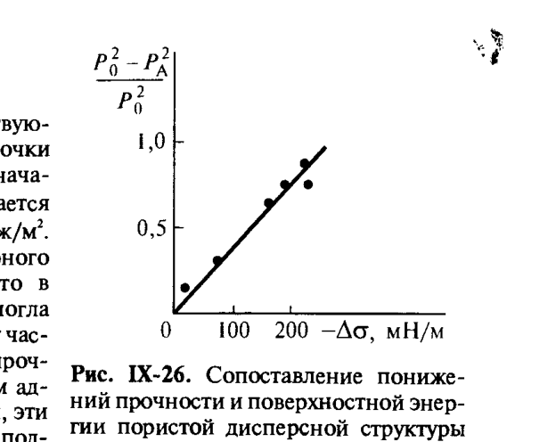
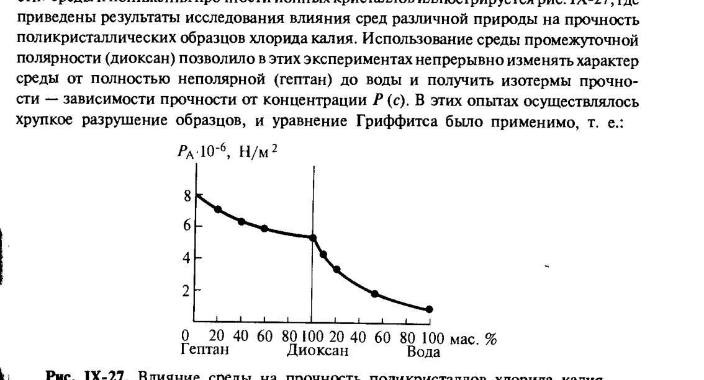
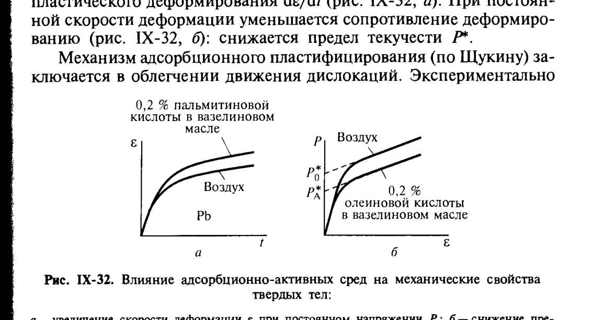

# Билет 61. Эффект Ребиндера: термодинамические, кинетические и структурные условия проявления

## Тема: Физико-химические явления в процессах деформации и разрушения твёрдых тел. Эффект Ребиндера

### Общая постановка

> [!note] Определение
> **Эффект Ребиндера** (адсорбционное понижение прочности, адсорбционное пластифицирование) — открытое П. А. Ребиндером явление существенного изменения механических (прочностных, пластических) свойств твёрдого тела под влиянием **физико-химического взаимодействия его поверхности с окружающей средой**, в первую очередь — за счёт адсорбции компонентов среды.

Перейдём к изучению физико-химических взаимодействий сплошных твёрдых тел со средой в процессах деформации и разрушения. Здесь открытое П. А. Ребиндером явление **существенного снижения прочности твёрдых тел при понижении межфазной поверхностной энергии**, связанного с понижением свободной поверхностной энергии тела на границе с какой-либо средой, занимает особое место.

> [!important] Двойственность влияния среды
> Особенности проявления влияния среды могут проявляться в различной форме и в разных формах, а именно как в понижении прочности тел (вплоть до условий, приближающихся к самопроизвольному диспергированию) или как в облегчении пластического деформирования твёрдого тела (адсорбционное пластифицирование). Возможность, форма и интенсивность проявления эффектов адсорбционного понижения прочности твёрдых тел определяются разным набором условий, которые можно разделить на три группы.

---

### Три группы условий проявления эффекта Ребиндера

> [!note] Классификация условий (по Щукину)
>
> **I. Химическая природа твёрдого тела**, т. е. характер действующих между молекулами (атомами) твёрдой фазы и поверхности раздела фаз связей.
>
> **II. Реальная (дефектная) структура твёрдого тела**, определяемая количеством и размером дефектов, включая трещины, дислокации, микропоры и т. п.
>
> **III. Условия проведения деформирования и разрушения твёрдого тела**, в том числе тип напряжённого состояния (т. е. способ приложения и величина внешних механических воздействий), скорость и продолжительность действия контакта со средой.

> [!important] Главная мысль
> Рассмотрим преимущественно роль факторов первой группы — в связи с самой формой проявления эффекта Ребиндера (резким снижением адсорбционно-активными средами прочности твёрдых тел), хотя и роль структуры твёрдого тела, и условий механического деформирования столь же существенна для возможных путей возникновения этих эффектов и для способов предотвращения их нежелательного влияния.

---

### Адсорбционное понижение поверхностной энергии и уравнение Гриффитса

Согласно уравнению Гриффитса (см. [[билет_60]]):

$$
P_c = \left(\frac{\sigma E}{l}\right)^{1/2}
$$

прочность твёрдого тела $P_c$ пропорциональна **корню квадратному из удельной поверхностной энергии** $\sigma$. Следовательно, **адсорбционное понижение поверхностной энергии $\Delta\sigma$ при контакте с поверхностно-активной средой должно приводить к понижению прочности** $P_c$.

> [!note] Связь понижения прочности и понижения поверхностной энергии
> Из соотношения Гиббса для понижения поверхностной энергии при адсорбции из пара:
> $$
> -\Delta\sigma = \sigma_0 - \sigma = RT\int_{0}^{p_{\text{н.п.}}} \Gamma\, d\ln p_{\text{н.п.}}
> $$
> где $\Gamma$ — адсорбция (поверхностный избыток) пара на поверхности твёрдого тела, $p_{\text{н.п.}}$ — давление насыщенных паров адсорбата, $R$ — универсальная газовая постоянная, $T$ — температура. Эта связь позволяет количественно оценивать снижение поверхностной энергии $\Delta\sigma$ по изотермам адсорбции $\Gamma(p)$.

Уравнение Гриффитса можно использовать для сопоставления понижения поверхностной энергии $\Delta\sigma$ и прочности $\Delta P$ твёрдых тел различной природы под действием адсорбционно-активных сред.

> [!important] Главное наблюдение (Ребиндер)
> Как было отмечено Ребиндером, наибольшее понижение прочности достигается тогда, когда жидкая адсорбционно-активная среда **по характеру межатомных взаимодействий близка к родственному твёрдому телу**. Иными словами — эффект максимален, когда среда и твёрдое тело **родственны по природе межатомного взаимодействия**.

---

### Тема 1. Ионные кристаллы — сопоставление снижения прочности и поверхностной энергии

Удобную возможность изучения связи снижения поверхностной энергии и понижения прочности предоставляют высокодисперсные пористые структуры тела, например высокодисперсная пористая структура гидроксида магния, получаемая при гидратационном термораспаде (дегидратации) оксида магния.

Высокая удельная поверхность такой структуры ($\sim 10^7\,\text{м}^2/\text{кг}$) позволяет непосредственно измерять снижение поверхностной энергии $\Delta\sigma$ путём измерения теплот адсорбции паров воды (объёмным или весовым методом) — изотерма адсорбции паров воды позволяет определить $\Gamma$, при адсорбции паров воды с молекулярной массой примерно 1 % образец становится близок к мономолекулярному слою адсорбата на поверхности — отсюда определяют снижение поверхностной энергии $\Delta\sigma$ по уравнению Гиббса:

$$
-\Delta\sigma = \sigma_0 - \sigma = RT \int_0^{p_{\text{н.п.}}} \Gamma\, d\ln p_{\text{н.п.}}
$$

Поскольку такие тела разрушаются хрупко, использование уравнения Гриффитса (XI.4) дало следующую связь между прочностью сухих $P_0$ и адсорбировавших влагу $P_A$ образцов:

$$
\frac{P_0^2 - P_A^2}{P_0^2} = -\frac{\Delta\sigma}{\sigma_0}
$$

> [!note] Расшифровка символов
> - $P_0$ — прочность сухого образца (без адсорбированной влаги);
> - $P_A$ — прочность образца после адсорбции паров воды;
> - $\sigma_0$ — поверхностная энергия сухого образца;
> - $\Delta\sigma$ — изменение (снижение) поверхностной энергии при адсорбции воды.

*Рис. IX-26. Сопоставление понижений прочности и поверхностной энергии пористой дисперсной структуры гидроксида магния при адсорбции паров воды. Щукин, с. 415.*

> [!important] Результат
> Действительно (рис. IX-26), в соответствующих координатах экспериментальные точки ложатся на прямую, проходящую через начало координат; при этом для $\sigma_0$ получается вполне приемлемое значение $\sim 300\,\text{мДж/м}^2$. Специальные опыты с применением ядерного магнитного резонанса подтвердили, что в этом случае жидкая фаза воды, которая могла бы вызывать пластифицирующие контакты между частицами, отсутствовала, т. е. понижение прочности было связано именно с действием адсорбционного слоя воды.

#### Сильно взаимодействующие («родственные») среды и ионные кристаллы

По отношению к ионным кристаллам такими родственными средами, способными вызывать сильное понижение прочности, являются различные полярные жидкости, прежде всего вода, водные растворы и расплавы. Значение «родственности» среды и понижения прочности ионных кристаллов такими средами иллюстрируется на рис. IX-27, где приведены результаты исследования влияния сред различной природы на прочность поликристаллических образцов хлорида калия. Использование среды промежуточной полярности (диоксан) позволило в этих экспериментах непрерывно изменять характер среды от полностью неполярной (гептан) до воды и получить изотермы прочности — зависимости прочности от концентрации $P(c)$. В этих опытах осуществлялось хрупкое разрушение образцов, и уравнение Гриффитса было применимо.

*Рис. IX-27. Влияние среды на прочность поликристаллов хлорида калия (изменение состава среды от гептана через диоксан к воде). Щукин, с. 415.*

> [!example] Вывод по рис. IX-27
> Прочность кристаллов KCl монотонно **снижается** при переходе от неполярного гептана к воде — то есть чем «родственнее» среда ионному кристаллу по характеру межмолекулярных взаимодействий (выше полярность, ближе к ионному характеру связей в решётке), тем сильнее адсорбционное понижение прочности.

---

### Тема 2. Металлы и ковалентные кристаллы

По отношению к ионным и молекулярным кристаллам **такими родственными средами**, способными вызывать сильное понижение прочности, являются различные полярные жидкости (прежде всего вода, водные растворы, расплавы). Значение «родственности» среды иллюстрируется также на примерах металлов.

> [!note] Дислокационный механизм
> Пластически способные к деформации материалы (металлы) могут испытывать существенное понижение прочности при адсорбции родственных сред на стадии локально пластической деформации, предшествующей хрупкому разрушению. В монокристаллах металлов малоопасные дефекты структуры могут наблюдаться в виде дислокаций, отдельных или объединённых в скопления.

> [!example] Дислокации (рис. IX-31)
> Пластические свойства кристаллических тел определяются в значительной степени дислокациями, отвечающими за пластическую деформацию, скольжение, экструзии и другие проявления пластичности. Движение дислокаций к поверхности кристалла, их выход на поверхность и взаимодействие с поверхностно-активной средой могут существенно облегчаться или затрудняться в зависимости от природы среды.

> [!important] Эффект жидкометаллической среды (системы Zn–Hg, Ga–Zn)
> Закономерности эффектов понижения прочности в присутствии жидкометаллических сред иллюстрируются на примерах систем Zn–Hg (рис. IX-29) и Ga–Zn (рис. IX-30, диаграммы состояния). Резкое снижение прочности и хрупкое межкристаллитное разрушение цинка наблюдается при адсорбции даже следовых количеств родственного жидкого металла (ртути, галлия) на границах зёрен — это явление называют **адсорбционно-индуцированной межкристаллитной хрупкостью**.

> [!warning] Частая путаница
> Не путать понижение прочности **поликристаллов вдоль границ зёрен** (межкристаллитное разрушение под действием родственной жидкометаллической среды — характерно для металлов, рис. IX-29, IX-30) с понижением прочности **монокристаллов** за счёт облегчения выхода дислокаций на поверхность под действием адсорбции (адсорбционное пластифицирование, рис. IX-31, IX-32).

---

### Тема 3. Адсорбционное пластифицирование

> [!note] Определение
> **Адсорбционное пластифицирование** — снижение сопротивления твёрдого тела пластической деформации (без хрупкого разрушения) под действием адсорбционно-активной среды, облегчающей движение дислокаций.

Деформируемое твёрдое тело в условиях, когда трещины и разрушения отсутствуют, иначе адсорбционно-активная среда пластифицирует твёрдое тело. В этом случае, как правило, наблюдаются механохимические эффекты, связанные с понижением потенциальной энергии при перемещении дислокаций или с понижением напряжения, необходимого для пластической деформации.

> [!important] Влияние на скорость деформации
> Если, как обычно, среда пластифицирует поверхностный слой, то возможно либо снижение постоянного напряжения, необходимого для поддержания постоянной скорости пластической деформации $d\varepsilon/dt$ (рис. IX-32, $а$), либо, при постоянном напряжении, повышение скорости пластической деформации $\dot\varepsilon$ (рис. IX-32, $б$): снижение предела текучести $P^*$.

*Рис. IX-32. Влияние адсорбционно-активных сред на механические свойства твёрдых тел: $а$ — увеличение скорости деформации при постоянном напряжении ($\varepsilon$ — деформация, $t$ — время; кривые для свинца на воздухе и в среде пальмитиновой кислоты в вазелиновом масле); $б$ — снижение предела текучести $P^*$ при постоянной скорости деформации (кривые $P(\varepsilon)$ на воздухе и в среде олеиновой кислоты в вазелиновом масле). Щукин, с. 421.*

> [!example] Пример — деформация монокристаллов
> Например, при деформации монокристаллов, в активных в отношении к ним средах, наблюдается значительное расстояние, пройденное дислокацией, которое может перемещаться без сопротивления решётки, что коррелирует с понижением сопротивления деформированию.

---

### Термодинамические, кинетические и структурные условия проявления эффекта Ребиндера

> [!note] Сводная классификация условий проявления эффекта
>
> **Термодинамическое условие**: адсорбционно-активная среда должна вызывать **понижение свободной (поверхностной) энергии** твёрдого тела $\Delta\sigma < 0$ (без этого понижения прочности по Гриффитсу не происходит).
>
> **Кинетическое условие**: время контакта твёрдого тела со средой и скорость деформации/нагружения должны быть достаточными для того, чтобы **адсорбционное равновесие успело установиться** в зоне действия напряжений (у вершины трещины, у выходящих дислокаций) — при слишком быстром нагружении эффект может не успеть проявиться.
>
> **Структурное условие**: твёрдое тело должно иметь **реальную дефектную структуру** (трещины, дислокации, границы зёрен), доступную для проникновения и адсорбции молекул среды — у идеального бездефектного тела эффект Ребиндера не имеет, куда «прикладываться».

> [!tip] Мнемоника — три условия эффекта Ребиндера
> «**Хочет** (термодинамика: $\Delta\sigma < 0$, выгодно адсорбироваться) — **успевает** (кинетика: есть время на адсорбцию) — **может** (структура: есть дефекты/пути для проникновения)». Если хотя бы одно из условий не выполняется — эффект Ребиндера не проявится или будет слабым.

---

### Практическое значение

> [!example] Применение эффекта Ребиндера
> - **Облегчение разрушения горных пород и руд** при бурении и дроблении — введение поверхностно-активных веществ (ПАВ) в буровые/промывочные жидкости снижает энергозатраты на разрушение.
> - **Обработка металлов резанием** — смазочно-охлаждающие жидкости (СОЖ), содержащие адсорбционно-активные компоненты, облегчают резание, снижая прочность поверхностного слоя обрабатываемого материала.
> - **Управление слёживанием и помолом порошков** — ПАВ применяются для интенсификации измельчения твёрдых материалов (понижение прочности облегчает разрушение частиц при размоле).

> [!important] Связь со структурно-механическим барьером
> Эффект Ребиндера и структурно-механический барьер устойчивости дисперсных систем ([[билет_49]]) — явления противоположной направленности по своему практическому смыслу: структурно-механический барьер **стабилизирует** дисперсную систему (предотвращает коагуляцию частиц благодаря прочным адсорбционным слоям), тогда как эффект Ребиндера, напротив, **облегчает разрушение** сплошного твёрдого тела под действием адсорбции той же природы — поверхностно-активные слои в обоих случаях понижают межфазную (поверхностную) энергию, но следствия для системы противоположны: устойчивость дисперсии vs снижение прочности монолита.

---

## Источники

- Щукин Е.Д., Перцов А.В., Амелина Е.А. «Коллоидная химия» (3-е изд., 2004): с. 410–411 (раздел IX.4, общая постановка эффекта Ребиндера, три группы условий), с. 413–417 (применение уравнения Гриффитса для сопоставления понижения прочности и поверхностной энергии, ионные кристаллы Mg(OH)₂ и KCl, рис. IX-26, IX-27), с. 418–421 (раздел IX.4.2, роль реальной структуры твёрдого тела, дислокации, металлы Zn–Hg, Ga–Zn, рис. IX-29, IX-30, IX-31), с. 421–423 (раздел IX.4.3, адсорбционное пластифицирование, рис. IX-32, IX-33).
- Перекрёстные ссылки: [[билет_60]] (уравнение Гриффитса — основа количественной связи прочности и поверхностной энергии), [[билет_49]] (структурно-механический барьер устойчивости — сопоставление направленности эффектов), [[билет_59]] (кристаллизационные структуры — прочность фазовых контактов как объект действия адсорбционно-активных сред).
